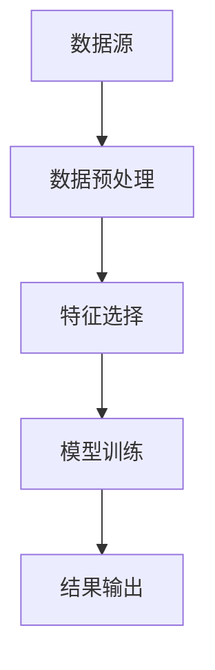

                 


# 威廉·欧奈尔的技术面与基本面结合策略

## 关键词：技术面分析、基本面分析、威廉·欧奈尔、CAN SLIM模型、投资策略、动量策略、价值策略

## 摘要：本文深入探讨了威廉·欧奈尔的技术面与基本面结合的策略，结合CAN SLIM模型，详细讲解了技术面分析的核心方法、基本面分析的基础知识、两者结合的策略框架、算法实现、系统架构设计、项目实战以及总结与展望。通过理论与实践相结合的方式，帮助读者全面理解并掌握这一投资策略。

---

# 第一部分: 技术面与基本面结合策略概述

# 第1章: 技术面与基本面分析概述

## 1.1 什么是技术面与基本面分析

### 1.1.1 技术面分析的定义与特点

技术面分析是一种通过研究金融资产的历史价格、成交量等市场数据，预测未来价格走势的方法。其核心在于通过分析价格图表和相关指标，识别市场趋势和潜在的买卖信号。技术面分析的特点包括：

- **数据驱动**：基于历史价格和成交量等数据。
- **趋势导向**：重视价格的趋势性，寻找趋势中的买卖机会。
- **多时间框架**：适用于不同时间周期的分析。

### 1.1.2 基本面分析的定义与特点

基本面分析是通过对公司财务状况、行业地位、宏观经济环境等因素的分析，评估其内在价值。其特点包括：

- **数据全面**：涉及财务报表、行业数据、宏观经济指标等多个方面。
- **长期视角**：注重公司长期的盈利能力和发展潜力。
- **理性分析**：基于逻辑和数据，而非市场情绪。

### 1.1.3 技术面与基本面结合的意义

将技术面分析与基本面分析结合，可以弥补单一分析方法的不足。技术面分析提供了市场的短期走势信号，而基本面分析提供了长期的投资价值评估。结合两者，投资者可以在合理估值的基础上，抓住市场趋势的买卖机会，提高投资决策的科学性和可行性。

---

## 1.2 威廉·欧奈尔的投资策略

### 1.2.1 威廉·欧奈尔的生平与投资理念

威廉·欧奈尔（William O'Neil）是美国著名的投资者和投资分析师，他提出了CAN SLIM模型，强调通过技术面分析和基本面分析相结合的方法进行投资决策。他的投资理念强调选择强势股，并在合适的时机进入和退出市场。

### 1.2.2 CAN SLIM 投资模型的提出与应用

CAN SLIM模型是一种选股模型，其名称代表了选股的8个关键因素：

- **C**：资金流量（Money Flow，成交量）
- **A**：资金流动的强度（Acceleration of Money Flow）
- **N**：新闻或市场关注度（News or Press Coverage）
- **S**：供给与需求关系（Supply and Demand）
- **L**：机构投资者的参与程度（Institutional sponsorship）
- **I**：股价表现（Intensity of price movement）
- **M**：相对强度（Relative Strength）
- **（无）**：无代表，可能是指市场的整体情况

CAN SLIM模型通过分析这些因素，筛选出具有强大资金流入、机构支持和相对强度高的股票。

### 1.2.3 技术面与基本面结合的策略框架

威廉·欧奈尔的策略框架强调以下几点：

1. **选择强势股**：通过CAN SLIM模型筛选出具有资金流入和相对强度高的股票。
2. **技术面确认**：利用技术面分析确认买入和卖出时机。
3. **风险管理**：设置止损点，控制投资风险。

---

## 1.3 本章小结

本章介绍了技术面分析和基本面分析的基本概念，并重点讲解了威廉·欧奈尔的CAN SLIM模型及其投资策略。通过结合技术面和基本面分析，投资者可以在市场中找到具有长期投资价值的强势股，并在合适的时机进行买卖操作。

---

# 第2章: 技术面分析的核心方法

## 2.1 技术分析的常用指标

### 2.1.1 移动平均线（MA）

移动平均线是将一段时间内的价格平均值连接起来形成的曲线，用于平滑价格波动，识别趋势方向。常用的方法包括简单移动平均线（SMA）和指数移动平均线（EMA）。

**公式**：
- SMA：$SMA = \frac{P_1 + P_2 + \dots + P_n}{n}$
- EMA：$EMA_t = P_t \times \alpha + EMA_{t-1} \times (1 - \alpha)$

### 2.1.2 相对强弱指数（RSI）

RSI用于衡量资产在一段时间内的超买或超卖状态，范围在0到100之间。

**公式**：
$$RSI = \frac{100}{1 + \frac{A}{B}}$$
其中，$A$为上涨幅度，$B$为下跌幅度。

### 2.1.3 威廉指标（WMS）

威廉指标用于衡量资产的超买或超卖状态，范围在0到100之间。

**公式**：
$$WMS = 100 \times \left( \frac{P_{\text{current}} - P_{\text{low}}}{P_{\text{high}} - P_{\text{low}}} \right)$$

### 2.1.4 布林带（Bollinger Bands）

布林带用于衡量资产价格的波动范围，由三条线组成：中线（MA）、上限（MA + 标准差）和下限（MA - 标准差）。

**公式**：
- 中线：$BB\_mid = SMA$
- 上限：$BB\_upper = BB\_mid + n \times StdDev$
- 下限：$BB\_lower = BB\_mid - n \times StdDev$

### 2.1.5 技术指标的综合应用

技术指标的综合应用需要结合市场环境和资产特性。例如，可以将RSI和WMS结合使用，当RSI和WMS同时显示超卖信号时，可能是买入机会。

---

## 2.2 技术分析的图表类型

### 2.2.1 K线图的构成与解读

K线图由开盘价、收盘价、最高价和最低价组成，反映了资产在某一时间段内的价格波动情况。

### 2.2.2 线形图与柱状图的区别

- **线形图**：用线条连接各时间段的价格，适合观察趋势。
- **柱状图**：用垂直柱状图表示价格高低，适合观察成交量。

### 2.2.3 技术分析中的支撑与阻力线

- **支撑线**：价格在下跌过程中遇到支撑，出现反弹。
- **阻力线**：价格在上涨过程中遇到阻力，出现回落。

---

## 2.3 技术分析的理论基础

### 2.3.1 道氏理论的核心观点

道氏理论认为市场趋势由主要趋势、次要趋势和短暂趋势组成，价格波动遵循一定的规律。

### 2.3.2 波浪理论的基本原理

波浪理论认为市场波动可以分为上升五浪和下降三浪，具有周期性。

### 2.3.3 技术分析与市场情绪的关系

技术分析通过价格和成交量的变化，间接反映市场情绪的变化。

---

## 2.4 本章小结

本章详细讲解了技术面分析的核心方法，包括常用指标、图表类型和理论基础。技术面分析通过分析价格和成交量的变化，帮助投资者识别市场趋势和买卖信号。

---

# 第3章: 基本面分析的核心方法

## 3.1 基本面分析的主要指标

### 3.1.1 市盈率（P/E）的计算与应用

市盈率是股票价格与每股收益的比值，用于评估股票的估值。

**公式**：
$$P/E = \frac{\text{股价}}{\text{每股收益}}$$

### 3.1.2 市净率（P/B）的计算与应用

市净率是股票价格与每股净资产的比值，用于评估股票的价值。

**公式**：
$$P/B = \frac{\text{股价}}{\text{每股净资产}}$$

### 3.1.3 股息率的计算与投资价值评估

股息率是股息与股价的比值，用于评估股票的分红能力。

**公式**：
$$\text{股息率} = \frac{\text{股息}}{\text{股价}} \times 100\%$$

### 3.1.4 财务报表分析的核心指标

- **收入**：反映公司的盈利能力。
- **利润**：反映公司的盈利能力。
- **资产负债表**：反映公司的资产、负债和所有者权益。
- **现金流量表**：反映公司的现金流情况。

---

## 3.2 宏观经济对股票价格的影响

### 3.2.1 利率政策对股市的影响

利率上升会增加借款成本，抑制投资需求；利率下降会降低借款成本，刺激投资需求。

### 3.2.2 汇率波动对股市的影响

汇率波动会影响出口企业的竞争力和国际资本流动，从而影响股市。

---

## 3.3 本章小结

本章详细讲解了基本面分析的核心方法，包括主要指标的计算与应用、宏观经济因素对股市的影响等。基本面分析通过分析公司的财务状况和宏观经济环境，帮助投资者评估股票的内在价值。

---

# 第4章: 技术面与基本面结合的策略框架

## 4.1 策略框架的核心要素

### 4.1.1 股票筛选

通过CAN SLIM模型筛选出具有资金流入、机构支持和相对强度高的股票。

### 4.1.2 买入时机确认

通过技术面分析确认买入时机，例如价格突破关键阻力位。

### 4.1.3 退出时机确认

通过技术面分析确认卖出时机，例如价格跌破支撑位。

### 4.1.4 风险管理

设置止损点，控制投资风险。

---

## 4.2 策略框架的数学模型

### 4.2.1 动量策略

动量策略基于价格的动量效应，即价格趋势具有持续性。

**公式**：
$$\text{动量} = \frac{\text{当前价格}}{\text{n天前价格}}$$

### 4.2.2 价值策略

价值策略基于价格与内在价值的偏离，即价格回归均值的效应。

**公式**：
$$\text{价值} = \frac{\text{内在价值}}{\text{市场价格}}$$

---

## 4.3 本章小结

本章详细讲解了技术面与基本面结合的策略框架，包括股票筛选、买入时机确认、退出时机确认和风险管理等内容。通过结合技术面和基本面分析，投资者可以在合理估值的基础上，抓住市场趋势的买卖机会。

---

# 第5章: 算法实现与数学模型

## 5.1 算法实现的核心步骤

### 5.1.1 数据获取

获取股票的历史价格、成交量等数据。

### 5.1.2 数据预处理

对数据进行清洗、标准化等预处理。

### 5.1.3 特征选择

选择与策略相关的特征，例如动量、相对强度等。

### 5.1.4 模型训练

使用机器学习算法训练模型，例如回归模型、分类模型等。

---

## 5.2 算法实现的Python代码

```python
import pandas as pd
import numpy as np

# 示例代码：计算动量策略的收益曲线
def calculate_momentum_returns(prices, n=10):
    returns = []
    for i in range(len(prices)):
        if i < n:
            continue
        momentum = prices[i] / prices[i - n]
        returns.append(momentum)
    return returns

# 示例代码：结合技术面和基本面因子进行预测
def combine_factors(prices, fundamentals):
    # 假设fundamentals是一个包含基本面因子的DataFrame
    # 计算动量因子
    momentum = prices['Close'].pct_change().rolling(10).mean()
    # 结合基本面因子
    combined = pd.concat([momentum, fundamentals], axis=1)
    return combined
```

---

## 5.3 数学模型与公式

### 5.3.1 动量策略的收益曲线

$$\text{收益} = \ln\left(\frac{\text{未来价格}}{\text{当前价格}}\right)$$

### 5.3.2 价值策略的回归模型

$$\text{预测收益} = \beta_0 + \beta_1 \times \text{价值因子} + \epsilon$$

---

## 5.4 本章小结

本章详细讲解了技术面与基本面结合策略的算法实现，包括数据获取、预处理、特征选择和模型训练等内容，并通过Python代码展示了具体实现方法。

---

# 第6章: 系统架构与接口设计

## 6.1 系统架构设计

### 6.1.1 数据流设计

从数据源获取数据，经过预处理后，输入到特征选择模块，最后输出到模型训练模块。



### 6.1.2 模块设计

- **数据获取模块**：负责获取股票数据。
- **数据预处理模块**：负责数据清洗和标准化。
- **特征选择模块**：负责选择与策略相关的特征。
- **模型训练模块**：负责训练模型并输出结果。

### 6.1.3 接口设计

- **数据接口**：定义数据获取和处理的接口。
- **模型接口**：定义模型训练和预测的接口。

---

## 6.2 本章小结

本章详细讲解了技术面与基本面结合策略的系统架构设计，包括数据流设计、模块设计和接口设计等内容，为后续的系统实现提供了理论基础。

---

# 第7章: 项目实战与案例分析

## 7.1 项目实战的核心步骤

### 7.1.1 环境安装

安装必要的Python库，例如Pandas、NumPy、Matplotlib等。

### 7.1.2 数据准备

获取股票的历史价格和财务数据。

### 7.1.3 策略实现

根据CAN SLIM模型和动量策略，编写策略代码。

### 7.1.4 回测分析

对策略进行回测，分析其表现和风险。

---

## 7.2 案例分析

### 7.2.1 数据准备

假设我们选择某只股票的历史价格和财务数据，进行数据清洗和标准化。

### 7.2.2 策略实现

结合CAN SLIM模型和动量策略，编写策略代码。

### 7.2.3 回测分析

分析策略的收益曲线和风险指标，例如夏普比率、最大回撤等。

---

## 7.3 本章小结

本章通过具体的案例分析，展示了如何将技术面与基本面结合策略应用于实际投资中，帮助投资者更好地理解和掌握策略的实现方法。

---

# 第8章: 总结与展望

## 8.1 总结

本文详细讲解了威廉·欧奈尔的技术面与基本面结合策略，包括技术面分析、基本面分析、策略框架、算法实现、系统架构和项目实战等内容。通过理论与实践相结合的方式，帮助投资者全面理解并掌握这一投资策略。

## 8.2 展望

未来，随着人工智能和大数据技术的发展，技术面与基本面结合策略将更加精准和高效。投资者可以利用更多的数据和算法，进一步优化策略，提高投资收益。

## 8.3 注意事项

- **数据质量**：确保数据的准确性和完整性。
- **风险管理**：合理设置止损点，控制投资风险。
- **市场环境**：注意市场环境的变化，及时调整策略。

## 8.4 拓展阅读

- 《股票作手回忆录》——杰西·利弗莫尔
- 《投资学》——约翰·C·弗伦奇

---

# 作者

作者：AI天才研究院/AI Genius Institute & 禅与计算机程序设计艺术 /Zen And The Art of Computer Programming

---

以上是《威廉·欧奈尔的技术面与基本面结合策略》的完整文章结构，涵盖了从基础到高级的各个方面，通过理论与实践相结合的方式，帮助读者全面理解并掌握这一投资策略。

