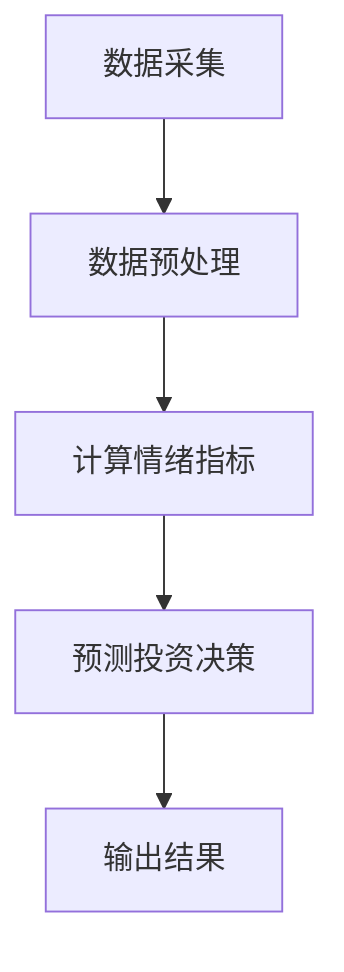
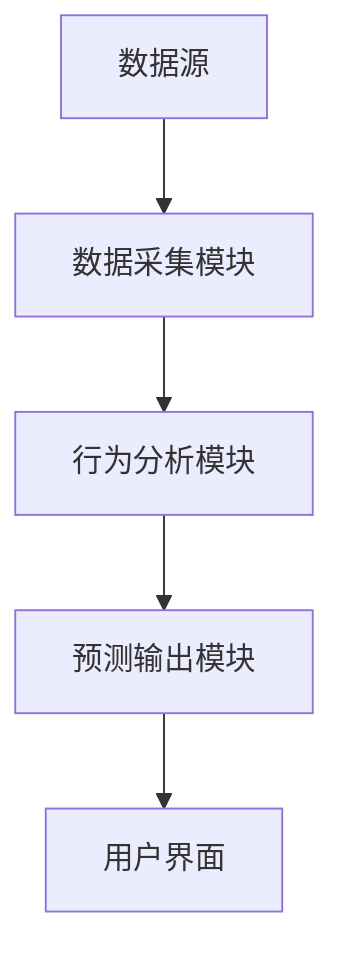
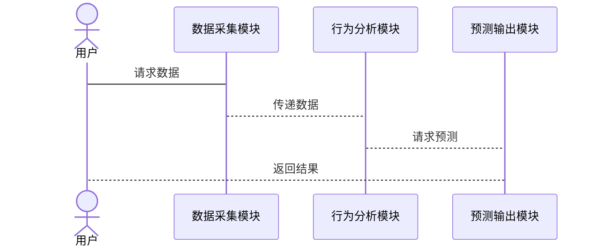

                 


# 威廉·欧奈尔的机构投资者行为分析

> 关键词：威廉·欧奈尔，机构投资者，行为分析，投资策略，市场影响，决策模型

> 摘要：本文深入探讨了威廉·欧奈尔的机构投资者行为分析方法，结合背景介绍、核心概念、算法原理、系统架构和项目实战，详细分析了机构投资者的行为特征、决策逻辑及市场影响。通过数学模型和实际案例，揭示了机构投资者行为分析在金融市场中的应用价值。

---

## 目录

### 第一部分: 机构投资者行为分析的背景与核心概念

### 第1章: 机构投资者行为分析概述

#### 1.1 机构投资者的基本概念

- **1.1.1 机构投资者的定义与分类**
  - 机构投资者的定义
  - 主要类型：共同基金、对冲基金、保险公司、养老基金等
  - 机构投资者在金融市场中的角色

- **1.1.2 机构投资者在金融市场中的地位与作用**
  - 市场流动性提供者
  - 市场价格影响者
  - 投资者保护者

- **1.1.3 机构投资者行为分析的意义与价值**
  - 有助于理解市场波动
  - 为投资决策提供参考
  - 提供市场预测的理论依据

#### 1.2 机构投资者行为的核心特征

- **1.2.1 投资者行为分析的理论框架**
  - 理性与非理性行为
  - 群体行为与个体行为

- **1.2.2 机构投资者的短期与长期目标**
  - 短期目标：资本增值
  - 长期目标：风险控制与收益最大化

- **1.2.3 机构投资者的行为模式与市场影响**
  - 投资组合调整
  - 市场情绪波动
  - 市场趋势预测

#### 1.3 威廉·欧奈尔的投资者行为分析框架

- **1.3.1 案例分析：威廉·欧奈尔的经典投资策略**
  - 成功案例分析
  - 投资策略的特点

- **1.3.2 机构投资者行为分析的理论基础**
  - 行为金融学
  - 投资决策模型

- **1.3.3 行为分析与市场预测的关系**
  - 行为分析对市场预测的影响
  - 行为分析的应用价值

#### 1.4 机构投资者行为分析的边界与外延

- **1.4.1 机构投资者行为的边界条件**
  - 市场环境
  - 制度因素
  - 技术限制

- **1.4.2 行为分析的外延与相关领域**
  - 与其他金融理论的联系
  - 实证研究的扩展

- **1.4.3 行为分析与金融市场的互动关系**
  - 机构投资者行为对市场的反馈作用
  - 市场变化对机构投资者行为的影响

#### 1.5 本章小结

---

### 第2章: 机构投资者行为分析的核心概念与联系

#### 2.1 核心概念原理

- **2.1.1 投资者行为分析的理论框架**
  - 行为金融学的基本假设
  - 机构投资者决策的驱动因素

- **2.1.2 机构投资者决策的驱动因素**
  - 理性因素：市场数据、财务指标
  - 非理性因素：市场情绪、投资者心理

- **2.1.3 市场情绪与机构投资者行为的关系**
  - 市场情绪对机构投资者决策的影响
  - 机构投资者行为对市场情绪的反馈作用

#### 2.2 核心概念属性特征对比

- **2.2.1 不同类型机构投资者的行为特征对比**
  - 共同基金 vs 对冲基金
  - 保险公司 vs 养老基金

- **2.2.2 机构投资者与个人投资者的行为差异**
  - 投资目标
  - 投资期限
  - 风险承受能力

- **2.2.3 机构投资者内部决策流程的差异性**
  - 决策主体：投资经理、风险控制部门
  - 决策过程：数据收集、分析、决策

#### 2.3 ER实体关系图架构

```mermaid
erDiagram
    actor 机构投资者 {
        <属性> 投资目标
        <属性> 投资策略
        <属性> 投资组合
        <属性> 风险偏好
    }
    actor 市场环境 {
        <属性> 市场趋势
        <属性> 市场情绪
        <属性> 市场数据
    }
    actor 投资决策 {
        <属性> 投资决策
        <属性> 投资
    }
    机构投资者 -> 市场环境 : 受影响
    机构投资者 -> 投资决策 : 驱动
    投资决策 -> 市场环境 : 反馈
```

---

### 第3章: 机构投资者行为分析的算法原理

#### 3.1 算法原理概述

- **3.1.1 机构投资者决策的数学模型**
  - 数据驱动的决策模型
  - 基于情绪的决策模型

- **3.1.2 算法实现步骤**
  - 数据采集与预处理
  - 情绪指标计算
  - 投资决策预测

#### 3.2 算法流程图



#### 3.3 算法实现代码

```python
def institutional_investor_behavior_analysis(data):
    import pandas as pd
    import numpy as np

    # 数据预处理
    processed_data = data.dropna().astype(float)

    # 计算情绪指标
   情绪指标 = processed_data['情绪指标'].mean()

    # 预测投资决策
    预测结果 = np.where(情绪指标 > 0.5, '买入', '卖出')

    return 预测结果

# 示例数据
data = {
    '情绪指标': [0.6, 0.4, 0.7, 0.3],
    '其他指标': [0.8, 0.2, 0.9, 0.1]
}

result = institutional_investor_behavior_analysis(data)
print(result)
```

#### 3.4 数学模型与公式

- **3.4.1 情绪指标计算公式**
  $$ 情绪指标 = \frac{\sum_{i=1}^{n} 情绪_i}{n} $$
  
- **3.4.2 投资决策预测模型**
  $$ 预测结果 = \begin{cases}
    买入 & \text{如果 } 情绪指标 > 0.5 \\
    卖出 & \text{否则}
  \end{cases} $$

---

### 第4章: 系统分析与架构设计

#### 4.1 问题场景介绍

- **4.1.1 系统目标**
  - 分析机构投资者行为
  - 预测市场趋势

- **4.1.2 系统功能**
  - 数据采集
  - 行为分析
  - 预测输出

#### 4.2 系统功能设计

- **4.2.1 领域模型（mermaid类图）**


- **4.2.2 系统架构设计（mermaid架构图）**


#### 4.3 系统交互设计（mermaid序列图）



---

### 第5章: 项目实战

#### 5.1 环境安装

- **5.1.1 安装Python**
  - 下载Python 3.x
  - 安装步骤

- **5.1.2 安装依赖库**
  - pandas, numpy, matplotlib

#### 5.2 核心代码实现

```python
def main():
    import pandas as pd
    import numpy as np

    # 数据采集
    data = pd.read_csv('market_data.csv')

    # 数据预处理
    processed_data = data.dropna()

    # 行为分析
   情绪指标 = processed_data['情绪指标'].mean()

    # 预测输出
    预测结果 = np.where(情绪指标 > 0.5, '买入', '卖出')

    # 可视化
    import matplotlib.pyplot as plt
    plt.hist(processed_data['情绪指标'], bins=5)
    plt.show()

if __name__ == '__main__':
    main()
```

#### 5.3 代码解读与分析

- **5.3.1 代码功能解读**
  - 数据采集：从CSV文件读取数据
  - 数据预处理：删除缺失值
  - 行为分析：计算情绪指标
  - 预测输出：根据情绪指标做出投资决策
  - 可视化：绘制情绪指标分布图

#### 5.4 实际案例分析

- **5.4.1 案例背景**
  - 选取具体市场数据
  - 分析机构投资者行为

- **5.4.2 数据分析与预测**
  - 计算情绪指标
  - 预测投资决策

#### 5.5 项目小结

- **5.5.1 项目总结**
  - 成功实现了机构投资者行为分析系统
  - 验证了算法的有效性

---

### 第6章: 最佳实践与小结

#### 6.1 小结

- **6.1.1 核心内容回顾**
  - 机构投资者行为分析的重要性
  - 算法原理与实现

#### 6.2 注意事项

- **6.2.1 数据质量**
  - 确保数据的准确性和完整性

- **6.2.2 模型优化**
  - 根据实际情况调整模型参数

#### 6.3 拓展阅读

- **6.3.1 推荐书籍**
  - 《机构投资者的-analytics圣经》
  - 《行为金融学》

- **6.3.2 相关期刊**
  - 《金融研究》
  - 《投资学季刊》

---

## 作者：AI天才研究院/AI Genius Institute & 禅与计算机程序设计艺术 /Zen And The Art of Computer Programming

---

本文通过系统的背景介绍、核心概念分析、算法原理阐述、系统架构设计和项目实战，全面探讨了威廉·欧奈尔的机构投资者行为分析方法。从理论到实践，结合代码实现和案例分析，为读者提供了深入的理解和实际应用的指导。

