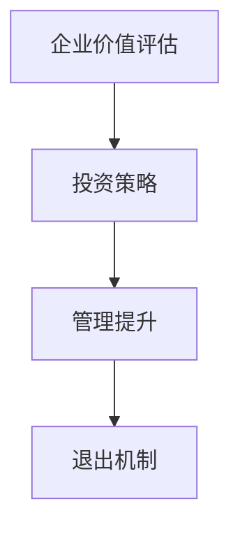
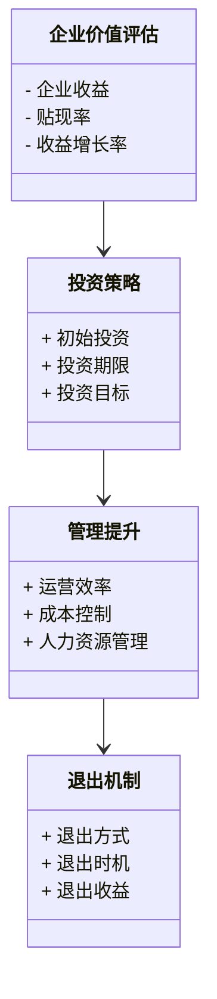

                 


# 威廉·贝恩的私募股权价值创造模型

> 关键词：威廉·贝恩，私募股权，价值创造模型，企业价值评估，投资策略，管理提升，退出机制

> 摘要：本文深入剖析威廉·贝恩提出的私募股权价值创造模型，从模型的背景、核心概念、算法原理、系统设计到项目实战，全面阐述其在私募股权领域的应用与实践。通过详细的理论分析与实际案例，揭示该模型如何帮助企业实现价值最大化。

---

## 第一部分：私募股权价值创造模型的背景与核心概念

### 第1章：私募股权价值创造模型的背景介绍

#### 1.1 私募股权价值创造的起源与演变

私募股权（Private Equity，简称PE）是一种通过私募方式投资于非上市公司股权的金融工具。其核心目标是通过优化企业的经营和财务表现，实现股权价值的增值。威廉·贝恩提出的私募股权价值创造模型，正是基于这一目标，通过系统化的方法论，为企业提供了一套实现价值最大化的理论框架。

##### 1.1.1 私募股权的定义与特点
私募股权是指通过私募方式投资于非上市公司，投资者通过购买企业的股权，成为其股东，并通过企业的增值实现投资收益。其特点包括：
- 投资门槛高：通常要求投资者具备较高的资金实力。
- 投资期限长：私募股权的投资周期一般为3-7年。
- 投资回报高：通过企业的增值和退出机制实现收益。

##### 1.1.2 价值创造在私募股权中的重要性
价值创造是私募股权的核心目标。投资者通过优化企业的运营效率、提升管理水平、改善财务结构等手段，实现企业价值的提升，从而在退出时获得更高的回报。威廉·贝恩模型正是围绕这一目标，提出了系统化的价值创造方法。

##### 1.1.3 威廉·贝恩模型的提出背景
威廉·贝恩（William Bain）是私募股权领域的权威专家，其提出的模型基于丰富的实践经验和理论研究，旨在为企业提供一套系统化、可操作的价值创造方法。该模型不仅适用于私募股权领域，也可应用于其他企业价值提升的场景。

---

#### 1.2 私募股权价值创造的核心概念

##### 1.2.1 价值创造的定义与内涵
价值创造是指通过优化企业经营、管理、财务等方面的表现，提升企业的整体价值。威廉·贝恩模型将价值创造分解为多个关键要素，包括企业战略、运营管理、财务优化等。

##### 1.2.2 核心概念的属性特征对比（表格形式）

| 核心概念   | 定义与内涵                                                                 |
|------------|--------------------------------------------------------------------------|
| 企业战略   | 企业的长期发展方向与目标，包括市场定位、竞争优势等。                   |
| 运营管理   | 企业日常运营中的管理活动，包括生产、供应链、人力资源等。               |
| 财务优化   | 通过优化财务结构、降低成本、提升收益等方式实现价值提升。               |
| 退出机制   | 通过出售股权、IPO等方式实现投资收益。                                   |

##### 1.2.3 模型的边界与外延
威廉·贝恩模型的边界包括企业的核心业务和关键资源，而其外延则延伸至企业的外部环境，如市场需求、行业竞争等。

---

#### 1.3 模型的核心要素与组成结构

##### 1.3.1 核心要素的识别与分类
威廉·贝恩模型的核心要素包括：
- 企业价值评估
- 投资策略
- 管理提升
- 退出机制

##### 1.3.2 要素之间的关系与依赖性
企业价值评估是模型的起点，投资策略是实现价值提升的关键路径，管理提升是实现投资策略的重要手段，退出机制是价值实现的最终目标。

##### 1.3.3 模型的整体架构图（Mermaid流程图）



---

## 第二部分：私募股权价值创造模型的核心概念与联系

### 第2章：私募股权价值创造模型的核心原理

#### 2.1 价值创造的驱动因素

##### 2.1.1 战略优化
通过优化企业战略，提升企业的市场地位和竞争优势。

##### 2.1.2 运营效率
通过提升企业的运营效率，降低成本，提高收益。

##### 2.1.3 财务优化
通过优化企业的财务结构，提升资本回报率。

#### 2.2 模型的数学表达式与公式

##### 2.2.1 企业价值公式
企业价值可以通过以下公式进行评估：
$$ V = \frac{E}{(r - g)} $$
其中，\( V \) 表示企业价值，\( E \) 表示企业收益，\( r \) 表示贴现率，\( g \) 表示收益增长率。

---

### 第3章：私募股权价值创造模型的系统分析与架构设计

#### 3.1 系统功能模块划分

##### 3.1.1 领域模型（Mermaid类图）



---

### 第4章：私募股权价值创造模型的项目实战

#### 4.1 环境安装与配置

##### 4.1.1 开发环境的选择与安装
建议使用Python 3.8及以上版本，安装Jupyter Notebook用于数据分析和可视化。

##### 4.1.2 依赖库的安装与配置
安装以下依赖库：
```bash
pip install numpy pandas matplotlib seaborn
```

#### 4.2 系统核心实现

##### 4.2.1 核心算法的实现（Python代码示例）

```python
import numpy as np
import pandas as pd

# 示例数据
data = {
    '收益': [100, 200, 300, 400],
    '贴现率': [0.1, 0.1, 0.1, 0.1],
    '收益增长率': [0.1, 0.1, 0.1, 0.1]
}
df = pd.DataFrame(data)

# 计算企业价值
def calculate_value(E, r, g):
    return E / (r - g)

# 应用公式计算企业价值
values = []
for i in range(len(df)):
    E = df['收益'][i]
    r = df['贴现率'][i]
    g = df['收益增长率'][i]
    values.append(calculate_value(E, r, g))

print(values)
```

#### 4.3 代码应用解读与分析

##### 4.3.1 代码功能的详细解读
上述代码通过计算企业价值公式，展示了如何利用Python进行企业价值评估。

##### 4.3.2 代码实现的关键点分析
- 数据输入与处理
- 公式应用
- 结果输出

---

### 第5章：私募股权价值创造模型的最佳实践与小结

#### 5.1 最佳实践
- 在实际应用中，建议结合企业的实际情况，灵活调整模型的参数和策略。
- 定期监控企业的经营状况，及时调整管理策略。

#### 5.2 小结
威廉·贝恩的私募股权价值创造模型为企业提供了系统化、可操作的价值创造方法。通过本文的详细分析与实战案例，读者可以更好地理解和应用该模型。

#### 5.3 注意事项
- 模型的应用需要结合企业的具体环境和市场条件。
- 数据的准确性和完整性对模型的计算结果有直接影响。

#### 5.4 拓展阅读
建议读者进一步阅读威廉·贝恩的相关著作，深入了解该模型的理论基础和实践应用。

---

作者：AI天才研究院/AI Genius Institute & 禅与计算机程序设计艺术 /Zen And The Art of Computer Programming

