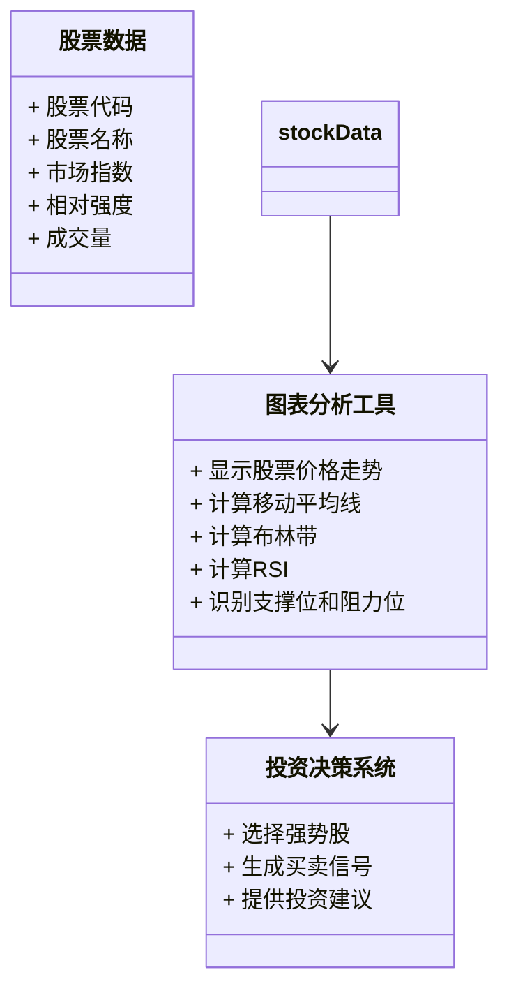
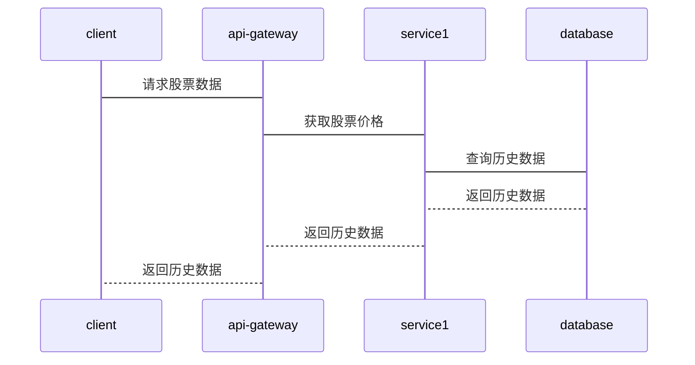

                 


# 威廉欧奈尔的图表分析技巧

> 关键词：威廉·欧奈尔、图表分析、股票投资、技术分析、CAN SLIM策略

> 摘要：本文系统地介绍了威廉·欧奈尔的图表分析技巧，结合CAN SLIM策略，深入探讨了其在股票投资中的应用。通过分析图表分析的核心概念、技巧、高级方法以及系统架构，本文为读者提供了全面的理论和实践指导。

---

# 第一部分：威廉·欧奈尔的图表分析技巧概述

## 第1章：什么是威廉·欧奈尔的图表分析技巧

### 1.1 什么是威廉·欧奈尔
#### 1.1.1 威廉·欧奈尔的生平简介
威廉·欧奈尔（William O'Neil）是美国著名投资专家，以其独特的股票分析方法闻名。他是《纽约证券交易所股票交易指南》的作者，创立了著名的CAN SLIM策略，帮助投资者在股票市场中获利。

#### 1.1.2 他的投资理念与方法
威廉·欧奈尔的投资理念基于技术分析，强调通过图表分析和市场趋势来判断股票的买卖时机。他认为，市场的行为反映了所有信息，因此图表分析是预测股票价格走势的关键工具。

#### 1.1.3 图表分析在投资中的重要性
图表分析通过解读股票价格走势和成交量变化，帮助投资者识别市场趋势、支撑位、阻力位等关键点，从而做出更明智的投资决策。

### 1.2 为什么学习威廉·欧奈尔的图表分析技巧
#### 1.2.1 图表分析的基本概念
图表分析是技术分析的重要组成部分，通过绘制股票价格走势和成交量数据，识别市场模式和趋势。

#### 1.2.2 图表分析在股票投资中的应用
图表分析可以帮助投资者判断买入和卖出的最佳时机，识别潜在的市场反转或突破点。

#### 1.2.3 为什么威廉·欧奈尔的技巧值得学习
威廉·欧奈尔的CAN SLIM策略结合了图表分析和基本面分析，是一种系统化的投资方法，适合不同类型的投资者。

### 1.3 本章小结
#### 1.3.1 本章内容回顾
本章介绍了威廉·欧奈尔的背景及其投资理念，强调了图表分析在股票投资中的重要性。

#### 1.3.2 下一章的预览
下一章将详细探讨图表分析的核心概念，包括趋势线、支撑位、阻力位等关键要素。

---

## 第2章：图表分析的核心概念

### 2.1 股票价格与市场的基本关系
#### 2.1.1 股票价格的波动规律
股票价格受到多种因素影响，包括市场情绪、经济指标和公司业绩等。通过图表分析，可以识别价格波动的规律和趋势。

#### 2.1.2 市场情绪对价格的影响
市场情绪是影响股票价格的重要因素。通过成交量和价格走势的结合，可以判断市场的乐观或悲观情绪。

#### 2.1.3 价格与成交量的关系
成交量是价格变动的确认指标。价格的上涨或下跌必须伴随成交量的变化，才能确认趋势的有效性。

### 2.2 威廉·欧奈尔的CAN SLIM策略
#### 2.2.1 C: 股价创新高
威廉·欧奈尔强调选择股价创新高的股票，因为这些股票具有更强的上涨潜力。

#### 2.2.2 A: 相对强度
相对强度是衡量股票相对于市场表现的重要指标，高相对强度的股票更容易成为市场领导者。

#### 2.2.3 N: 新闻
市场新闻和公司公告往往会影响股票价格，投资者需要关注这些信息并及时调整投资策略。

#### 2.2.4 S: 供给与需求
供给与需求关系直接影响股票价格，通过图表分析可以识别市场的供需平衡点。

#### 2.2.5 I: 内部交易
内部交易是指公司高层的交易行为，这些交易往往反映了公司的真实情况，是投资者的重要参考。

#### 2.2.6 M: 市场宽度
市场宽度反映了市场的广度，即有多少股票在上涨或下跌。高市场宽度通常意味着市场趋势的强劲。

### 2.3 图表分析的核心要素
#### 2.3.1 趋势线
趋势线是价格波动的支撑或阻力线，帮助投资者识别价格趋势的方向和强度。

#### 2.3.2 支撑位与阻力位
支撑位是价格下跌时的支撑点，阻力位是价格上涨时的阻碍点，这些点位是图表分析的重要参考。

#### 2.3.3 移动平均线
移动平均线是价格的平均值，反映了市场的短期或长期趋势，是判断价格支撑或阻力的重要指标。

#### 2.3.4 布林带
布林带用于衡量价格的波动范围，帮助投资者判断价格的超买或超卖状态。

#### 2.3.5 成交量分析
成交量是价格变动的确认指标，帮助投资者判断价格趋势的强度和持续性。

### 2.4 本章小结
#### 2.4.1 核心概念总结
本章详细介绍了图表分析的核心概念，包括趋势线、支撑位、阻力位、移动平均线和布林带等。

#### 2.4.2 下一章的预览
下一章将探讨图表分析的核心技巧，包括趋势线与支撑位的分析技巧，相对强度分析与股票选择等。

---

## 第3章：图表分析的核心技巧

### 3.1 趋势线与支撑位的分析技巧
#### 3.1.1 趋势线的定义与作用
趋势线是价格波动的支撑或阻力线，帮助投资者识别价格趋势的方向和强度。

#### 3.1.2 支撑位与阻力位的分析
支撑位是价格下跌时的支撑点，阻力位是价格上涨时的阻碍点，这些点位是图表分析的重要参考。

#### 3.1.3 趋势线的突破与回测
价格突破趋势线通常预示着趋势的改变，而回测则是对趋势线的有效确认。

### 3.2 相对强度分析与股票选择
#### 3.2.1 相对强度的定义
相对强度是衡量股票相对于市场表现的重要指标，高相对强度的股票更容易成为市场领导者。

#### 3.2.2 威廉·欧奈尔的相对强度筛选法
威廉·欧奈尔强调选择相对强度高的股票，这些股票通常具有更强的上涨潜力。

#### 3.2.3 强势股的定义
强势股是指在市场中表现优于大多数股票的个股，通常具有较高的相对强度和成交量。

### 3.3 本章小结
#### 3.3.1 技巧总结
本章详细介绍了趋势线与支撑位的分析技巧，以及相对强度分析与股票选择的方法。

#### 3.3.2 下一章的预览
下一章将探讨图表分析的高级技巧，包括移动平均线与布林带的综合应用等。

---

## 第4章：图表分析的高级技巧

### 4.1 移动平均线与布林带的综合应用
#### 4.1.1 移动平均线的定义与作用
移动平均线是价格的平均值，反映了市场的短期或长期趋势，是判断价格支撑或阻力的重要指标。

#### 4.1.2 布林带的定义与作用
布林带用于衡量价格的波动范围，帮助投资者判断价格的超买或超卖状态。

#### 4.1.3 移动平均线与布林带的结合应用
通过结合移动平均线和布林带，投资者可以更准确地判断价格的买卖时机。

### 4.2 相对强度指数（RSI）的分析
#### 4.2.1 RSI的定义与计算
相对强度指数（RSI）是一种衡量股票超买或超卖状态的技术指标，计算公式为：
$$RSI = \frac{100 \times (\text{上涨幅度} - \text{下跌幅度})}{\text{上涨幅度} + \text{下跌幅度}}$$

#### 4.2.2 RSI的应用
RSI通常用于判断价格的超买或超卖状态，当RSI高于70时，股票可能超买，当RSI低于30时，股票可能超卖。

### 4.3 本章小结
#### 4.3.1 技巧总结
本章详细介绍了移动平均线与布林带的综合应用，以及相对强度指数（RSI）的分析方法。

#### 4.3.2 下一章的预览
下一章将探讨系统分析与架构设计方案，介绍如何构建一个高效的图表分析系统。

---

## 第5章：系统分析与架构设计方案

### 5.1 问题场景介绍
在股票分析中，投资者需要一个高效、准确的工具来帮助他们进行图表分析和投资决策。

### 5.2 项目介绍
本项目旨在构建一个基于威廉·欧奈尔图表分析技巧的股票分析系统，结合CAN SLIM策略，为投资者提供实时数据和分析工具。

### 5.3 系统功能设计
#### 5.3.1 领域模型（Mermaid类图）


#### 5.3.2 系统架构设计（Mermaid架构图）
```mermaid
client
    api-gateway
        service1
        service2
        service3
    database
```

#### 5.3.3 系统接口设计
系统需要与股票数据源、交易系统和用户界面进行交互，具体接口包括：
- 数据接口：获取实时股票数据和历史数据。
- 分析接口：执行图表分析和指标计算。
- 用户接口：展示分析结果和投资建议。

#### 5.3.4 系统交互设计（Mermaid序列图）


### 5.4 本章小结
#### 5.4.1 系统架构总结
本章详细介绍了股票分析系统的功能设计和架构方案，为后续的项目实施提供了理论基础。

#### 5.4.2 下一章的预览
下一章将探讨项目实战，介绍如何实现基于威廉·欧奈尔图表分析技巧的股票分析系统。

---

## 第6章：项目实战

### 6.1 环境安装
需要安装以下工具和库：
- Python编程语言
- Pandas库（数据处理）
- Matplotlib库（数据可视化）
- 金融数据API（获取实时股票数据）

### 6.2 核心代码实现
以下是一个基于威廉·欧奈尔图表分析技巧的Python代码示例：
```python
import pandas as pd
import matplotlib.pyplot as plt

# 获取股票数据
data = pd.read_csv('stock_data.csv')

# 计算移动平均线
data['MA_20'] = data['收盘价'].rolling(window=20).mean()
data['MA_50'] = data['收盘价'].rolling(window=50).mean()

# 绘制图表
plt.figure(figsize=(10, 6))
plt.plot(data['日期'], data['收盘价'], label='收盘价')
plt.plot(data['日期'], data['MA_20'], label='MA_20')
plt.plot(data['日期'], data['MA_50'], label='MA_50')
plt.legend()
plt.show()
```

### 6.3 案例分析
以某只股票为例，分析其价格走势和成交量变化，结合CAN SLIM策略判断买卖时机。

### 6.4 本章小结
#### 6.4.1 项目总结
本章通过实际案例展示了如何使用威廉·欧奈尔图表分析技巧进行股票分析，包括数据获取、指标计算和图表绘制等步骤。

#### 6.4.2 下一章的预览
下一章将总结最佳实践，提供小结、注意事项和拓展阅读等内容。

---

## 第7章：最佳实践、小结、注意事项和拓展阅读

### 7.1 最佳实践
- 定期更新股票数据，保持分析的准确性。
- 结合基本面分析，全面评估股票的投资价值。
- 设置止损和止盈点，控制投资风险。

### 7.2 小结
本文系统地介绍了威廉·欧奈尔的图表分析技巧，结合CAN SLIM策略，详细探讨了其在股票投资中的应用。通过实际案例和系统设计，为读者提供了全面的理论和实践指导。

### 7.3 注意事项
- 图表分析仅是投资决策的辅助工具，需结合其他因素综合判断。
- 市场波动具有不确定性，投资者需保持警惕。

### 7.4 拓展阅读
- 《纽约证券交易所股票交易指南》
- 其他技术分析书籍和资源

---

# 作者：AI天才研究院 & 禅与计算机程序设计艺术

