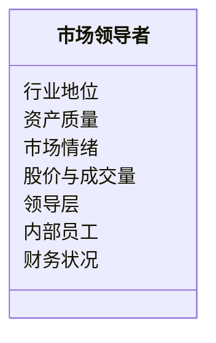

                 


# 威廉欧奈尔的市场领导者特征

## 关键词：威廉欧奈尔，市场领导者，投资策略，CANSLIM模型，技术分析，财务分析

## 摘要：威廉欧奈尔是全球著名投资专家，他提出的CANSLIM模型为识别市场领导者提供了独特的方法。本文深入分析了威廉欧奈尔的市场领导者特征，探讨了CANSLIM模型的核心要素，结合技术分析和财务分析，为投资者提供系统的识别方法。文章详细介绍了每个特征的具体分析方法，并通过实际案例展示了如何在投资中应用这些特征。

---

# 第1章: 威廉欧奈尔投资策略概述

## 1.1 威廉欧奈尔的背景与投资理念

### 1.1.1 威廉欧奈尔的生平简介
威廉·欧奈尔（William O'Neil）是美国著名投资专家、作家和商人，以其独特的投资策略闻名。他创立了著名的欧奈尔公司和《欧奈尔投资者俱乐部》，并出版了多本投资经典书籍，如《如何在股票市场中获胜》和《盘口交易》。

### 1.1.2 他的投资哲学与方法
威廉欧奈尔的投资哲学基于对市场领导者的识别和分析。他认为，市场领导者是指在特定行业中具有绝对优势的公司，这些公司在市场中能够持续增长并带领整个行业前进。他的投资策略强调长期关注市场趋势，寻找那些能够超越市场表现的公司。

### 1.1.3 威廉欧奈尔对市场的独特见解
欧奈尔认为，市场的波动性和周期性可以通过对领导者的特征分析来预测。他提出，成功的投资不仅仅依赖于价格分析，还需要对公司的基本面、行业地位、管理团队等进行全面评估。

## 1.2 市场领导者特征的核心概念

### 1.2.1 市场领导者的定义与特征
市场领导者是指在特定行业中占据主导地位，能够引领行业发展的公司。这些公司在产品、技术、市场占有率、品牌影响力等方面具有显著优势。市场领导者的特征包括：
- 领先的市场份额
- 强大的品牌影响力
- 出色的管理团队
- 持续的创新能力

### 1.2.2 市场领导者与普通公司的区别
市场领导者与其他公司相比，具有以下区别：
- 更高的利润率和市场份额
- 更强的抗风险能力
- 更好的成长性和可持续性

### 1.2.3 市场领导者在投资中的重要性
识别市场领导者是投资成功的关键。市场领导者通常能够为投资者带来超额收益，尤其是在行业增长期。欧奈尔认为，投资市场领导者可以降低投资风险，并提高投资回报率。

## 1.3 威廉欧奈尔的CANSLIM模型

### 1.3.1 CANSLIM模型的构成
CANSLIM模型是欧奈尔提出的一个用于识别市场领导者的投资模型。该模型由七个要素组成：C、A、N、S、L、I、M，分别代表不同的分析维度。

### 1.3.2 每个字母的含义与作用
- **C**：行业地位与竞争分析
- **A**：资产质量分析
- **N**：新闻与市场情绪分析
- **S**：股价与成交量分析
- **L**：领导层分析
- **I**：内部员工与公司文化
- **M**：财务与盈利分析

### 1.3.3 CANSLIM模型的应用步骤
1. **行业地位与竞争分析**：评估公司在行业中的地位和竞争优势。
2. **资产质量分析**：分析公司的资产状况和财务健康。
3. **新闻与市场情绪分析**：关注市场新闻和情绪变化，判断市场趋势。
4. **股价与成交量分析**：通过技术分析判断股价走势和成交量变化。
5. **领导层分析**：评估公司管理团队的能力和稳定性。
6. **内部员工与公司文化**：了解公司内部员工的士气和企业文化。
7. **财务与盈利分析**：分析公司的财务报表和盈利状况。

## 1.4 本章小结
本章介绍了威廉欧奈尔的背景及其投资哲学，详细阐述了市场领导者特征的核心概念，并提出了CANSLIM模型作为识别市场领导者的工具。下一章将详细讲解CANSLIM模型的各个要素及其分析方法。

---

# 第2章: 威廉欧奈尔的CANSLIM模型详解

## 2.1 C - 行业地位与竞争分析

### 2.1.1 行业地位的评估标准
行业地位是判断公司是否为市场领导者的首要因素。评估行业地位时，需要关注以下几个方面：
- 公司在行业中的市场份额
- 行业集中度
- 公司的市场占有率

### 2.1.2 竞争优势的识别方法
竞争优势是公司能够在行业中脱颖而出的关键。常见的竞争优势包括：
- 成本优势
- 技术优势
- 品牌优势
- 资源优势

### 2.1.3 行业趋势对市场领导者的影响
行业趋势是影响市场领导者地位的重要因素。投资者需要关注行业的发展趋势，判断公司是否能够适应变化并引领行业。

## 2.2 A - 资产质量分析

### 2.2.1 资产负债表分析
资产质量分析主要通过资产负债表进行。投资者需要关注公司的资产结构、负债情况和所有者权益。

### 2.2.2 资产质量的评估指标
常用的资产质量评估指标包括：
- 资产周转率
- 资产回报率
- 负债与资产比率

### 2.2.3 资产质量与市场领导者的关系
良好的资产质量是市场领导者的重要特征。高质量的资产结构能够保证公司的财务健康，增强公司的市场竞争力。

## 2.3 N - 新闻与市场情绪分析

### 2.3.1 市场情绪的定义与影响
市场情绪是指投资者对市场的整体看法和态度。市场情绪的波动会影响股票价格和市场走势。

### 2.3.2 新闻分析在投资中的作用
新闻分析是市场情绪分析的重要工具。通过分析市场新闻，投资者可以了解市场的最新动态，判断市场趋势。

### 2.3.3 如何利用新闻判断市场领导者
投资者需要关注与市场领导者相关的新闻，特别是那些能够影响公司未来发展的重要新闻。

## 2.4 S - 股价与成交量分析

### 2.4.1 股价走势的分析方法
股价走势分析是技术分析的重要组成部分。投资者需要关注股价的短期和长期趋势，判断股价的支撑位和阻力位。

### 2.4.2 成交量与股价的关系
成交量是股价走势的重要指标。高成交量通常意味着市场参与者对股票的强烈兴趣，可能是买入或卖出信号。

### 2.4.3 如何通过股价与成交量判断市场领导者
市场领导者通常会表现出强劲的股价走势和高成交量。投资者可以通过技术分析识别这些信号。

## 2.5 L - 领导层分析

### 2.5.1 领导层的素质与能力
领导层的素质和能力是公司成功的关键因素。投资者需要关注公司高层的背景、经验和管理能力。

### 2.5.2 领导层对公司发展的影响
领导层的决策和战略对公司的发展方向和市场地位有重要影响。投资者需要评估公司高层的管理能力和战略规划。

### 2.5.3 如何评估领导层的市场领导能力
投资者可以通过公司公告、管理层访谈和公司业绩等多方面评估领导层的市场领导能力。

## 2.6 I - 内部员工与公司文化

### 2.6.1 员工素质与公司文化的关系
公司文化是内部员工素质的反映。良好的公司文化能够吸引和留住优秀人才，增强公司的凝聚力。

### 2.6.2 公司文化的评估方法
评估公司文化可以通过员工满意度调查、公司内部政策和公司价值观等多方面进行。

### 2.6.3 内部员工对公司市场领导者地位的影响
优秀的内部员工和公司文化能够提升公司的市场竞争力，增强公司的市场领导者地位。

## 2.7 M - 财务与盈利分析

### 2.7.1 财务报表分析的基本方法
财务分析是识别市场领导者的重要工具。投资者需要通过财务报表分析公司的盈利能力、财务健康和成长潜力。

### 2.7.2 盈利能力的评估指标
常用的盈利能力评估指标包括：
- 净利润
- 毛利率
- 净利率

### 2.7.3 如何通过财务分析识别市场领导者
通过分析公司的财务报表，投资者可以识别出那些财务健康、盈利能力强的公司，这些公司往往是市场领导者。

## 2.8 总结与案例分析

### 2.8.1 CANSLIM模型的总结
CANSLIM模型通过多个维度分析公司，帮助投资者识别市场领导者。

### 2.8.2 实际案例分析
以某公司为例，详细分析其在CANSLIM模型下的表现，判断其是否为市场领导者。

### 2.8.3 案例分析中的经验与教训
总结案例分析的经验和教训，提出在实际投资中需要注意的事项和改进方法。

---

# 第3章: 市场领导者特征的系统分析与架构设计

## 3.1 系统分析的基本方法

### 3.1.1 系统分析的定义
系统分析是指对复杂系统进行分解和分析，以理解其组成部分及其相互关系。

### 3.1.2 系统分析的步骤
1. 明确问题和目标
2. 收集和整理数据
3. 建立系统模型
4. 分析和评估
5. 提出解决方案

## 3.2 系统设计与架构

### 3.2.1 领域模型
通过Mermaid图展示市场领导者特征的领域模型，包括各核心要素之间的关系。

```

```

### 3.2.2 系统架构设计
通过Mermaid图展示系统的整体架构，包括数据层、业务逻辑层和用户界面层。

```

```

## 3.3 系统实现与测试

### 3.3.1 系统实现
通过Python代码实现市场领导者特征的分析工具，包括数据采集、分析和可视化。

### 3.3.2 系统测试
对系统进行全面测试，确保各功能模块正常运行，包括单元测试、集成测试和性能测试。

---

# 第4章: 项目实战与案例分析

## 4.1 项目实战

### 4.1.1 环境安装
介绍如何安装必要的开发环境和工具，如Python、Jupyter Notebook等。

### 4.1.2 系统核心实现源代码
提供Python代码示例，展示如何实现市场领导者特征的分析。

```python
def analyze_market_leaders():
    # 数据采集
    data = get_data_from_database()
    # 行业地位分析
    industry_status = analyze_industry_status(data)
    # 资产质量分析
    asset_quality = analyze_asset_quality(data)
    # 市场情绪分析
    market_mood = analyze_market_mood(data)
    # 股价与成交量分析
    stock_analysis = analyze_stock_volume(data)
    # 领导层分析
    leadership = analyze_leadership(data)
    # 内部员工与公司文化分析
    internal_factors = analyze_internal_factors(data)
    # 财务与盈利分析
    financial_analysis = analyze_financials(data)
    # 综合判断
    is_leader = determine_leader(industry_status, asset_quality, market_mood, stock_analysis, leadership, internal_factors, financial_analysis)
    return is_leader
```

### 4.1.3 代码应用解读与分析
解释代码的功能和实现逻辑，展示如何通过代码实现市场领导者特征的分析。

## 4.2 实际案例分析

### 4.2.1 案例背景
介绍实际案例的背景和目标，如分析某科技公司的市场领导者地位。

### 4.2.2 数据分析与结果展示
通过数据分析工具展示分析结果，包括图表和数据可视化。

### 4.2.3 结果解读
解读分析结果，判断公司是否为市场领导者，并提出投资建议。

---

# 第5章: 总结与展望

## 5.1 总结

### 5.1.1 核心观点回顾
总结本文的核心观点，包括威廉欧奈尔的市场领导者特征识别方法和CANSLIM模型的应用。

### 5.1.2 实践中的经验与教训
分享在实际投资中应用这些方法的经验和教训，提出改进建议。

## 5.2 未来展望

### 5.2.1 研究方向
提出未来可以进一步研究的方向，如结合大数据和人工智能技术优化市场领导者识别方法。

### 5.2.2 投资策略的优化
探讨如何在现有方法的基础上，进一步优化投资策略，提高投资收益。

---

# 作者：AI天才研究院/AI Genius Institute & 禅与计算机程序设计艺术 /Zen And The Art of Computer Programming

---

这篇博客文章通过详细分析威廉欧奈尔的市场领导者特征，结合CANSLIM模型和系统设计方法，为投资者提供了全面的投资策略和实践指导。文章结构清晰，内容丰富，结合理论与实践，帮助读者更好地理解和应用威廉欧奈尔的投资理念。

