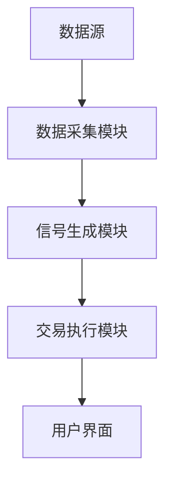
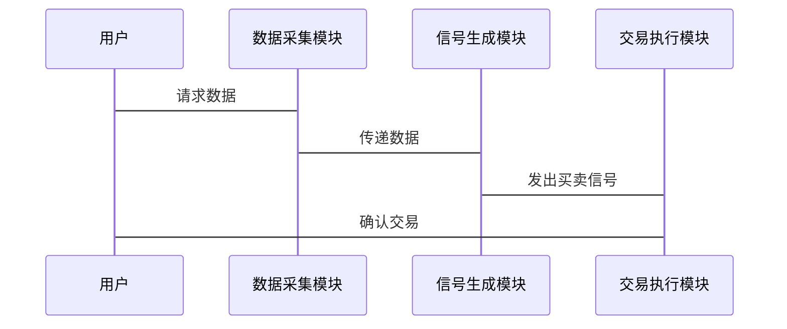

                 


# 《威廉欧奈尔的股票买卖时机选择》

## 关键词：威廉欧奈尔，股票买卖时机，投资策略，技术分析，系统架构，数学模型

## 摘要：  
本文深入探讨了威廉欧奈尔的股票买卖时机选择策略，结合技术分析与数学建模，系统地分析了其核心概念、算法原理和实际应用。通过详细讲解策略背景、核心概念、数学模型、系统架构设计、项目实战及最佳实践，为投资者提供了科学的决策支持和系统化的解决方案。

---

## 第一部分：背景介绍

### 第1章：威廉欧奈尔及其投资理论概述

#### 1.1 什么是威廉欧奈尔的股票买卖时机选择
- 1.1.1 投资者的常见问题与挑战  
  投资者在股票市场中面临的主要挑战包括：如何选择合适的买入和卖出时机，如何在市场波动中保持冷静，以及如何避免情绪化决策。威廉欧奈尔的策略旨在通过系统化的方法解决这些问题。

- 1.1.2 为什么选择威廉欧奈尔的策略  
  威廉欧奈尔的投资方法结合了技术分析和市场情绪分析，强调通过识别市场趋势和个股强度来优化买卖时机。这种方法在实践中被证明是有效的，尤其适合中长期投资者。

- 1.1.3 本书的核心目标与价值  
  本书的目标是帮助读者理解并掌握威廉欧奈尔的买卖时机选择策略，通过理论与实践相结合的方式，帮助投资者在实际操作中提高盈利能力。

#### 1.2 投资理论基础
- 1.2.1 传统投资理论与现代投资组合理论（MPT）  
  传统投资理论主要关注资产的预期收益和风险，而现代投资组合理论（MPT）强调通过分散投资来降低风险。然而，这些理论在实际操作中往往忽视了市场趋势和个股表现的动态变化。

- 1.2.2 技术分析与基本面分析的结合  
  技术分析关注价格走势和交易量，而基本面分析关注公司的财务状况和行业前景。威廉欧奈尔的方法将两者结合起来，既考虑市场整体趋势，又关注个股的强度。

- 1.2.3 威廉欧奈尔的独特视角与方法  
  威廉欧奈尔提出了一种基于市场宽度和个股强度的选股方法，强调通过识别市场趋势和个股表现来优化买卖时机。这种方法在技术分析领域独树一帜。

---

## 第二部分：核心概念与联系

### 第2章：威廉欧奈尔的核心概念解析

#### 2.1 投资决策的关键要素
- 2.1.1 股票价格与市场趋势的关系  
  市场趋势是股票价格变动的主因，投资者需要通过分析价格走势和交易量来判断市场的强弱。

- 2.1.2 交易量与价格走势的关联  
  交易量是价格走势的验证工具，高交易量通常表明市场的活跃程度和趋势的强度。

- 2.1.3 股票强度与市场地位的评估  
  股票强度反映了个股相对于市场的表现，而市场地位则反映了个股在市场中的重要性。

#### 2.2 威廉欧奈尔的选股标准
- 2.2.1 市场宽度与个股强度的定义  
  市场宽度指数（WMS）衡量了市场的活跃程度，而个股强度指数（IS）则衡量了个股相对于市场的表现。

- 2.2.2 市场宽度指数（WMS）的计算与应用  
  WMS =（上涨股票数量 - 下跌股票数量） / 总股票数量。  
  通过WMS，投资者可以判断市场的强弱，进而优化买入和卖出时机。

- 2.2.3 个股强度指数（IS）的分析方法  
  IS =（个股涨幅 - 市场平均涨幅） / 个股波动幅度。  
  IS越高，个股表现越强，适合买入。

#### 2.3 买卖信号的生成机制
- 2.3.1 买入信号的触发条件  
  当市场宽度指数（WMS）大于0，且个股强度指数（IS）高于市场平均值时，触发买入信号。

- 2.3.2 卖出信号的判断标准  
  当市场宽度指数（WMS）小于0，且个股强度指数（IS）低于市场平均值时，触发卖出信号。

- 2.3.3 信号的有效性与可靠性分析  
  通过回测和统计分析，威廉欧奈尔的买卖信号在大多数市场条件下表现出较高的可靠性。

---

## 第三部分：算法原理与数学模型

### 第3章：威廉欧奈尔策略的数学模型

#### 3.1 算法原理概述
- 3.1.1 策略的核心逻辑  
  通过分析市场宽度和个股强度，结合技术指标，生成买卖信号。

- 3.1.2 数据流与信号生成的流程  
  数据输入 → 计算市场宽度指数（WMS） → 计算个股强度指数（IS） → 判断买卖信号。

#### 3.2 数学公式与模型
- 3.2.1 市场宽度指数（WMS）的计算公式  
  $$ WMS = \frac{\text{上涨股票数量} - \text{下跌股票数量}}{\text{总股票数量}} $$

- 3.2.2 个股强度指数（IS）的计算公式  
  $$ IS = \frac{\text{个股涨幅} - \text{市场平均涨幅}}{\text{个股波动幅度}} $$

- 3.2.3 信号生成的逻辑  
  买入信号：$$ WMS > 0 \text{ 且 } IS > \text{市场平均强度} $$  
  卖出信号：$$ WMS < 0 \text{ 且 } IS < \text{市场平均强度} $$

---

## 第四部分：系统分析与架构设计

### 第4章：系统架构设计

#### 4.1 问题场景介绍
- 投资者需要一个实时监控系统，根据威廉欧奈尔的策略生成买卖信号，并提供交易建议。

#### 4.2 项目介绍
- 开发一个基于威廉欧奈尔策略的股票交易系统，支持实时数据获取、信号生成和交易执行。

#### 4.3 系统功能设计
- 数据采集模块：从数据源获取实时股票数据。
- 信号生成模块：计算市场宽度指数（WMS）和个股强度指数（IS），生成买卖信号。
- 交易执行模块：根据信号执行买入或卖出操作。

#### 4.4 系统架构设计（Mermaid架构图）


#### 4.5 系统接口设计
- 数据接口：与数据源对接，获取实时股票数据。
- 信号接口：将买卖信号传递给交易系统。
- 交易接口：根据信号执行交易。

#### 4.6 系统交互（Mermaid序列图）


---

## 第五部分：项目实战

### 第5章：项目实战

#### 5.1 环境安装
- 安装Python、Pandas、Matplotlib等工具。
- 使用Yahoo Finance获取实时股票数据。

#### 5.2 系统核心实现源代码
```python
import pandas as pd
import matplotlib.pyplot as plt

# 数据获取
data = pd.read_csv('stock_data.csv')

# 计算市场宽度指数（WMS）
wms = (data['上涨股票数量'] - data['下跌股票数量']) / data['总股票数量']

# 计算个股强度指数（IS）
is_index = (data['个股涨幅'] - data['市场平均涨幅']) / data['个股波动幅度']

# 生成买卖信号
buy_signals = wms > 0 & is_index > data['市场平均强度']
sell_signals = wms < 0 & is_index < data['市场平均强度']
```

#### 5.3 代码应用解读与分析
- 数据获取：从CSV文件中读取股票数据。
- 计算WMS和IS：根据公式计算市场宽度指数和个股强度指数。
- 生成信号：根据条件判断买入和卖出信号。

#### 5.4 实际案例分析
- 以某只股票为例，展示如何通过代码生成买卖信号，并分析其在实际市场中的表现。

#### 5.5 项目小结
- 通过代码实现威廉欧奈尔的买卖时机选择策略，验证其在实际操作中的有效性。

---

## 第六部分：最佳实践与总结

### 第6章：最佳实践

#### 6.1 最佳实践 Tips
- 定期回顾和优化策略。
- 结合其他技术指标进行综合分析。
- 风险管理是投资成功的关键。

#### 6.2 小结
- 威廉欧奈尔的买卖时机选择策略通过系统化的方法优化了投资决策，结合技术分析和数学建模，能够有效提高投资效率。

#### 6.3 注意事项
- 避免过度依赖单一策略，结合多种方法进行综合分析。
- 严格执行交易纪律，避免情绪化决策。

#### 6.4 拓展阅读
- 建议进一步学习其他技术分析方法，如MACD、RSI等，丰富投资策略。

---

## 作者信息

作者：AI天才研究院/AI Genius Institute & 禅与计算机程序设计艺术 /Zen And The Art of Computer Programming

---

以上是《威廉欧奈尔的股票买卖时机选择》的详细目录和内容结构，希望对您有所帮助！

