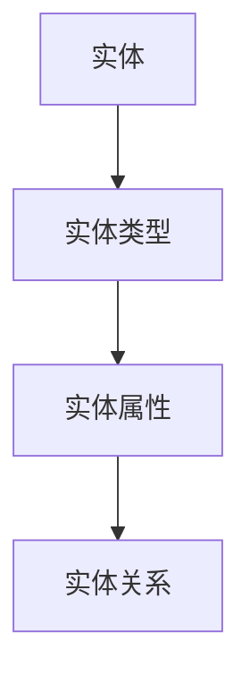
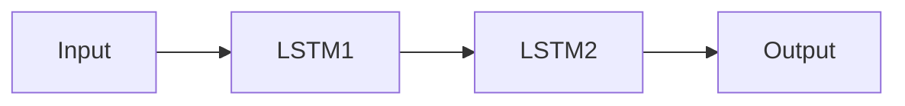
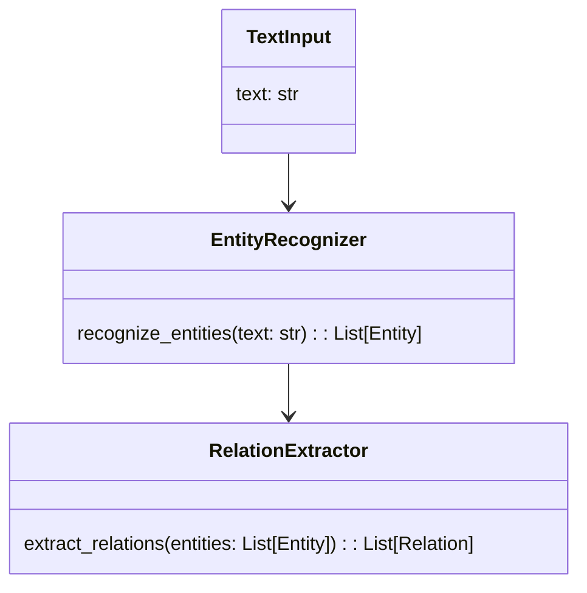
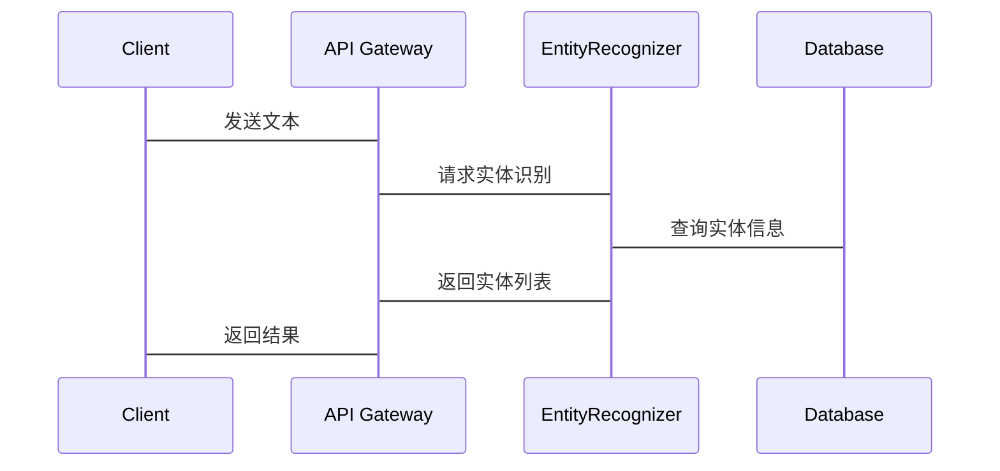

                 


# 实体提取：增强AI Agent的信息处理能力

> 关键词：实体提取，命名实体识别，自然语言处理，AI Agent，信息抽取

> 摘要：实体提取是自然语言处理中的关键任务，通过识别文本中的命名实体来增强AI Agent的信息处理能力。本文系统地介绍了实体提取的核心概念、算法原理、系统架构设计，以及在实际项目中的应用，帮助读者全面理解并掌握实体提取的技术与实践。

---

# 第1章: 实体提取的概述

## 1.1 实体提取的基本概念

### 1.1.1 实体提取的定义

实体提取（Entity Extraction）是自然语言处理（NLP）中的一个关键任务，旨在从文本中识别出具有特定意义的实体，例如人名、地名、组织名、时间、日期等。这些实体是文本中的关键信息，能够帮助AI Agent更好地理解和处理文本内容。

### 1.1.2 实体提取的背景与意义

随着AI技术的快速发展，实体提取在多个领域中发挥着重要作用，例如智能客服、信息检索、机器翻译等。通过实体提取，AI Agent能够从大量非结构化文本中提取结构化信息，从而提高信息处理的效率和准确性。

### 1.1.3 实体提取的应用场景

- **智能问答系统**：提取问题中的实体以生成更准确的回答。
- **信息抽取**：从新闻文章中提取关键实体。
- **知识图谱构建**：通过实体提取构建大规模的知识网络。

---

## 1.2 实体提取的核心问题

### 1.2.1 实体识别的挑战

实体识别过程中面临的主要挑战包括：

- **歧义性**：同一个词可能代表不同的实体，例如“苹果”可以指水果或公司名称。
- **命名实体的多样性**：不同领域中的实体类型和数量差异较大。

### 1.2.2 实体关系的复杂性

实体之间的关系可能较为复杂，例如“公司A收购了公司B”中涉及“收购”这一关系。实体关系的识别需要结合上下文信息进行分析。

### 1.2.3 实体提取的边界与外延

实体提取的边界在于如何准确识别实体的起始和结束位置，而外延则涉及如何处理实体的同义词、变体形式等问题。

---

## 1.3 实体提取的分类与特点

### 1.3.1 命名实体识别（NER）的分类

命名实体识别主要分为以下几类：

- **人名（PER）**：如“李小龙”。
- **地名（LOC）**：如“北京”。
- **组织名（ORG）**：如“谷歌公司”。
- **时间（TIME）**：如“2023年”。

### 1.3.2 实体提取的特征对比

| 特征 | 描述 |
|------|------|
| 精度 | 实体提取的准确性 |
| 速度 | 实体提取的处理效率 |
| 领域适应性 | 实体提取在不同领域的适用性 |

### 1.3.3 实体提取的核心要素组成

- **实体类型**：实体的分类，如人名、地名等。
- **实体属性**：实体的额外描述，如人名的性别。
- **实体关系**：实体之间的关联，如“属于”、“位于”。

---

# 第2章: 实体提取的核心概念与联系

## 2.1 实体提取的原理

### 2.1.1 实体识别的基本原理

实体识别的过程通常包括以下几个步骤：

1. **分词**：将文本分割成词语。
2. **特征提取**：提取每个词语的特征，如词性、上下文信息。
3. **实体分类**：基于特征对词语进行实体分类。

### 2.1.2 实体关系的建模方法

实体关系的建模可以通过以下方式实现：

- **基于规则的方法**：利用预定义的规则匹配实体关系。
- **基于统计的方法**：通过统计词语之间的共现频率发现关系。
- **基于深度学习的方法**：利用神经网络模型学习实体关系。

### 2.1.3 实体提取的模式识别

模式识别在实体提取中主要用于处理文本中的模式，例如日期的格式识别。

---

## 2.2 实体提取的核心概念联系

### 2.2.1 实体提取与自然语言处理的关系

实体提取是自然语言处理的重要组成部分，它依赖于分词、句法分析等技术。

### 2.2.2 实体提取与知识图谱的关联

实体提取是构建知识图谱的关键步骤，通过提取实体及其关系，可以构建大规模的知识网络。

### 2.2.3 实体提取与信息抽取的差异

信息抽取是更广泛的概念，包括实体识别、关系抽取等，而实体提取是其中的一部分。

---

## 2.3 实体提取的ER实体关系图



---

# 第3章: 实体提取的算法原理

## 3.1 实体提取的常用算法

### 3.1.1 基于规则的实体提取

基于规则的方法通过预定义的规则进行实体识别，例如：

- 规则：如果词语是“公司”，则识别为组织名。

### 3.1.2 基于统计的实体提取

基于统计的方法利用词语的特征进行分类，例如：

- 使用条件随机场（CRF）模型进行序列标注。

### 3.1.3 基于深度学习的实体提取

深度学习方法通过神经网络模型进行实体识别，例如：

- 使用双向长短期记忆网络（Bi-LSTM）进行序列标注。

---

## 3.2 实体提取的算法实现

### 3.2.1 基于CRF的实体识别

条件随机场（CRF）是一种常用的序列标注模型，其数学模型如下：

$$ P(y|x) = \frac{\exp(\sum_{i=1}^n f_i(x,y))}{\sum_{y'} \exp(\sum_{i=1}^n f_i(x,y'))} $$

其中，\( f_i \) 是特征函数。

### 3.2.2 基于Bi-LSTM的实体识别

双向长短期记忆网络（Bi-LSTM）通过捕捉上下文信息进行实体识别，其模型结构如下：



---

## 3.3 实体提取的Python代码实现

以下是一个基于CRF的实体识别的Python代码示例：

```python
import numpy as np

class CRF:
    def __init__(self, state_size):
        self.state_size = state_size
        self.parameters = {}

    def forward(self, x):
        # 前向传播
        pass

    def backward(self, x, y):
        # 后向传播
        pass

    def train(self, x, y):
        # 训练模型
        pass

    def predict(self, x):
        # 预测
        pass

# 示例使用
crf = CRF(state_size=10)
x = np.random.randn(10, 5)
y = np.random.randint(0, 4, 5)
crf.train(x, y)
predicted = crf.predict(x)
print(predicted)
```

---

# 第4章: 实体提取的系统分析与架构设计

## 4.1 实体提取系统的项目介绍

本章通过一个医疗领域的实体提取项目来介绍系统的设计与实现。

---

## 4.2 系统功能设计

### 4.2.1 系统功能模块

- **输入模块**：接收待处理的文本。
- **处理模块**：进行实体识别和关系抽取。
- **输出模块**：输出提取的实体及其关系。

### 4.2.2 领域模型设计



---

## 4.3 系统架构设计

### 4.3.1 系统架构图

```mermaid
graph LR
    Client --> API Gateway
    API Gateway --> EntityRecognizer
    EntityRecognizer --> Database
    Database --> Result
```

### 4.3.2 系统接口设计

- **API接口**：提供RESTful API，供外部系统调用实体提取功能。
- **数据库接口**：存储提取的实体及其关系。

### 4.3.3 系统交互流程



---

## 4.4 系统实现与优化

### 4.4.1 系统实现

通过Python和Flask框架实现一个简单的实体提取API：

```python
from flask import Flask, request, jsonify

app = Flask(__name__)

@app.route('/extract', methods=['POST'])
def extract():
    data = request.json
    text = data['text']
    # 实体识别逻辑
    entities = []
    return jsonify({'entities': entities})

if __name__ == '__main__':
    app.run()
```

### 4.4.2 系统优化

- **性能优化**：使用更高效的算法和优化数据库查询。
- **可扩展性优化**：增加缓存机制，提高处理速度。

---

# 第5章: 实体提取项目实战

## 5.1 项目背景与环境搭建

### 5.1.1 项目背景

以医疗领域的病历文本实体提取为例，介绍项目背景和目标。

### 5.1.2 环境搭建

- **安装Python**：3.8及以上版本。
- **安装依赖库**：使用pip安装flask、numpy等库。

## 5.2 系统核心实现

### 5.2.1 核心代码实现

```python
from sklearn_crfsuite import CRF
from sklearn_crfsuite import features

def train_crf_model(X_train, y_train):
    crf = CRF()
    crf.fit(X_train, y_train)
    return crf

# 示例训练
X_train = [...]  # 特征矩阵
y_train = [...]  # 标签
model = train_crf_model(X_train, y_train)
```

### 5.2.2 代码应用解读

- **数据预处理**：对文本进行分词和特征提取。
- **模型训练**：使用CRF模型进行实体识别。
- **结果解析**：输出提取的实体及其位置。

## 5.3 实际案例分析

以一段病历文本为例，展示实体提取的过程和结果。

## 5.4 项目小结

总结项目实施的关键步骤和注意事项，提出改进建议。

---

# 第6章: 实体提取的最佳实践与小结

## 6.1 最佳实践 tips

### 6.1.1 数据质量的重要性

确保训练数据的多样性和代表性，以提高实体提取的准确率。

### 6.1.2 模型调优方法

- **特征选择**：选择合适的特征可以提高模型性能。
- **超参数优化**：通过网格搜索等方法优化模型参数。

## 6.2 小结与展望

总结全文的主要内容，展望未来的发展方向，例如多语言实体提取、实时实体提取等。

---

# 附录

## 附录A: 实体提取相关工具与资源

- **工具推荐**：spaCy、NLTK等。
- **数据集推荐**：CoNLL命名实体识别数据集。

## 附录B: 进一步阅读的建议

推荐一些经典的实体提取相关书籍和论文。

---

# 作者

作者：AI天才研究院/AI Genius Institute & 禅与计算机程序设计艺术 /Zen And The Art of Computer Programming

---

以上是《实体提取：增强AI Agent的信息处理能力》的技术博客文章目录大纲，涵盖了实体提取的核心概念、算法原理、系统架构设计、项目实战以及最佳实践等内容。

