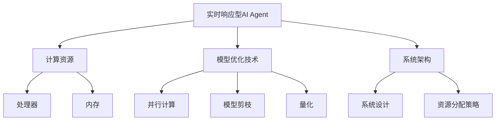

                 

# 实时响应型AI Agent：优化LLM的计算效率

## 关键词：
- 实时响应型AI Agent
- LLM计算效率优化
- 大规模语言模型
- 分布式计算
- 异步处理
- 系统架构设计

## 摘要：
本文探讨了优化实时响应型AI Agent中大规模语言模型（LLM）的计算效率。在AI Agent需要实时响应的场景中，如何在保证响应速度的同时降低计算资源消耗是一个关键挑战。本文通过分析LLM的计算瓶颈，提出了基于并行计算、模型剪枝和量化等技术的优化策略，并设计了高效的系统架构以实现异步处理和分布式计算。通过实际案例分析，验证了这些优化方法的有效性，并总结了在优化过程中的最佳实践和注意事项，为构建高效实时响应型AI Agent提供了理论支持和实践指导。

---

# 第一部分: 实时响应型AI Agent概述

## 第1章: 实时响应型AI Agent的背景与概念

### 1.1 问题背景与挑战
#### 1.1.1 当前AI Agent的发展现状
随着自然语言处理技术的快速发展，AI Agent（智能体）在多个领域得到了广泛应用。AI Agent能够理解用户意图、执行任务并提供实时反馈，这使得其在客服、教育、医疗等领域展现出巨大潜力。然而，现有AI Agent在实时响应能力方面仍存在不足，主要体现在以下方面：
- **计算资源消耗高**：大规模语言模型（LLM）的计算复杂度高，导致响应延迟。
- **资源分配不均**：在高并发场景下，计算资源无法高效分配，导致部分请求处理缓慢。
- **实时性不足**：传统优化方法难以在保证响应速度的同时降低计算开销。

#### 1.1.2 实时响应的需求与挑战
实时响应型AI Agent的核心目标是在用户提出请求的瞬间完成处理并返回结果。这种需求在以下场景中尤为重要：
- **在线客服**：用户期望快速获得问题解答。
- **实时翻译**：需要在输入过程中实时生成翻译结果。
- **智能助手**：用户期望快速获取任务执行结果。

实现实时响应的关键挑战包括：
1. **计算效率优化**：如何在有限的计算资源下快速处理请求。
2. **资源分配策略**：如何高效分配计算资源以应对高并发请求。
3. **模型优化**：如何在不降低模型性能的前提下减少计算开销。

#### 1.1.3 优化LLM计算效率的重要性
LLM（Large Language Model）的计算效率直接决定了AI Agent的实时响应能力。优化LLM计算效率的意义在于：
- **提升用户体验**：快速响应减少用户等待时间。
- **降低运营成本**：减少计算资源消耗，降低能源消耗和运营成本。
- **扩展应用场景**：支持更多实时响应的场景，如实时语音助手、实时推荐系统等。

---

### 1.2 核心概念与定义
#### 1.2.1 实时响应型AI Agent的定义
实时响应型AI Agent是一种能够在用户请求后极短时间内完成处理并返回结果的智能体。其实时性体现在以下几个方面：
- **响应速度**：从接收到请求到返回结果的时间间隔极短。
- **计算效率**：在有限的计算资源下高效完成任务。
- **资源分配**：能够动态分配计算资源以应对不同负载。

#### 1.2.2 LLM的基本概念与工作原理
大规模语言模型（LLM）是基于Transformer架构的模型，通过自注意力机制捕捉文本中的语义信息。其核心工作原理包括：
- **输入处理**：将用户输入转化为模型可处理的向量表示。
- **自注意力计算**：计算输入文本中每个词与其他词的相关性。
- **输出生成**：根据注意力结果生成模型输出。

#### 1.2.3 实时响应的核心问题分析
实时响应型AI Agent的核心问题在于如何在有限的计算资源下快速处理用户请求。这需要解决以下问题：
1. **计算资源分配**：如何高效分配计算资源以应对不同请求。
2. **模型优化**：如何在不降低模型性能的前提下减少计算开销。
3. **系统架构设计**：如何设计高效的系统架构以支持实时响应。

---

### 1.3 问题描述与解决方案
#### 1.3.1 LLM计算效率低的表现形式
LLM计算效率低下可能导致以下问题：
- **响应延迟**：用户请求处理时间过长，影响用户体验。
- **资源消耗高**：大量计算资源被占用，增加运营成本。
- **系统稳定性差**：高负载下系统容易崩溃或响应错误。

#### 1.3.2 实时响应的核心问题分析
实时响应的核心问题在于如何在有限的计算资源下快速处理用户请求。具体表现为：
- **计算资源不足**：在高并发场景下，计算资源无法满足需求。
- **模型计算复杂**：LLM的计算复杂度高，导致响应时间长。
- **资源分配不合理**：计算资源分配策略不合理，导致部分请求处理缓慢。

#### 1.3.3 优化策略的初步探讨
优化LLM计算效率的初步策略包括：
1. **并行计算**：利用多核处理器或分布式计算资源并行处理请求。
2. **模型剪枝**：通过剪枝技术减少模型参数数量，降低计算复杂度。
3. **量化技术**：通过量化技术降低模型参数的精度，减少计算开销。

---

### 1.4 边界与外延
#### 1.4.1 实时响应的边界条件
实时响应型AI Agent的实时性受到以下条件的限制：
- **计算资源**：系统的计算资源（CPU、GPU、内存等）。
- **网络延迟**：网络传输的延迟会影响实时响应。
- **模型复杂度**：模型的复杂度直接影响计算时间。

#### 1.4.2 LLM计算效率优化的适用范围
LLM计算效率优化适用于以下场景：
- **实时翻译**：需要快速生成翻译结果。
- **在线客服**：需要快速回答用户问题。
- **智能助手**：需要快速执行任务并返回结果。

#### 1.4.3 相关概念的对比与区分
实时响应型AI Agent与传统AI Agent的主要区别在于：
- **响应速度**：实时响应型AI Agent强调极短的响应时间，而传统AI Agent对响应时间的要求相对宽松。
- **计算效率**：实时响应型AI Agent更注重计算效率的优化，而传统AI Agent对计算效率的要求较低。

---

### 1.5 核心要素与概念结构
#### 1.5.1 核心要素分析
实时响应型AI Agent的核心要素包括：
1. **计算资源**：包括处理器、内存、存储等。
2. **模型优化技术**：包括并行计算、模型剪枝、量化等。
3. **系统架构**：包括系统设计、资源分配策略等。

#### 1.5.2 概念结构图

#### 1.5.3 外延与内涵的对比
实时响应型AI Agent的内涵在于其极高的实时响应能力，而外延则包括实现这一能力的各种技术和方法。

---

### 1.6 本章小结
#### 1.6.1 主要内容回顾
本章主要介绍了实时响应型AI Agent的背景与概念，分析了其实时响应的需求与挑战，并探讨了优化LLM计算效率的重要性。

#### 1.6.2 下文铺垫
下一章将深入探讨实时响应型AI Agent的核心概念与原理，分析其实时响应的实现机制与优化策略。

---

**作者：AI天才研究院 & 禅与计算机程序设计艺术**

