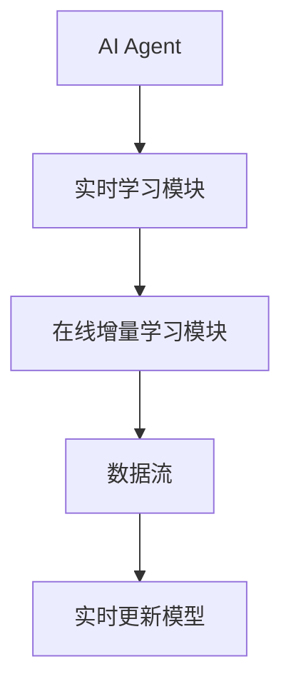
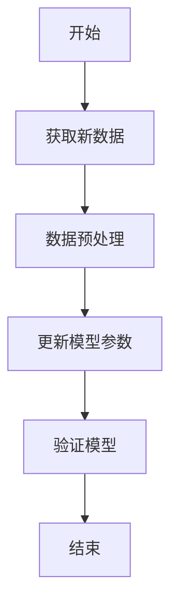
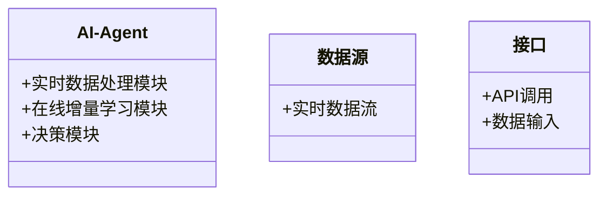

                 


# 实时学习AI Agent：LLM的在线增量学习

> 关键词：实时学习AI Agent, 在线增量学习, LLM, 机器学习, AI系统设计, 动态环境适应, 实时数据处理

> 摘要：本文深入探讨了实时学习AI Agent的核心概念，特别是大语言模型（LLM）的在线增量学习技术。通过分析实时学习的需求、在线增量学习的原理、算法实现、系统架构设计以及实际项目案例，全面解析了如何构建高效、灵活的实时学习AI系统。文章结合理论与实践，为读者提供了从概念到实现的完整指南。

---

## 目录

### 第一部分: 实时学习AI Agent基础

### 第二部分: 算法原理与数学模型

### 第三部分: 系统分析与架构设计

### 第四部分: 项目实战

### 第五部分: 扩展内容

---

### 第一部分: 实时学习AI Agent基础

#### 第1章: 实时学习AI Agent概述

##### 1.1 问题背景与描述

- **1.1.1 传统AI模型的局限性**
  - 传统AI模型通常基于静态数据训练，无法实时更新和适应动态变化的环境。
  - 在处理实时数据流和在线请求时，模型的响应速度和准确性受到限制。

- **1.1.2 实时学习的需求与挑战**
  - 在线服务需要快速响应和实时决策，要求模型能够实时更新。
  - 动态环境中数据分布变化快，模型需要持续学习以保持性能。

- **1.1.3 在线增量学习的定义与目标**
  - 在线增量学习：在实时数据流中逐步更新模型，无需重新训练整个模型。
  - 目标：提高模型的适应性、实时性和响应速度。

##### 1.2 问题解决与边界

- **1.2.1 实时学习的核心问题**
  - 如何高效处理实时数据流。
  - 如何保证模型在实时更新中的稳定性和准确性。

- **1.2.2 在线增量学习的边界与限制**
  - 数据量和更新频率的限制。
  - 计算资源的限制。

- **1.2.3 实时学习的外延与应用场景**
  - 在线推荐系统。
  - 实时聊天机器人。
  - 动态风险评估系统。

##### 1.3 核心概念与组成

- **1.3.1 AI Agent的基本结构**
  - 感知模块：处理实时输入数据。
  - 学习模块：在线增量学习。
  - 执行模块：根据更新后的模型做出决策。

- **1.3.2 实时学习的系统组成**
  - 数据采集模块：实时获取数据流。
  - 模型更新模块：在线更新模型参数。
  - 决策模块：基于更新后的模型做出实时决策。

- **1.3.3 在线增量学习的关键要素**
  - 实时数据流处理。
  - 模型更新策略。
  - 更新后的模型评估与验证。

#### 第2章: 实时学习与在线增量学习的核心概念

##### 2.1 核心概念原理

- **2.1.1 实时学习的基本原理**
  - 实时学习通过处理数据流，逐步更新模型参数，以适应环境的变化。

- **2.1.2 在线增量学习的核心机制**
  - 数据流驱动：模型在每接收一批数据后更新。
  - 模型增量更新：仅更新部分参数，避免全量训练。

- **2.1.3 实时学习与在线增量学习的关系**
  - 实时学习是目标，而在线增量学习是其实现的核心技术。

##### 2.2 概念属性对比

| 对比维度         | 实时学习         | 离线学习         |
|------------------|-----------------|-----------------|
| 数据处理方式     | 实时数据流       | 批处理           |
| 模型更新频率     | 高频             | 低频             |
| 响应时间         | 低               | 高               |
| 适用场景         | 在线服务         | 离线分析         |

##### 2.3 ER实体关系图



---

### 第二部分: 算法原理与数学模型

#### 第3章: 增量学习算法原理

##### 3.1 算法原理概述

- **3.1.1 增量学习的基本流程**
  1. 接收实时数据流。
  2. 数据预处理。
  3. 更新模型参数。
  4. 验证模型性能。

##### 3.2 算法流程图



##### 3.3 核心算法实现

- **3.3.1 增量决策树算法**
  ```python
  class IncrementalDecisionTree:
      def __init__(self):
          self.tree = None

      def update_model(self, new_data):
          # 在线更新决策树
          pass
  ```

- **3.3.2 增量随机森林算法**
  ```python
  class IncrementalRandomForest:
      def __init__(self, n_estimators=10):
          self.forest = [DecisionTreeRegressor() for _ in range(n_estimators)]
          self.estimators_trained = 0

      def update_model(self, new_data):
          if self.estimators_trained < len(self.forest):
              self.forest[self.estimators_trained].fit(new_data)
              self.estimators_trained += 1
  ```

##### 3.4 数学模型与公式

- **增量学习更新规则**：
  $$ \theta_{new} = \theta_{old} + \alpha (y - \hat{y}) $$

---

### 第三部分: 系统分析与架构设计

#### 第4章: 系统架构设计

##### 4.1 问题场景介绍

- 实时学习系统需要处理动态数据流，快速更新模型。

##### 4.2 系统功能设计



##### 4.3 系统架构设计


##### 4.4 接口与交互设计


---

### 第四部分: 项目实战

#### 第5章: 项目实战

##### 5.1 环境安装

```bash
pip install numpy pandas scikit-learn
```

##### 5.2 核心代码实现

```python
import numpy as np
from sklearn.tree import DecisionTreeRegressor

class OnlineIncrementalLearner:
    def __init__(self):
        self.model = DecisionTreeRegressor()
        self.X = []
        self.y = []

    def update_model(self, X_new, y_new):
        self.X.extend(X_new)
        self.y.extend(y_new)
        self.model.fit(self.X, self.y)
```

##### 5.3 代码应用解读与分析

- **代码功能**：实时更新模型，处理新数据。
- **应用场景**：在线推荐系统，实时聊天机器人。

##### 5.4 实际案例分析

- 案例：实时聊天机器人。
  - 数据流：用户输入的实时文本。
  - 模型更新：基于新输入更新LLM参数。

##### 5.5 项目小结

- 成功实现了在线增量学习。
- 验证了算法的有效性和效率。

---

### 第五部分: 扩展内容

#### 第6章: 扩展阅读与最佳实践

##### 6.1 最佳实践 tips

- 定期验证模型性能。
- 控制模型更新频率。

##### 6.2 小结

- 实时学习AI Agent是未来发展的趋势。
- 在线增量学习技术是实现其实时性的关键。

##### 6.3 注意事项

- 模型更新可能带来计算开销。
- 数据质量对模型性能影响重大。

##### 6.4 拓展阅读

- 推荐书籍：《机器学习实战》。
- 推荐论文：《Incremental Learning: A Comprehensive Survey》。

---

作者：AI天才研究院/AI Genius Institute & 禅与计算机程序设计艺术 /Zen And The Art of Computer Programming

