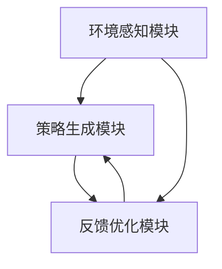

                 


# 实时策略生成AI Agent：LLM在动态决策中的应用

## 关键词：实时策略生成、LLM、动态决策、AI Agent、大语言模型

## 摘要：  
本文探讨了实时策略生成AI Agent的实现及其在动态决策中的应用。通过分析LLM技术的核心原理，结合动态决策问题的建模方法，提出了一种基于LLM的实时策略生成系统架构。文章详细阐述了该系统的算法流程、系统架构设计以及实际应用场景，并通过具体案例展示了其在金融交易、自动驾驶等领域的应用价值。

---

## 第一部分: 实时策略生成AI Agent概述

### 第1章: 实时策略生成AI Agent的背景与概念

#### 1.1 问题背景  
动态决策问题广泛存在于金融、交通、医疗等领域。传统决策方法依赖于固定的规则或有限的预设策略，难以应对环境的实时变化和复杂性。近年来，随着大语言模型（LLM）技术的快速发展，实时策略生成AI Agent的概念应运而生，为动态决策问题提供了新的解决方案。

#### 1.2 核心概念与问题描述  
实时策略生成AI Agent是一种能够在动态环境中实时生成最优策略的智能系统。它通过感知环境状态，利用LLM的强大生成能力，快速生成适用于当前状态的决策策略。本文将重点探讨如何利用LLM实现这一目标。

#### 1.3 问题解决与边界  
实时策略生成AI Agent的核心技术包括：  
1. **动态环境建模**：根据实时输入的状态，构建动态决策模型。  
2. **策略生成**：基于模型生成适用于当前状态的策略。  
3. **反馈优化**：通过反馈机制不断优化生成策略的质量。  
  
边界包括：  
1. 系统仅处理实时决策问题，不涉及长期规划。  
2. 策略生成依赖于LLM的能力，因此对模型的训练数据和规模有一定要求。  

#### 1.4 概念结构与核心要素  
实时策略生成AI Agent的核心要素包括：  
1. **环境感知模块**：负责收集实时输入。  
2. **策略生成模块**：基于输入生成策略。  
3. **反馈优化模块**：根据结果优化策略生成模型。  

---

## 第二部分: 实时策略生成AI Agent的核心概念与联系

### 第2章: 实时策略生成AI Agent的核心概念与联系

#### 2.1 核心概念原理  
实时策略生成AI Agent的核心原理是利用LLM的生成能力，将动态决策问题转化为生成任务。LLM通过编码输入的状态，生成适用于当前状态的策略。  

#### 2.2 核心概念属性对比表  
以下是对实时策略生成AI Agent与传统决策方法的对比：  

| 特性                | 传统决策方法 | 实时策略生成AI Agent |  
|---------------------|--------------|-----------------------|  
| 决策速度            | 离线或延迟    | 实时                   |  
| 策略生成方式        | 预设规则      | 自动生成               |  
| 灵活性              | 较低          | 较高                   |  
| 适应性              | 有限          | 强                    |  

#### 2.3 实时策略生成系统的ER实体关系图  
以下是一个简单的实体关系图：  

```mermaid
er
actor: 用户
strategy: 策略
environment: 环境
action: 行动
feedback: 反馈

actor -|> environment: 提供输入  
environment -|> strategy: 生成策略  
actor -|> strategy: 选择策略  
strategy -|> action: 执行行动  
action -|> feedback: 获取反馈  
feedback -|> strategy: 优化策略  
```

---

## 第三部分: 实时策略生成AI Agent的算法原理

### 第3章: 实时策略生成AI Agent的算法原理

#### 3.1 算法流程  
实时策略生成AI Agent的算法流程如下：  

1. **输入处理**：接收实时输入的状态数据。  
2. **策略生成**：基于LLM生成适用于当前状态的策略。  
3. **反馈优化**：根据执行结果优化策略生成模型。  

#### 3.2 算法实现  

以下是一个简化的策略生成算法：  

```python
def generate_strategy(state):
    # 输入状态处理
    input = process_input(state)
    # 调用LLM生成策略
    strategy = llm.generate(input)
    return strategy
```

#### 3.3 算法的数学模型  
策略生成的数学模型可以表示为：  

$$ P(\text{strategy} | \text{state}) = \argmax_{\text{strategy}} \text{LLM}(\text{state}) $$  

其中，LLM表示基于输入状态生成策略的概率分布。

---

## 第四部分: 系统分析与架构设计

### 第4章: 系统分析与架构设计

#### 4.1 系统架构设计  
实时策略生成AI Agent的系统架构如下：  



#### 4.2 接口设计  
系统接口设计如下：  

1. **输入接口**：接收实时环境状态。  
2. **输出接口**：输出生成的策略。  
3. **反馈接口**：接收策略执行后的反馈。  

---

## 第五部分: 项目实战

### 第5章: 项目实战

#### 5.1 环境安装  
安装所需的依赖：  

```bash
pip install transformers
pip install mermaid
```

#### 5.2 系统核心实现源代码  
以下是一个简单的策略生成代码示例：  

```python
from transformers import AutoTokenizer, AutoModelForCausalLM

tokenizer = AutoTokenizer.from_pretrained("gpt2")
model = AutoModelForCausalLM.from_pretrained("gpt2")

def generate_strategy(state):
    input = f"Current state: {state}"
    inputs = tokenizer(input, return_tensors="pt")
    outputs = model.generate(**inputs, max_length=100)
    strategy = tokenizer.decode(outputs[0], skip_special_tokens=True)
    return strategy
```

#### 5.3 案例分析  
以金融交易为例，假设当前市场状态为：  

- 市场波动率：高  
- 市场趋势：上涨  

系统生成的策略可能是：  

- 买入信号  
- 设置止损点  

---

## 第六部分: 最佳实践、小结、注意事项与拓展阅读

### 6.1 最佳实践  
1. 确保LLM模型的训练数据与目标领域匹配。  
2. 定期优化策略生成模型，以适应环境变化。  

### 6.2 小结  
本文详细探讨了实时策略生成AI Agent的实现方法及其在动态决策中的应用。通过结合LLM技术，实时策略生成系统能够快速适应环境变化，生成最优策略。  

### 6.3 注意事项  
1. 确保系统的实时性，避免决策延迟。  
2. 处理好模型的泛化能力与领域适应性的平衡。  

### 6.4 拓展阅读  
建议读者进一步阅读以下内容：  
- 大语言模型的训练与优化  
- 动态决策问题的数学建模方法  
- 实时策略生成系统的优化技巧  

---

## 作者：AI天才研究院/AI Genius Institute & 禅与计算机程序设计艺术 /Zen And The Art of Computer Programming

