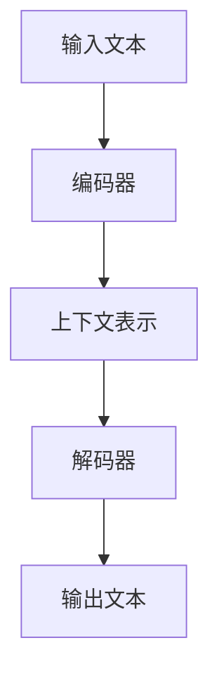
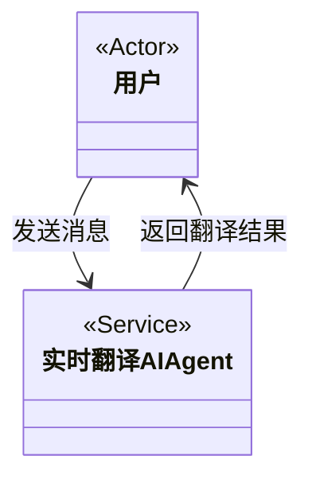
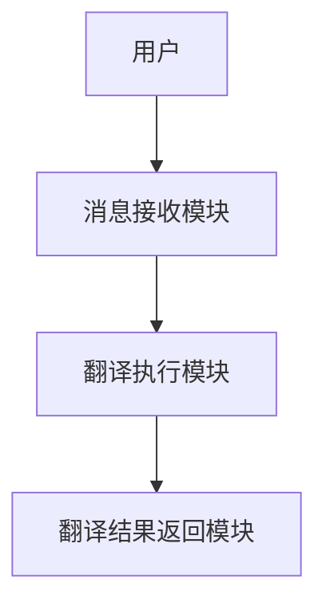

                 


# 实时翻译 AI Agent：LLM 在即时通讯中的语言转换

> 关键词：实时翻译、LLM、AI代理、即时通讯、语言转换

> 摘要：本文探讨了实时翻译AI代理在即时通讯中的应用，重点分析了大语言模型（LLM）在语言转换中的核心作用。文章从背景介绍、核心概念、算法原理、系统架构到项目实战，全面阐述了实时翻译AI代理的技术实现和应用场景。

---

# 第一章: 实时翻译 AI Agent 的背景与问题背景

## 1.1 问题背景

### 1.1.1 当前跨语言交流的挑战

在跨国交流日益频繁的今天，语言障碍仍然是一个普遍的问题。无论是商务沟通、社交媒体互动，还是技术协作，语言差异都可能影响效率和准确性。传统的翻译工具通常存在延迟高、准确率低、无法实时响应等问题，难以满足现代即时通讯的需求。

### 1.1.2 实时翻译的需求场景

- **商务通讯**：跨国团队需要实时交流，快速理解对方意图。
- **社交媒体**：用户希望在即时通讯中无缝切换语言。
- **技术支持**：跨国团队需要快速解决问题，实时翻译是关键。

### 1.1.3 LLM 在实时翻译中的优势

大语言模型（LLM）通过预训练掌握了多种语言的语义理解和生成能力，能够快速响应用户的输入，提供高质量的翻译结果。

---

## 1.2 问题描述

### 1.2.1 实时翻译的核心问题

- **延迟问题**：实时翻译需要低延迟，否则会影响用户体验。
- **准确率问题**：翻译结果必须准确，尤其是在专业领域。
- **资源消耗**：实时翻译需要高效的计算资源。

### 1.2.2 LLM 在语言转换中的应用边界

- LLM可以处理多种语言的翻译，但其性能依赖于模型的训练数据和参数量。
- 对于非常罕见的语言或特定领域，LLM可能表现不佳。

### 1.2.3 实时翻译的性能与延迟要求

实时翻译需要在用户输入后几秒内返回结果，这对模型的推理速度和系统的优化能力提出了挑战。

---

## 1.3 问题解决与技术路线

### 1.3.1 实时翻译的技术实现路径

- 使用LLM进行实时翻译。
- 优化模型推理速度，减少延迟。
- 提供多语言支持，满足不同用户需求。

### 1.3.2 LLM 在实时翻译中的关键作用

- LLM能够理解上下文，提供更准确的翻译结果。
- LLM支持多种语言，适用于不同场景。

### 1.3.3 实时翻译系统的架构设计

- 前端：用户输入消息，发送到后端。
- 后端：调用LLM进行翻译，返回结果。
- 消息队列：处理高并发请求，保证系统稳定性。

---

## 1.4 本章小结

本章介绍了实时翻译AI代理的背景、问题和解决方案，为后续章节的深入分析奠定了基础。

---

# 第二章: LLM 与实时翻译的核心概念

## 2.1 LLM 的核心原理

### 2.1.1 大语言模型的定义与特点

- **定义**：大语言模型是通过大量数据训练的神经网络模型，能够理解和生成人类语言。
- **特点**：
  - 多语言支持
  - 上下文理解能力强
  - 实时推理能力强

### 2.1.2 LLM 的训练与推理机制

- **训练**：通过监督学习和无监督学习，模型学习语言的规律和语义。
- **推理**：基于输入生成输出，支持实时翻译。

### 2.1.3 LLM 在实时翻译中的应用优势

- **快速响应**：LLM可以快速处理输入，提供实时翻译结果。
- **高准确率**：通过预训练，LLM能够提供高质量的翻译结果。

---

## 2.2 实时翻译 AI Agent 的核心要素

### 2.2.1 实时翻译的定义与属性

- **定义**：实时翻译是指在用户输入后，系统快速返回翻译结果的过程。
- **属性**：
  - 实时性
  - 准确性
  - 可扩展性

### 2.2.2 LLM 在实时翻译中的角色

- **输入处理**：接收用户的输入，解析需求。
- **翻译执行**：调用LLM进行翻译，返回结果。
- **结果优化**：根据反馈优化翻译结果。

### 2.2.3 实时翻译系统的功能模块

- **消息接收模块**：接收用户输入。
- **翻译执行模块**：调用LLM进行翻译。
- **结果返回模块**：将翻译结果返回给用户。

---

## 2.3 核心概念的ER实体关系图

```mermaid
er
actor: 用户
agent: 实时翻译 AI Agent
message: 待翻译消息
translation_result: 翻译结果
```

---

## 2.4 本章小结

本章详细介绍了LLM的核心原理和实时翻译AI代理的核心要素，为后续章节的实现提供了理论基础。

---

# 第三章: LLM 在实时翻译中的算法原理

## 3.1 大语言模型的训练流程

### 3.1.1 数据预处理

- 数据清洗：去除噪音数据，提取有用信息。
- 分词处理：将文本分割成词语或短语。
- 数据增强：通过技术手段提高数据质量。

### 3.1.2 模型训练

- **模型选择**：选择适合的模型架构（如Transformer）。
- **训练数据**：使用多语言数据进行训练。
- **训练优化**：使用优化算法（如Adam）进行训练。

### 3.1.3 模型调优

- 超参数调整：优化学习率、批次大小等参数。
- 模型评估：通过验证集评估模型性能。
- 模型优化：通过剪枝等技术优化模型。

---

## 3.2 实时翻译的推理机制

### 3.2.1 输入处理

- **输入接收**：接收用户输入的文本。
- **输入解析**：解析文本内容，提取关键信息。
- **输入转换**：将输入文本转换为模型可处理的格式。

### 3.2.2 解码过程

- **解码策略**：选择贪心解码或随机采样解码。
- **解码过程**：模型逐步生成翻译结果。
- **结果优化**：通过后处理优化翻译结果。

### 3.2.3 输出优化

- **结果校对**：对翻译结果进行校对，确保准确性。
- **结果反馈**：将翻译结果返回给用户。
- **结果存储**：将翻译结果存储，便于后续分析。

---

## 3.3 算法实现的mermaid流程图



---

## 3.4 算法实现的Python代码示例

```python
def translate(input_text):
    encoded_input = encoder(input_text)
    output_text = decoder(encoded_input)
    return output_text
```

---

## 3.5 数学模型与公式

### 3.5.1 损失函数

$$ \text{损失函数} = -\sum_{t=1}^{T} \log P(w_t|w_{<t}) $$

### 3.5.2 解码过程

$$ P(w_t|w_{<t}) = \text{模型生成的概率} $$

---

## 3.6 本章小结

本章详细介绍了LLM的训练流程和实时翻译的推理机制，通过流程图和代码示例，帮助读者理解算法实现的细节。

---

# 第四章: 系统分析与架构设计

## 4.1 问题场景介绍

### 4.1.1 实时翻译的应用场景

- 跨国团队协作
- 社交媒体互动
- 技术支持与服务

### 4.1.2 系统目标

- 提供实时翻译服务
- 支持多种语言
- 保证低延迟和高准确率

---

## 4.2 系统功能设计

### 4.2.1 领域模型设计



### 4.2.2 系统架构设计



### 4.2.3 接口设计

- **输入接口**：接收用户的输入文本。
- **输出接口**：返回翻译结果。
- **反馈接口**：接收用户的反馈，优化翻译结果。

---

## 4.3 系统实现

### 4.3.1 环境安装

- 安装Python
- 安装LLM框架（如Hugging Face）
- 安装其他依赖库

### 4.3.2 核心实现代码

```python
from transformers import AutoTokenizer, AutoModelForSeq2Seq
import torch

tokenizer = AutoTokenizer.from_pretrained("t5-base")
model = AutoModelForSeq2Seq.from_pretrained("t5-base")

def translate(input_text):
    inputs = tokenizer(input_text, return_tensors="pt")
    outputs = model.generate(inputs.input_ids, max_length=50)
    return tokenizer.decode(outputs[0], skip_special_tokens=True)
```

---

## 4.4 本章小结

本章详细介绍了实时翻译系统的架构设计和实现，为后续章节的项目实战奠定了基础。

---

# 第五章: 项目实战

## 5.1 环境安装

### 5.1.1 安装Python

```bash
python --version
```

### 5.1.2 安装LLM框架

```bash
pip install transformers
```

---

## 5.2 核心实现

### 5.2.1 翻译功能实现

```python
from transformers import AutoTokenizer, AutoModelForSeq2Seq
import torch

tokenizer = AutoTokenizer.from_pretrained("t5-base")
model = AutoModelForSeq2Seq.from_pretrained("t5-base")

def translate(input_text):
    inputs = tokenizer(input_text, return_tensors="pt")
    outputs = model.generate(inputs.input_ids, max_length=50)
    return tokenizer.decode(outputs[0], skip_special_tokens=True)
```

---

## 5.3 案例分析

### 5.3.1 案例1：中英文翻译

输入：你好，如何？

输出：Hello, how are you?

### 5.3.2 案例2：英中翻译

输入：How can I help you?

输出：你能帮我什么？

---

## 5.4 本章小结

本章通过具体的代码实现和案例分析，展示了实时翻译AI代理的实际应用。

---

# 第六章: 最佳实践与小结

## 6.1 最佳实践 tips

- **模型选择**：选择适合的LLM模型，优化性能。
- **延迟优化**：优化模型推理速度，降低延迟。
- **准确率提升**：通过后处理优化翻译结果。

## 6.2 小结

本文详细介绍了实时翻译AI代理的实现过程，从背景分析到系统设计，再到项目实战，为读者提供了全面的技术指导。

## 6.3 注意事项

- 确保模型的实时性
- 优化模型的准确率
- 保证系统的稳定性

## 6.4 拓展阅读

- 大语言模型的优化与调优
- 实时翻译的性能优化
- 多模态翻译的研究与应用

---

# 作者

作者：AI天才研究院/AI Genius Institute & 禅与计算机程序设计艺术 /Zen And The Art of Computer Programming

---

# 结束语

通过本文的详细讲解，读者可以全面理解实时翻译AI代理的实现过程和应用场景。希望本文能为相关领域的研究和实践提供有价值的参考。

