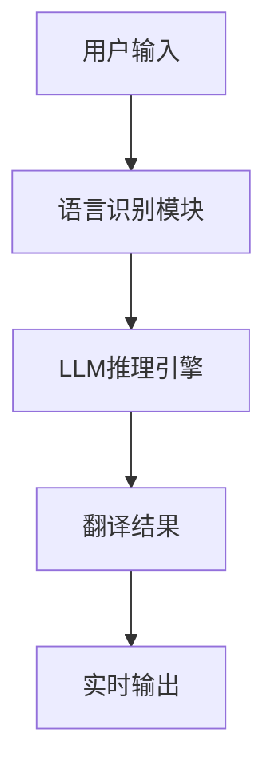
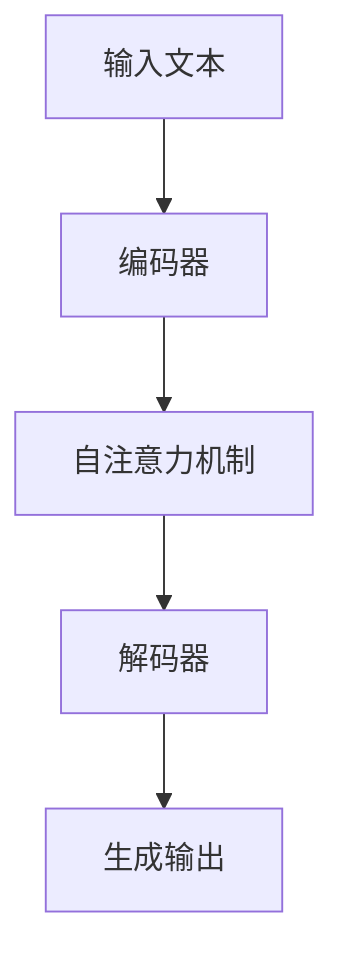
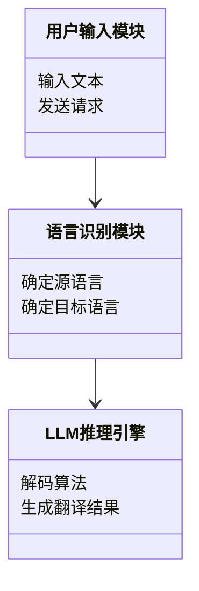
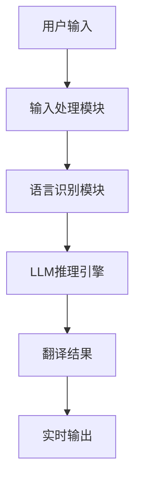

                 


# 实时语言转换AI Agent：LLM在多语言环境中的应用

> 关键词：实时语言转换、LLM、大语言模型、多语言环境、自然语言处理、人工智能

> 摘要：本文探讨了实时语言转换AI Agent在多语言环境中的应用，详细分析了其核心概念、算法原理、系统架构，并通过实际案例展示了如何利用大语言模型实现高效的实时语言转换。

---

# 第一部分: 实时语言转换AI Agent概述

## 第1章: 实时语言转换的背景与挑战

### 1.1 问题背景与描述

#### 1.1.1 多语言交流的痛点
在跨国会议、国际交流、多语言客服等场景中，语言障碍是一个长期存在的痛点。传统的翻译工具通常需要用户手动输入文本，等待几分钟才能得到结果，无法满足实时交流的需求。

#### 1.1.2 实时语言转换的需求场景
实时语言转换的目标是实现即时、准确的语言转换，让用户在语音通话、实时聊天、视频会议等场景中能够无缝交流。这种技术可以显著提高跨语言交流的效率和体验。

#### 1.1.3 当前技术的局限性
传统的翻译技术依赖于规则引擎和静态词典，存在以下局限性：
- 精度有限：无法处理复杂句式和语境。
- 实时性不足：需要等待用户输入完整文本后才能进行翻译。
- 语言覆盖有限：难以支持小语种和方言。

### 1.2 LLM在语言转换中的作用

#### 1.2.1 大语言模型的核心优势
大语言模型（LLM）通过深度学习技术，能够理解和生成多种语言的文本。其优势包括：
- 高精度：基于上下文理解，生成更准确的翻译结果。
- 实时性：支持流式处理，能够在输入过程中逐步生成翻译结果。
- 多语言支持：模型通常经过多语言数据训练，能够支持数十种语言。

#### 1.2.2 LLM在实时语言转换中的应用潜力
LLM可以实现以下功能：
- 实时语音翻译：在通话过程中即时转换语言。
- 文本自动翻译：用户输入文本后，系统实时生成目标语言的文本。
- 跨语言对话：支持多语言对话，用户可以自由切换语言。

#### 1.2.3 技术边界与外延
实时语言转换的边界包括：
- 支持的语言种类：通常取决于模型的训练数据。
- 处理速度：取决于模型的推理能力。
- 翻译精度：受模型训练数据质量和目标语言的复杂性影响。

### 1.3 本章小结
本章介绍了实时语言转换的背景、需求场景及其面临的挑战，并分析了LLM在其中的核心作用。通过对比传统翻译技术与LLM的优势，明确了实时语言转换的潜力和边界。

---

## 第2章: 实时语言转换AI Agent的核心概念

### 2.1 LLM的基本原理

#### 2.1.1 大语言模型的定义
大语言模型是指基于深度学习技术训练的大型神经网络模型，通常使用Transformer架构，能够理解和生成多种语言的文本。

#### 2.1.2 LLM的训练机制
- **输入数据**：多样化的多语言文本数据。
- **训练目标**：最小化预测词与实际词之间的交叉熵损失。
- **训练过程**：通过自监督学习，模型从大量未标注数据中学习语言规律。

#### 2.1.3 LLM的输出机制
- **输入处理**：将输入文本转化为模型可处理的向量表示。
- **解码过程**：通过自注意力机制生成目标语言的文本。

### 2.2 实时语言转换的关键技术

#### 2.2.1 流式处理技术
流式处理是指在输入过程中逐步生成输出结果，适用于实时语音翻译场景。

#### 2.2.2 异步通信机制
异步通信可以减少延迟，提高系统的响应速度。

#### 2.2.3 实时推理优化
通过并行计算和模型剪枝技术优化模型的推理效率。

### 2.3 核心概念对比分析

#### 2.3.1 LLM与传统翻译技术对比
| 对比维度 | LLM | 传统翻译技术 |
|----------|-----|--------------|
| 精度     | 高   | 中            |
| 实时性   | 实时 | 非实时        |
| 可扩展性 | 高   | 低            |

#### 2.3.2 实时转换与离线转换的对比
| 对比维度 | 实时转换 | 离线转换 |
|----------|----------|----------|
| 响应时间 | 实时     | 非实时   |
| 资源消耗 | 高       | 低       |

#### 2.3.3 语言模型的可扩展性分析
LLM通过微调或参数共享技术可以支持多种语言，扩展性较好。

### 2.4 实体关系图


### 2.5 本章小结
本章详细介绍了实时语言转换AI Agent的核心概念，包括LLM的基本原理、实时语言转换的关键技术，并通过对比分析明确了LLM的优势。

---

## 第3章: 实时语言转换的算法原理

### 3.1 LLM的训练过程

#### 3.1.1 Transformer模型结构
Transformer模型由编码器和解码器组成，编码器负责将输入文本转化为向量表示，解码器负责生成目标语言的文本。

#### 3.1.2 自注意力机制
自注意力机制通过计算输入序列中每个词与其他词的相关性，生成位置感知的表示。

#### 3.1.3 梯度下降优化
通过反向传播算法和梯度下降优化器（如Adam）更新模型参数，最小化预测损失。

### 3.2 解码算法的实现

#### 3.2.1 基于贪心算法的解码
贪心解码在每一步选择概率最高的词生成输出。

#### 3.2.2 频率加权解码
频率加权解码通过调整候选词的概率分布，生成更合理的翻译结果。

#### 3.2.3 温度调节解码
温度调节解码通过调整生成分布的温度参数，平衡生成结果的多样性和准确性。

### 3.3 算法流程图


### 3.4 本章小结
本章详细讲解了实时语言转换AI Agent的算法原理，包括LLM的训练过程和解码算法的实现。

---

## 第4章: 系统分析与架构设计

### 4.1 系统应用场景
实时语言转换AI Agent适用于以下场景：
- 视频会议
- 实时聊天
- 电话会议

### 4.2 系统功能设计

#### 4.2.1 领域模型


### 4.3 系统架构设计


### 4.4 本章小结
本章通过系统分析和架构设计，明确了实时语言转换AI Agent的核心功能和实现方式。

---

## 第5章: 项目实战

### 5.1 环境配置
- **Python版本**：3.8以上
- **依赖库**：transformers、torch

### 5.2 核心代码实现
```python
from transformers import AutoTokenizer, AutoModelForSeq2SeqLM
import torch

# 初始化模型和分词器
tokenizer = AutoTokenizer.from_pretrained("facebook/m2m100")
model = AutoModelForSeq2SeqLM.from_pretrained("facebook/m2m100")

# 定义实时转换函数
def realtime_translation(source_text, target_lang):
    inputs = tokenizer(source_text, return_tensors="pt")
    with torch.no_grad():
        outputs = model.generate(**inputs, forced_eos_token_id=tokenizer.eos_token_id)
    translated = tokenizer.decode(outputs[0], skip_special_tokens=True)
    return translated

# 示例调用
source_text = "Hello, how are you?"
target_lang = "zh"
result = realtime_translation(source_text, target_lang)
print(result)  # 输出："你好，你怎么样？"
```

### 5.3 本章小结
本章通过项目实战，详细讲解了实时语言转换AI Agent的实现过程，包括环境配置和核心代码实现。

---

## 第6章: 最佳实践与小结

### 6.1 本章小结
本文详细探讨了实时语言转换AI Agent的应用，包括其核心概念、算法原理、系统架构和项目实现。

### 6.2 注意事项
- **性能优化**：通过模型剪枝和量化技术优化推理效率。
- **错误处理**：设计完善的错误处理机制，确保系统稳定性。
- **用户反馈**：收集用户反馈，不断优化翻译质量。

### 6.3 未来展望
未来，实时语言转换AI Agent可以通过以下方式进一步优化：
- 支持更多语言
- 提高翻译精度
- 优化实时性能

### 6.4 本章小结
本章总结了实时语言转换AI Agent的核心内容，并提供了未来发展的建议。

---

## 附录: 参考资料

1. 值得一看的论文：
   - "Massively Multilingual Neural Machine Translation"
2. 推荐工具：
   - Hugging Face的Transformers库
3. 相关技术博客：
   - "Understanding Large Language Models"

---

**作者：AI天才研究院/AI Genius Institute & 禅与计算机程序设计艺术 /Zen And The Art of Computer Programming**

