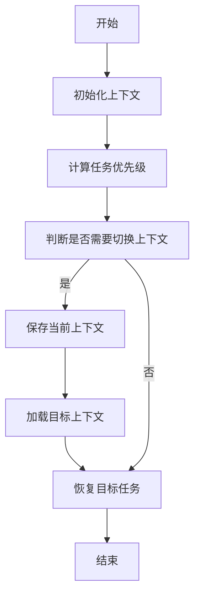
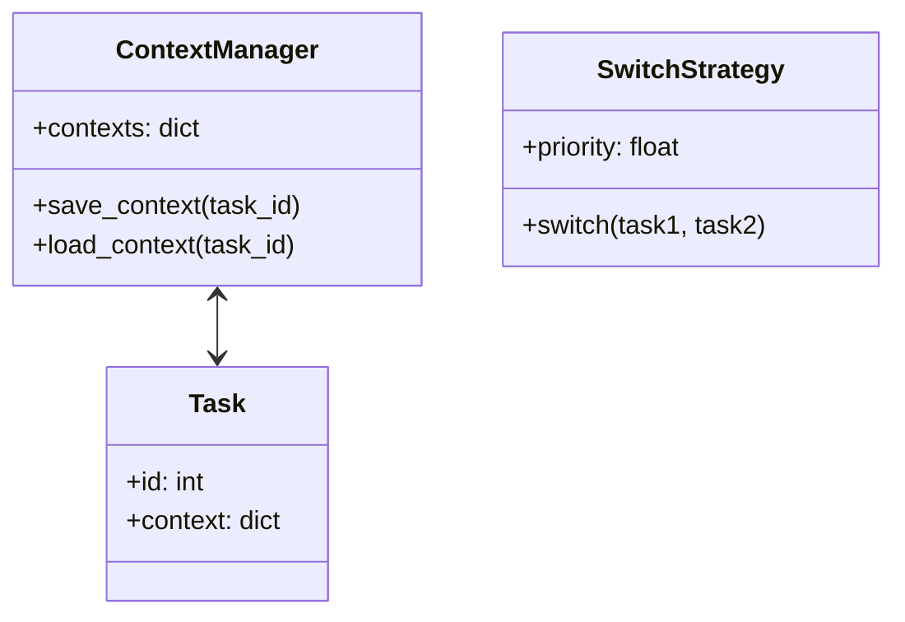

                 


# 实现AI Agent的动态上下文切换机制

> 关键词：AI Agent，动态上下文切换，多任务处理，注意力机制，系统架构

> 摘要：本文详细探讨了AI Agent的动态上下文切换机制，从问题背景、核心概念、算法原理到系统架构设计，结合实际案例分析，全面阐述了如何实现高效、可靠的动态上下文切换机制，助力AI Agent在复杂场景下的灵活应对能力。

---

# 第一部分: AI Agent的动态上下文切换机制背景介绍

## 第1章: 动态上下文切换机制的背景与问题背景

### 1.1 问题背景
AI Agent（人工智能代理）在现代计算系统中扮演着越来越重要的角色。随着应用场景的复杂化，AI Agent需要处理的任务类型不断增加，尤其是在多任务处理场景中，动态切换上下文的能力变得至关重要。传统的静态上下文管理方式已经无法满足复杂场景的需求，动态上下文切换机制因此应运而生。

#### 1.1.1 当前AI Agent的发展现状
- AI Agent已广泛应用于机器人控制、智能助手、自动驾驶等领域。
- 单一任务处理能力不断增强，但在多任务场景下的灵活性不足。
- 上下文切换机制的研究尚处于初级阶段，存在切换效率低、状态丢失等问题。

#### 1.1.2 动态上下文切换的需求来源
- 多任务处理需求：AI Agent需要快速响应不同任务之间的切换。
- 动态环境适应：实时场景中，任务优先级可能动态变化。
- 上下文一致性：确保每次任务切换后的上下文状态正确恢复。

#### 1.1.3 问题背景与应用场景
- 例如，在智能客服系统中，AI Agent需要在多个客户之间切换，同时保持对每个客户的上下文理解。
- 在自动驾驶中，AI Agent需要在不同驾驶场景（如城市道路、高速公路）之间快速切换，确保安全性和效率。

### 1.2 问题描述
动态上下文切换机制的核心问题在于如何高效地管理、切换和恢复上下文，同时保证任务执行的正确性和连续性。

#### 1.2.1 AI Agent的多任务处理挑战
- 上下文干扰：不同任务的上下文可能存在冲突。
- 上下文切换开销：频繁切换会导致性能下降。
- 上下文恢复错误：切换后可能无法正确恢复任务状态。

#### 1.2.2 上下文切换的核心问题
- 如何高效存储和检索上下文。
- 如何确定切换时机和目标。
- 如何保证切换过程的原子性和一致性。

#### 1.2.3 动态上下文切换的定义与特点
- 动态上下文切换是指AI Agent在运行过程中，根据任务需求实时切换当前处理的上下文。
- 其特点包括：实时性、高效性、可靠性。

### 1.3 问题解决思路
动态上下文切换机制的设计需要从上下文管理、切换策略和状态恢复三方面入手。

#### 1.3.1 动态上下文切换的目标
- 实现上下文的快速切换和恢复。
- 最小化切换过程中的性能开销。
- 提高AI Agent在复杂场景下的适应性。

#### 1.3.2 解决方案的初步构想
- 引入高效的上下文存储机制。
- 设计智能的切换策略。
- 确保切换过程中的原子性和一致性。

#### 1.3.3 相关技术的对比分析
- 对比静态上下文切换和动态上下文切换的优缺点。
- 分析现有上下文管理技术的适用性。

### 1.4 边界与外延
动态上下文切换机制的边界和外延需要明确。

#### 1.4.1 动态上下文切换的边界条件
- 仅处理任务切换，不涉及任务本身的执行逻辑。
- 切换过程中不改变任务的优先级。

#### 1.4.2 相关概念的外延分析
- 上下文管理：包括上下文的存储、检索和恢复。
- 切换策略：基于任务需求和系统状态的切换决策。

#### 1.4.3 核心概念的结构化描述
- 核心概念包括：上下文管理模块、切换策略模块、状态恢复模块。

### 1.5 核心概念组成
动态上下文切换机制由以下几个核心模块组成：

#### 1.5.1 上下文管理模块
- 负责存储和检索当前上下文。
- 使用高效的数据结构（如哈希表）存储上下文信息。

#### 1.5.2 切换机制模块
- 根据任务需求决定是否切换上下文。
- 设计切换策略（如优先级调度、负载均衡）。

#### 1.5.3 状态管理模块
- 确保切换前后状态的一致性。
- 实现切换过程的原子性。

---

# 第二部分: 核心概念与联系

## 第2章: 动态上下文切换机制的核心概念

### 2.1 动态上下文切换的原理
动态上下文切换机制通过高效的上下文管理、智能的切换策略和可靠的恢复机制，实现快速的任务切换。

#### 2.1.1 上下文管理的原理
- 上下文存储：使用轻量级的数据结构存储当前任务的上下文信息。
- 上下文检索：根据任务标识快速检索对应的上下文。

#### 2.1.2 切换机制的原理
- 切换触发条件：任务优先级变化、资源竞争等。
- 切换执行步骤：保存当前上下文、加载目标上下文、恢复目标任务。

#### 2.1.3 状态管理的原理
- 确保切换过程中的状态一致性。
- 提供状态恢复的机制，避免切换错误。

### 2.2 动态上下文切换的核心概念

#### 2.2.1 上下文管理模块的特征
- 可扩展性：支持多种任务类型的上下文存储。
- 高效性：快速存储和检索上下文。

#### 2.2.2 切换策略模块的特征
- 智能性：基于系统负载和任务优先级动态调整切换策略。
- 可定制性：支持多种切换策略的灵活配置。

#### 2.2.3 状态恢复模块的特征
- 原子性：确保切换过程中的状态一致性。
- 可靠性：避免切换过程中出现状态丢失或错误。

### 2.3 动态上下文切换机制的ER实体关系图

```mermaid
erd
    title 动态上下文切换机制的ER实体关系图
    ContextSwitch
    Context
    Task
    switch (
        Context,
        Task,
        ContextSwitch
    )
```

---

# 第三部分: 算法原理讲解

## 第3章: 动态上下文切换机制的算法原理

### 3.1 基于注意力机制的动态切换算法

#### 3.1.1 算法的基本原理
- 使用注意力机制计算任务切换的概率。
- 根据任务优先级和系统负载动态调整切换策略。

#### 3.1.2 算法流程图



#### 3.1.3 算法的数学模型
- 任务优先级计算公式：
  $$ priority = \frac{1}{1 + e^{-score}} $$
- 注意力权重计算公式：
  $$ attention = \frac{e^{score}}{\sum e^{score}} $$

#### 3.1.4 算法的实现代码
```python
def dynamic_context_switch(tasks):
    for task in tasks:
        score = calculate_score(task)
        priority = 1 / (1 + math.exp(-score))
        if priority > 0.5:
            # 切换上下文
            save_current_context()
            load_context(task)
        # 恢复目标任务
        restore_task(task)
    return
```

---

# 第四部分: 系统分析与架构设计

## 第4章: 动态上下文切换机制的系统分析与架构设计

### 4.1 系统功能设计

#### 4.1.1 领域模型类图



### 4.2 系统架构设计

#### 4.2.1 系统架构图


### 4.3 系统接口设计

#### 4.3.1 接口描述
- `save_context(task_id)`：保存当前任务的上下文。
- `load_context(task_id)`：加载目标任务的上下文。
- `switch_context(task1, task2)`：根据优先级切换任务上下文。

#### 4.3.2 接口交互流程图

```mermaid
sequence
    客户端 -> ContextManager: save_context(task1)
    ContextManager --> SwitchStrategy: calculate_priority(task1, task2)
    SwitchStrategy --> 客户端: return priority
    客户端 -> ContextManager: load_context(task2)
    ContextManager --> Task: restore_task(task2)
```

---

# 第五部分: 项目实战

## 第5章: 动态上下文切换机制的项目实战

### 5.1 环境安装与配置

#### 5.1.1 环境要求
- Python 3.8+
- Mermaid工具链
- 必要的开发库（如numpy、pandas）

### 5.2 核心代码实现

#### 5.2.1 上下文管理模块

```python
class ContextManager:
    def __init__(self):
        self.contexts = {}

    def save_context(self, task_id):
        self.contexts[task_id] = deepcopy(current_context)

    def load_context(self, task_id):
        if task_id in self.contexts:
            return self.contexts[task_id]
        else:
            return None
```

#### 5.2.2 切换策略模块

```python
class SwitchStrategy:
    def calculate_priority(self, task1, task2):
        return 1 / (1 + math.exp(-(task1.score + task2.score / 2)))
```

### 5.3 代码解读与分析
- 上下文管理模块通过哈希表存储任务上下文，确保快速存取。
- 切换策略模块根据任务优先级动态调整切换决策。

### 5.4 案例分析与详细解读
- 案例：智能客服系统中的多任务切换。
- 分析：通过动态上下文切换机制，客服AI Agent可以在不同客户之间快速切换，保持高效响应。

---

# 第六部分: 总结与展望

## 第6章: 总结与展望

### 6.1 最佳实践 Tips
- 合理设计上下文管理模块，确保高效存取。
- 根据具体场景调整切换策略，优化切换效率。

### 6.2 小结
动态上下文切换机制是AI Agent在复杂场景下高效运行的关键技术。通过本文的详细讲解，读者可以深入了解其实现原理和应用场景。

### 6.3 注意事项
- 切换上下文时要注意状态一致性。
- 避免频繁切换导致的性能开销。

### 6.4 拓展阅读
- 《Attention Is All You Need》
- 《Dynamic Context Management in AI Systems》

---

作者：AI天才研究院/AI Genius Institute & 禅与计算机程序设计艺术 /Zen And The Art of Computer Programming

