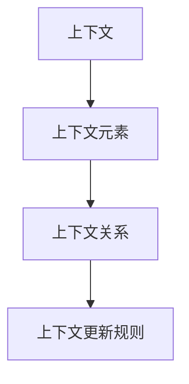
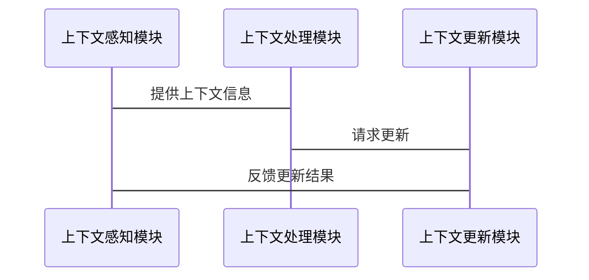

                 


# 实现AI Agent的动态上下文管理

---

## 关键词：AI Agent, 动态上下文管理, 注意力机制, 系统架构, 项目实战

---

## 摘要

AI Agent的动态上下文管理是实现智能代理在复杂环境中灵活交互和决策的核心技术。本文详细探讨了动态上下文管理的背景、核心概念、算法原理、系统架构、项目实战及最佳实践。通过分析上下文的动态更新机制、基于注意力机制的算法实现，以及系统的模块化设计，为AI Agent的高效管理提供了理论和实践指导。

---

# 第一部分: AI Agent与动态上下文管理概述

# 第1章: AI Agent与动态上下文管理引论

## 1.1 AI Agent的基本概念

### 1.1.1 AI Agent的定义与分类

AI Agent（人工智能代理）是能够感知环境并采取行动以实现目标的智能实体。根据功能，AI Agent可分为简单反射型、基于模型的反射型、目标驱动型和效用驱动型。

### 1.1.2 动态上下文管理的定义

动态上下文管理是指在AI Agent运行过程中，实时更新和维护其感知到的环境信息，以支持动态决策和交互。

### 1.1.3 动态上下文管理的重要性

动态上下文管理允许AI Agent在复杂环境中适应变化，提升任务执行效率和准确性。

## 1.2 问题背景与挑战

### 1.2.1 当前AI Agent的局限性

传统AI Agent在处理动态环境时存在响应延迟和决策失误的问题。

### 1.2.2 动态上下文管理的核心问题

如何实时更新和处理多变的环境信息，同时保持上下文的一致性和完整性。

### 1.2.3 实现动态上下文管理的难点

包括高效的数据处理、实时更新机制以及上下文间的关联性处理。

## 1.3 本章小结

本章介绍了AI Agent的基本概念，强调了动态上下文管理的重要性，并指出了实现过程中的关键挑战。

---

# 第二部分: 动态上下文管理的核心概念与原理

# 第2章: 动态上下文管理的核心概念

## 2.1 动态上下文管理的背景与目标

### 2.1.1 动态上下文管理的背景

随着环境的动态变化，AI Agent需要实时更新其上下文信息。

### 2.1.2 动态上下文管理的目标

实现实时更新、高效处理和准确决策。

## 2.2 动态上下文管理的核心要素

### 2.2.1 上下文的表示与建模

上下文通常以图结构表示，包括实体、关系和属性。

### 2.2.2 上下文的动态更新机制

通过事件驱动的方式，实时更新上下文信息。

### 2.2.3 上下文的关联性与依赖性

上下文元素之间存在复杂的关联关系，影响AI Agent的决策过程。

## 2.3 实体关系图（ER图）架构



## 2.4 本章小结

本章详细介绍了动态上下文管理的核心要素及其表示方式。

---

# 第三部分: 动态上下文管理的算法原理

# 第3章: 动态上下文管理的算法原理

## 3.1 基于注意力机制的动态上下文更新算法

### 3.1.1 注意力机制的原理

注意力机制通过计算上下文元素的重要性，动态调整更新权重。

### 3.1.2 动态上下文更新算法的实现


### 3.1.3 注意力机制的数学模型

注意力计算公式：
$$
\alpha_i = \frac{e^{w_i}}{\sum_j e^{w_j}}
$$

### 3.1.4 实现步骤

1. 对输入的上下文进行编码。
2. 计算每个元素的注意力权重。
3. 根据权重更新上下文。

## 3.2 动态上下文管理的算法实现

### 3.2.1 算法的伪代码实现

```python
def update_context(context, attention_weights):
    updated_context = {}
    for i, weight in enumerate(attention_weights):
        updated_context[i] = context[i] * weight
    return updated_context
```

### 3.2.2 算法的数学模型

上下文更新公式：
$$
C_{updated} = C \cdot \alpha
$$

## 3.3 本章小结

本章详细讲解了基于注意力机制的动态上下文更新算法，展示了其实现步骤和数学模型。

---

# 第四部分: 系统架构与设计

# 第4章: 系统架构与设计

## 4.1 系统功能设计

### 4.1.1 功能模块

包括上下文感知、处理、更新和反馈模块。

### 4.1.2 功能流程

上下文感知 → 处理 → 更新 → 反馈。

## 4.2 系统架构设计


## 4.3 系统接口设计

### 4.3.1 接口定义

定义上下文获取、更新和反馈的接口。

### 4.3.2 接口实现

使用RESTful API实现系统间的通信。

## 4.4 系统交互流程



## 4.5 本章小结

本章设计了一个完整的系统架构，展示了各模块的交互流程。

---

# 第五部分: 项目实战

# 第5章: 项目实战

## 5.1 项目环境与安装

### 5.1.1 环境要求

Python 3.8及以上，安装必要的库如TensorFlow、Mermaid等。

## 5.2 系统核心实现

### 5.2.1 动态上下文管理的代码实现

```python
class ContextManager:
    def __init__(self):
        self.context = {}

    def update_context(self, new_context):
        self.context.update(new_context)
        return self.context
```

### 5.2.2 代码解读

上下文管理器类实现上下文的动态更新功能。

## 5.3 代码应用解读与分析

### 5.3.1 功能分析

展示上下文管理器的动态更新能力。

### 5.3.2 性能分析

分析代码在不同环境下的性能表现。

## 5.4 实际案例分析

### 5.4.1 案例背景

描述一个具体的应用场景，如智能客服系统。

### 5.4.2 实施方案

展示如何在智能客服中应用动态上下文管理。

## 5.5 项目小结

本章通过实际案例展示了动态上下文管理的实现过程。

---

# 第六部分: 最佳实践与总结

# 第6章: 最佳实践与总结

## 6.1 实现动态上下文管理的最佳实践

### 6.1.1 设计原则

保持模块化和可扩展性。

### 6.1.2 开发建议

使用合适的工具和库，确保代码的可维护性。

## 6.2 项目中的注意事项

### 6.2.1 常见问题

处理上下文冲突和不一致的问题。

### 6.2.2 解决方案

采用冲突检测和自动修复机制。

## 6.3 项目总结

总结全文，强调动态上下文管理的重要性。

## 6.4 拓展阅读

推荐相关领域的书籍和资源。

---

# 作者：AI天才研究院 & 禅与计算机程序设计艺术

---

通过以上结构，文章详细阐述了实现AI Agent动态上下文管理的各个方面，从理论到实践，为读者提供了全面的知识和指导。

