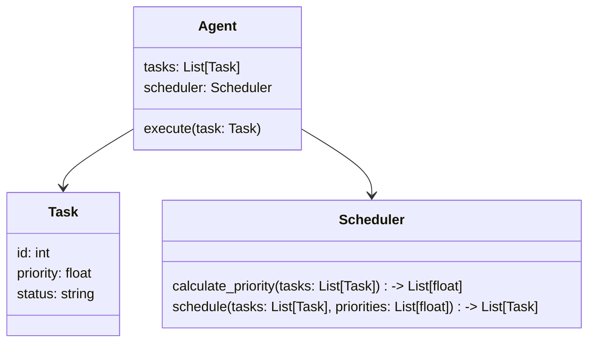
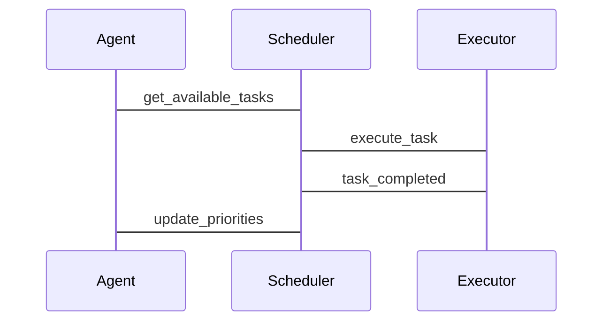

                 


# 实现AI Agent的动态任务优先级调度

## 关键词
AI Agent, 动态任务优先级, 调度算法, 系统设计, 项目实战

## 摘要
AI Agent在现代人工智能系统中扮演着重要角色，而动态任务优先级调度是其高效运作的关键。本文将详细探讨动态任务优先级调度的核心概念、算法原理、系统架构设计以及实际项目实现。通过理论与实践结合，帮助读者理解如何设计和实现高效的动态任务优先级调度系统。

## 第一部分：AI Agent与动态任务优先级调度基础

## 第1章：AI Agent的基本概念与动态任务调度的背景

### 1.1 AI Agent的定义与特点
#### 1.1.1 AI Agent的定义
AI Agent（人工智能代理）是能够感知环境并采取行动以实现目标的智能实体。它通常具备自主性、反应性、社会性和持续性等特点。

#### 1.1.2 AI Agent的核心特点
- **自主性**：能够在没有外部干预的情况下独立运作。
- **反应性**：能够实时感知环境并做出响应。
- **社会性**：能够与其他Agent或人类进行交互和协作。
- **持续性**：能够在长时间内持续执行任务。

#### 1.1.3 AI Agent的应用场景
AI Agent广泛应用于自动驾驶、智能助手、机器人控制、任务分配等领域。例如，智能音箱通过语音指令执行任务，就是一个典型的AI Agent应用。

### 1.2 动态任务优先级调度的背景与意义
#### 1.2.1 动态任务调度的背景
在多任务环境下，AI Agent需要同时处理多个任务，而任务的优先级可能因环境变化、资源限制或用户需求而动态调整。

#### 1.2.2 动态任务优先级调度的重要性
动态调度能够确保AI Agent在复杂环境中高效运作，优先处理关键任务，提高整体性能和用户体验。

#### 1.2.3 动态调度在AI Agent中的应用
例如，在自动驾驶中，AI Agent需要动态调整传感器数据处理的优先级，确保安全性和任务完成效率。

## 第2章：动态任务优先级调度的核心概念

### 2.1 调度问题的定义与分析
#### 2.1.1 任务调度的基本概念
任务调度是指在多任务环境下，合理分配资源和时间，以优化任务执行顺序的过程。

#### 2.1.2 动态调度的特性与挑战
动态调度需要实时调整优先级，以应对环境变化和任务需求的变化。其挑战包括快速响应、资源约束和不确定性。

### 2.2 影响任务优先级的因素
#### 2.2.1 任务的重要性和紧急性
- **重要性**：任务对最终目标的贡献程度。
- **紧急性**：任务的紧迫程度。

#### 2.2.2 资源约束与环境变化
资源的可用性和环境的变化会影响任务的执行条件和优先级。

#### 2.2.3 用户需求和反馈
用户的实时需求和反馈是调整任务优先级的重要依据。

### 2.3 调度策略的分类与对比
#### 2.3.1 基于静态优先级的调度
优先级固定，适用于任务需求稳定的场景。

#### 2.3.2 基于动态评估的调度
根据实时信息动态调整优先级，适用于环境变化快的场景。

#### 2.3.3 混合调度策略
结合静态和动态因素，综合评估任务优先级。

## 第二部分：动态任务优先级调度的核心算法

## 第3章：基于优先级的调度算法

### 3.1 基于静态优先级的调度
#### 3.1.1 静态优先级的定义
优先级在任务创建时确定，并在整个执行过程中保持不变。

#### 3.1.2 静态优先级的实现流程
1. 为每个任务分配静态优先级。
2. 按照优先级顺序执行任务。
3. 在任务执行过程中，优先级不变。

#### 3.1.3 优缺点分析
- **优点**：简单易实现，适合任务需求稳定的场景。
- **缺点**：无法应对环境变化和任务优先级的动态调整。

### 3.2 基于动态优先级的调度
#### 3.2.1 动态优先级的计算方法
根据实时信息（如任务重要性、资源可用性）动态计算优先级。

#### 3.2.2 动态优先级的更新机制
定期或实时更新优先级，确保任务执行顺序适应环境变化。

#### 3.2.3 实现步骤与代码示例
步骤：
1. 获取任务信息和环境数据。
2. 计算每个任务的动态优先级。
3. 根据优先级排序任务。
4. 执行任务。

代码示例：
```python
def calculate_dynamic_priority(tasks):
    priorities = []
    for task in tasks:
        importance = task['importance']
        urgency = task['urgency']
        priority = importance * urgency
        priorities.append(priority)
    return priorities

tasks = [{'id': 1, 'importance': 0.8, 'urgency': 0.6},
         {'id': 2, 'importance': 0.5, 'urgency': 0.9}]
priorities = calculate_dynamic_priority(tasks)
```

## 第4章：基于遗传算法的动态调度

### 4.1 遗传算法的基本原理
遗传算法是一种模拟生物进化过程的优化算法，适用于复杂问题的求解。

### 4.2 遗传算法在动态调度中的应用
将任务调度问题建模为一个优化问题，通过遗传算法寻找最优调度方案。

#### 4.2.1 遗传算法的实现步骤
1. 初始化种群。
2. 计算适应度。
3. 选择、交叉和变异。
4. 重复迭代，直到满足条件。

### 4.3 遗传算法的代码实现
```python
import random

def fitness(individual):
    # 计算适应度函数
    pass

def evolve_population(population):
    # 选择、交叉、变异
    pass

# 初始化种群
initial_population = [individual1, individual2, ...]
# 进化过程
evolve_population(initial_population)
```

## 第5章：基于强化学习的动态调度

### 5.1 强化学习的基本原理
强化学习通过智能体与环境的交互，学习最优策略以最大化累积奖励。

### 5.2 强化学习在动态调度中的应用
将任务调度问题建模为马尔可夫决策过程，通过强化学习寻找最优调度策略。

#### 5.2.1 强化学习的实现步骤
1. 状态表示。
2. 动作选择。
3. 奖励函数设计。
4. 策略更新。

### 5.3 强化学习的代码实现
```python
import numpy as np

class Agent:
    def __init__(self, state_space_size, action_space_size):
        self.state_space = state_space_size
        self.action_space = action_space_size
        # 初始化策略网络

    def act(self, state):
        # 根据状态选择动作
        pass

    def learn(self, state, action, reward, next_state):
        # 更新策略
        pass

# 初始化智能体
agent = Agent(state_space_size, action_space_size)
# 环境交互
state = env.reset()
while True:
    action = agent.act(state)
    next_state, reward, done = env.step(action)
    agent.learn(state, action, reward, next_state)
    if done:
        break
```

## 第三部分：系统分析与架构设计

## 第6章：系统分析与架构设计

### 6.1 问题场景介绍
在多任务环境中，AI Agent需要动态调整任务优先级，以高效完成目标。

### 6.2 系统功能设计
#### 6.2.1 功能模块划分
- 任务管理模块
- 调度算法模块
- 状态感知模块
- 执行控制模块

#### 6.2.2 领域模型类图


### 6.3 系统架构设计
#### 6.3.1 系统架构图


### 6.4 接口设计
- **任务管理接口**：用于任务的添加、删除和状态查询。
- **调度算法接口**：用于优先级计算和任务调度。
- **状态感知接口**：用于获取环境状态和资源信息。

### 6.5 交互设计
#### 6.5.1 交互流程图


## 第四部分：项目实战

## 第7章：项目实战

### 7.1 环境搭建
#### 7.1.1 开发环境
- Python 3.8+
- 基础库：numpy, matplotlib, scikit-learn
- 额外库：mermaid，用于流程图绘制

### 7.2 核心代码实现

#### 7.2.1 动态优先级调度器实现
```python
class DynamicScheduler:
    def __init__(self):
        self.tasks = []
    
    def add_task(self, task):
        self.tasks.append(task)
    
    def calculate_priority(self, task):
        # 假设任务有重要性和紧急性属性
        return task['importance'] * task['urgency']
    
    def schedule(self):
        # 根据优先级排序
        self.tasks.sort(key=lambda x: self.calculate_priority(x), reverse=True)
        return self.tasks
```

#### 7.2.2 调度器测试
```python
scheduler = DynamicScheduler()
scheduler.add_task({'id': 1, 'importance': 0.8, 'urgency': 0.6})
scheduler.add_task({'id': 2, 'importance': 0.5, 'urgency': 0.9})
scheduler.schedule()
# 输出优先级排序后的任务列表
```

### 7.3 代码解读与分析
动态优先级调度器通过实时计算任务的重要性与紧急性乘积作为优先级，按从高到低排序任务执行顺序。该方法简单有效，适用于大多数动态调度场景。

### 7.4 实际案例分析
以智能助手为例，当收到多个用户的请求时，系统根据请求的紧急程度和重要性动态调整优先级，优先处理高优先级的任务。

### 7.5 项目小结
通过实际项目的实现，验证了动态任务优先级调度算法的有效性。在实现过程中，需要注意任务状态的实时更新和优先级的动态调整。

## 第五部分：总结与展望

## 第8章：总结与展望

### 8.1 全文总结
动态任务优先级调度是AI Agent高效运作的关键技术。本文从理论到实践，详细讲解了多种调度算法及其在系统设计中的应用。

### 8.2 未来展望
随着AI技术的发展，动态调度算法将更加智能化和自适应。未来的研究方向包括结合边缘计算和雾计算，提升调度的实时性和准确性。

### 8.3 最佳实践 tips
- 定期评估和优化调度策略，确保系统的高效性。
- 在资源受限的环境中，优先采用轻量级的调度算法。
- 结合具体应用场景，定制化调度策略。

## 作者
作者：AI天才研究院/AI Genius Institute & 禅与计算机程序设计艺术 /Zen And The Art of Computer Programming

---

通过以上内容，您可以系统地了解实现AI Agent的动态任务优先级调度的相关知识，从基础概念到算法实现，再到系统设计和项目实战，逐步深入掌握这一技术的核心内容。希望这篇文章能为您提供有价值的见解和实践指导。

