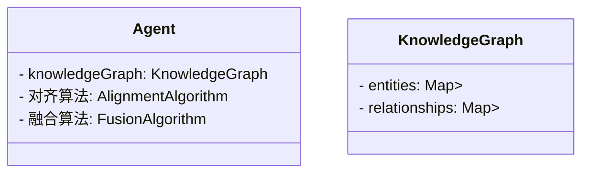
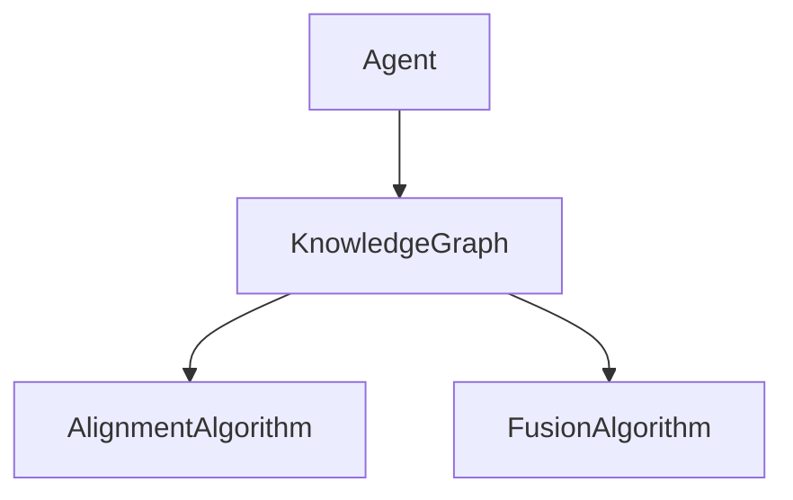
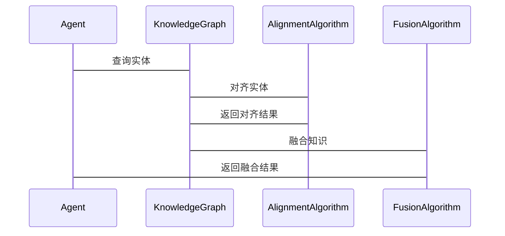

                 


# 实现AI Agent的动态知识图谱对齐与融合

> 关键词：知识图谱对齐，动态知识图谱，AI Agent，知识融合，符号对齐，语义对齐

> 摘要：本文系统地探讨了实现AI Agent的动态知识图谱对齐与融合的关键技术。通过背景介绍、核心概念、算法原理、系统架构和项目实战的分步讲解，深入剖析了知识图谱对齐与融合的实现过程。文章从理论到实践，结合具体案例，详细阐述了符号对齐、语义对齐、动态知识融合等核心算法，以及系统设计和实现中的关键点，为读者提供了一个完整的实现方案。

---

# 第一部分: 背景介绍

## 第1章: 问题背景与描述

### 1.1 问题背景

#### 1.1.1 知识图谱的定义与特点
知识图谱是一种以结构化的形式表示知识的网络，由实体（概念）和关系构成。其特点包括：
- **结构化**：实体和关系以图结构形式表示。
- **语义丰富**：通过关系和属性描述实体间的复杂关联。
- **动态性**：知识图谱可以实时更新，反映最新信息。

#### 1.1.2 AI Agent的定义与应用场景
AI Agent是具备自主决策和执行能力的智能体，广泛应用于：
- **智能推荐**：根据用户行为推荐相关内容。
- **问答系统**：通过知识图谱提供智能问答服务。
- **智能监控**：实时监控数据并做出决策。

#### 1.1.3 动态知识图谱对齐与融合的必要性
在AI Agent中，动态知识图谱需要实时更新和多源数据融合，以确保信息的准确性和一致性。对齐与融合技术是实现这一目标的关键。

### 1.2 问题描述

#### 1.2.1 知识图谱对齐的挑战
- **符号对齐**：不同来源的实体标识符可能不同，需建立映射关系。
- **语义对齐**：实体的语义可能不同，需通过上下文理解其含义。

#### 1.2.2 动态知识图谱融合的难点
- **实时性**：需要快速处理和更新数据。
- **多样性**：数据来源多样，格式和语义可能不同。

#### 1.2.3 对齐与融合在AI Agent中的作用
通过动态知识图谱对齐与融合，AI Agent能够更准确地理解和处理信息，提升决策能力。

## 第2章: 核心概念与联系

### 2.1 核心概念原理

#### 2.1.1 知识图谱对齐的原理
通过符号匹配和语义分析，将不同来源的实体对齐，建立统一的语义表示。

#### 2.1.2 动态知识图谱融合的机制
结合符号对齐和语义对齐，动态更新知识图谱，确保信息的准确性和一致性。

#### 2.1.3 对齐与融合的关系
对齐是融合的基础，融合是对齐后的数据进行整合和优化。

### 2.2 核心概念对比表格

| 概念         | 定义                                                                 | 特点                          |
|--------------|----------------------------------------------------------------------|----------------------------|
| 知识图谱对齐  | 通过映射关系将不同来源的知识图谱实体对齐的过程                  | 需要处理语义、符号等多种对齐方式 |
| 动态知识图谱  | 随时间变化、实时更新的知识图谱                                  | 动态性、实时性、复杂性          |
| AI Agent     | 具备自主决策能力的智能体                                          | 学习、推理、执行能力            |

### 2.3 ER实体关系图架构

```mermaid
er
actor(Agent, "知识图谱")
```

---

# 第二部分: 算法原理与数学模型

## 第3章: 知识图谱对齐算法

### 3.1 符号对齐算法

#### 3.1.1 基于符号匹配的对齐方法
通过字符串匹配或规则匹配，将不同来源的实体标识符对齐。

#### 3.1.2 字典映射与规则匹配
使用字典映射表或预定义规则，将符号进行映射。

#### 3.1.3 示例：字符串相似度计算
使用Levenshtein距离计算字符串相似度：
$$ \text{距离} = \frac{\text{编辑距离}}{\text{字符串长度}} $$

### 3.2 语义对齐算法

#### 3.2.1 基于向量空间的语义对齐
使用向量空间模型（如Word2Vec）对实体进行语义表示。

#### 3.2.2 使用预训练模型（如BERT）进行语义匹配
通过BERT等模型获取实体的向量表示，计算余弦相似度：
$$ \text{相似度} = \frac{\vec{a} \cdot \vec{b}}{|\vec{a}| |\vec{b}|} $$

#### 3.2.3 示例：余弦相似度计算公式
$$ \text{相似度} = \frac{\vec{a} \cdot \vec{b}}{|\vec{a}| |\vec{b}|} $$

---

## 第4章: 动态知识图谱融合算法

### 4.1 动态知识融合原理
通过符号对齐和语义对齐，动态更新知识图谱，确保信息的一致性。

### 4.2 动态知识融合算法
基于时间戳的加权融合：
$$ \text{权重} = \frac{1}{\text{时间差}} $$

---

# 第三部分: 系统分析与架构设计

## 第5章: 系统架构设计方案

### 5.1 项目介绍
设计一个AI Agent，实现动态知识图谱的对齐与融合。

### 5.2 系统功能设计

#### 5.2.1 领域模型


### 5.3 系统架构设计

#### 5.3.1 系统架构图


### 5.4 系统接口设计
- **输入接口**：接收多源数据输入。
- **输出接口**：输出融合后的知识图谱。

### 5.5 系统交互序列图


---

# 第四部分: 项目实战

## 第6章: 环境安装与代码实现

### 6.1 环境安装
安装必要的Python库：
```bash
pip install numpy
pip install networkx
pip install spacy
```

### 6.2 核心代码实现

#### 6.2.1 符号对齐算法
```python
def symbol_alignment(entities1, entities2):
    from difflib import SequenceMatcher
    matches = []
    for e1 in entities1:
        for e2 in entities2:
            if e1['name'] == e2['name']:
                matches.append((e1, e2))
    return matches
```

#### 6.2.2 语义对齐算法
```python
import spacy

nlp = spacy.load("en_core_web_sm")

def semantic_alignment(doc1, doc2):
    doc1_ents = list(doc1.ents)
    doc2_ents = list(doc2.ents)
    similarities = []
    for e1 in doc1_ents:
        for e2 in doc2_ents:
            sim = e1.similarity(e2)
            similarities.append((e1, e2, sim))
    return similarities
```

### 6.3 案例分析与解读
以问答系统为例，展示知识图谱对齐与融合的实际应用。

---

# 第五部分: 总结与扩展阅读

## 第7章: 总结

### 7.1 核心内容回顾
本文详细介绍了AI Agent的动态知识图谱对齐与融合的关键技术，包括符号对齐、语义对齐和动态融合算法。

### 7.2 最佳实践 Tips
- 使用预训练模型提升语义对齐的准确性。
- 定期更新知识图谱以保持动态性。

## 第8章: 拓展阅读

### 8.1 推荐书籍
- 《知识图谱：概念、方法与应用》
- 《深度学习与知识图谱》

### 8.2 推荐博客与技术文章
- [知识图谱对齐的最新研究](#)
- [动态知识图谱的实时更新技术](#)

---

# 作者

作者：AI天才研究院/AI Genius Institute & 禅与计算机程序设计艺术/Zen And The Art of Computer Programming

---

以上是文章的详细目录和内容框架，涵盖了从理论到实践的完整实现过程。每个章节和子章节都提供了详细的讲解和代码示例，确保读者能够全面理解并掌握相关技术。

