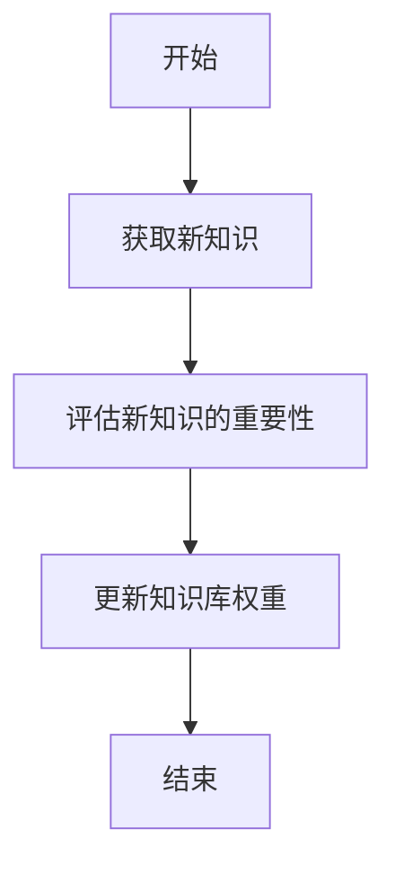
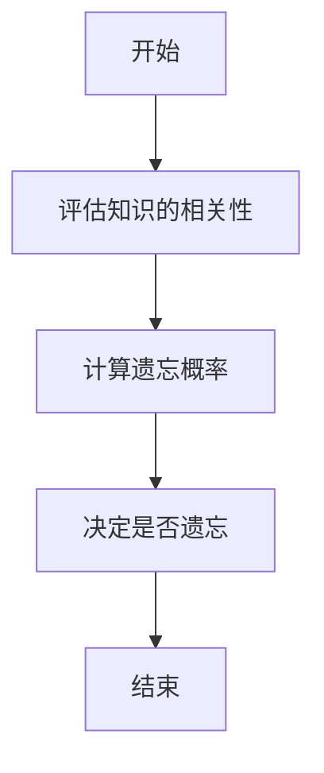
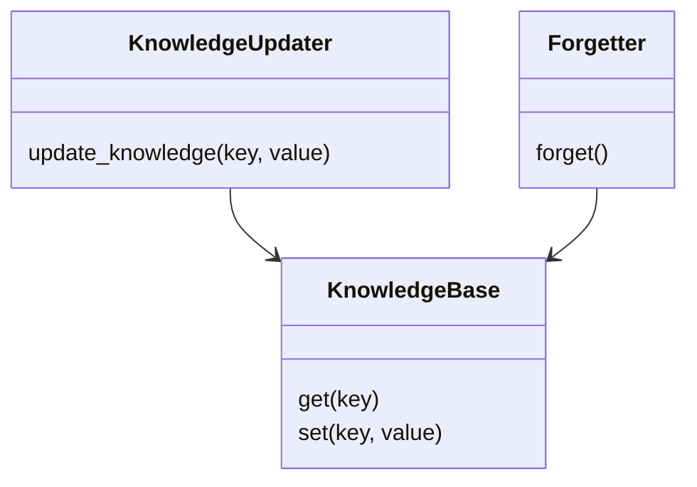

                 


# 实现AI Agent的动态知识更新与遗忘机制

**关键词**: AI Agent, 动态知识更新, 遗忘机制, 知识管理, 人工智能

**摘要**: 本文深入探讨了AI Agent的动态知识更新与遗忘机制，分析了其核心概念、算法原理、系统架构设计及项目实战。通过详细的技术分析，本文旨在帮助读者理解如何有效管理AI Agent的知识库，以提升其性能和用户体验。

---

# 第1章: AI Agent的基本概念与背景

## 1.1 AI Agent的定义与特点

### 1.1.1 AI Agent的定义
AI Agent（人工智能代理）是指能够感知环境、自主决策并执行任务的智能实体。它通过传感器接收信息，利用推理机制做出决策，并通过执行器与环境交互。

### 1.1.2 AI Agent的核心特点
1. **智能性**: 能够理解和处理复杂信息。
2. **自主性**: 在没有外部干预的情况下自主运作。
3. **反应性**: 能够实时感知环境变化并做出反应。
4. **社会性**: 能够与其他Agent或人类进行交互协作。
5. **持续学习能力**: 能够不断更新知识和技能。

### 1.1.3 AI Agent与传统AI的区别
AI Agent与传统AI的区别在于其自主性和主动性。传统AI更多是处理输入数据，而AI Agent能够主动与环境交互，执行任务并适应变化。

## 1.2 动态知识更新与遗忘机制的背景

### 1.2.1 知识更新的必要性
随着环境的变化，知识库需要不断更新以保持AI Agent的有效性。例如，在推荐系统中，用户偏好可能会随时间变化，知识库需要及时更新以提供准确的推荐。

### 1.2.2 遗忘机制的引入动机
遗忘机制用于管理知识库的大小，避免信息过载。通过遗忘不相关或过时的知识，AI Agent可以更高效地运行，并减少存储和处理的负担。

### 1.2.3 动态知识更新与遗忘机制的边界与外延
动态知识更新和遗忘机制不仅适用于AI Agent，还可应用于其他领域，如数据库管理和缓存优化。本文主要关注AI Agent的知识管理。

## 1.3 问题背景与目标

### 1.3.1 动态知识更新的核心问题
如何高效地更新知识库，同时保持知识的准确性和相关性。

### 1.3.2 遗忘机制的关键挑战
如何选择性地遗忘过时或不相关的知识，同时不影响当前任务的性能。

### 1.3.3 本章小结
本章介绍了AI Agent的基本概念和动态知识更新与遗忘机制的背景，明确了本文的研究目标和意义。

---

# 第2章: 动态知识更新与遗忘机制的核心概念

## 2.1 动态知识更新机制的原理

### 2.1.1 知识表示与更新策略
知识可以表示为图结构、向量或符号。更新策略包括基于时间、基于频率和基于重要性的策略。

### 2.1.2 知识更新的数学模型
更新公式示例：
$$ w_{new} = \alpha w_{old} + (1-\alpha) w_{new} $$
其中，$\alpha$ 是更新率，取值范围为 $0 \leq \alpha \leq 1$。

## 2.2 遗忘机制的原理与实现

### 2.2.1 遗忘机制的核心概念
遗忘机制是有选择地删除不再需要的知识。遗忘概率计算示例：
$$ P_{forget} = 1 - \frac{count}{total} $$
其中，$count$ 是知识项的访问次数，$total$ 是总访问次数。

### 2.2.2 遗忘机制的特征对比
| 特征 | 更新机制 | 遗忘机制 |
|------|----------|----------|
| 基础 | 新知识引入 | 删除旧知识 |
| 方法 | 增量式 | 基于规则或概率 |
| 目标 | 维护最新知识 | 减少知识库大小 |

## 2.3 动态知识更新与遗忘机制的结合

### 2.3.1 协同作用的原理
更新和遗忘机制相互配合，确保知识库的优化。例如，定期更新知识并遗忘不再相关的部分。

### 2.3.2 对比分析
通过对比分析，更新机制注重知识的准确性和相关性，而遗忘机制注重知识的效率和存储管理。

---

# 第3章: 动态知识更新与遗忘机制的算法实现

## 3.1 知识表示与更新算法

### 3.1.1 算法流程图


### 3.1.2 Python代码示例
```python
class KnowledgeUpdater:
    def __init__(self, alpha=0.5):
        self.alpha = alpha
        self.knowledge_base = {}

    def update_knowledge(self, key, value):
        current = self.knowledge_base.get(key, 0)
        new_value = self.alpha * current + (1 - self.alpha) * value
        self.knowledge_base[key] = new_value
```

## 3.2 遗忘机制的算法实现

### 3.2.1 算法流程图


### 3.2.2 Python代码示例
```python
class Forgetter:
    def __init__(self, threshold=0.1):
        self.threshold = threshold

    def forget(self, knowledge_base):
        for key in list(knowledge_base.keys()):
            if knowledge_base[key] < self.threshold:
                del knowledge_base[key]
        return knowledge_base
```

---

# 第4章: 系统架构设计

## 4.1 系统功能设计

### 4.1.1 系统模块划分
| 模块 | 功能 |
|------|------|
| 知识获取 | 从外部数据源获取新知识 |
| 更新策略 | 确定知识更新的规则和频率 |
| 遗忘策略 | 确定知识遗忘的规则和频率 |
| 知识库管理 | 管理知识库的存储和访问 |

### 4.1.2 系统架构图


---

# 第5章: 项目实战

## 5.1 环境配置与核心代码实现

### 5.1.1 环境安装
安装必要的Python库：
```bash
pip install numpy pandas scikit-learn
```

### 5.1.2 核心代码实现
```python
from collections import deque

class DynamicKnowledgeManager:
    def __init__(self, max_size=100, alpha=0.7, threshold=0.2):
        self.max_size = max_size
        self.alpha = alpha
        self.threshold = threshold
        self.knowledge_base = deque()

    def update_knowledge(self, new_info):
        # 更新知识
        for i in range(len(self.knowledge_base)):
            current = self.knowledge_base[i]
            new_value = self.alpha * current + (1 - self.alpha) * new_info
            self.knowledge_base[i] = new_value
        # 遗忘机制
        while len(self.knowledge_base) > self.max_size:
            if self.knowledge_base[0] < self.threshold:
                self.knowledge_base.popleft()
            else:
                break
```

## 5.2 测试与优化

### 5.2.1 测试用例设计
编写测试用例，验证知识更新和遗忘机制的正确性。

### 5.2.2 性能优化
优化算法，提高处理速度和效率，例如使用更高效的数据结构。

---

# 第6章: 总结与展望

## 6.1 总结
本文详细探讨了AI Agent的动态知识更新与遗忘机制，分析了其核心概念、算法原理、系统架构设计及项目实战。通过理论分析和实际案例，展示了如何有效管理知识库，提升AI Agent的性能。

## 6.2 展望
未来的研究方向可以包括结合强化学习优化遗忘策略，以及探索动态知识更新与遗忘机制在更多领域的应用。

---

**作者**: AI天才研究院 & 禅与计算机程序设计艺术

