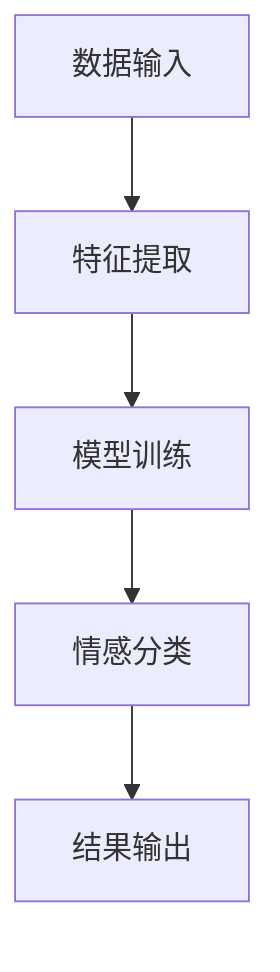
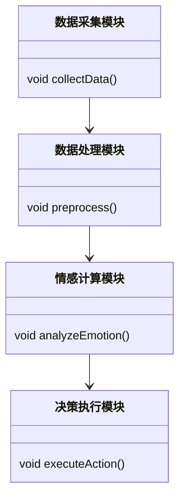
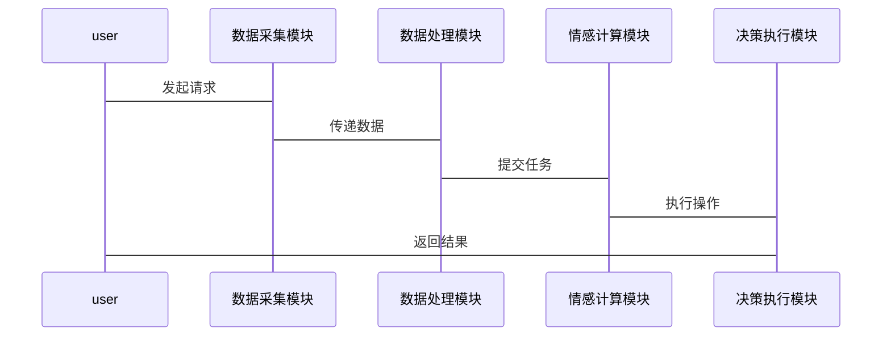

                 


```markdown
# 实现AI Agent的多模态情感识别

> 关键词：AI Agent, 多模态情感识别, 人机交互, 情感计算, 模型融合

> 摘要：本文详细探讨了实现AI Agent的多模态情感识别技术，从背景与概述、核心概念、算法原理、系统架构到项目实战和最佳实践，系统性地分析了多模态情感识别的实现过程。文章通过具体的算法流程、系统设计和实际案例，深入剖析了多模态情感识别的技术细节和应用价值。

---

# 第1章: 多模态情感识别的背景与概述

## 1.1 多模态情感识别的基本概念
### 1.1.1 情感识别的定义与核心概念
- 情感识别是通过分析多模态数据（如文本、语音、图像）来推断人类情感状态的过程。
- 核心概念包括：情感分类、情感强度、情感关联。

### 1.1.2 多模态数据的定义与特点
- 多模态数据是指结合多种数据形式（文本、语音、图像、视频等）来描述同一事件或情境的数据集。
- 多模态数据的特点：互补性、多样性、复杂性。

### 1.1.3 AI Agent在情感识别中的作用
- AI Agent通过多模态情感识别技术，能够实时感知用户情感，从而提供更智能、更个性化的服务。

## 1.2 多模态情感识别的应用场景
### 1.2.1 人机交互中的情感识别
- 在智能助手、虚拟助手等场景中，情感识别能够提升用户体验，使交互更加自然。

### 1.2.2 智能客服中的应用
- 通过分析用户的情感状态，智能客服可以更好地理解用户需求，提供更有效的解决方案。

### 1.2.3 教育与心理健康领域的应用
- 在教育领域，情感识别可以帮助教师更好地理解学生的学习状态；在心理健康领域，它可以辅助诊断和治疗。

## 1.3 问题背景与挑战
### 1.3.1 多模态数据融合的难点
- 数据异构性：不同数据类型之间的差异使得融合具有挑战性。
- 数据冗余：如何有效去除冗余信息是一个重要问题。

### 1.3.2 情感识别中的噪声处理
- 如何处理数据中的噪声（如背景噪音、表情干扰）是情感识别中的关键问题。

### 1.3.3 AI Agent的实时性与响应速度
- 在实时交互场景中，AI Agent需要快速响应，这对计算效率提出了更高的要求。

## 1.4 本章小结
- 本章介绍了多模态情感识别的基本概念、应用场景以及面临的主要挑战。

---

# 第2章: 多模态情感识别的核心概念与联系

## 2.1 多模态数据与情感计算的核心概念
### 2.1.1 多模态数据融合的原理
- 数据融合：将多种数据源的信息进行整合，以提高识别的准确性和鲁棒性。
- 数据融合方法：基于特征的融合、基于决策的融合、基于模型的融合。

### 2.1.2 情感计算模型的构建
- 情感计算模型：基于多模态数据，构建能够准确识别情感状态的计算模型。

### 2.1.3 多模态数据与情感计算的关系
- 多模态数据为情感计算提供了丰富的信息来源，情感计算则通过分析这些数据来实现情感识别。

## 2.2 情感计算模型的构建
### 2.2.1 情感计算的基本原理
- 通过分析文本、语音、图像等数据，提取情感特征，进而进行情感分类。

### 2.2.2 情感计算的特征提取
- 文本特征：关键词提取、情感词汇分析。
- 语音特征：语调、语速、音调等。
- 图像特征：面部表情、肢体语言。

### 2.2.3 情感计算的分类算法
- 常用算法：支持向量机（SVM）、随机森林（RF）、深度学习模型（如CNN、RNN）。

## 2.3 AI Agent的结构与功能
### 2.3.1 AI Agent的基本结构
- 感知层：负责数据的采集与初步处理。
- 计算层：负责情感计算与模型推理。
- 行为层：负责根据计算结果执行相应的动作。

### 2.3.2 AI Agent的功能模块
- 数据采集模块：负责采集多模态数据。
- 情感计算模块：负责对数据进行情感分析。
- 决策执行模块：根据情感分析结果，执行相应的操作。

### 2.3.3 AI Agent与情感识别的结合
- 通过情感识别，AI Agent能够更好地理解用户需求，提供更智能的服务。

## 2.4 核心概念的ER实体关系图
```mermaid
erDiagram
    user {
        id
        name
        emotion
    }
    data_source {
        id
        type
        content
    }
    emotion_model {
        id
        name
        accuracy
    }
    agent {
        id
        name
        status
    }
    user --|{many} data_source
    data_source --|{one} emotion_model
    emotion_model --|{one} agent
```

---

# 第3章: 多模态情感识别的算法原理

## 3.1 模型融合方法
### 3.1.1 基于特征的融合
- 将不同数据源的特征进行融合，构建联合特征向量。

### 3.1.2 基于决策的融合
- 将不同模型的决策结果进行融合，如投票法、加权融合。

### 3.1.3 基于模型的融合
- 使用深度学习模型（如多任务学习）对多模态数据进行联合建模。

## 3.2 情感计算算法
### 3.2.1 基于文本的情感计算
- 使用词袋模型、TF-IDF等方法提取文本特征，再通过分类器进行情感分类。

### 3.2.2 基于语音的情感计算
- 通过分析语音特征（如音调、语速、停顿等）来判断情感状态。

### 3.2.3 基于图像的情感计算
- 使用计算机视觉技术（如面部表情识别）来分析情感状态。

## 3.3 多模态特征提取方法
### 3.3.1 文本特征提取
- 使用BERT等预训练模型提取文本特征。

### 3.3.2 语音特征提取
- 提取梅尔频率倒谱系数（MFCC）作为语音特征。

### 3.3.3 图像特征提取
- 使用卷积神经网络（CNN）提取图像特征。

## 3.4 算法流程图


## 3.5 情感分类算法的数学模型
### 3.5.1 支持向量机（SVM）
- 模型公式：最大化间隔分类。

### 3.5.2 随机森林（RF）
- 基于决策树的集成学习方法。

### 3.5.3 深度学习模型
- 使用LSTM进行序列建模。

---

# 第4章: 多模态情感识别的系统架构

## 4.1 系统功能设计
### 4.1.1 功能模块划分
- 数据采集模块：负责采集多模态数据。
- 数据处理模块：对数据进行预处理和特征提取。
- 情感计算模块：进行情感分析和分类。
- 决策执行模块：根据分析结果执行相应操作。

### 4.1.2 功能模块之间的关系


## 4.2 系统架构设计
### 4.2.1 分层架构
- 表现层：用户界面。
- 业务逻辑层：处理业务逻辑。
- 数据访问层：访问数据源。

### 4.2.2 微服务架构
- 每个功能模块独立部署，通过API进行交互。

### 4.2.3 分布式架构
- 数据采集、处理、分析部分分布部署，提高系统的扩展性和性能。

## 4.3 系统接口设计
### 4.3.1 数据采集接口
- 提供API接口，用于采集多模态数据。

### 4.3.2 情感计算接口
- 提供API接口，用于进行情感分析和分类。

### 4.3.3 决策执行接口
- 提供API接口，用于根据情感分析结果执行相应操作。

## 4.4 系统交互流程图


---

# 第5章: 多模态情感识别的项目实战

## 5.1 环境配置
### 5.1.1 安装Python
- 安装Python 3.x及以上版本。

### 5.1.2 安装依赖库
- 使用pip安装numpy、pandas、scikit-learn、tensorflow等库。

## 5.2 核心代码实现
### 5.2.1 数据预处理
```python
import numpy as np
import pandas as pd

# 加载数据
data = pd.read_csv('emotion_data.csv')

# 数据清洗
data = data.dropna()
```

### 5.2.2 模型训练
```python
from sklearn.model

