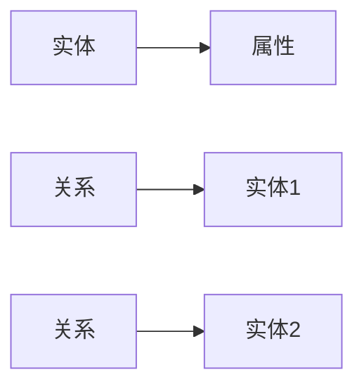
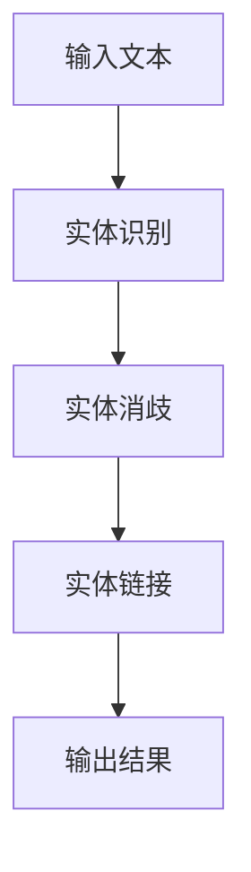
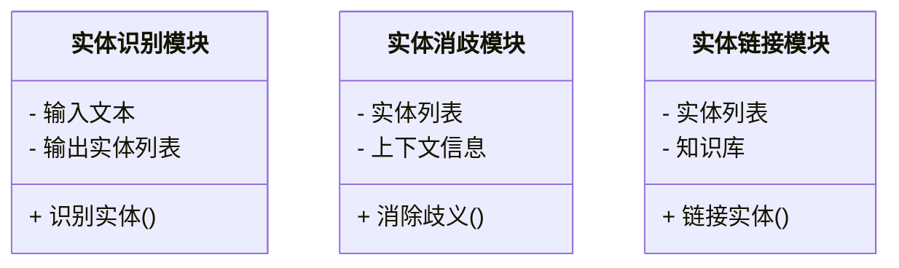
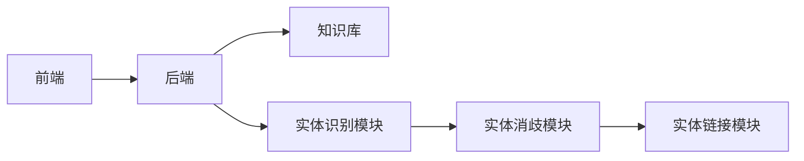
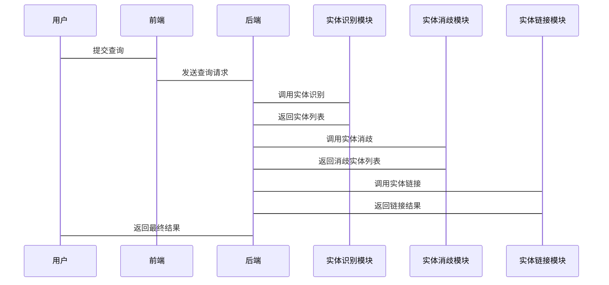

                 


# 实现AI Agent的多语言实体链接

> 关键词：AI Agent, 多语言实体链接, 实体识别, 消歧, 实体链接, 跨语言数据整合

> 摘要：本文详细探讨了AI Agent在多语言实体链接中的实现方法，从背景介绍、核心概念、算法原理到系统设计和项目实战，全面解析了多语言实体链接的关键技术。文章通过具体案例分析，展示了如何利用AI Agent实现跨语言信息的有效整合，为相关领域的研究和实践提供了参考。

---

## 第一部分: 多语言实体链接的背景与挑战

### 第1章: 多语言实体链接的背景与挑战

#### 1.1 多语言实体链接的基本概念
多语言实体链接是指在多种语言环境下，将文本中的实体与知识库中的实体进行准确匹配的过程。这种技术在跨语言信息检索、机器翻译、问答系统等领域具有重要应用。

**实体链接的定义**：实体链接（Entity Linking）是自然语言处理中的一个关键任务，旨在将文本中的实体（如人名、地名、组织名等）映射到知识库中的唯一标识实体。

**多语言实体链接的必要性**：在多语言环境下，同一个实体在不同语言中可能有不同的表示形式，例如“Paris”在中文中是“巴黎”。因此，如何准确地将这些不同的表示形式映射到同一个实体是多语言实体链接的核心挑战。

**AI Agent与实体链接的关系**：AI Agent是一种智能代理，能够理解用户的需求并执行相应的任务。在多语言实体链接中，AI Agent需要能够处理多种语言的输入，并将实体准确地链接到知识库中的实体。

#### 1.2 AI Agent的核心概念
**AI Agent的定义**：AI Agent是一种智能代理，能够感知环境、理解用户需求并执行任务。它可以是一个软件系统，能够与用户进行交互，并根据用户的需求执行相应的操作。

**AI Agent的主要功能**：
1. 实体识别：从输入文本中识别出实体。
2. 实体消歧：消除实体的歧义性，例如“Apple”可以指苹果公司或苹果这个水果。
3. 实体链接：将识别出的实体映射到知识库中的唯一实体。

**AI Agent与多语言实体链接的结合**：AI Agent需要处理多种语言的输入，并将实体准确地链接到知识库中的实体，从而实现跨语言的信息检索和处理。

#### 1.3 多语言实体链接的挑战
**多语言环境下的语义差异**：不同语言中的实体表示可能存在语义差异，例如“Professor”在中文中是“教授”，但在某些情况下可能指“老师”或“导师”。

**实体识别的准确性问题**：在多语言环境下，实体识别的准确性可能受到语言差异的影响，例如中文中的“苹果”可能指“苹果公司”或“苹果（水果）”。

**跨语言数据整合的复杂性**：不同语言的知识库可能存在结构和表示上的差异，如何有效地整合这些数据是一个复杂的问题。

---

## 第二部分: 多语言实体链接的核心概念与联系

### 第2章: 多语言实体链接的核心概念与联系

#### 2.1 实体链接的原理
**实体识别与消歧**：实体识别是通过NLP技术从文本中提取出实体，而实体消歧则是消除实体的歧义性，例如“Apple”可以指苹果公司或苹果这个水果。

**实体关系的构建**：实体关系是指实体之间的关联，例如“苹果公司”和“库克”之间的关系是“创始人”。

**实体链接的算法选择**：常用的实体链接算法包括基于向量的相似度计算、基于图结构的实体链接等。

#### 2.2 多语言实体链接的属性特征对比
**不同语言的实体特征对比**：
- 中文：实体可能具有多种含义，例如“苹果”可以指苹果公司或苹果（水果）。
- 英文：实体通常具有明确的指代，例如“Apple”通常指苹果公司。

**实体链接的跨语言一致性**：不同语言中的实体表示需要保持一致，以便在知识库中进行准确的映射。

**实体链接的可扩展性**：实体链接系统需要能够处理多种语言和大量的实体，具有良好的可扩展性。

#### 2.3 ER实体关系图架构


---

## 第三部分: 多语言实体链接的算法原理

### 第3章: 多语言实体链接的算法原理

#### 3.1 基于向量的实体链接算法
**向量空间模型**：将实体表示为向量，通过计算向量的相似度来判断实体的相似性。

**余弦相似度计算**：余弦相似度是一种常用的相似度计算方法，公式如下：
$$ \text{similar} = \frac{\vec{A} \cdot \vec{B}}{|\vec{A}| |\vec{B}|} $$

**基于Word2Vec的实体表示**：通过Word2Vec模型将实体表示为向量，利用向量的相似度进行实体链接。

#### 3.2 基于图结构的实体链接
**图嵌入表示**：通过图嵌入技术将实体及其关系表示为向量。

**图遍历算法**：使用图遍历算法（如BFS、DFS）在图结构中进行实体链接。

**实体关系推理**：通过图结构中的关系推理来确定实体之间的关联。

#### 3.3 算法流程图


---

## 第四部分: 多语言实体链接的系统设计与实现

### 第4章: 多语言实体链接的系统设计与实现

#### 4.1 问题场景介绍
**跨语言信息检索**：用户在中文环境下查询英文实体，例如查询“Paris”在中文中的对应实体。

**多语言问答系统**：用户在中文环境下提出问题，系统需要能够理解并回答涉及多种语言实体的问题。

#### 4.2 系统功能设计
**领域模型设计**：通过类图描述系统的功能模块，例如实体识别模块、实体消歧模块、实体链接模块等。



**系统架构设计**：通过架构图描述系统的整体架构，包括前端、后端、知识库等模块。



**系统交互设计**：通过序列图描述系统的交互流程。



---

## 第五部分: 多语言实体链接的项目实战

### 第5章: 项目实战

#### 5.1 环境安装
**安装依赖**：
- Python 3.8+
- NLTK库
- WordNet
- Gensim库

#### 5.2 系统核心实现源代码
**实体识别模块**：
```python
import nltk

def identify_entities(text):
    tokens = nltk.word_tokenize(text)
    tagged = nltk.pos_tag(tokens)
    entities = []
    for word, pos in tagged:
        if pos in ['NNP', 'NN']:
            entities.append(word)
    return entities
```

**实体消歧模块**：
```python
from gensim.models import KeyedVectors

model = KeyedVectors.load_word2vec_format('word2vec.txt', binary=True)

def disambiguate_entities(entities, context):
    scores = {}
    for entity in entities:
        scores[entity] = calculate_similarity(entity, context, model)
    return max(scores, key=lambda k: scores[k])

def calculate_similarity(entity, context, model):
    context_vector = model[context]
    entity_vector = model[entity]
    similarity = entity_vector.dot(context_vector) / (np.linalg.norm(entity_vector) * np.linalg.norm(context_vector))
    return similarity
```

**实体链接模块**：
```python
import requests

def link_entity(entity, knowledge_base_url):
    params = {'entity': entity}
    response = requests.get(knowledge_base_url, params=params)
    return response.json()['linked_entity']
```

#### 5.3 代码应用解读与分析
通过上述代码，我们可以实现一个基本的多语言实体链接系统。实体识别模块从输入文本中提取实体，实体消歧模块通过向量相似度计算消除实体的歧义性，实体链接模块将实体链接到知识库中的唯一实体。

#### 5.4 实际案例分析
**案例1**：输入文本“Paris”，系统识别出“Paris”是一个实体，并将其链接到知识库中的“Paris”（城市）。

**案例2**：输入文本“Apple”，系统识别出“Apple”是一个实体，并将其链接到知识库中的“苹果公司”。

#### 5.5 项目小结
通过上述项目的实现，我们可以看到多语言实体链接的核心技术包括实体识别、实体消歧和实体链接。在实际应用中，需要考虑不同语言的语义差异和知识库的结构差异，以实现准确的实体链接。

---

## 第六部分: 多语言实体链接的最佳实践

### 第6章: 最佳实践

#### 6.1 数据预处理与清洗
**数据清洗**：确保输入文本的质量，去除噪音数据。

**数据增强**：通过数据增强技术（如同义词替换）提高系统的鲁棒性。

#### 6.2 模型调优与优化
**超参数调优**：通过网格搜索等方法优化模型的参数。

**模型融合**：结合多种模型（如基于向量的模型和基于图结构的模型）提高系统的准确性。

#### 6.3 系统优化与扩展
**分布式计算**：通过分布式计算技术提高系统的处理能力。

**增量学习**：通过增量学习技术不断更新模型，适应新的实体和语言。

#### 6.4 注意事项
- 数据隐私问题：在处理用户数据时，需要注意数据隐私和安全。
- 系统性能问题：在实现多语言实体链接系统时，需要注意系统的性能和扩展性。

#### 6.5 小结
多语言实体链接是一个复杂的任务，需要综合考虑多种因素。通过合理的数据处理、模型优化和系统设计，可以实现高效的多语言实体链接。

---

## 作者信息

作者：AI天才研究院/AI Genius Institute & 禅与计算机程序设计艺术 /Zen And The Art of Computer Programming

---

**总结**：本文详细探讨了AI Agent在多语言实体链接中的实现方法，从背景介绍、核心概念、算法原理到系统设计和项目实战，全面解析了多语言实体链接的关键技术。通过具体案例分析，展示了如何利用AI Agent实现跨语言信息的有效整合，为相关领域的研究和实践提供了参考。

