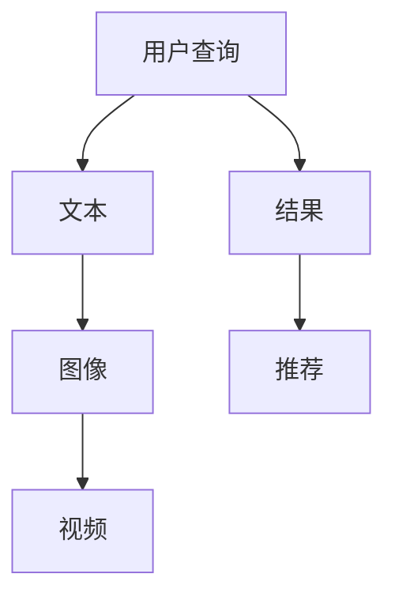
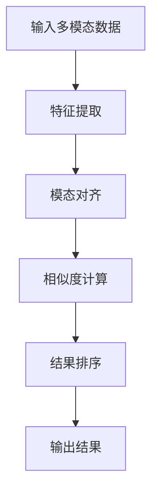
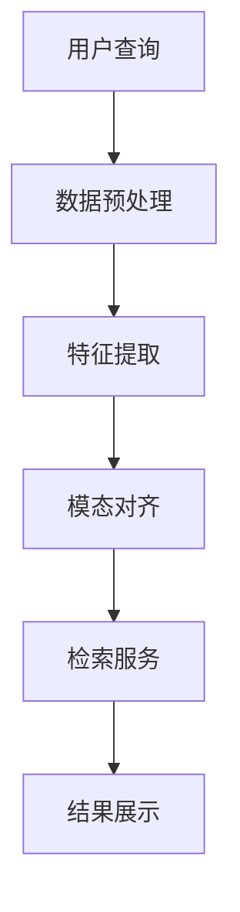
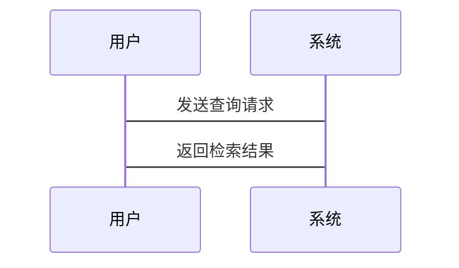

                 


# 实现AI Agent的跨模态检索能力

> 关键词：AI Agent，跨模态检索，多模态数据，模态对齐，深度学习，检索算法

> 摘要：本文详细探讨了实现AI Agent跨模态检索能力的核心概念、算法原理、系统架构以及项目实战。从背景介绍到数学模型，从系统设计到实际案例，全面解析跨模态检索的关键技术，帮助读者掌握如何构建高效的AI Agent检索系统。

---

## 第一部分: AI Agent与跨模态检索的背景介绍

### 第1章: 跨模态检索的背景与问题背景

#### 1.1 跨模态检索的背景
##### 1.1.1 跨模态检索的定义与核心概念
跨模态检索是一种通过多模态数据（如文本、图像、音频、视频等）进行信息检索的技术。其核心在于理解不同模态之间的语义关联，实现跨模态的高效检索。

##### 1.1.2 跨模态检索的应用场景与重要性
跨模态检索广泛应用于智能客服、图像搜索、推荐系统等领域。其重要性体现在提升用户体验、增强系统智能性和提高检索效率。

##### 1.1.3 跨模态检索与传统检索的区别
传统检索主要基于单一模态数据，而跨模态检索通过结合多模态数据，提升检索的准确性和多样性。

#### 1.2 跨模态检索的问题背景
##### 1.2.1 当前检索技术的局限性
传统检索技术在处理多模态数据时存在局限性，如无法有效处理模态间的语义关联。

##### 1.2.2 跨模态检索面临的挑战
- 模态对齐困难
- 跨模态相似度计算复杂
- 数据异构性问题

##### 1.2.3 跨模态检索的潜在解决方案
- 统一特征表示
- 深度学习模型
- 跨模态对齐技术

### 第2章: 跨模态检索的核心概念与联系

#### 2.1 跨模态检索的核心概念
##### 2.1.1 多模态数据的定义与特征
多模态数据指多种数据类型，如文本、图像、音频等。其特征包括异构性、多样性、关联性。

##### 2.1.2 跨模态检索的基本原理
跨模态检索通过构建模态间语义关联，实现多模态数据的高效检索。

##### 2.1.3 跨模态检索的关键技术
- 特征提取
- 模态对齐
- 跨模态相似度计算

#### 2.2 跨模态检索的核心要素
##### 2.2.1 数据模态的多样性
数据模态多样性的优势在于能够提供丰富的信息，提升检索的准确性。

##### 2.2.2 模态间的关联性
模态间的关联性是跨模态检索的核心，通过关联性分析，可以实现模态间的信息互补。

##### 2.2.3 跨模态检索的目标函数
$$L = \sum_{i=1}^{n} (1 - s_i)$$
其中，$s_i$是第i对模态的相似度得分。

#### 2.3 跨模态检索的ER实体关系图


---

## 第二部分: 跨模态检索的算法原理

### 第3章: 跨模态检索的算法原理

#### 3.1 跨模态检索的基本算法
##### 3.1.1 基于相似度的检索算法
- 使用余弦相似度或欧氏距离计算文本与图像的相似度。

##### 3.1.2 基于深度学习的检索算法
- 使用预训练语言模型和图像模型，提取统一特征表示。

##### 3.1.3 基于图结构的检索算法
- 将多模态数据建模为图结构，通过图遍历进行检索。

#### 3.2 跨模态检索的对齐方法
##### 3.2.1 模态对齐的定义与目标
模态对齐旨在消除不同模态间的语义鸿沟，实现统一的特征表示。

##### 3.2.2 基于特征的对齐方法
- 使用线性变换或非线性变换对齐特征空间。

##### 3.2.3 基于语义的对齐方法
- 使用深度学习模型学习语义相似性。

#### 3.3 跨模态检索的流程图


---

### 第4章: 跨模态检索的数学模型与公式

#### 4.1 跨模态相似度计算模型
##### 文本与图像的相似度计算
文本表示为向量$T \in \mathbb{R}^{d}$，图像表示为向量$I \in \mathbb{R}^{d}$。相似度计算公式：
$$s(T, I) = \frac{T \cdot I}{\|T\| \|I\|}$$

##### 文本与视频的相似度计算
视频可以分解为多个帧，使用平均池化计算视频表示：
$$V = \frac{1}{n}\sum_{i=1}^{n} I_i$$
相似度计算公式：
$$s(T, V) = \frac{T \cdot V}{\|T\| \|V\|}$$

#### 4.2 跨模态检索的损失函数
##### 交叉熵损失
$$L_{CE} = -\sum_{i=1}^{n} y_i \log(p_i) + (1 - y_i) \log(1 - p_i)$$

##### 三元组损失
$$L_{Tri} = \sum_{i<j<k} [y_{ik} - y_{ij} + y_{jk} > 0]$$

---

## 第三部分: 跨模态检索的系统分析与架构设计

### 第5章: 跨模态检索系统的分析与设计

#### 5.1 问题场景介绍
跨模态检索系统需要处理多种数据类型，支持复杂查询，提供高效的检索服务。

#### 5.2 系统功能设计
- 数据预处理
- 特征提取
- 模态对齐
- 检索服务
- 结果展示

#### 5.3 系统架构设计
##### 5.3.1 系统架构图


##### 5.3.2 接口设计
- 输入接口：用户查询、多模态数据
- 输出接口：检索结果、相似度得分

##### 5.3.3 交互流程


---

## 第四部分: 跨模态检索的项目实战

### 第6章: 跨模态检索的项目实战

#### 6.1 环境安装
- 安装Python、TensorFlow、Keras、Flask

#### 6.2 系统核心实现源代码
##### 文本处理代码
```python
import tensorflow as tf
from tensorflow.keras.preprocessing.text import Tokenizer
from tensorflow.keras.preprocessing.sequence import pad_sequences

tokenizer = Tokenizer()
tokenizer.fit_on_texts(texts)
sequences = tokenizer.texts_to_sequences(texts)
X_text = pad_sequences(sequences, maxlen=max_length)
```

##### 图像处理代码
```python
from tensorflow.keras.preprocessing.image import ImageDataGenerator

datagen = ImageDataGenerator(rescale=1./255)
generator = datagen.flow(x_train, batch_size=batch_size)
```

#### 6.3 代码解读与分析
- 文本处理：使用分词工具提取文本特征，生成词袋模型。
- 图像处理：使用数据增强技术，生成标准化的图像数据。

#### 6.4 实际案例分析
案例：构建一个多模态智能客服系统，支持文本和语音查询。

---

## 第五部分: 最佳实践与总结

### 第7章: 最佳实践与总结

#### 7.1 最佳实践
- 数据预处理：标准化和归一化处理
- 特征提取：使用预训练模型提升效果
- 模态对齐：选择合适的对齐方法

#### 7.2 小结
跨模态检索是实现AI Agent智能能力的关键技术，通过多模态数据的高效检索，提升系统的实用性和用户体验。

#### 7.3 注意事项
- 数据异构性问题
- 模态对齐的计算效率
- 检索结果的可解释性

#### 7.4 拓展阅读
- 经典论文推荐
- 相关技术书籍推荐
- 在线课程资源推荐

---

# 作者：AI天才研究院 & 禅与计算机程序设计艺术

