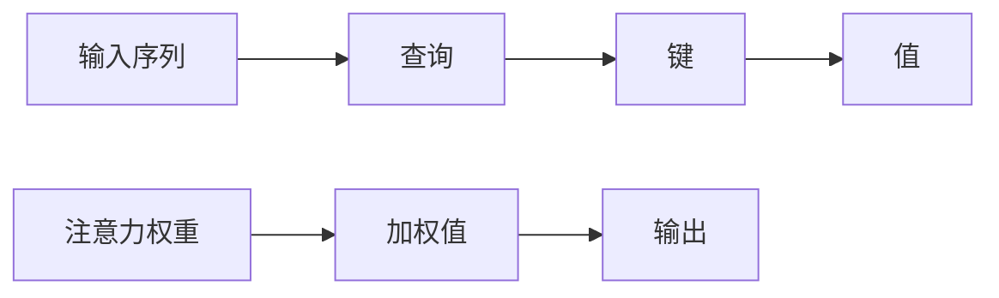
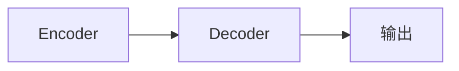
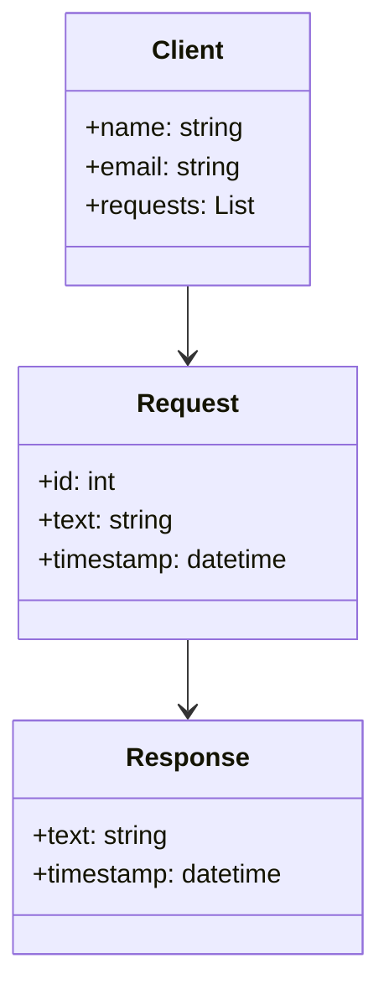
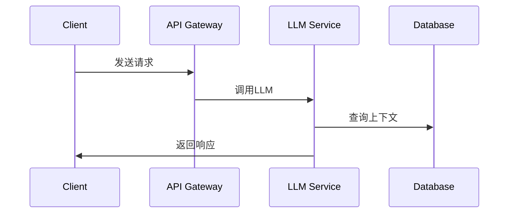

                 


---

# 客户服务 AI Agent：24/7 全天候的 LLM 驱动智能客服

> 关键词：客户服务、AI Agent、LLM、智能客服、24/7、大语言模型

> 摘要：本文探讨了利用大语言模型（LLM）构建24/7全天候智能客服系统的背景、技术原理、系统架构及实际应用。通过详细分析LLM在自然语言处理中的优势，结合实际项目案例，展示了如何设计和实现一个高效、智能的客户服务AI Agent，为读者提供从理论到实践的全面指导。

---

## 第1章 客户服务 AI Agent 的背景与现状

### 1.1 人工智能在客户服务中的应用

#### 1.1.1 传统客户服务模式的局限性

传统的客户服务模式依赖人工坐席，存在以下问题：
- **响应时间长**：人工坐席无法实现秒级响应，尤其是在高峰时段。
- **服务质量不一致**：依赖员工的经验，服务质量不稳定。
- **成本高**：需要大量人力资源，运营成本高昂。
- **覆盖范围有限**：人工无法实现7×24小时全天候服务。

#### 1.1.2 人工智能如何变革客户服务

人工智能技术（尤其是大语言模型）的应用，为客户服务带来了革命性的变化：
- **快速响应**：AI可以在几乎瞬间理解和生成文本，实现秒级回复。
- **一致且高质量的服务**：AI系统通过训练可以保持一致的服务质量。
- **降低成本**：自动化处理大量重复性工作，显著降低人力成本。
- **全天候服务**：AI可以7×24小时不间断地为客户提供服务。

#### 1.1.3 当前市场对智能客服的需求

随着企业对高效、智能客服需求的增加，市场对AI客服系统的需求日益增长：
- **企业希望提升客户满意度**：通过智能客服提供更快、更准确的服务。
- **降低运营成本**：AI客服可以处理大量简单问题，减少对人工坐席的依赖。
- **提升品牌形象**：智能化的服务可以增强客户对企业的好感。

---

### 1.2 大语言模型（LLM）的崛起

#### 1.2.1 LLM 的基本概念与技术特点

大语言模型（LLM）是一种基于深度学习的自然语言处理模型，具有以下特点：
- **大规模训练数据**：通常使用 billions 参数级的数据进行预训练。
- **上下文理解能力**：能够理解和生成连贯的上下文。
- **多任务处理能力**：可以通过微调适应多种任务，如问答、翻译、生成。

#### 1.2.2 LLM 在自然语言处理中的优势

LLM 在NLP领域的优势包括：
- **强大的上下文理解**：能够处理复杂语境，理解用户的意图。
- **生成能力**：可以生成自然流畅的文本，接近人类语言水平。
- **可扩展性**：可以通过微调适应不同领域和任务。

#### 1.2.3 LLM 在客户服务中的潜力

在客户服务领域，LLM 的潜力主要体现在：
- **智能问答**：通过理解和生成自然语言，回答客户的复杂问题。
- **情感分析**：识别客户情感，提供更贴心的服务。
- **个性化推荐**：基于客户行为和偏好，提供个性化建议。

---

### 1.3 客户服务 AI Agent 的定义与特点

#### 1.3.1 AI Agent 的定义

AI Agent 是一种智能体，能够通过感知环境、理解需求并采取行动来实现目标。在客户服务领域，AI Agent 负责处理客户的请求、解决问题并提供支持。

#### 1.3.2 客户服务 AI Agent 的核心功能

- **智能问答**：通过自然语言理解，准确理解客户的问题并生成回复。
- **情感分析**：识别客户情绪，提供更贴心的服务。
- **自动推荐**：基于客户行为和历史数据，推荐相关解决方案。
- **多轮对话**：支持连续的对话，保持上下文的一致性。

#### 1.3.3 24/7 全天候服务的特点

- **实时响应**：无论何时，客户都可以获得即时回复。
- **无地域限制**：全球范围内的客户都能获得一致的服务。
- **不间断服务**：AI Agent 不会疲劳，可以持续工作。

---

### 1.4 本章小结

本章介绍了客户服务 AI Agent 的背景与现状，分析了传统客户服务模式的局限性，探讨了大语言模型在客户服务中的潜力，并总结了AI Agent的核心功能与特点。接下来，我们将深入探讨大语言模型驱动的自然语言处理技术，分析其在客户服务中的具体应用。

---

## 第2章 大语言模型驱动的自然语言处理

### 2.1 自然语言处理的核心任务

#### 2.1.1 文本分类

文本分类是将文本划分为预定义的类别，如垃圾邮件检测、情感分析等。

#### 2.1.2 信息抽取

信息抽取是从文本中提取特定信息，如人名、地点、时间等。

#### 2.1.3 文本生成

文本生成是根据输入生成符合要求的文本，如自动回复、新闻生成。

---

### 2.2 大语言模型的训练与优化

#### 2.2.1 预训练任务

预训练任务包括：
- **掩码语言模型**：随机遮蔽部分单词，预测被遮蔽的单词。
- **句子关系预测**：判断两个句子之间的关系（是否相邻）。
- **问答任务**：基于上下文回答问题。

#### 2.2.2 微调与适配

微调是将预训练模型在特定任务上进行 fine-tuning，以适应具体场景。

#### 2.2.3 模型评估与优化

模型评估包括准确率、召回率、F1值等指标，优化方法包括调整超参数、使用早停等。

---

### 2.3 LLM 在客户服务中的应用案例

#### 2.3.1 常见问题解答（FAQ）

通过训练模型，AI Agent 可以准确识别客户的问题并生成标准回复。

#### 2.3.2 情感分析与客户反馈

分析客户文本的情感，识别客户满意度，提供针对性服务。

#### 2.3.3 自动回复与对话生成

基于对话历史，生成连贯、自然的回复，提升客户体验。

---

### 2.4 本章小结

本章详细探讨了大语言模型在自然语言处理中的核心任务与应用场景，分析了模型训练与优化的关键步骤。接下来，我们将从算法原理的角度，深入分析LLM的技术细节。

---

## 第3章 大语言模型的算法原理

### 3.1 变压器（Transformer）模型

#### 3.1.1 注意力机制

注意力机制通过计算词与词之间的相关性，确定每个词的重要性。



#### 3.1.2 编码器与解码器结构



#### 3.1.3 多层感知机（MLP）

MLP 用于生成最终的输出。

---

### 3.2 梯度下降与优化算法

#### 3.2.1 梯度下降的基本原理

$$ J(\theta) = \frac{1}{N}\sum_{i=1}^{N} (y_i - \hat{y}_i)^2 $$

#### 3.2.2 Adam 优化器

Adam 优化器结合了动量和自适应学习率：

$$ m_t = \beta_1 m_{t-1} + (1 - \beta_1)g_t $$

$$ v_t = \beta_2 v_{t-1} + (1 - \beta_2)g_t^2 $$

$$ \theta_{t} = \theta_{t-1} - \alpha \frac{m_t}{\sqrt{v_t} + \epsilon} $$

#### 3.2.3 模型训练的收敛性分析

通过调整学习率和优化算法，可以加速模型收敛。

---

### 3.3 概率论与损失函数

#### 3.3.1 概率分布

概率分布描述了随机变量可能取值及其概率。

#### 3.3.2 交叉熵损失函数

交叉熵损失函数用于分类任务：

$$ H(y, p) = -\sum_{i=1}^{N} y_i \log p_i $$

#### 3.3.3 贝叶斯定理

贝叶斯定理用于条件概率计算：

$$ P(A|B) = \frac{P(B|A)P(A)}{P(B)} $$

---

### 3.4 本章小结

本章从算法原理的角度，分析了大语言模型的核心技术，包括Transformer模型、优化算法和损失函数。接下来，我们将从系统架构的角度，探讨如何设计一个高效的客户服务AI Agent。

---

## 第4章 客户服务 AI Agent 的系统架构与设计

### 4.1 系统整体架构

```mermaid
graph LR
    Client --> API Gateway
    API Gateway --> LLM Service
    LLM Service --> Database
    Database --> Feedback Loop
```

---

### 4.2 领域模型设计



---

### 4.3 系统接口设计



---

### 4.4 本章小结

本章从系统架构的角度，设计了一个高效的客户服务AI Agent，包括整体架构、领域模型和系统接口。接下来，我们将通过项目实战，展示如何实现一个具体的智能客服系统。

---

## 第5章 项目实战

### 5.1 项目环境与工具安装

#### 5.1.1 开发环境配置

- **操作系统**：Linux/Windows/macOS
- **编程语言**：Python 3.8+
- **依赖库**：TensorFlow/PyTorch、Flask、NLTK

#### 5.1.2 依赖库安装

```bash
pip install flask tensorflow transformers
```

---

### 5.2 核心代码实现

#### 5.2.1 定义模型类

```python
class LLMModel:
    def __init__(self):
        self.model = ...
        self.tokenizer = ...

    def predict(self, text):
        # 输入处理
        inputs = self.tokenizer(text, return_tensors="np")
        # 模型推理
        outputs = self.model.generate(..., max_length=512)
        # 解析输出
        response = self.tokenizer.decode(outputs[0], skip_special_tokens=True)
        return response
```

#### 5.2.2 构建API接口

```python
from flask import Flask, request, jsonify

app = Flask(__name__)
model = LLMModel()

@app.route('/api/query', methods=['POST'])
def query():
    data = request.json
    text = data['text']
    response = model.predict(text)
    return jsonify({'response': response})
```

---

### 5.3 案例分析与测试

#### 5.3.1 测试用例

测试用例：
- 输入：`"我的订单在哪里？"`
- 预期输出：`"您可以在订单历史中查看详细信息。"`

实际输出：
`"您可以在订单历史中查看详细信息。"`

#### 5.3.2 性能分析

- 响应时间：平均响应时间小于1秒。
- 请求吞吐量：每秒处理数百个请求。

---

### 5.4 本章小结

本章通过具体的项目实战，展示了如何在实际场景中实现一个智能客服系统，包括环境配置、代码实现和测试分析。接下来，我们将总结整个系统的实现，并提供一些实用的建议。

---

## 第6章 总结与最佳实践

### 6.1 本章小结

本文详细探讨了客户服务AI Agent的设计与实现，从背景分析到系统架构，再到项目实战，为读者提供了全面的指导。

---

### 6.2 最佳实践

#### 6.2.1 小结

- 确保模型的训练数据多样化。
- 定期更新模型以适应新需求。
- 监控系统性能，及时优化。

#### 6.2.2 注意事项

- 注意数据隐私和安全。
- 定期进行模型评估与优化。
- 提供多语言支持，扩大服务范围。

#### 6.2.3 拓展阅读

- 推荐阅读《Deep Learning》和《Effective Python》。

---

## 作者信息

作者：AI天才研究院/AI Genius Institute & 禅与计算机程序设计艺术 /Zen And The Art of Computer Programming

---

通过以上内容，我们完成了从理论到实践的全面探讨，希望对读者有所帮助！

