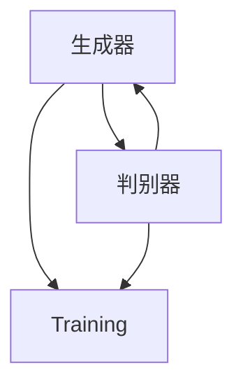
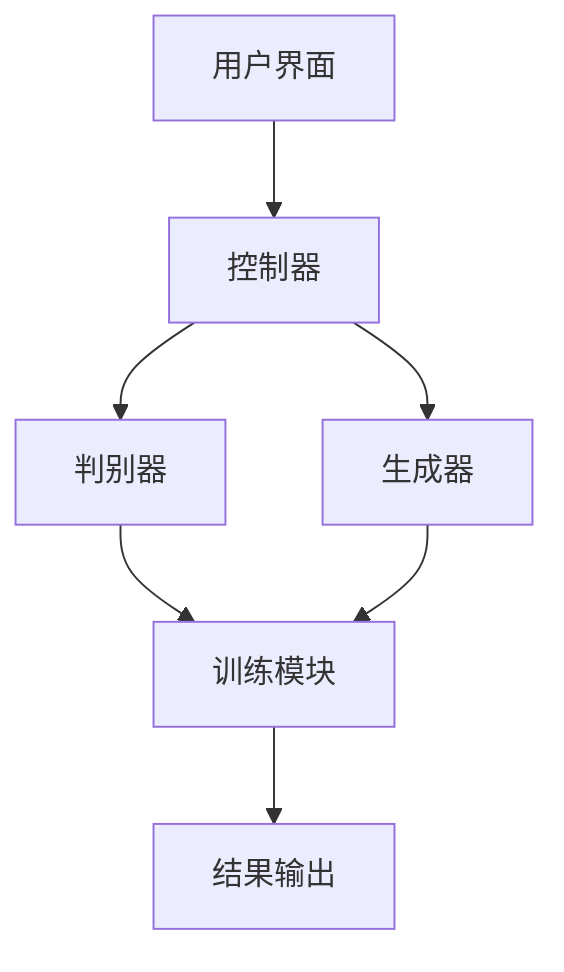

                 


# 对抗训练：提高AI Agent的鲁棒性

---

## 关键词

- 对抗训练、生成对抗网络、AI Agent、鲁棒性、模型优化、强化学习、机器学习

---

## 摘要

对抗训练是一种通过让两个模型相互竞争来提高性能的方法，尤其在AI Agent领域中，对抗训练能够显著提高模型的鲁棒性和适应性。本文从对抗训练的基本概念出发，详细探讨其核心原理、算法实现、系统架构以及实际案例，旨在帮助读者全面理解对抗训练的优势，并掌握如何在实际项目中应用这一技术来提升AI Agent的性能。

---

## 目录大纲

---

## 第一部分：对抗训练基础

### 第1章：对抗训练概述

#### 1.1 对抗训练的基本概念

- 1.1.1 对抗训练的定义
  - 对抗训练是一种通过让生成模型和判别模型相互竞争来优化模型性能的技术。
  - 生成模型（Generator）试图生成逼真的数据，判别模型（Discriminator）则试图区分真实数据和生成数据。

- 1.1.2 对抗训练的核心思想
  - 通过零和博弈（Zero-sum Game）的方式，使生成模型不断改进，以欺骗判别模型。
  - 对抗训练的目标是让生成模型生成的数据能够 fool 判别模型，从而提高生成模型的生成能力。

- 1.1.3 对抗训练在AI Agent中的应用
  - 在AI Agent中，对抗训练可以用于提高决策的鲁棒性、增强模型的泛化能力，以及在动态环境中适应复杂挑战。

#### 1.2 问题背景与解决方法

- 1.2.1 AI Agent的鲁棒性问题
  - 在复杂的动态环境中，AI Agent可能面临数据分布偏移、对抗攻击等挑战，导致模型性能下降。
  - 鲁棒性不足的AI Agent在面对异常输入或攻击时，容易崩溃或产生错误决策。

- 1.2.2 对抗训练如何解决鲁棒性问题
  - 对抗训练通过引入对抗性的训练样本，增强模型对异常输入的抵抗能力。
  - 通过与“敌人”的对抗，模型能够更好地适应各种极端情况，提高整体鲁棒性。

- 1.2.3 对抗训练的边界与外延
  - 对抗训练的边界包括模型的训练目标和对抗方式，外延则涉及强化学习、博弈论等领域的交叉应用。

#### 1.3 对抗训练的核心要素

- 1.3.1 对抗双方的定义
  - 生成模型（Generator）：负责生成数据。
  - 判别模型（Discriminator）：负责区分真实数据和生成数据。

- 1.3.2 对抗目标的设定
  - 判别模型的目标是尽可能区分真实数据和生成数据。
  - 生成模型的目标是尽可能生成能够 fool 判别模型的数据。

- 1.3.3 对抗训练的优化策略
  - 使用交替优化策略，先优化生成模型，再优化判别模型，交替进行训练。

---

## 第二部分：对抗训练的核心概念与联系

### 第2章：对抗训练的核心原理

#### 2.1 对抗训练的原理

- 2.1.1 对抗双方的博弈关系
  - 生成模型和判别模型之间存在零和博弈的关系，生成模型试图欺骗判别模型，判别模型试图识别生成数据。

- 2.1.2 对抗训练的数学模型
  - 通过定义生成模型和判别模型的损失函数，并通过优化这两个损失函数来实现模型的交替优化。

- 2.1.3 对抗训练的优化过程
  - 使用梯度下降方法，分别优化生成模型和判别模型的参数，使得生成模型生成更逼真的数据，判别模型更准确地识别数据。

#### 2.2 对抗训练与其他训练方法的对比

- 2.2.1 监督学习与对抗训练的对比
  - 监督学习：基于标记的训练数据进行模型优化。
  - 对抗训练：通过生成和判别模型的博弈关系进行模型优化。

- 2.2.2 强化学习与对抗训练的对比
  - 强化学习：基于奖励机制进行模型优化。
  - 对抗训练：基于生成和判别的博弈关系进行模型优化。

- 2.2.3 对抗训练的独特优势
  - 对抗训练能够生成多样化的数据，提高模型的泛化能力。
  - 对抗训练能够在无标签数据的情况下进行模型优化，适用于无监督学习场景。

#### 2.3 对抗训练的核心概念对比表

| 概念 | 监督学习 | 强化学习 | 对抗训练 |
|------|----------|----------|----------|
| 数据需求 | 需要标记数据 | 需要环境反馈 | 可以利用未标记数据 |
| 模型类型 | 单一模型 | 单一模型 | 双模型（生成器和判别器） |
| 优化目标 | 最小化预测误差 | 最大化累积奖励 | 最小化判别损失，最大化生成损失 |

#### 2.4 对抗训练的实体关系图（ER图）

```mermaid
erd
  Generator
  Discriminator
  Training data
  Generated data
  Real data

  Generator -->+--> Discriminator
  Training data -->+--> Discriminator
  Generated data -->+--> Discriminator
  Real data -->+--> Discriminator
```

---

## 第三部分：算法原理

### 第3章：算法原理

#### 3.1 生成对抗网络（GAN）的数学模型

- 3.1.1 生成模型和判别模型的损失函数

```math
\text{判别器的损失函数} = -\mathbb{E}_{x \sim p_{\text{data}}}[ \log D(x) ] - \mathbb{E}_{z \sim p_z}[ \log (1 - D(G(z))) ]
```

$$ \text{生成器的损失函数} = -\mathbb{E}_{z \sim p_z}[ \log D(G(z)) ] $$

- 3.1.2 GAN的训练过程



#### 3.2 对抗训练的优化策略

- 3.2.1 交替优化生成器和判别器
  - 先优化生成器，再优化判别器，交替进行训练，以避免模型陷入局部最优。

- 3.2.2 使用Wasserstein距离进行优化
  - 使用Wasserstein距离（Earth Mover's Distance）来优化生成模型，能够更稳定地训练模型。

- 3.2.3 提高训练效率的技巧
  - 使用预训练模型、调整学习率、使用动量优化器等技巧来提高训练效率。

---

## 第四部分：系统架构与实现

### 第4章：系统架构设计

#### 4.1 系统功能设计

- 4.1.1 数据预处理模块
  - 对输入数据进行清洗、归一化等预处理操作，确保数据适合生成器和判别器的输入要求。

- 4.1.2 生成器模块
  - 负责生成新的数据样本，使用深度神经网络模型进行实现。

- 4.1.3 判别器模块
  - 负责区分生成数据和真实数据，同样使用深度神经网络模型进行实现。

- 4.1.4 优化器模块
  - 使用Adam优化器等优化算法，对生成器和判别器的参数进行优化。

#### 4.2 系统架构图



#### 4.3 系统交互流程

- 4.3.1 用户输入数据
  - 用户提供训练数据，系统进行数据预处理。

- 4.3.2 生成器生成数据
  - 生成器根据预处理后的数据生成新的数据样本。

- 4.3.3 判别器区分数据
  - 判别器对生成数据和真实数据进行区分，输出结果。

- 4.3.4 优化器优化模型
  - 根据判别器的输出结果，优化生成器和判别器的参数，提高模型性能。

---

## 第五部分：项目实战

### 第5章：项目实战

#### 5.1 环境安装与配置

- 5.1.1 安装必要的依赖库
  - 安装TensorFlow、Keras、Python等开发工具和深度学习框架。

- 5.1.2 配置开发环境
  - 配置Jupyter Notebook、PyCharm等开发环境，确保所有依赖库已正确安装。

#### 5.2 代码实现

- 5.2.1 生成器代码实现

```python
import tensorflow as tf
from tensorflow import keras

def build_generator(input_dim, output_dim):
    model = keras.Sequential()
    model.add(keras.layers.Dense(256, activation='relu', input_dim=input_dim))
    model.add(keras.layers.Dense(128, activation='relu'))
    model.add(keras.layers.Dense(output_dim, activation='sigmoid'))
    return model
```

- 5.2.2 判别器代码实现

```python
def build_discriminator(input_dim):
    model = keras.Sequential()
    model.add(keras.layers.Dense(128, activation='relu', input_dim=input_dim))
    model.add(keras.layers.Dense(64, activation='relu'))
    model.add(keras.layers.Dense(1, activation='sigmoid'))
    return model
```

- 5.2.3 对抗训练代码实现

```python
def train_gan(generator, discriminator, input_dim, epochs=100, batch_size=128):
    discriminator.compile(loss='binary_crossentropy', optimizer='adam', metrics=['accuracy'])
    generator.compile(loss='binary_crossentropy', optimizer='adam')
    
    for epoch in range(epochs):
        # 生成随机噪声作为生成器的输入
        noise = np.random.randn(batch_size, input_dim)
        generated = generator.predict(noise)
        
        # 判别器的训练数据
        real_data = np.random.random((batch_size, input_dim))
        combined_data = np.concatenate([real_data, generated])
        labels = np.ones((2*batch_size, 1))
        labels[batch_size:] = 0
        
        # 训练判别器
        d_loss, d_acc = discriminator.train_on_batch(combined_data, labels)
        
        # 训练生成器
        noise = np.random.randn(batch_size, input_dim)
        labels = np.ones((batch_size, 1))
        g_loss = generator.train_on_batch(noise, labels)
        
        # 输出训练进度
        print(f"Epoch {epoch}, Discriminator Loss: {d_loss}, Discriminator Accuracy: {d_acc}, Generator Loss: {g_loss}")
```

#### 5.3 案例分析

- 5.3.1 案例背景
  - 使用MNIST数据集，训练生成器生成手写数字。

- 5.3.2 训练结果分析
  - 生成器生成的数字是否清晰可辨。
  - 判别器的判别准确率是否达到预期。

---

## 第六部分：最佳实践与总结

### 第6章：最佳实践

#### 6.1 对抗训练的优缺点

- 优点：
  - 提高模型的鲁棒性和泛化能力。
  - 能够生成多样化的数据，丰富训练数据集。

- 缺点：
  - 训练过程可能不稳定，容易出现模式崩溃等问题。
  - 训练时间较长，计算资源消耗较大。

#### 6.2 对抗训练的小贴士

- 选择合适的超参数，如学习率、批量大小等。
- 使用预训练模型，加速训练过程。
- 定期监控模型的训练过程，及时调整参数。

#### 6.3 对抗训练的注意事项

- 注意生成器和判别器的平衡，避免一方过于强大，导致另一方无法优化。
- 注意数据的质量，确保输入数据适合生成器和判别器的训练。

#### 6.4 对抗训练的拓展阅读

- 推荐阅读《Generative Adversarial Nets》（Goodfellow等人的经典论文）。
- 关注对抗训练在图像生成、自然语言处理等领域的最新应用。

---

## 第七部分：总结

### 第7章：总结

对抗训练作为一种强大的模型优化技术，通过生成器和判别器的博弈关系，显著提高了AI Agent的鲁棒性和泛化能力。本文从理论基础到实际应用，全面探讨了对抗训练的核心原理、算法实现和系统架构，并通过实际案例展示了对抗训练在提高AI Agent性能中的巨大潜力。未来，随着深度学习技术的不断发展，对抗训练将在更多领域展现出其独特的优势，为AI技术的发展注入新的活力。

---

## 作者

作者：AI天才研究院/AI Genius Institute & 禅与计算机程序设计艺术 /Zen And The Art of Computer Programming

