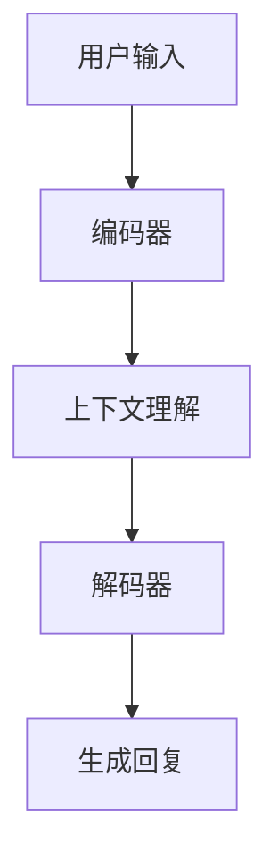
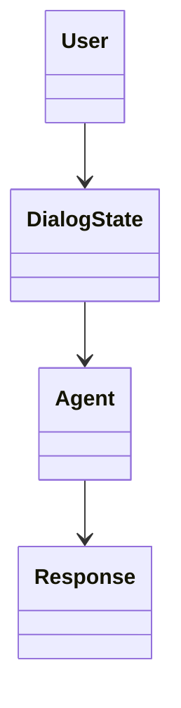
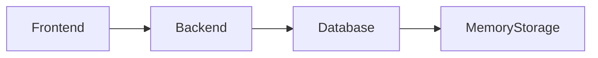
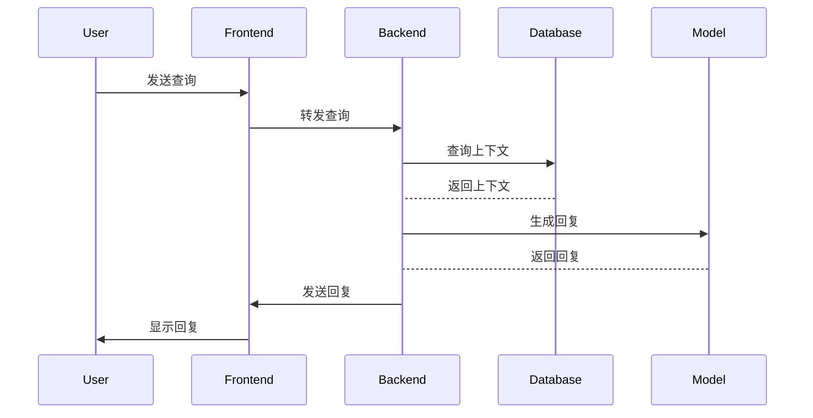

                 


# 对话式AI Agent：提升LLM的自然语言交互能力

---

## 关键词
对话式AI Agent, 大语言模型, 自然语言交互, 人机对话, 对话生成, 系统架构, 优化与扩展

---

## 摘要
随着人工智能技术的快速发展，对话式AI Agent（智能对话代理）正逐渐成为人机交互领域的重要研究方向。本文旨在深入探讨如何通过提升大语言模型（LLM）的自然语言交互能力，构建更加智能、流畅的对话系统。文章从对话式AI Agent的背景与基础出发，详细分析其核心算法与数学模型，系统性地讲解对话式AI Agent的架构设计与实现方案，并通过实际项目案例展示如何在具体场景中应用这些技术。最后，本文还探讨了对话式AI Agent的优化与扩展策略，为读者提供全面的技术指导。

---

## 第一部分：对话式AI Agent的背景与基础

### 第1章：对话式AI Agent的定义与背景

#### 1.1 对话式AI Agent的定义与核心概念
对话式AI Agent是一种能够与人类进行自然语言交互的智能系统，它通过理解和生成自然语言来实现人机对话。与传统对话系统相比，对话式AI Agent具有更强的上下文理解和生成能力，能够提供更接近人类对话的交互体验。

**核心概念：**
- **对话生成**：AI Agent根据输入的查询生成自然语言回复。
- **上下文理解**：AI Agent能够理解对话历史，保持对话的连贯性。
- **意图识别**：AI Agent能够识别用户的意图，提供针对性的回复。

#### 1.2 对话式AI Agent的发展历程
对话式AI Agent的发展可以分为以下几个阶段：
1. **规则驱动阶段**：基于预定义的规则进行对话生成，适用于简单的场景。
2. **统计学习阶段**：利用机器学习算法（如SVM、随机森林）进行模式匹配。
3. **深度学习阶段**：基于神经网络（如RNN、Transformer）实现更复杂的对话生成。

**技术趋势**：
- **模型规模越来越大**：从最初的固定规则到基于Transformer的模型，对话式AI Agent的模型复杂度和能力不断提升。
- **多模态交互**：结合视觉、听觉等多模态信息，提升对话的自然性。
- **实时推理**：通过优化算法和硬件，实现更高效的实时对话生成。

#### 1.3 对话式AI Agent的技术基础
对话式AI Agent的核心技术包括：
- **自然语言处理（NLP）**：文本的理解与生成。
- **大语言模型（LLM）**：如GPT系列模型，用于生成高质量的对话回复。
- **对话管理**：通过策略或规则管理对话流程。

**技术对比**：
| 技术 | 描述 | 优缺点 |
|------|------|--------|
| 基于规则的方法 | 通过预定义的规则生成回复 | 易于理解，但难以应对复杂场景 |
| 统计学习方法 | 基于机器学习模型进行模式匹配 | 可以处理复杂场景，但需要大量数据 |
| 深度学习方法 | 基于神经网络生成对话回复 | 表现更自然，但训练成本高 |

#### 1.4 对话式AI Agent的应用场景
对话式AI Agent广泛应用于以下领域：
- **客服系统**：自动处理客户咨询。
- **智能助手**：如Siri、Alexa等。
- **教育领域**：智能辅导系统。
- **医疗领域**：辅助诊断与咨询。

#### 1.5 对话式AI Agent的挑战与机遇
**技术挑战**：
- 对话生成的连贯性和自然性。
- 上下文的理解与记忆。
- 多语言、多文化适应性。

**机遇**：
- 通过技术进步，对话式AI Agent能够更好地服务于各行业。
- 结合其他技术（如知识图谱、视觉识别）提升对话质量。

---

## 第二部分：对话式AI Agent的核心算法与数学模型

### 第2章：大语言模型（LLM）的训练与优化

#### 2.1 LLM的基本原理
大语言模型（LLM）是对话式AI Agent的核心技术之一，基于Transformer架构。其基本原理如下：
1. **编码器**：将输入的文本序列转换为嵌入表示。
2. **解码器**：根据编码器的输出生成回复。

**数学公式**：
- **自注意力机制**：
  $$ \text{Attention}(Q, K, V) = \text{softmax}\left(\frac{QK^T}{\sqrt{d_k}}\right)V $$
- **前馈神经网络**：
  $$ f(x) = \text{ReLU}(Wx + b) $$

#### 2.2 对话式AI Agent的对话生成机制
对话生成主要分为以下步骤：
1. **输入处理**：将用户输入的文本转换为嵌入表示。
2. **上下文理解**：分析对话历史，提取关键信息。
3. **回复生成**：基于上下文生成回复。

**算法流程图**：



#### 2.3 对话生成的数学模型
基于Transformer的对话生成模型：
- **编码器**：将输入序列编码为上下文表示。
- **解码器**：根据上下文生成回复。

**损失函数**：
$$ \mathcal{L} = -\sum_{i=1}^{n} \log P(y_i|x_{<i}) $$

**优化目标**：
最小化损失函数，提升生成回复的相关性和自然性。

#### 2.4 对话式AI Agent的算法实现
实现对话式AI Agent的主要步骤：
1. **数据预处理**：清洗和标注对话数据。
2. **模型训练**：使用标注数据训练LLM。
3. **对话生成**：基于训练好的模型生成回复。

**代码示例**：
```python
def generate_response(model, tokenizer, input_text):
    inputs = tokenizer(input_text, return_tensors='np')
    outputs = model.generate(**inputs)
    response = tokenizer.decode(outputs[0], skip_special_tokens=True)
    return response
```

---

## 第三部分：对话式AI Agent的系统架构与设计

### 第3章：系统功能设计

#### 3.1 领域模型设计
对话式AI Agent的领域模型包括：
- **用户角色**：用户、客服、医生等。
- **对话状态**：当前对话的主题和上下文。
- **系统角色**：AI Agent的响应角色。

**领域模型类图**：



#### 3.2 系统架构设计
对话式AI Agent的系统架构包括：
- **前端**：用户输入接口。
- **后端**：对话生成引擎。
- **数据库**：存储对话历史和用户信息。

**系统架构图**：



#### 3.3 系统接口设计
主要接口包括：
- **输入接口**：接收用户的输入文本。
- **输出接口**：返回生成的回复。
- **状态接口**：管理对话状态。

**接口序列图**：



#### 3.4 系统交互设计
对话式AI Agent的交互流程：
1. 用户输入查询。
2. 系统解析查询并生成回复。
3. 系统返回回复给用户。

---

## 第四部分：项目实战

### 第4章：对话式AI Agent的实现

#### 4.1 环境安装
安装必要的库：
```bash
pip install transformers torch
```

#### 4.2 系统核心实现
实现对话生成的主程序：
```python
from transformers import GPT2LMHeadModel, GPT2Tokenizer

model_name = "gpt2"
tokenizer = GPT2Tokenizer.from_pretrained(model_name)
model = GPT2LMHeadModel.from_pretrained(model_name)

def generate_response(input_text):
    inputs = tokenizer(input_text, return_tensors='pt')
    outputs = model.generate(**inputs, max_length=50)
    response = tokenizer.decode(outputs[0], skip_special_tokens=True)
    return response

# 测试
print(generate_response("What is AI?"))
```

#### 4.3 案例分析
案例：客服系统中的常见问题解答。

用户输入：我需要技术支持。
系统回复：请描述具体的问题，我会尽力帮助您。

---

## 第五部分：优化与扩展

### 第5章：对话式AI Agent的优化策略

#### 5.1 对话生成的优化
优化策略包括：
- **模型调优**：微调模型以适应特定领域。
- **多轮对话管理**：优化对话流程，提升连贯性。
- **上下文记忆机制**：引入记忆网络或注意力机制。

#### 5.2 对话式AI Agent的扩展
扩展方向：
- **多语言支持**：支持多种语言的对话生成。
- **知识图谱结合**：整合外部知识提升对话质量。
- **实时推理优化**：优化算法和硬件，提升推理速度。

#### 5.3 最佳实践 tips
- **数据质量**：高质量的训练数据是模型表现的关键。
- **模型选择**：根据具体场景选择合适的模型。
- **性能优化**：通过量化、剪枝等技术优化推理速度。

#### 5.4 小结
对话式AI Agent的优化与扩展需要综合考虑模型性能、系统架构和实际应用场景，通过不断优化和创新，提升对话系统的用户体验。

---

## 结语

对话式AI Agent作为人机交互的重要技术，正在深刻改变我们的生活方式。通过提升LLM的自然语言交互能力，对话式AI Agent将变得更加智能和自然。未来，随着技术的进步，对话式AI Agent将在更多领域发挥重要作用。

---

## 作者

作者：AI天才研究院/AI Genius Institute & 禅与计算机程序设计艺术 /Zen And The Art of Computer Programming

---

