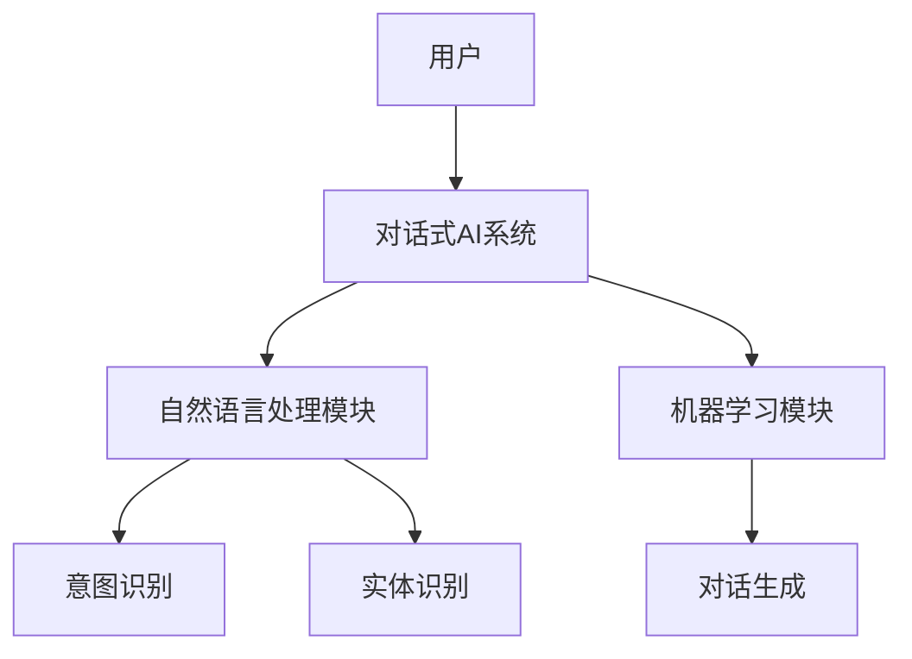
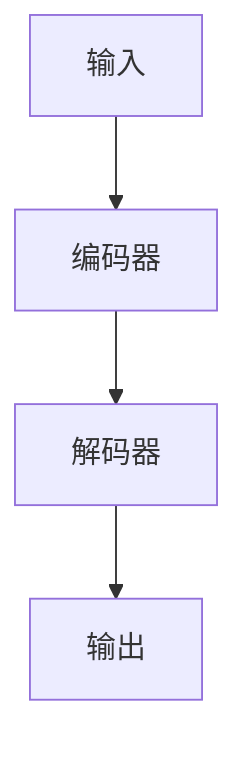
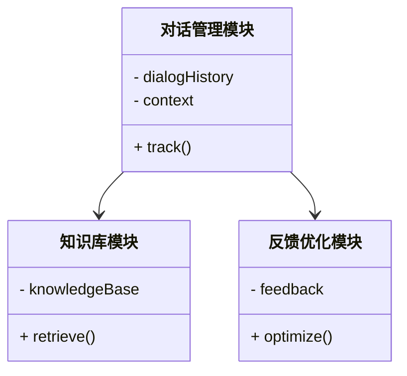

                 


# 对话式AI在客户服务中的应用与优化

## 关键词：对话式AI、自然语言处理、机器学习、客户服务、优化

## 摘要：对话式AI作为人工智能技术的重要应用之一，在客户服务领域展现了巨大的潜力。本文将详细探讨对话式AI的核心技术、算法原理、系统架构设计以及实际应用案例，旨在为读者提供全面的视角，帮助其理解并优化对话式AI在客户服务中的应用。

---

## 第1章：对话式AI的基本概念与背景

### 1.1 对话式AI的定义与核心要素

#### 1.1.1 对话式AI的定义
对话式AI（Conversational AI）是一种能够理解和生成自然语言的智能系统，它通过模拟人类对话的方式，为用户提供服务或解决问题。对话式AI的核心在于理解和生成自然语言，能够通过上下文进行推理，并根据对话内容提供相应的反馈。

#### 1.1.2 对话式AI的核心要素
1. **自然语言处理（NLP）**：理解和生成人类语言的关键技术。
2. **机器学习**：通过数据训练模型，使其能够自动优化对话策略。
3. **对话管理**：跟踪对话上下文，确保对话的连贯性和一致性。
4. **知识库**：提供对话所需的知识和信息。

#### 1.1.3 对话式AI与传统客服的区别
- **自动化**：对话式AI能够24/7全天候工作，无需人工干预。
- **个性化**：通过分析用户数据，提供个性化的服务。
- **效率**：能够快速响应并解决问题，提升客户满意度。

### 1.2 对话式AI的发展历程

#### 1.2.1 自然语言处理技术的演进
从早期的基于规则的系统到现在的深度学习模型，NLP技术经历了多次迭代，极大地提升了对话式AI的准确性和流畅性。

#### 1.2.2 对话式AI的崛起与应用
随着计算能力的提升和大数据技术的发展，对话式AI逐渐从理论研究走向实际应用，广泛应用于客服、销售、教育等领域。

#### 1.2.3 当前对话式AI的技术瓶颈
尽管对话式AI取得了显著进展，但在复杂场景下的理解能力、多语言支持以及情感分析方面仍存在挑战。

### 1.3 对话式AI在客户服务中的应用价值

#### 1.3.1 提升客户体验
通过个性化的对话，客户能够获得更贴心的服务体验，增强客户忠诚度。

#### 1.3.2 降低企业成本
自动化服务减少了人力成本，同时提高了服务效率，降低了整体运营成本。

#### 1.3.3 提高服务效率
对话式AI能够快速响应客户需求，减少客户等待时间，提高服务效率。

---

## 第2章：对话式AI的核心技术与原理

### 2.1 自然语言处理（NLP）技术

#### 2.1.1 NLP的基本概念
NLP是研究如何让计算机理解和生成人类语言的技术，是对话式AI的核心。

#### 2.1.2 常见的NLP技术与模型
- **分词**：将连续的文本分割成有意义的词语或短语。
- **实体识别**：识别文本中的命名实体，如人名、地名等。
- **句法分析**：分析句子的语法结构，理解句子的含义。
- **情感分析**：判断文本的情感倾向，如正面、负面或中性。

#### 2.1.3 对话式AI中的NLP应用
- **意图识别**：识别用户的意图，如“查询订单状态”。
- **实体抽取**：从对话中提取关键信息，如订单号、客户姓名等。

### 2.2 机器学习与深度学习

#### 2.2.1 机器学习的基本原理
机器学习是一种通过数据训练模型，使其能够从数据中学习规律的技术。

#### 2.2.2 深度学习在对话式AI中的应用
- **神经网络**：用于自然语言处理任务，如文本生成和意图识别。
- **循环神经网络（RNN）**：适用于处理序列数据，如对话历史。
- **Transformer模型**：如BERT和GPT，能够生成更自然的对话。

#### 2.2.3 常见的深度学习模型
- **BERT**：用于文本理解，能够处理上下文信息。
- **GPT**：用于文本生成，能够生成连贯的对话。

### 2.3 对话式AI的算法原理

#### 2.3.1 基于规则的对话系统
基于预定义的规则，系统根据输入生成相应的回应。这种方法简单，但灵活性较低。

#### 2.3.2 基于统计的对话系统
通过统计语言模型，系统根据对话历史和上下文生成最可能的回应。

#### 2.3.3 基于深度学习的对话系统
利用深度学习模型，系统能够学习对话的模式和规律，生成更自然的回应。

---

## 第3章：对话式AI的核心概念与联系

### 3.1 对话式AI的实体关系图



### 3.2 对话式AI的技术对比表格

| 技术 | 基于规则 | 基于统计 | 基于深度学习 |
|------|----------|----------|--------------|
| 原理 | 预定义规则 | 统计模型 | 神经网络模型 |
| 优点 | 实现简单 | 精度较高 | 更自然流畅 |
| 缺点 | 灵活性低 | 需大量数据 | 计算资源需求高 |

---

## 第4章：对话式AI的算法原理讲解

### 4.1 基于深度学习的对话生成算法

#### 4.1.1 Transformer模型
Transformer模型由编码器和解码器组成，能够处理长文本序列。



#### 4.1.2 BERT模型
BERT是一种预训练语言模型，能够理解上下文信息。

#### 4.1.3 GPT模型
GPT是一种生成式模型，能够生成连贯的文本。

### 4.2 对话式AI的训练与优化

#### 4.2.1 损失函数
使用交叉熵损失函数来衡量预测值与真实值的差距。

$$ \text{loss} = -\sum_{i=1}^{n} y_{i}\log(p(y_{i})) $$

#### 4.2.2 优化算法
使用Adam优化器来更新模型参数。

$$ \theta = \theta - \eta \frac{\partial L}{\partial \theta} $$

---

## 第5章：系统分析与架构设计方案

### 5.1 客户服务场景介绍

#### 5.1.1 客户咨询
用户通过对话式AI系统查询订单状态。

#### 5.1.2 投诉处理
用户通过对话式AI系统提交投诉，并获得解决方案。

### 5.2 系统功能设计

#### 5.2.1 对话管理模块
负责跟踪对话上下文，确保对话的连贯性。

#### 5.2.2 知识库模块
存储与对话相关的产品信息、常见问题解答等。

#### 5.2.3 反馈优化模块
根据用户反馈优化对话策略。



### 5.3 系统架构设计

#### 5.3.1 前端架构
负责用户界面的展示和交互。

#### 5.3.2 后端架构
负责接收请求、处理数据并返回响应。

#### 5.3.3 数据库架构
存储对话历史、用户信息等数据。


---

## 第6章：项目实战

### 6.1 环境安装

```bash
pip install transformers
pip install torch
```

### 6.2 核心实现代码

```python
from transformers import AutoModelWithLMHead, AutoTokenizer

model = AutoModelWithLMHead.from_pretrained(' microsoft/GPT-2')
tokenizer = AutoTokenizer.from_pretrained(' microsoft/GPT-2')

def generate_response(input_text):
    inputs = tokenizer(input_text, return_tensors='pt')
    outputs = model.generate(**inputs, max_length=50)
    return tokenizer.decode(outputs[0], skip_special_tokens=True)
```

### 6.3 案例分析

#### 6.3.1 案例1：订单查询
用户输入：“我需要查询我的订单状态。”
系统响应：“请提供您的订单号。”

#### 6.3.2 案例2：投诉处理
用户输入：“我对产品不满意。”
系统响应：“非常抱歉，我们可以帮您处理退款事宜。”

---

## 第7章：最佳实践与小结

### 7.1 最佳实践

#### 7.1.1 数据质量
确保训练数据的多样性和质量，避免偏见。

#### 7.1.2 模型优化
定期更新模型，根据用户反馈优化对话策略。

#### 7.1.3 安全性
保护用户隐私，确保数据安全。

### 7.2 小结

对话式AI在客户服务中的应用前景广阔，通过不断优化技术和提升用户体验，对话式AI将成为未来客户服务的重要组成部分。

### 7.3 注意事项

- **数据隐私**：确保用户数据的安全性。
- **模型可解释性**：提高模型的透明度，便于调试和优化。
- **多语言支持**：扩展对话式AI的多语言能力，满足全球用户的需求。

### 7.4 拓展阅读

- 推荐书籍：《深度学习》（Deep Learning）
- 推荐博客：[AI前线](https://aifrontier.com/)

---

## 作者：AI天才研究院 & 禅与计算机程序设计艺术

---

以上是对话式AI在客户服务中的应用与优化的技术博客文章，希望对您有所帮助！

