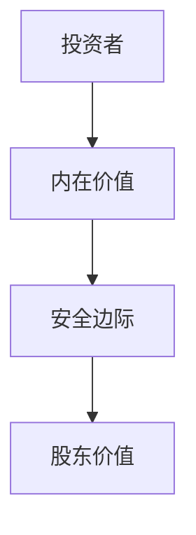
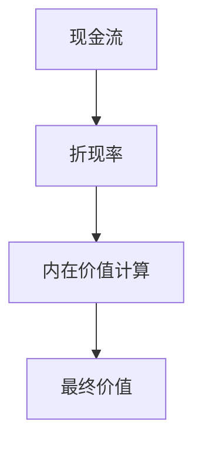
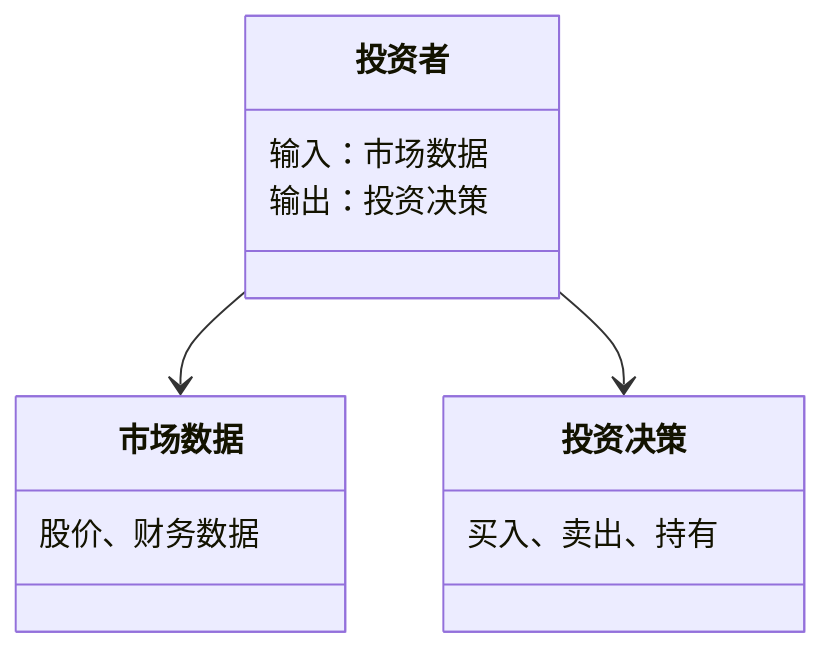
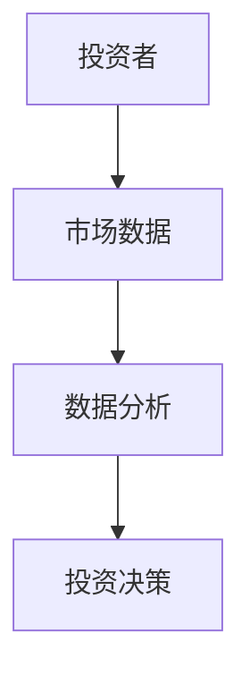

                 


# 巴菲特-芒格投资策略解析：价值投资的精髓

## 关键词：巴菲特，芒格，价值投资，内在价值，安全边际，股东价值，投资策略

## 摘要：
本文深入解析巴菲特和芒格的价值投资策略，从核心概念到数学模型，再到系统架构，全面分析其精髓。通过实际案例和系统设计，帮助读者掌握价值投资的奥秘。

---

# 第1章：价值投资的背景与核心理念

## 1.1 巴菲特与芒格的投资哲学

### 1.1.1 巴菲特的生平与投资理念
沃伦·巴菲特，生于1930年，美国著名投资人，倡导“价值投资”。他通过长期持有优质股票，实现财富增长。

### 1.1.2 芒格的智慧与决策思维
查理·芒格，巴菲特的长期合作伙伴，强调理性思维和独立思考，倡导多元思维模型。

### 1.1.3 两人合作的投资模式
巴菲特和芒格共同创立伯克希尔·哈撒韦公司，通过购买优质企业实现长期价值增长。

## 1.2 价值投资的核心理念

### 1.2.1 价值投资的定义与特征
价值投资是通过寻找市场价格低于内在价值的股票进行投资。其特征包括长期性、安全性、逆周期性。

### 1.2.2 投资的三大核心原则
1. **安全边际**：购买价格低于内在价值，降低风险。
2. **企业质量**：选择具有竞争优势的企业。
3. **长期持有**：避免短期波动，获取长期收益。

### 1.2.3 价值投资与市场波动的关系
市场波动为价值投资者提供机会，通过逆向投资，利用市场的非理性获取超额收益。

---

# 第2章：价值投资的核心概念与联系

## 2.1 核心概念原理

### 2.1.1 内在价值的计算方法
内在价值是企业未来现金流的现值，公式为：
$$\text{内在价值} = \sum_{t=1}^{n} \frac{\text{CF}_t}{(1+r)^t} + \frac{\text{残值}}{(1+r)^n}$$
其中，CF为现金流，r为折现率，n为时间。

### 2.1.2 安全边际的数学模型
安全边际=内在价值-市场价格。

### 2.1.3 股东价值的长期增长逻辑
股东价值=净利润×留存收益比率×投资回报率。

## 2.2 核心概念对比表格

| 概念       | 特征1 | 特征2 | 特征3 |
|------------|--------|--------|--------|
| 内在价值   | 客观性 | 可计算 | 长期性 |
| 安全边际   | 保护性 | 可量化 | 灵活性 |
| 股东价值   | 持续性 | 可累积 | 可持续性 |

## 2.3 实体关系图


---

# 第3章：价值投资的数学模型与算法原理

## 3.1 内在价值计算模型


## 3.2 安全边际计算公式
$$\text{安全边际} = \text{内在价值} - \text{市场价格}$$

## 3.3 股东价值增长模型
$$\text{股东价值} = \text{净利润} \times \text{留存收益比率} \times \text{投资回报率}$$`

---

# 第4章：价值投资的系统分析与架构设计

## 4.1 投资决策系统功能需求

### 4.1.1 系统架构设计


### 4.1.2 系统架构设计


### 4.1.3 系统接口设计
接口：获取市场数据、计算内在价值、生成投资信号。

### 4.1.4 系统交互设计
```mermaid
sequenceDiagram
投资者 -> 市场数据: 获取数据
市场数据 -> 数据分析: 分析数据
数据分析 -> 投资决策: 生成决策
投资者 <- 投资决策: 输出信号
```

---

# 第5章：价值投资的项目实战

## 5.1 环境安装
安装Python、Pandas、Matplotlib等工具。

## 5.2 核心实现代码
```python
def calculate_intrinsic_value(cash_flows, discount_rate, residual_value):
    intrinsic_value = 0
    for t in range(len(cash_flows)):
        if t == len(cash_flows) - 1:
            intrinsic_value += residual_value / (1 + discount_rate)**t
        else:
            intrinsic_value += cash_flows[t] / (1 + discount_rate)**t
    return intrinsic_value

cash_flows = [100, 100, 100, 100, 100, 100]
discount_rate = 0.1
residual_value = 1000
iv = calculate_intrinsic_value(cash_flows, discount_rate, residual_value)
print(iv)
```

## 5.3 实际案例分析
以可口可乐为例，计算其内在价值，比较市场价格，得出安全边际。

---

# 第6章：总结与展望

## 6.1 小结
巴菲特和芒格的价值投资策略强调安全边际和长期持有，通过深入分析企业内在价值，实现稳定收益。

## 6.2 注意事项
避免短期波动，选择优质企业，保持安全边际。

## 6.3 拓展阅读
推荐书籍：《巴菲特传》、《芒格的智慧》。

---

# 作者
作者：AI天才研究院 & 禅与计算机程序设计艺术

---

希望这篇博客能帮助读者深入理解巴菲特和芒格的价值投资策略，掌握其精髓，并在实际投资中应用这些理念。

