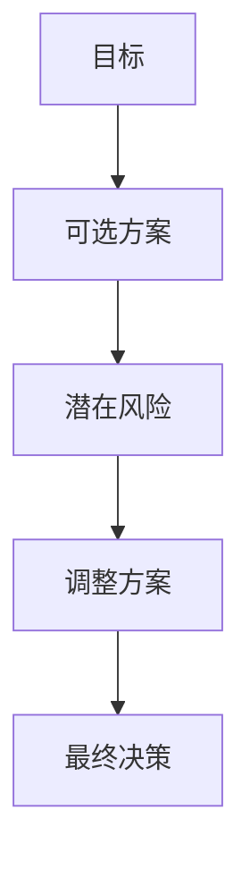
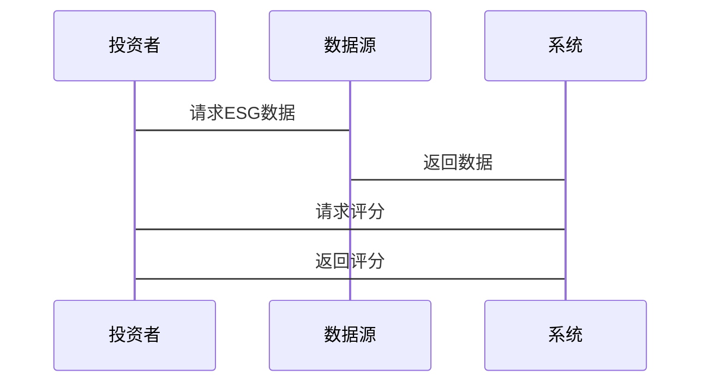

                 


# 巴菲特-芒格的ESG投资观：平衡利润和社会责任

## 关键词：巴菲特，芒格，ESG投资，价值投资，社会责任，长期主义

## 摘要：  
本文深入探讨了巴菲特和芒格的ESG投资观，分析了他们在长期主义、价值投资和多元思维模型中的ESG理念，揭示了如何在追求利润的同时履行社会责任。通过详细分析ESG投资的核心概念、评价体系、数学模型和系统架构，结合实际案例，为投资者提供了平衡利润与社会责任的实践指南。

---

# 第一部分：巴菲特与芒格的投资理念

## 第1章：巴菲特与芒格的投资哲学

### 1.1 巴菲特的价值投资理念

#### 1.1.1 巴菲特的投资哲学概述

沃伦·巴菲特（Warren Buffett）是价值投资的鼻祖，他的投资哲学基于以下几个核心原则：

1. **长期主义**：巴菲特认为投资的本质是通过持有优质资产获得长期收益，而非短期交易。
2. **安全边际**：他强调以低于内在价值的价格买入资产，确保本金的安全。
3. **价值投资**：关注企业的基本面，寻找具有持续竞争优势和良好管理的公司。

巴菲特的投资哲学可以用一句话概括：**“价格是你要支付的，价值是你要得到的。”**

#### 1.1.2 巴菲特的长期主义投资观

巴菲特的长期主义不仅体现在投资时间跨度上，更体现在他对企业社会责任的关注上。他认为，企业不仅要为股东创造利润，还要为社会做出贡献。这种理念与ESG投资不谋而合。

#### 1.1.3 巴菲特投资决策的核心原则

- **集中投资**：将资金集中在少数优质企业上，而非分散投资。
- **逆周期投资**：在市场恐慌时买入，在市场狂热时卖出。
- **避免过度杠杆**：保持企业的财务健康，避免过度负债。

### 1.2 芒格的多元思维模型

#### 1.2.1 多元思维模型的定义与特点

查理·芒格（Charlie Munger）提出的多元思维模型（Multi-Model Thinking）是一种将多个学科的原理和原则交叉应用的思维方式。他认为，投资者需要通过多个角度（如心理学、经济学、物理学等）来分析问题，避免认知偏差。

#### 1.2.2 芒格思维模型在投资中的应用

芒格认为，ESG因素是企业价值的重要组成部分。例如：
- **心理因素**：企业声誉和社会责任感会影响员工和消费者的行为。
- **经济因素**：良好的治理结构能够提高企业运营效率。
- **社会因素**：企业对环境保护的投入会影响其长期竞争力。

#### 1.2.3 芒格决策框架的逻辑分析

芒格的决策框架可以用一个简单的逻辑图来表示：



---

## 第2章：ESG投资的背景与意义

### 2.1 ESG投资的定义与内涵

#### 2.1.1 ESG的定义与核心要素

ESG（Environmental, Social, Governance）是衡量企业可持续发展能力的三个维度：
- **环境（E）**：企业对环境的影响，包括碳排放、资源消耗等。
- **社会（S）**：企业与社会的互动，包括员工权益、社区贡献等。
- **治理（G）**：企业的管理结构和治理效率。

#### 2.1.2 ESG投资与传统投资的区别

传统投资主要关注企业的财务表现，而ESG投资则将企业的社会和环境表现纳入考量。这种区别可以用一个简单的表格来对比：

| **维度** | **传统投资** | **ESG投资** |
|----------|--------------|-------------|
| 关注点   | 财务表现     | ESG表现     |
| 时间跨度 | 短期         | 长期         |
| 风险考量 | 财务风险     | 社会与环境风险 |

#### 2.1.3 ESG投资的全球发展趋势

近年来，全球ESG投资规模快速增长，主要原因包括：
- 社会责任感的增强。
- 环境问题的加剧。
- 机构投资者对长期收益的关注。

---

# 第二部分：ESG投资的核心概念与分析框架

## 第3章：ESG投资的评价体系

### 3.1 ESG评价体系的构成

#### 3.1.1 环境（E）指标

环境指标包括碳排放、能源消耗等。例如，可以使用以下公式计算企业的碳排放强度：

$$ \text{碳排放强度} = \frac{\text{总碳排放}}{\text{营业收入}} $$

#### 3.1.2 社会（S）指标

社会指标包括员工满意度、社会责任支出等。例如：

$$ \text{员工满意度} = \frac{\text{员工调查结果}}{\text{员工总数}} $$

#### 3.1.3 治理（G）指标

治理指标包括董事会结构、高管薪酬等。例如：

$$ \text{董事会独立性} = \frac{\text{独立董事数量}}{\text{董事会总人数}} $$

#### 3.1.4 ESG评价体系的优缺点分析

| **优缺点** | **优点**         | **缺点**         |
|------------|------------------|------------------|
| 计量方式   | 定量与定性结合   | 难以量化         |
| 时间跨度   | 长期导向         | 短期波动大       |
| 可操作性   | 易于实施         | 标准化不足       |

---

## 第4章：ESG投资的逻辑与模型

### 4.1 ESG投资的逻辑框架

#### 4.1.1 ESG因素对企业价值的影响

ESG因素通过影响企业的风险和收益来影响其价值。例如，一个具有优秀ESG表现的企业可能具有更低的声誉风险和更高的品牌价值。

#### 4.1.2 ESG评分与企业风险的关联

ESG评分与企业风险呈负相关关系。例如：

$$ \text{风险系数} = \alpha + \beta \times \text{ESG评分} $$

其中，$\beta$是回归系数，$\alpha$是截距。

#### 4.1.3 ESG投资的长期收益分析

研究表明，长期来看，ESG表现优异的企业具有更高的超额收益。例如：

$$ \text{超额收益} = \text{实际收益} - \text{无风险收益} $$

### 4.2 ESG投资的数学模型

#### 4.2.1 ESG评分模型的构建

ESG评分模型可以使用加权平均法：

$$ \text{ESG评分} = w_E \times E + w_S \times S + w_G \times G $$

其中，$w_E$、$w_S$、$w_G$是各维度的权重。

#### 4.2.2 基于ESG评分的投资组合优化

投资组合优化可以使用均值-方差模型：

$$ \min \sigma^2 \quad \text{subject to} \quad \mu = \text{目标收益} $$

其中，$\sigma^2$是投资组合的方差，$\mu$是期望收益。

#### 4.2.3 ESG投资的收益-风险权衡分析

收益-风险权衡可以用夏普比率来衡量：

$$ \text{夏普比率} = \frac{\text{超额收益}}{\text{收益的标准差}} $$

---

# 第三部分：ESG投资的实践与策略

## 第5章：ESG投资的策略与方法

### 5.1 ESG投资的策略选择

#### 5.1.1 基于ESG评分的投资策略

投资者可以根据ESG评分筛选出表现优异的企业。例如，使用以下Python代码计算ESG评分：

```python
import pandas as pd

# 假设df是一个包含ESG数据的DataFrame
def calculate_esg_score(df):
    weights = {'E': 0.4, 'S': 0.3, 'G': 0.3}
    esg_scores = []
    for index, row in df.iterrows():
        score = weights['E'] * row['E'] + weights['S'] * row['S'] + weights['G'] * row['G']
        esg_scores.append(score)
    return esg_scores

df['ESG评分'] = calculate_esg_score(df)
```

#### 5.1.2 行业选择与ESG投资策略

不同行业对ESG因素的敏感性不同。例如，能源行业需要关注环境因素，而金融行业需要关注治理因素。

#### 5.1.3 ESG因子在量化投资中的应用

量化投资者可以将ESG因子纳入因子模型。例如：

$$ \text{收益预测} = \alpha + \beta_1 \times \text{ESG评分} + \beta_2 \times \text{其他因子} + \epsilon $$

---

## 第6章：ESG投资的系统架构与实现

### 6.1 ESG投资的系统架构设计

ESG投资系统可以分为以下几个模块：

- 数据采集模块：收集企业ESG数据。
- ESG评分模块：计算ESG评分。
- 投资组合优化模块：根据评分生成投资组合。
- 风险管理模块：监控投资组合的风险。

### 6.2 系统交互设计

系统交互可以用一个简单的序列图表示：



---

# 结语

巴菲特和芒格的投资理念为我们提供了一个平衡利润和社会责任的ESG投资框架。通过长期主义和多元思维模型，投资者可以在追求收益的同时，为社会和环境做出贡献。

作者：AI天才研究院/AI Genius Institute & 禅与计算机程序设计艺术/Zen And The Art of Computer Programming

