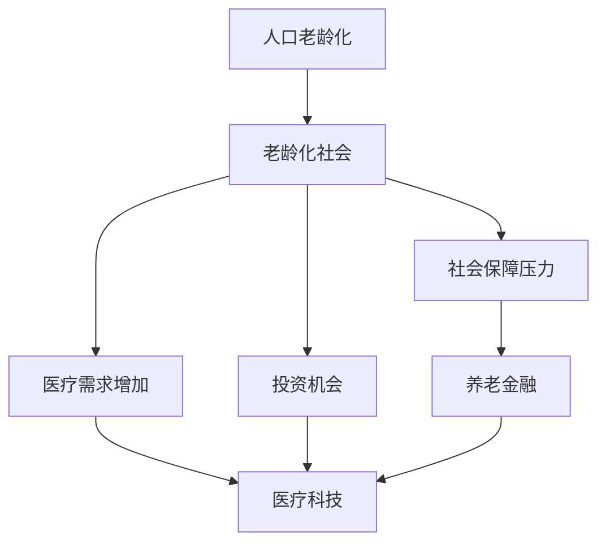

                 


```markdown
# 巴菲特-芒格的人口老龄化投资：社会变迁中的机遇

> 关键词：巴菲特，芒格，人口老龄化，投资策略，社会变迁，长期投资

> 摘要：人口老龄化是当今社会面临的重大挑战，也是投资领域的重要机遇。本文深入分析了巴菲特和芒格在人口老龄化背景下的投资策略，探讨了医疗健康、养老金融等领域的投资机会，并结合实际案例，提供了风险管理与投资组合构建的建议。文章从理论到实践，全面解析了如何在社会变迁中抓住投资机遇。

---

# 第一部分: 人口老龄化与投资的背景分析

## 第1章: 人口老龄化的问题背景

### 1.1 人口老龄化的基本概念

#### 1.1.1 人口老龄化定义与特征
- **定义**: 人口老龄化是指65岁及以上人口占总人口比例增加的趋势。
- **特征**: 老龄人口比例高、劳动年龄人口减少、家庭结构变化。

#### 1.1.2 人口老龄化对社会经济的影响
- **经济影响**: 劳动力减少、社会保障压力增加、消费结构变化。
- **社会影响**: 医疗需求增加、养老服务体系压力加大、家庭结构变化。

#### 1.1.3 投资视角下的老龄化问题
- **投资机会**: 医疗健康、养老服务、科技养老等领域。
- **投资挑战**: 传统行业衰退、劳动力成本上升。



---

## 第2章: 巴菲特与芒格的投资理念

### 2.1 巴菲特的价值投资理论

#### 2.1.1 价值投资的核心理念
- **核心理念**: 以低于内在价值的价格购买优质资产。
- **关键原则**: 长期投资、安全边际、集中投资。

#### 2.1.2 巴菲特的投资策略
- **策略一**: 投资于具有强大竞争优势的企业。
- **策略二**: 优先选择具有持续盈利能力的企业。
- **策略三**: 保持投资组合的分散化。

#### 2.1.3 芒格的多元思维模型
- **模型一**: 经济学思维，理解市场机制。
- **模型二**: 心理学思维，洞察人性弱点。
- **模型三**: 生物学思维，理解生态系统的平衡。

---

## 第3章: 老龄化社会的投资机会

### 3.1 医疗健康领域的机会

#### 3.1.1 医疗科技的发展
- **医疗科技**: 远程医疗、AI诊断、基因技术。
- **投资机会**: 医疗设备制造、医疗信息化服务。

#### 3.1.2 养老服务行业的投资潜力
- **养老服务**: 养老社区建设、居家养老服务。
- **投资模式**: 物业投资、服务连锁化。

### 3.2 养老金融与保险行业的机遇

#### 3.2.1 养老保险产品的创新
- **产品一**: 养老年金保险。
- **产品二**: 健康保险。

#### 3.2.2 保险行业的长期投资价值
- **保险业增长**: 保险需求增加。
- **投资收益**: 保险资金的长期收益稳定。

---

## 第4章: 老龄化背景下的投资策略

### 4.1 股票投资策略

#### 4.1.1 高质量企业的选择标准
- **标准一**: 高ROE（净资产收益率）。
- **标准二**: 强大的竞争优势。
- **标准三**: 可持续的盈利能力。

#### 4.1.2 股票估值方法
- **方法一**: 市盈率（P/E）。
- **方法二**: 市净率（P/B）。
- **方法三**: 现金流折现法。

#### 4.1.3 耐久型企业的投资价值
- **企业类型**: 快速消费品、公用事业。
- **投资逻辑**: 长期稳定的收益。

### 4.2 债券与固定收益投资

#### 4.2.1 债券投资的风险与收益
- **收益**: 利息收入。
- **风险**: 利率风险、信用风险。

#### 4.2.2 固定收益产品的选择策略
- **策略一**: 选择AAA级债券。
- **策略二**: 分散投资不同期限的债券。

#### 4.2.3 利率变化对债券投资的影响
- **影响**: 利率上升导致债券价格下跌。
- **应对策略**: 投资短期债券或浮动利率债券。

---

## 第5章: 投资组合的构建与风险管理

### 5.1 投资组合的构建原则

#### 5.1.1 资产配置的重要性
- **配置比例**: 股票、债券、现金的合理分配。
- **调整策略**: 定期再平衡。

#### 5.1.2 不同资产类别的权重分配
- **股票**: 60%。
- **债券**: 30%。
- **现金**: 10%。

#### 5.1.3 投资组合的再平衡策略
- **再平衡频率**: 每季度或每年一次。
- **调整方法**: 根据市场变化调整各资产比例。

### 5.2 风险管理与控制

#### 5.2.1 投资风险的分类
- **系统性风险**: 市场风险、利率风险。
- **非系统性风险**: 企业特有风险。

#### 5.2.2 风险控制的具体措施
- **措施一**: 分散投资。
- **措施二**: 使用衍生工具对冲风险。
- **措施三**: 建立止损机制。

#### 5.2.3 保险在风险管理中的作用
- **保险类型**: 责任保险、财产保险。
- **保险策略**: 通过保险转移部分风险。

---

## 第6章: 实际案例分析

### 6.1 巴菲特的经典投资案例

#### 6.1.1 可口可乐的投资案例
- **投资逻辑**: 可口可乐具有强大的品牌和分销网络。
- **投资收益**: 长期股价增长和股息收入。

#### 6.1.2 富国银行的投资策略
- **投资逻辑**: 银行业具有稳定的收益。
- **策略调整**: 在老龄化背景下，关注银行的资产质量和风险管理能力。

#### 6.1.3 老龄化背景下巴菲特的选股标准
- **标准一**: 具有防御性的行业地位。
- **标准二**: 能够持续提供稳定收益。

### 6.2 芒格的多元思维模型应用

#### 6.2.1 芒格的选股标准
- **标准一**: 公司治理良好。
- **标准二**: 管理层具备优秀的能力。

#### 6.2.2 芒格在投资中的风险管理策略
- **策略一**: 避免过于集中投资。
- **策略二**: 通过多元思维模型评估风险。

#### 6.2.3 芒格对长期投资的思考
- **思考一**: 长期投资需要耐心和信心。
- **思考二**: 长期投资的成功在于选择优质的资产。

---

## 第7章: 长期投资与社会变迁

### 7.1 长期投资的哲学

#### 7.1.1 长期投资与社会发展的关系
- **关系一**: 长期投资推动经济发展。
- **关系二**: 社会发展影响投资环境。

#### 7.1.2 投资者心态与长期投资的成功
- **心态**: 耐心、理性、独立思考。
- **成功因素**: 正确的选股标准、长期的持有策略。

#### 7.1.3 社会变迁对投资策略的影响
- **影响一**: 经济结构调整。
- **影响二**: 科技进步改变行业格局。

### 7.2 老龄化社会的投资展望

#### 7.2.1 未来老龄化社会的经济趋势
- **趋势一**: 医疗健康支出增加。
- **趋势二**: 养老服务市场规模扩大。

#### 7.2.2 新兴行业的投资机会
- **机会一**: 数字医疗。
- **机会二**: 老年教育。

#### 7.2.3 长期投资在应对老龄化中的作用
- **作用一**: 提供稳定的资金来源。
- **作用二**: 促进相关产业的发展。

---

## 第8章: 总结与展望

### 8.1 本书的核心观点回顾

#### 8.1.1 人口老龄化对投资的影响
- 人口老龄化带来了医疗健康、养老服务等领域的投资机会。

#### 8.1.2 巴菲特与芒格的投资策略
- 巴菲特的价值投资和芒格的多元思维模型为应对老龄化提供了有效的投资策略。

#### 8.1.3 老龄化社会的投资展望
- 长期投资和多元化策略将在老龄化社会中发挥重要作用。

### 8.2 对未来投资的展望

#### 8.2.1 全球老龄化趋势下的投资机会
- **机会**: 医疗科技、智能养老服务。
- **挑战**: 经济不确定性增加。

#### 8.2.2 投资者如何应对社会变迁
- **策略**: 持续学习、灵活调整投资策略。
- **心态**: 保持耐心和信心。

---

# 作者：AI天才研究院 & 禅与计算机程序设计艺术
```

