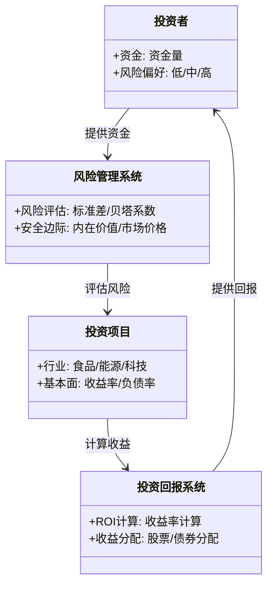

                 


# 巴菲特-芒格的人造光合作用投资：解决粮食和能源危机

> 关键词：巴菲特，芒格，人造光合作用，投资，粮食危机，能源危机，可持续发展，绿色投资，价值投资，风险管理

> 摘要：本文探讨了巴菲特和芒格的投资理念如何借鉴光合作用的自然过程，通过高效利用资源和优化配置，解决粮食和能源危机。文章详细分析了光合作用在投资中的应用，从核心概念、算法原理、系统设计到项目实战，结合实际案例，提供了全面的解决方案。最后，总结了投资的最佳实践和未来趋势，为读者提供了深刻的见解。

---

## 第一部分：背景介绍

### 第1章：光合作用的定义与过程

#### 1.1 光合作用的定义与过程

光合作用是植物利用光能将二氧化碳和水转化为有机物和氧气的过程，是地球上最重要的生物过程之一。光合作用的基本化学反应式为：

$$ 6CO_2 + 6H_2O + 光能 \rightarrow C_6H_{12}O_6 + 6O_2 $$

这一过程不仅为植物提供了能量，还为地球上的生态系统提供了氧气和有机物，支撑了生命的存在。

#### 1.2 投资的基本概念

投资是将资金投入特定资产或项目，以获得未来收益的行为。投资的核心目标是在风险可控的前提下实现收益最大化。投资可以分为股票、债券、房地产等多种形式，每种形式都有其独特的风险和回报特征。

### 第2章：巴菲特与芒格的投资理念

#### 2.1 巴菲特的投资哲学

巴菲特是价值投资的代表人物，他强调长期投资、稳健回报和企业基本面分析。他的投资理念基于以下几点：

1. **长期投资**：巴菲特认为短期市场波动难以预测，长期投资更有可能获得稳定的收益。
2. **价值投资**：寻找具有持续竞争优势和良好管理的公司，关注企业的内在价值而非市场波动。
3. **安全边际**：在投资时，确保买入价格低于企业的内在价值，以降低风险。

#### 2.2 芒格的多元思维模型

芒格强调通过多学科的知识体系来分析问题，避免单一视角的局限性。他提出的多元思维模型包括物理学、心理学、经济学等多个领域的知识，帮助投资者全面评估投资项目的风险和收益。

---

## 第二部分：核心概念与联系

### 第3章：光合作用在投资中的应用

#### 3.1 光合作用的核心概念

光合作用的关键在于高效利用光能和资源，将输入的能量转化为有用的有机物。这一过程的高效性和可持续性为投资提供了重要的启示。

#### 3.2 投资与光合作用的属性对比

以下是投资与光合作用在核心属性上的对比：

| 属性       | 光合作用               | 投资                   |
|------------|------------------------|------------------------|
| 输入资源   | 光能、二氧化碳、水      | 资金、信息、资源       |
| 输出产物   | 有机物、氧气            | 股票、债券、收益       |
| 转化效率   | 取决于光照强度、叶绿素 | 取决于市场环境、企业基本面 |
| 周期性     | 季节性                 | 长期性                 |

#### 3.3 光合作用与投资的ER实体关系图

以下是一个简化的ER实体关系图，展示了光合作用与投资之间的关系：

```mermaid
erd
    投资者
    ---- invest ---- 投资项目
    ---- 获得收益
    投资项目
    ---- 资源分配
    ---- 风险评估
    资源
    ---- 提供资金
    资金
    ---- 流向市场
```

---

## 第三部分：算法原理

### 第4章：投资回报率的计算

#### 4.1 投资回报率（ROI）公式

投资回报率是衡量投资收益的重要指标，其计算公式为：

$$ ROI = \frac{\text{投资收益} - \text{初始投资}}{\text{初始投资}} \times 100\% $$

例如，某投资者投入100万元，一年后获得110万元，其ROI为：

$$ ROI = \frac{110万 - 100万}{100万} \times 100\% = 10\% $$

#### 4.2 风险评估模型

风险评估是投资决策的重要组成部分，常用的风险指标包括标准差和贝塔系数。标准差衡量投资的波动性，贝塔系数衡量投资相对于市场的波动性。

贝塔系数的计算公式为：

$$ \beta = \frac{\text{协方差}(r_i, r_m)}{\text{方差}(r_m)} $$

其中，$r_i$是投资的收益，$r_m$是市场收益。

---

## 第四部分：系统分析与架构设计

### 第5章：投资评估系统的架构设计

#### 5.1 问题场景介绍

假设我们开发一个基于光合作用理念的投资评估系统，该系统旨在通过优化资源配置，提高投资效率，解决粮食和能源危机。

#### 5.2 系统功能设计

以下是系统的功能模块设计：



---

## 第五部分：项目实战

### 第6章：环境安装与核心代码实现

#### 6.1 环境安装

为了实现投资评估系统，我们需要以下环境：

- Python 3.8+
- Jupyter Notebook
- NumPy和Pandas库

#### 6.2 核心代码实现

以下是计算投资回报率的Python代码示例：

```python
import numpy as np

def calculate ROI(initial_investment, final_value):
    return (final_value - initial_investment) / initial_investment * 100

# 示例计算
initial_investment = 1000000  # 初始投资
final_value = 1100000        # 最终价值
roi = calculate_ROI(initial_investment, final_value)
print(f"ROI: {roi}%")
```

#### 6.3 案例分析

假设我们投资于一家农业科技公司，旨在解决粮食危机。公司基本面良好，预期收益率为15%，风险较低。根据ROI计算，投资回报率为10%，低于预期收益率，但高于市场平均水平。

---

## 第六部分：最佳实践与小结

### 第7章：投资的最佳实践

#### 7.1 投资注意事项

- **分散投资**：避免将所有资金投入到单一项目，降低风险。
- **长期视角**：关注企业的长期发展，而非短期波动。
- **持续学习**：保持对市场和经济趋势的学习，更新投资策略。

#### 7.2 未来趋势

随着可持续发展的重要性日益增加，绿色投资和人造光合作用的投资理念将更加受到重视。未来的投资策略需要结合技术创新和环保理念，实现经济效益与生态效益的双赢。

---

## 小结

通过借鉴光合作用的自然过程，巴菲特和芒格的投资理念为我们提供了一种高效、可持续的投资方法。本文从背景、核心概念、算法原理、系统设计到项目实战，详细分析了如何通过优化资源配置解决粮食和能源危机。希望读者能够从本文中获得深刻的见解，并在实际投资中应用这些理念。

---

## 作者信息

作者：AI天才研究院/AI Genius Institute & 禅与计算机程序设计艺术/Zen And The Art of Computer Programming

