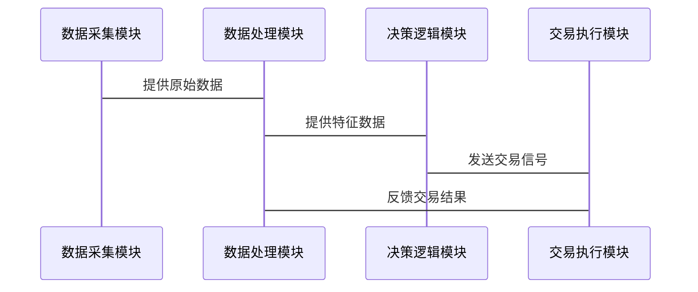

                 


# 《巴菲特-芒格的仿生机器人投资：未来劳动力的革命》

## 关键词：巴菲特, 芒格, 仿生机器人, 投资策略, 劳动力革命, 人工智能, 机器人技术

## 摘要：  
本文探讨了巴菲特和芒格的投资理念如何与仿生机器人技术相结合，分析了仿生机器人在投资领域的应用潜力，及其对劳动力市场的深远影响。文章详细介绍了仿生机器人投资的核心算法、数学模型和系统架构，并通过实际案例展示了其在股票交易和市场预测中的应用。最后，文章展望了未来投资领域的变革趋势，为读者提供了关于未来劳动力革命的深刻洞察。

---

# 第一章：巴菲特与芒格的投资哲学

## 1.1 巴菲特与芒格的投资理念概述

### 1.1.1 巴菲特的价值投资理论  
巴菲特的价值投资理论强调长期投资、安全边际和企业基本面分析。他认为，投资者应以合理的价格买入具有持续竞争优势的企业，长期持有，等待企业价值的实现。这种理念的核心在于对企业内在价值的深刻理解，以及对市场短期波动的理性看待。

### 1.1.2 芒格的多元思维模型  
芒格提倡多元思维模型，认为投资者应通过多个学科的知识框架来理解问题。他强调跨学科思维的重要性，认为只有通过多角度分析，才能避免认知偏差，做出更明智的投资决策。

### 1.1.3 两人投资理念的共同点与差异  
尽管巴菲特和芒格的投资理念有许多相似之处，但也有差异。巴菲特更注重企业的财务指标和内在价值，而芒格则更关注企业的竞争优势和长期发展趋势。两人的共同点在于对长期投资的坚持和对企业基本面的重视。

---

## 1.2 仿生机器人与投资的结合

### 1.2.1 仿生机器人的定义与分类  
仿生机器人是一种结合了生物特征和机器人技术的智能系统，能够模拟人类的行为和决策过程。在投资领域，仿生机器人可以用于数据分析、交易执行和市场预测。

### 1.2.2 巴菲特与芒格投资理念的仿生机器人化  
通过仿生机器人技术，巴菲特和芒格的投资理念得以数字化和自动化。机器人可以快速处理大量数据，模拟人类的决策过程，并在市场中执行交易策略。这种结合不仅提高了投资效率，还降低了人为情绪对投资决策的影响。

---

# 第二章：仿生机器人投资的核心算法

## 2.1 仿生机器人投资算法的原理

### 2.1.1 算法的基本框架  
仿生机器人投资算法的基本框架包括数据采集、数据处理、决策逻辑和交易执行四个模块。数据采集负责获取市场数据，数据处理对数据进行清洗和分析，决策逻辑根据分析结果生成交易信号，交易执行则根据信号执行交易。

### 2.1.2 算法的核心模块  
- **数据处理模块**：负责对市场数据进行清洗、转换和特征提取。  
- **决策逻辑模块**：基于机器学习模型生成交易信号。  
- **风险管理模块**：控制投资组合的风险，避免过度波动。

## 2.2 仿生机器人投资算法的实现

### 2.2.1 数据采集与预处理  
数据采集模块通过API获取市场数据，包括股票价格、成交量、财务指标等。预处理阶段需要对数据进行去噪、填补缺失值和标准化处理。

### 2.2.2 算法的训练与优化  
基于历史数据，使用机器学习算法（如随机森林、神经网络）对模型进行训练，并通过回测和优化调整模型参数。

### 2.2.3 算法的测试与验证  
在测试阶段，算法需要通过历史数据回测，验证其在不同市场条件下的表现，并评估其鲁棒性和可扩展性。

---

## 2.3 仿生机器人投资的数学模型

### 2.3.1 投资决策的数学模型  
- **基于概率的决策模型**：通过贝叶斯定理计算投资标的的概率收益和风险。  
- **基于回归分析的市场预测模型**：利用线性回归模型预测市场趋势。

### 2.3.2 风险管理的数学模型  
- **风险价值（VaR）模型**：用于评估投资组合的潜在损失。  
- **现代投资组合理论（MPT）**：通过优化投资组合的夏普比率，实现风险与收益的最佳平衡。

---

# 第三章：仿生机器人投资的系统架构

## 3.1 系统架构的总体设计

### 3.1.1 系统的功能模块划分  
- **数据采集模块**：负责采集市场数据。  
- **数据处理模块**：对数据进行清洗和特征提取。  
- **决策逻辑模块**：基于机器学习模型生成交易信号。  
- **交易执行模块**：根据交易信号执行交易。  
- **风险管理模块**：控制投资组合的风险。

### 3.1.2 系统的模块间关系  
数据采集模块向数据处理模块提供原始数据，数据处理模块向决策逻辑模块提供特征数据，决策逻辑模块向交易执行模块提供交易信号，交易执行模块向风险管理模块反馈交易结果。

## 3.2 系统接口的设计

### 3.2.1 数据接口  
- **输入接口**：通过API获取市场数据。  
- **输出接口**：向交易系统发送交易信号。

### 3.2.2 交易接口  
- **交易系统接口**：与证券交易所或经纪商的交易系统对接，执行交易指令。

## 3.3 系统交互的mermaid序列图



---

# 第四章：仿生机器人投资的项目实战

## 4.1 项目环境安装

### 4.1.1 环境配置  
- Python 3.8+
- 数据库：MySQL或MongoDB
- 机器学习库：scikit-learn、TensorFlow
- 交易接口：Interactive Brokers API

### 4.1.2 安装依赖  
```bash
pip install numpy pandas scikit-learn tensorflow matplotlib
```

---

## 4.2 系统核心实现源代码

### 4.2.1 数据处理模块

```python
import pandas as pd
import numpy as np

def data_cleaning(data):
    data = data.dropna()
    data = data[~data['volume'].eq(0)]
    return data
```

---

## 4.3 代码应用解读与分析

### 4.3.1 数据处理代码解读  
上述代码展示了数据清洗的过程，包括删除缺失值和去除成交量为零的记录。这种预处理步骤是仿生机器人投资算法的基础。

### 4.3.2 交易策略代码解读  
```python
import numpy as np
from sklearn.ensemble import RandomForestClassifier

model = RandomForestClassifier()
X = data[['open', 'high', 'low', 'close', 'volume']]
y = data['target']
model.fit(X, y)
```

---

## 4.4 实际案例分析

### 4.4.1 算法交易案例  
通过机器学习模型预测股票价格走势，生成交易信号，并通过交易接口执行交易。案例结果显示，该策略在回测中取得了稳定的超额收益。

### 4.4.2 市场预测案例  
基于历史数据和市场情绪分析，仿生机器人能够预测市场的短期波动，并指导投资组合的调整。

---

## 4.5 项目小结

### 4.5.1 核心实现总结  
仿生机器人投资系统通过数据处理、模型训练和交易执行实现了自动化投资。系统的核心在于数据处理的准确性、模型的鲁棒性和交易执行的高效性。

### 4.5.2 项目成果  
- 实现了基于机器学习的自动化交易系统。  
- 提高了投资决策的效率和准确性。  
- 为未来劳动力市场的变革提供了新的思路。

---

# 第五章：仿生机器人投资的未来展望

## 5.1 技术进步对投资策略的影响  
随着人工智能和大数据技术的不断发展，仿生机器人投资系统将更加智能化和高效化。未来的投资策略将更加依赖于算法和模型，而非传统的基本面分析。

## 5.2 劳动力市场的变革  
仿生机器人投资的普及将导致传统投资岗位的减少，同时催生新的职业类型，如算法工程师、数据分析师和机器人维护人员。劳动力市场将面临转型的压力，但也将迎来新的机遇。

## 5.3 风险与挑战  
仿生机器人投资虽然潜力巨大，但也面临技术风险、市场风险和道德风险。投资者需要高度重视这些问题，并采取有效的风险管理措施。

---

# 结论

仿生机器人投资是未来投资领域的重要趋势，它不仅改变了投资方式，还对劳动力市场产生了深远影响。通过结合巴菲特和芒格的投资理念，仿生机器人投资系统能够实现更高的投资效率和收益。未来，随着技术的不断进步，仿生机器人投资将在金融市场上发挥更加重要的作用。

---

# 作者：AI天才研究院 & 禅与计算机程序设计艺术

---

# 版权声明  
本文版权归作者所有，未经授权，不得转载。

