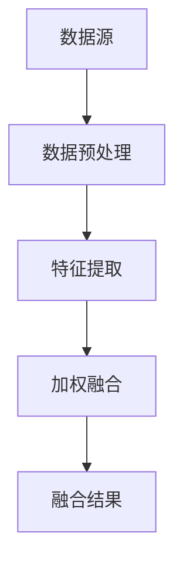
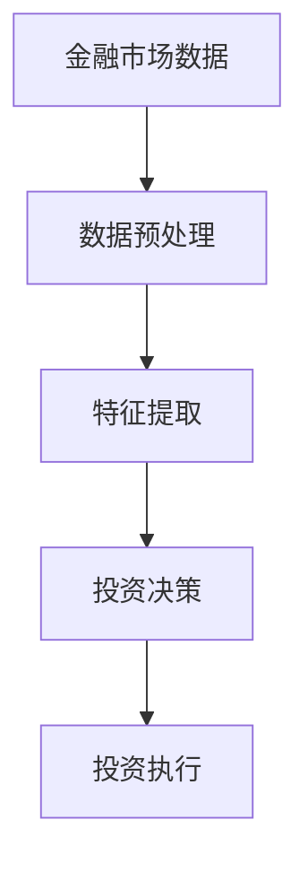

                 


# 巴菲特-芒格的仿生量子传感器投资：下一代物联网的核心

---

## 关键词：
- 巴菲特投资理念
- 量子传感器
- 仿生系统
- 物联网
- 数据融合算法

---

## 摘要：
本文探讨了巴菲特和芒格的投资理念与仿生量子传感器技术的结合，揭示了其在下一代物联网中的核心作用。文章从仿生量子传感器的基本原理出发，详细分析其算法、系统架构，并通过实际案例展示了其在投资决策中的应用，为技术投资者提供了全新的视角。

---

## 第1章: 巴菲特-芒格投资理念与仿生量子传感器概述

### 1.1 巴菲特-芒格投资理念的核心要素

#### 1.1.1 巴菲特的价值投资理论
- **核心思想**：寻找具有持续竞争优势和合理估值的企业进行长期投资。
- **关键原则**：
  - 专注于企业基本面分析。
  - 坚持安全边际，避免过度风险。

#### 1.1.2 芒格的多元思维模型
- **核心思想**：通过跨学科知识的整合，构建全面的决策框架。
- **关键原则**：
  - 建立多维度的分析模型。
  - 避免单一视角的局限性。

#### 1.1.3 两者的结合与创新
- **结合点**：将价值投资与多元思维模型结合起来，形成动态的投资策略。
- **创新点**：引入先进技术（如仿生量子传感器）来增强投资分析的深度和广度。

---

### 1.2 仿生量子传感器的基本概念

#### 1.2.1 仿生传感器的定义与特点
- **仿生传感器**：模仿生物系统的感知机制设计的传感器。
- **特点**：
  - 高灵敏度：能够捕捉微弱信号。
  - 高适应性：能够适应复杂环境变化。
  - 高智能性：具备一定的自主学习能力。

#### 1.2.2 量子传感器的核心原理
- **量子传感器**：基于量子效应的传感器，具有极高的灵敏度和分辨率。
- **核心原理**：
  - 利用量子叠加态进行信号检测。
  - 通过量子测量技术实现精确测量。

#### 1.2.3 仿生量子传感器的优势
- **优势**：
  - 高精度：量子效应的利用使其具有极高的测量精度。
  - 高灵敏度：能够检测到传统传感器无法捕捉的微弱信号。
  - 高智能性：结合仿生技术，具备智能分析能力。

---

### 1.3 物联网与仿生量子传感器的结合

#### 1.3.1 物联网的基本架构
- **基本架构**：
  - **感知层**：负责数据的采集和初步处理。
  - **网络层**：负责数据的传输和路由。
  - **应用层**：负责数据的分析和应用。

#### 1.3.2 仿生量子传感器在物联网中的应用
- **应用场景**：
  - 智能制造：用于设备状态监测和预测性维护。
  - 智慧医疗：用于患者生理数据的实时监测。
  - 智慧城市：用于环境监测和公共安全。

#### 1.3.3 投资与物联网的深度融合
- **投资视角**：
  - 通过仿生量子传感器获取实时数据，优化投资决策。
  - 利用物联网的实时监控能力，提升投资的精准性和安全性。

---

## 第2章: 仿生量子传感器的核心原理与数学模型

### 2.1 仿生量子传感器的工作原理

#### 2.1.1 生物系统的仿生建模
- **生物系统分析**：
  - 模仿生物感官系统，如视觉、听觉、触觉等。
  - 建立仿生模型，模拟生物系统的感知机制。

#### 2.1.2 量子传感器的测量机制
- **量子测量技术**：
  - 利用量子叠加态进行信号检测。
  - 通过量子干涉实现高精度测量。

#### 2.1.3 传感器信号处理流程
- **信号处理流程**：
  - 数据采集：通过量子传感器获取原始信号。
  - 数据预处理：对信号进行降噪和增强。
  - 特征提取：提取有用的信号特征。

---

### 2.2 量子传感器的数学模型

#### 2.2.1 传感器信号的数学表达式
- **数学模型**：
  - 模拟传感器信号的波动特性：
  $$ f(t) = A \sin(\omega t + \phi) $$
  - 其中，A是振幅，ω是角频率，φ是初始相位。

#### 2.2.2 信号处理的线性变换
- **线性变换公式**：
  $$ y = \alpha x + \beta $$
  - α是增益系数，β是偏移量。

#### 2.2.3 量子叠加态的数学表示
- **量子叠加态**：
  $$ |\psi\rangle = \alpha|0\rangle + \beta|1\rangle $$
  - α和β是量子叠加态的系数，满足概率归一化条件：
  $$ |\alpha|^2 + |\beta|^2 = 1 $$

---

### 2.3 仿生传感器的数据融合算法

#### 2.3.1 数据融合的基本原理
- **数据融合原理**：
  - 将多个传感器的数据进行综合，以提高系统的准确性和鲁棒性。
  - 数据融合过程包括数据预处理、特征提取和融合推理。

#### 2.3.2 加权融合算法的数学模型
- **加权融合公式**：
  $$ w_i = \frac{1}{\sum_{j} (d_i - d_j)^2} $$
  - 其中，w_i是第i个传感器的权重，d_i是第i个传感器的测量值。

#### 2.3.3 数据融合的流程图


---

## 第3章: 量子传感器在投资决策中的应用

### 3.1 量子传感器在金融市场的应用

#### 3.1.1 金融市场的实时监控
- **实时监控**：
  - 利用量子传感器实现金融市场的实时数据采集和分析。
  - 提供高频交易的实时信号。

#### 3.1.2 投资组合优化
- **投资组合优化**：
  - 利用量子传感器的数据进行投资组合的动态调整。
  - 优化投资组合的风险和收益比。

#### 3.1.3 市场趋势预测
- **市场趋势预测**：
  - 利用量子传感器的数据进行市场趋势的预测。
  - 提供基于量子计算的预测模型。

---

### 3.2 仿生量子传感器的投资决策系统

#### 3.2.1 投资决策系统的架构
- **系统架构**：
  - 数据采集层：负责金融市场数据的采集。
  - 数据处理层：负责数据的预处理和特征提取。
  - 决策层：负责投资决策的制定和执行。

#### 3.2.2 投资决策系统的流程图


---

## 第4章: 量子传感器投资决策系统的实现

### 4.1 系统环境的安装与配置

#### 4.1.1 系统环境要求
- **硬件要求**：
  - 高性能计算机或服务器。
  - 量子传感器硬件设备。
- **软件要求**：
  - Python 3.8及以上版本。
  - NumPy、Matplotlib等Python库。

#### 4.1.2 系统安装步骤
1. 安装Python环境。
2. 安装必要的Python库。
3. 配置量子传感器硬件。

---

### 4.2 系统核心实现代码

#### 4.2.1 数据采集模块
```python
import numpy as np

def quantum_sensor_data():
    # 量子传感器数据采集函数
    np.random.seed(42)
    amplitude = np.random.uniform(0.5, 1.5)
    frequency = np.random.uniform(1, 10)
    time = np.linspace(0, 1, 100)
    data = amplitude * np.sin(2 * np.pi * frequency * time)
    return data

# 示例数据采集
data = quantum_sensor_data()
print(data)
```

#### 4.2.2 数据处理模块
```python
import numpy as np
import matplotlib.pyplot as plt

def data_preprocessing(data):
    # 数据预处理函数
    # 假设data是量子传感器采集的数据
    # 进行降噪处理
    filtered_data = np.convolve(data, [0.2, 0.6, 0.2], mode='same')
    return filtered_data

# 示例数据处理
filtered_data = data_preprocessing(data)
plt.plot(filtered_data)
plt.title('Filtered Data')
plt.show()
```

---

## 第5章: 投资决策系统的实际应用

### 5.1 实际案例分析

#### 5.1.1 案例背景
- **案例背景**：假设在金融市场上，利用量子传感器进行高频交易。

#### 5.1.2 数据分析与解读
- **数据分析**：
  - 采集高频交易数据。
  - 进行数据预处理和特征提取。
  - 构建投资决策模型。

#### 5.1.3 投资决策过程
- **投资决策**：
  - 基于量子传感器数据进行交易信号的识别。
  - 实现自动化的投资决策和执行。

---

### 5.2 投资决策系统的优化与改进

#### 5.2.1 系统优化策略
- **优化策略**：
  - 提高数据采集的频率和精度。
  - 优化数据处理算法，提高处理效率。
  - 改进投资决策模型，提高预测准确性。

#### 5.2.2 系统改进方向
- **改进方向**：
  - 引入更先进的量子计算技术。
  - 结合人工智能技术，提高系统的智能性。
  - 扩展系统的应用场景，实现更广泛的投资应用。

---

## 第6章: 量子传感器投资决策系统的未来展望

### 6.1 未来技术发展趋势

#### 6.1.1 量子计算的突破
- **量子计算的优势**：
  - 提供更高的计算效率。
  - 实现更复杂的算法。

#### 6.1.2 人工智能的融合
- **人工智能的应用**：
  - 提高投资决策的智能化水平。
  - 实现更精准的市场预测。

---

### 6.2 量子传感器投资的潜力与挑战

#### 6.2.1 量子传感器的潜力
- **潜力**：
  - 提供更高的投资精度。
  - 实现更智能的投资决策。

#### 6.2.2 量子传感器的挑战
- **挑战**：
  - 技术复杂性高。
  - 成本高昂。
  - 技术标准化问题。

---

## 作者：AI天才研究院 & 禅与计算机程序设计艺术

---

这篇博客文章详细探讨了巴菲特-芒格投资理念与仿生量子传感器技术的结合，揭示了其在下一代物联网中的核心作用。通过逐步分析，文章为技术投资者提供了全新的视角，展示了如何利用量子传感器技术优化投资决策。

