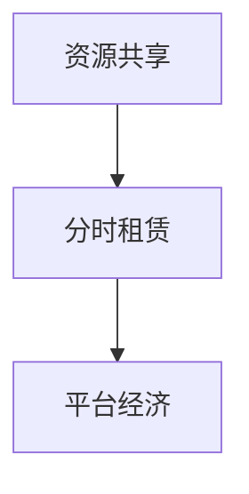
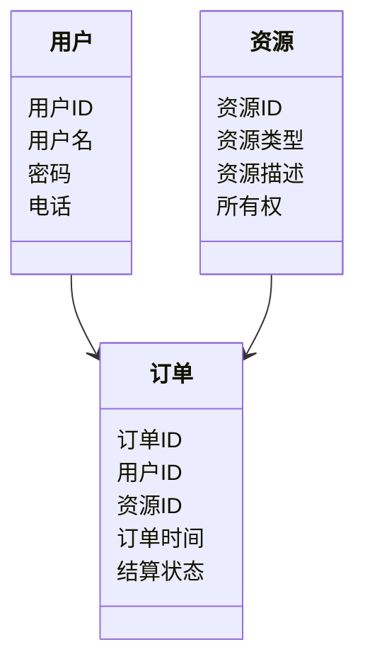

                 


# 巴菲特-芒格的共享经济投资：新商业模式的潜力

## 关键词：共享经济，巴菲特，芒格，投资策略，商业模式，数学模型，系统架构

## 摘要：  
本文探讨了巴菲特和芒格在共享经济领域的投资策略及其对新商业模式的潜力。通过分析共享经济的定义、核心特征，巴菲特的价值投资理论，芒格的多元思维模型，以及共享经济的商业模式，本文揭示了如何将传统投资理念应用于新兴经济模式。结合数学模型和系统架构，本文进一步分析了共享经济的投资机会和风险，最后通过案例实战总结了投资策略和未来趋势。

---

## 第一部分: 共享经济的起源与发展

### 第1章: 共享经济的定义与背景

#### 1.1 共享经济的起源  
共享经济（Sharing Economy）是一种基于资源共享的新经济模式，通过数字技术将闲置资源与需求方匹配，实现资源的高效利用。其起源可以追溯到2008年金融危机后，全球经济复苏过程中人们对资源高效利用的需求增加。

#### 1.2 共享经济的核心特征  
共享经济的核心特征包括去中心化、按需分配、高效利用和数字化支持。以下是其核心特征的对比：

| 特征       | 描述                                                                 |
|------------|----------------------------------------------------------------------|
| 去中心化    | 通过平台实现资源供需匹配，减少中间环节                                   |
| 按需分配    | 用户按需使用资源，避免资源浪费                                             |
| 高效利用    | 通过共享最大化资源利用率                                                 |
| 数字化支持  | 依赖互联网技术实现资源匹配和支付结算                                       |

#### 1.3 共享经济与传统经济的对比  
以下是共享经济与传统经济的对比表格：

| 维度       | 共享经济                          | 传统经济                          |
|------------|-----------------------------------|------------------------------------|
| 资源分配    | 按需分配                          | 固定分配                          |
| 中介角色    | 平台作为中介                      | 中介角色较多                      |
| 成本效率    | 成本低，效率高                    | 成本高，效率较低                  |
| 信任机制    | 依赖平台信用评分                  | 依赖长期信任关系                  |

---

### 第2章: 巴菲特与芒格的投资理念

#### 2.1 巴菲特的价值投资理论  
巴菲特的价值投资理论强调长期持有优质资产，关注企业的基本面，如盈利能力、财务状况和行业地位。以下是巴菲特投资理念的核心要点：

1. **长期投资**：巴菲特定语长期持有优质资产，避免短期波动。
2. **企业基本面**：关注企业的盈利能力、财务健康和行业地位。
3. **安全边际**：以低于内在价值的价格买入资产，确保投资的安全性。

#### 2.2 芒格的多元思维模型  
芒格的多元思维模型强调从多个角度分析问题，避免单一思维的局限性。以下是其核心要点：

1. **多学科思维**：将不同领域的知识结合起来，形成全面的分析框架。
2. **逆向思考**：从问题的反面出发，寻找解决方案。
3. **决策框架**：通过建立决策框架，降低决策错误的可能性。

---

### 第3章: 巴菲特与芒格的共享经济投资策略

#### 3.1 共享经济的投资机会  
共享经济的市场规模庞大，涵盖交通、住宿、办公空间等多个领域。以下是共享经济的主要模式对比：

| 模式       | 描述                                                                 |
|------------|----------------------------------------------------------------------|
| 资源共享    | 用户共享闲置资源                                                     |
| 分时租赁    | 按需付费使用资源                                                     |
| 平台经济    | 通过平台实现供需匹配                                               |

#### 3.2 巴菲特与芒格的投资逻辑  
巴菲特和芒格的投资逻辑在共享经济领域中体现为以下几点：

1. **长期投资**：关注共享经济平台的长期盈利能力。
2. **商业模式**：评估平台的商业模式是否可持续。
3. **竞争优势**：分析平台的竞争优势，如技术壁垒、用户黏性等。

---

### 第4章: 共享经济的商业模式分析

#### 4.1 共享经济的主要模式  
共享经济的主要模式包括资源共享、分时租赁和平台经济。以下是其对比图：



#### 4.2 共享经济的盈利模式  
共享经济的盈利模式主要包括平台佣金和广告收入。以下是其数学模型：

$$
\text{总收入} = \text{平台佣金} + \text{广告收入}
$$

其中，平台佣金的计算公式为：

$$
\text{平台佣金} = \text{订单量} \times \text{佣金比例}
$$

---

## 第二部分: 系统分析与架构设计

### 第5章: 系统分析与架构设计

#### 5.1 问题场景介绍  
共享经济平台需要解决资源匹配、支付结算和用户信任等问题。以下是系统的功能模块：

1. 用户模块：用户注册、登录和信息发布。
2. 资源模块：资源信息发布和管理。
3. 订单模块：订单生成、处理和结算。

#### 5.2 系统功能设计  
以下是系统的领域模型图：



#### 5.3 系统架构设计  
以下是系统的架构图：


---

## 第三部分: 项目实战

### 第6章: 项目实战

#### 6.1 环境安装  
以下是项目实战的环境安装步骤：

1. 安装Python和相关库（如Flask、Django）。
2. 配置数据库（如MySQL）。
3. 配置API接口。

#### 6.2 核心实现  
以下是平台的核心实现代码示例：

```python
def calculate_profit(revenue, cost):
    return revenue - cost

revenue = 10000
cost = 8000
profit = calculate_profit(revenue, cost)
print(f"利润为：${profit}")
```

#### 6.3 实际案例分析  
以滴滴出行为例，分析其商业模式和巴菲特-芒格的投资策略。滴滴出行通过分时租赁模式，利用平台经济实现资源高效匹配，巴菲特和芒格可能关注其长期盈利能力、竞争优势和财务健康。

---

## 第四部分: 总结

### 第7章: 总结

#### 7.1 最佳实践 tips  
1. 关注共享经济平台的长期盈利能力。
2. 评估平台的商业模式和竞争优势。
3. 结合巴菲特和芒格的投资理念进行决策。

#### 7.2 项目小结  
本文通过分析共享经济的定义、巴菲特和芒格的投资理念、共享经济的商业模式、数学模型和系统架构，揭示了共享经济的投资潜力和未来趋势。

#### 7.3 注意事项  
1. 风险评估：关注共享经济平台的风险，如政策风险和市场竞争风险。
2. 投资策略：结合长期投资和多元思维模型进行决策。

#### 7.4 拓展阅读  
推荐阅读巴菲特和芒格的经典著作，深入理解价值投资理论和多元思维模型。

---

## 作者：AI天才研究院 & 禅与计算机程序设计艺术

