                 


# 巴菲特-芒格的医疗保健行业投资：长期增长潜力

> 关键词：巴菲特，芒格，医疗保健，投资策略，长期增长，风险管理

> 摘要：本文深入分析了巴菲特和芒格在医疗保健行业的投资策略，探讨了他们的投资哲学、逻辑、案例以及未来趋势，结合了技术分析和实际应用，为投资者提供了全面的参考。

---

# 第一部分: 巴菲特与芒格的投资理念与医疗保健行业

## 第1章: 巴菲特与芒格的投资理念概述

### 1.1 巴菲特与芒格的投资哲学

#### 1.1.1 巴菲特的价值投资理念
巴菲特的价值投资理念的核心在于寻找具有持久竞争优势的企业，即具备“护城河”的企业。他强调企业内在价值的重要性，主张以合理的价格买入优质资产，并长期持有。

**公式：**
$$ \text{内在价值} = \sum_{t=1}^{\infty} \frac{\text{现金流}}{(1+r)^t} $$

**图表：**
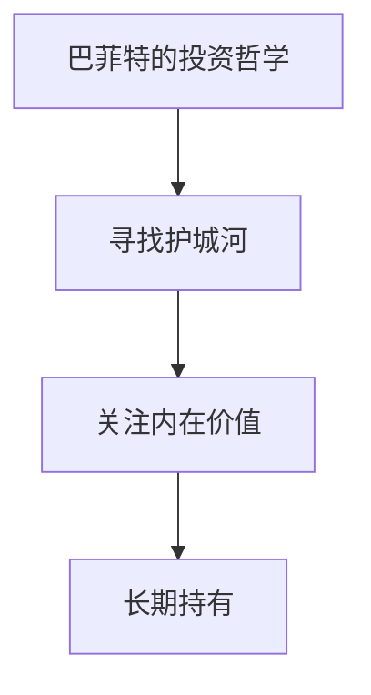

#### 1.1.2 芒格的多元思维模型
芒格的多元思维模型强调跨学科的思维方式，通过将各个领域的知识进行整合，形成对问题的全面理解。这种方法帮助他更好地识别投资机会和风险。

**图表：**
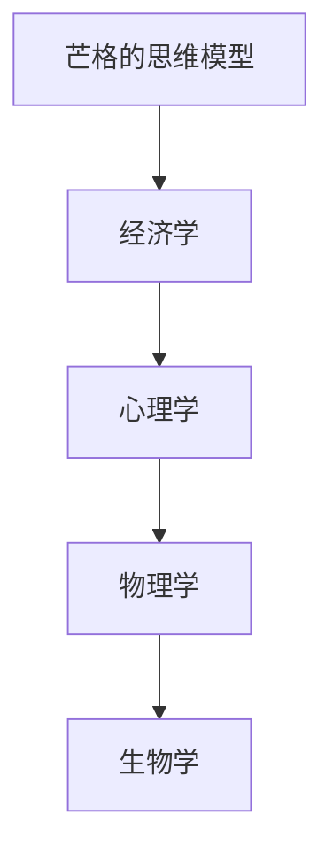

#### 1.1.3 两人投资理念的异同点
- **相同点**：都强调长期投资、价值发现和风险管理。
- **不同点**：巴菲特更注重财务指标，而芒格更注重跨学科的思维方式。

### 1.2 医疗保健行业的独特性

#### 1.2.1 医疗保健行业的基本特征
医疗保健行业具有需求刚性、政策敏感性强、技术进步快等特点。

**表格：医疗保健行业与传统制造业的对比**

| 特性                | 医疗保健行业          | 传统制造业         |
|---------------------|----------------------|-------------------|
| 需求弹性            | 刚性需求             | 弹性需求           |
| 技术更新周期        | 短                   | 长                 |
| 政策影响            | 高                   | 低                 |
| 进入壁垒            | 高                   | 中                 |

---

## 第2章: 巴菲特与芒格的医疗保健投资逻辑

### 2.1 医疗保健行业的长期增长潜力

#### 2.1.1 人口老龄化对医疗需求的影响
随着人口老龄化加剧，医疗需求将显著增加，尤其是高端医疗服务和慢性病管理。

**图表：人口老龄化与医疗需求的关系**
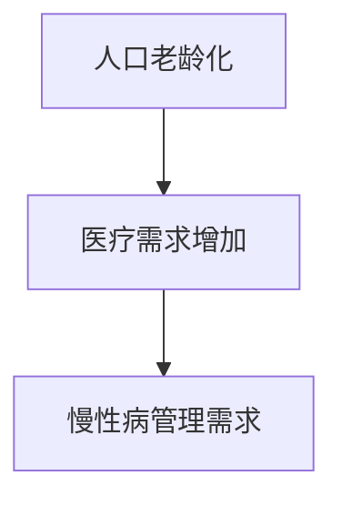

#### 2.1.2 医疗技术进步带来的投资机会
医疗技术的进步（如人工智能、基因编辑）为行业带来了新的增长点。

**公式：**
$$ \text{技术创新} = \text{投资机会} $$

#### 2.1.3 医疗服务消费升级的趋势
消费者对医疗服务质量的要求不断提高，高端医疗服务市场潜力巨大。

**图表：医疗服务消费升级趋势**
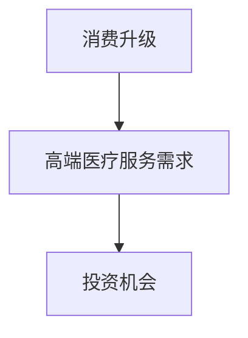

### 2.2 巴菲特与芒格的投资标准

#### 2.2.1 企业护城河的构建
企业必须具备独特的竞争优势，能够在长期竞争中占据优势地位。

**公式：**
$$ \text{护城河} = \text{竞争优势} $$

#### 2.2.2 企业的财务健康状况
企业必须具备健康的财务状况，包括稳定的现金流、合理的负债率和良好的盈利能力。

**图表：财务健康状况分析**
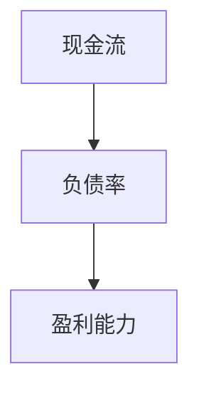

#### 2.2.3 管理层的诚信与能力
管理层必须具备诚信和能力，能够为股东创造长期价值。

**图表：管理层能力与企业价值的关系**
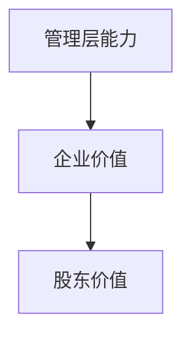

---

## 第3章: 巴菲特与芒格的经典医疗保健投资案例分析

### 3.1 巴菲特与芒格的经典投资案例

#### 3.1.1 以某医疗公司为例的分析
以某医疗公司为例，分析其竞争优势、财务状况和管理层能力。

**代码：财务指标分析工具**
```python
import pandas as pd

def calculate_roe(df):
    df['ROE'] = df['净利润'] / df['净资产']
    return df

data = {
    '年份': [2018, 2019, 2020, 2021],
    '净利润': [100, 120, 150, 180],
    '净资产': [500, 600, 700, 800]
}
df = pd.DataFrame(data)
calculate_roe(df)
print(df)
```

#### 3.1.2 投资回报与风险控制
分析投资回报率和风险控制策略。

**公式：**
$$ \text{回报率} = \frac{\text{收益} - \text{成本}}{\text{成本}} \times 100\% $$

#### 3.1.3 案例中的经验与教训
总结投资经验，避免类似错误。

---

## 第4章: 医疗保健行业的投资策略与风险管理

### 4.1 医疗保健行业的投资策略

#### 4.1.1 长期投资与价值发现
巴菲特和芒格的长期投资策略强调寻找具有长期增长潜力的企业。

**图表：长期投资策略**
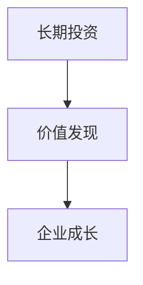

#### 4.1.2 行业周期与企业选择
分析行业周期，选择处于上升周期的企业。

**公式：**
$$ \text{行业周期} = \text{企业选择的关键因素} $$

#### 4.1.3 政策风险的应对策略
制定应对政策风险的策略，如分散投资、关注政策变化等。

**图表：政策风险应对策略**
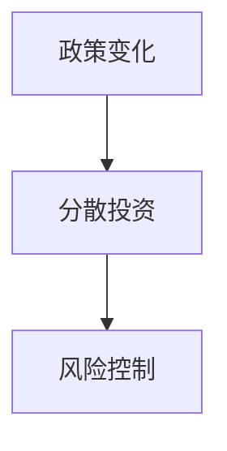

### 4.2 风险管理与投资组合优化

#### 4.2.1 风险评估与控制
评估投资风险，制定控制措施。

**公式：**
$$ \text{风险评估} = \text{概率} \times \text{影响} $$

#### 4.2.2 投资组合的分散化
通过分散化降低投资风险。

**图表：投资组合分散化**
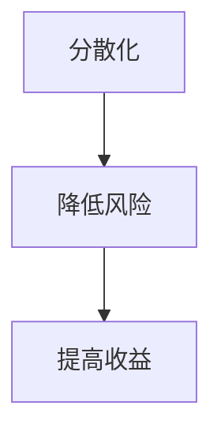

#### 4.2.3 定期复盘与调整
定期复盘投资组合，根据市场变化进行调整。

**图表：投资组合调整流程**
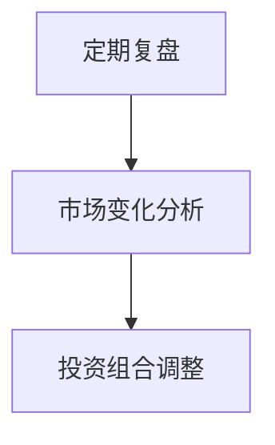

---

## 第5章: 医疗保健行业的未来投资机会

### 5.1 医疗技术的创新与投资机会

#### 5.1.1 数字医疗与人工智能
人工智能在医疗诊断和治疗中的应用前景广阔。

**图表：人工智能在医疗中的应用**
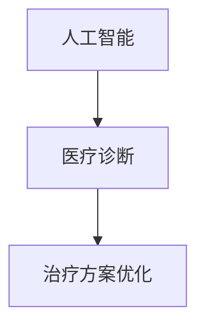

#### 5.1.2 精准医疗的发展前景
精准医疗基于个体基因差异提供个性化治疗方案，市场潜力巨大。

**公式：**
$$ \text{精准医疗} = \text{个体化治疗} $$

#### 5.1.3 远程医疗的市场潜力
远程医疗在降低医疗成本和提高医疗服务效率方面具有显著优势。

**图表：远程医疗市场潜力**
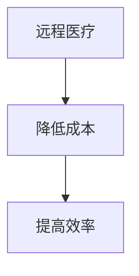

### 5.2 医疗服务与健康管理的未来趋势

#### 5.2.1 健康管理服务的崛起
健康管理服务将从预防、监测到治疗提供全流程服务。

**图表：健康管理服务流程**


#### 5.2.2 医疗服务的消费升级
消费者对医疗服务的需求将从“基本需求”向“高端需求”升级。

**公式：**
$$ \text{消费升级} = \text{需求升级} $$

#### 5.2.3 医疗保险与健康管理的结合
医疗保险与健康管理的结合将为投资者带来新的机会。

**图表：医疗保险与健康管理结合**
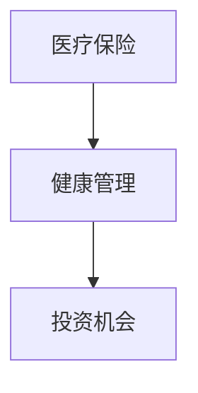

---

## 第6章: 巴菲特与芒格投资理念的实际应用

### 6.1 投资框架的构建

#### 6.1.1 行业分析框架
构建行业分析框架，包括市场需求、竞争格局、政策环境等方面。

**图表：行业分析框架**
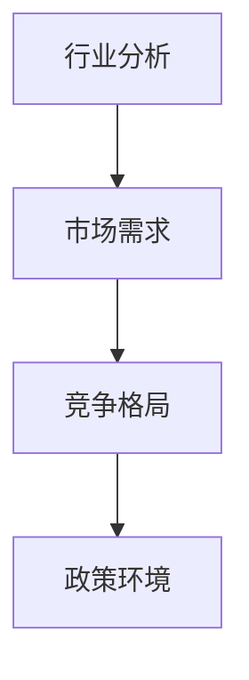

#### 6.1.2 企业估值模型
使用企业估值模型（如DCF模型）对目标企业进行估值。

**公式：**
$$ \text{DCF模型} = \text{现金流折现} $$

#### 6.1.3 投资决策流程
制定投资决策流程，包括筛选、分析、评估和决策。

**图表：投资决策流程**
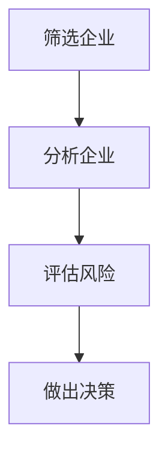

### 6.2 投资工具与方法

#### 6.2.1 财务指标分析
分析企业的财务指标，如ROE、净利润率等。

**公式：**
$$ \text{ROE} = \frac{\text{净利润}}{\text{净资产}} $$

#### 6.2.2 竞争优势分析
评估企业的竞争优势，如成本优势、技术优势等。

**图表：竞争优势分析**
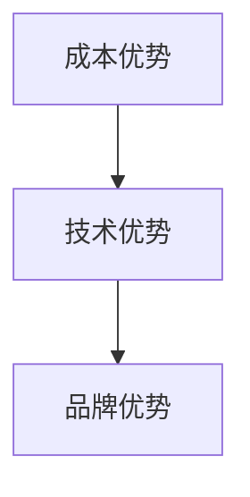

#### 6.2.3 管理层分析
评估管理层的诚信与能力，确保其能够为股东创造长期价值。

**公式：**
$$ \text{管理层能力} = \text{企业价值的关键因素} $$

---

# 第七章: 结论与展望

### 7.1 结论
巴菲特和芒格的投资理念为医疗保健行业的投资提供了宝贵的指导。通过长期投资、价值发现和风险管理，投资者可以在医疗保健行业中实现长期增长。

### 7.2 未来展望
随着医疗技术的进步和政策环境的优化，医疗保健行业将继续保持增长潜力，投资者应密切关注行业动态，抓住投资机会。

---

# 附录

## 附录A: 巴菲特与芒格的经典语录

### 附录B: 医疗保健行业数据分析工具

### 附录C: 相关研究报告与文献

---

# 作者信息

作者：AI天才研究院/AI Genius Institute & 禅与计算机程序设计艺术 /Zen And The Art of Computer Programming

---

本文通过深入分析巴菲特和芒格在医疗保健行业的投资策略，结合技术分析和实际案例，为投资者提供了全面的参考。希望本文能为读者在医疗保健行业的投资决策中提供有价值的洞见。

