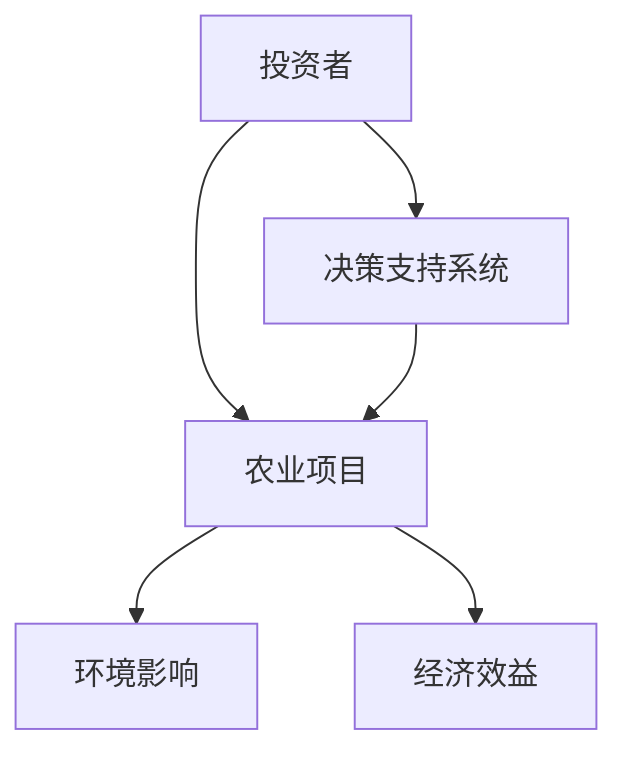

                 


# 巴菲特-芒格的可持续农业投资：粮食安全与环境保护

**关键词：** 巴菲特, 芒格, 可持续农业, 粮食安全, 环境保护, 投资策略

**摘要：** 本文探讨巴菲特和芒格在可持续农业投资领域的策略，分析粮食安全与环境保护的平衡，结合数学模型和系统架构，提供投资策略和实战案例，总结未来趋势和投资建议。

---

## 第一部分：引言

### 第1章：问题背景与核心概念

#### 1.1 问题背景

当前，全球面临粮食安全和环境保护的双重挑战。传统农业模式导致资源枯竭、环境污染，可持续农业成为解决这些问题的关键。

#### 1.2 问题描述

传统农业过度依赖化肥和农药，导致土壤退化、水资源污染，同时加剧气候变化。这些问题威胁全球粮食安全。

#### 1.3 问题解决

可持续农业通过生态种植、有机农业等方法，减少环境影响，提高资源利用效率。

#### 1.4 核心概念

- **核心概念：** 可持续农业强调环境、经济和社会三者的平衡，采用生态友好的生产方式。
- **对比表格：**

| 属性        | 传统农业         | 可持续农业       |
|-------------|------------------|------------------|
| 资源利用     | 高消耗           | 高效             |
| 环境影响     | 严重污染         | 减少污染         |
| 经济效益     | 短期高收益       | 长期可持续收益   |

- **ER实体关系图：**

```mermaid
er
  entity 投资者
  entity 农业项目
  entity 环境影响
  entity 经济效益
  relation 投资者 -> 投资农业项目
  relation 农业项目 -> 环境影响
  relation 农业项目 -> 经济效益
```

---

## 第二部分：核心概念与联系

### 第2章：可持续农业的核心要素

#### 2.1 可持续农业的定义

可持续农业是一种能够长期维持生产，不损害环境的农业生产方式，强调生态平衡。

#### 2.2 粮食安全与环境保护的关系

粮食安全是基本人权，环境保护是可持续发展的基础，两者相辅相成。

---

## 第三部分：投资策略与分析方法

### 第3章：可持续农业的投资评估

#### 3.1 数学模型

**净现值计算公式：**

$$ NPV = \sum_{t=0}^{n} \frac{C_t}{(1+r)^t} $$

其中，$C_t$为第$t$年的现金流，$r$为折现率。

#### 3.2 系统架构



---

## 第四部分：项目实战

### 第4章：案例分析

#### 4.1 农业项目选择

以某有机农场为例，分析其投资策略，包括环境影响评估和经济效益预测。

#### 4.2 Python代码实现

```python
import numpy as np
import pandas as pd

# 净现值计算
def calculate_npv(cash_flows, discount_rate):
    return np.npv(discount_rate, *cash_flows)

# 示例数据
cash_flows = [-100, 30, 30, 30]
discount_rate = 0.1

npv = calculate_npv(cash_flows, discount_rate)
print(f"净现值为：{npv}")
```

---

## 第五部分：结论与展望

### 第5章：总结与未来趋势

#### 5.1 总结

可持续农业投资是保障粮食安全和环境保护的关键，巴菲特和芒格的投资策略为实现这一目标提供了重要参考。

#### 5.2 未来展望

技术创新和政策支持将推动可持续农业发展，投资机会广泛。

---

## 附录

### 附录A：数据图表

- 粮食产量与环境影响对比图。

### 附录B：参考文献

-巴菲特，芒格的相关著作和论文。

---

**作者：AI天才研究院/AI Genius Institute & 禅与计算机程序设计艺术 /Zen And The Art of Computer Programming**

