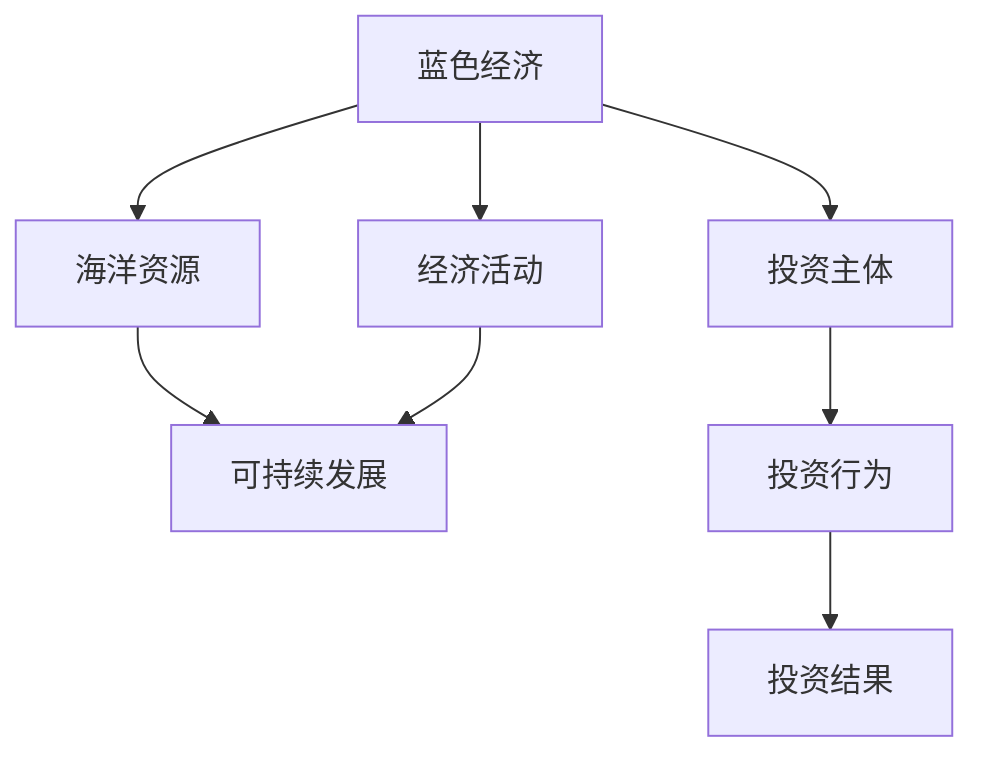
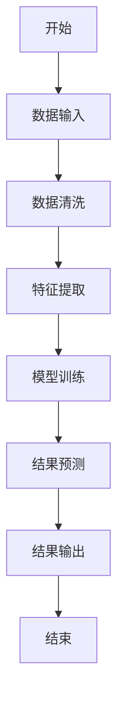
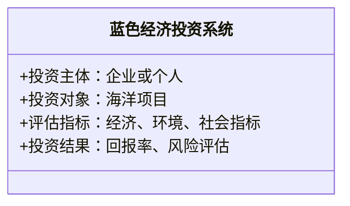
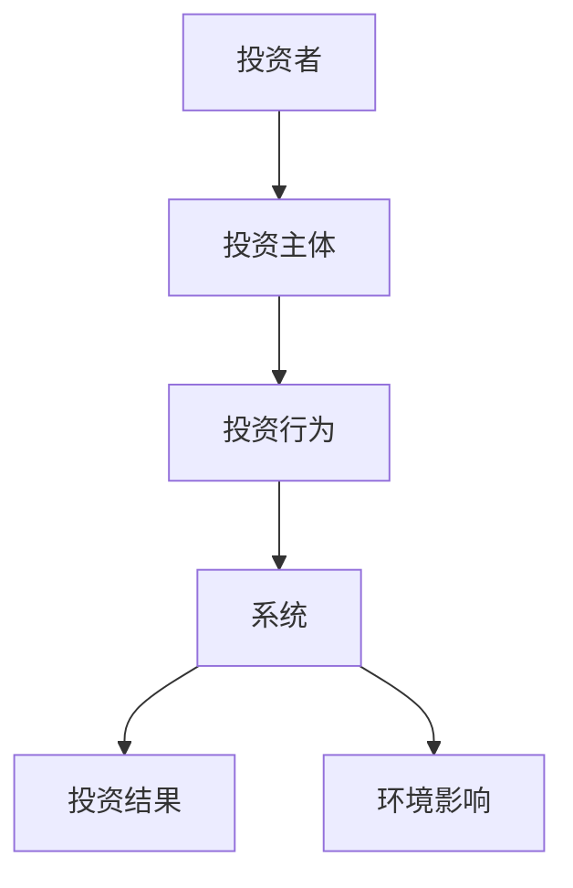

                 

# 巴菲特-芒格的可持续海洋经济投资：蓝色经济的未来

## 关键词：巴菲特, 芒格, 可持续投资, 蓝色经济, 海洋经济, 价值投资

## 摘要：  
本文探讨了巴菲特和芒格的价值投资理念在蓝色经济中的应用，特别是可持续海洋经济投资的未来发展方向。通过分析蓝色经济的核心概念、投资算法的原理、系统架构设计以及实际项目案例，本文旨在为投资者和相关从业者提供深入的理论和实践指导。

---

# 第一部分：蓝色经济与可持续海洋经济投资的背景

## 第1章：蓝色经济的定义与现状

### 1.1 蓝色经济的定义
#### 1.1.1 蓝色经济的定义与内涵  
蓝色经济是指以海洋资源为基础，通过可持续的方式开发和利用海洋资源的经济活动。它强调生态系统的保护与经济发展的平衡，涵盖渔业、海洋能源、航运、旅游等领域。

#### 1.1.2 蓝色经济与可持续发展的关系  
蓝色经济是实现联合国可持续发展目标（SDGs）的重要组成部分。它不仅关注经济收益，还注重环境保护和社会效益，强调“绿水青山就是金山银山”的理念。

#### 1.1.3 蓝色经济的全球发展趋势  
近年来，蓝色经济在全球范围内迅速发展。随着人们对海洋资源的需求增加，如何在开发中保护海洋生态系统成为各国关注的重点。蓝色经济的投资潜力巨大，但同时也面临政策、技术和环境的多重挑战。

---

### 1.2 可持续海洋经济投资的背景

#### 1.2.1 海洋经济的现状与挑战  
海洋经济是全球经济的重要组成部分，但传统海洋经济活动往往以牺牲环境为代价。过度捕捞、污染、资源枯竭等问题严重威胁海洋生态系统的健康。

#### 1.2.2 可持续海洋经济的必要性  
可持续海洋经济投资是解决上述问题的关键。通过科学规划和技术创新，可以实现海洋资源的高效利用，同时保护海洋生态系统，促进经济的可持续发展。

#### 1.2.3 巴菲特与芒格的投资理念  
巴菲特和芒格的价值投资理念强调长期稳健回报和对公司基本面的深入分析。芒格的多元思维模型则注重跨学科的综合分析，这为蓝色经济的投资提供了独特的视角。

---

### 1.3 巴菲特与芒格的投资策略

#### 1.3.1 巴菲特的价值投资理念  
巴菲特的价值投资理念强调寻找具有持续竞争优势的公司，注重企业的内在价值和长期盈利能力。他认为，投资的本质是寻找那些能够在未来持续创造价值的企业。

#### 1.3.2 芒格的多元思维模型  
芒格的多元思维模型强调将多个领域的知识融会贯通，形成一个立体的思维方式。这种思维方式可以帮助投资者更好地识别投资机会，避免决策失误。

#### 1.3.3 两者的投资理念对蓝色经济的启示  
巴菲特和芒格的投资理念为蓝色经济投资提供了重要启示。通过关注企业的可持续发展能力和长期价值，投资者可以在保护环境的同时实现经济回报。

---

## 第2章：蓝色经济的核心概念与联系

### 2.1 核心概念原理

#### 2.1.1 蓝色经济的核心要素  
蓝色经济的核心要素包括海洋资源、技术、政策、市场和生态系统。这些要素相互作用，构成了蓝色经济的系统。

#### 2.1.2 可持续海洋经济的关键驱动因素  
可持续海洋经济的关键驱动因素包括技术创新、政策支持、市场需求和公众意识。这些因素共同推动蓝色经济的发展。

#### 2.1.3 巴菲特与芒格投资理念的结合点  
巴菲特和芒格的投资理念与蓝色经济的核心要素高度契合。他们注重企业的长期价值和可持续发展能力，这与蓝色经济的目标一致。

---

### 2.2 核心概念属性对比

#### 2.2.1 蓝色经济与传统经济的对比  
| 属性 | 蓝色经济 | 传统经济 |
|------|----------|----------|
| 资源利用 | 可持续 | 传统开发 |
| 环境影响 | 最小化 | 可能较大 |
| 经济回报 | 长期稳定 | 可能波动 |

#### 2.2.2 可持续投资与传统投资的对比  
| 属性 | 可持续投资 | 传统投资 |
|------|------------|------------|
| 投资目标 | 长期可持续回报 | 短期收益 |
| 风险管理 | 强调风险管理 | 可能忽视环境风险 |

#### 2.2.3 巴菲特与芒格投资理念的对比  
| 属性 | 巴菲特 | 芒格 |
|------|--------|--------|
| 投资理念 | 价值投资 | 多元思维模型 |
| 重点 | 公司基本面 | 跨学科分析 |

---

### 2.3 ER实体关系图

---

## 第3章：蓝色经济投资的算法原理

### 3.1 算法原理概述

#### 3.1.1 投资评估模型的构建  
投资评估模型需要考虑企业的财务状况、市场前景、政策环境和环境影响等多个因素。

#### 3.1.2 可持续性评估指标的设计  
可持续性评估指标包括资源利用率、环境影响、社会贡献等。

#### 3.1.3 投资组合优化算法的原理  
投资组合优化算法通过数学建模，找到最优的投资组合，实现风险与收益的平衡。

---

### 3.2 算法流程图

---

### 3.3 数学模型与公式

#### 3.3.1 投资回报率计算公式  
$$ ROI = \frac{净收益}{投资成本} \times 100\% $$

#### 3.3.2 可持续性评估模型  
$$ S = \sum_{i=1}^{n} w_i \times s_i $$
其中，$w_i$ 是指标权重，$s_i$ 是指标评分。

---

# 第四部分：系统分析与架构设计

## 第4章：系统架构设计

### 4.1 问题场景介绍  
本章将探讨如何构建一个蓝色经济投资评估系统，帮助投资者评估海洋经济项目的可持续性和经济回报。

### 4.2 系统功能设计

#### 4.2.1 领域模型设计  

#### 4.2.2 系统架构设计  

---

## 第5章：项目实战

### 5.1 项目介绍  
本章将通过一个具体案例，展示如何将巴菲特和芒格的投资理念应用于蓝色经济投资中。

---

## 第6章：总结与展望

### 6.1 总结  
本文通过分析巴菲特和芒格的投资理念，探讨了蓝色经济的未来发展方向。通过系统架构设计和实际案例分析，展示了如何实现可持续海洋经济投资。

### 6.2 展望  
随着技术的进步和政策的支持，蓝色经济的投资潜力将越来越大。未来，投资者需要更加注重企业的可持续发展能力，实现经济与环境的双赢。

---

# 作者：AI天才研究院 & 禅与计算机程序设计艺术

---

通过以上内容，我们系统地探讨了巴菲特和芒格的投资理念在蓝色经济中的应用，为投资者和相关从业者提供了理论和实践指导。

