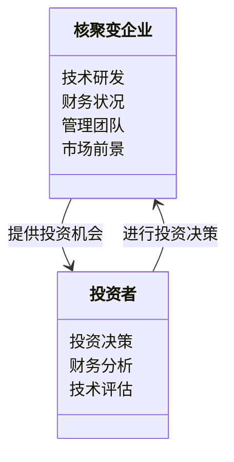
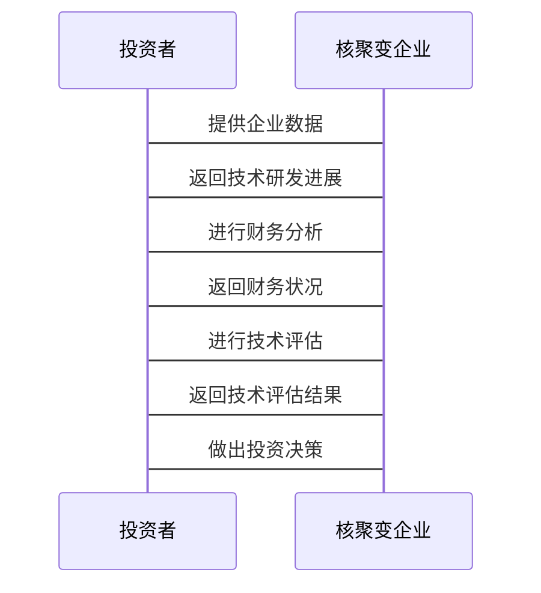

                 


# 巴菲特-芒格的可控核聚变投资：未来能源的终极解决方案

## 关键词：巴菲特, 芒格, 可控核聚变, 投资策略, 能源技术

## 摘要：  
本文深入探讨了巴菲特和芒格的投资哲学及其在可控核聚变能源领域的应用。通过分析核聚变技术的潜力、市场价值及投资策略，结合价值投资的核心框架和长期主义的投资理念，本文为读者提供了在能源投资领域的全新视角，揭示了可控核聚变作为未来能源终极解决方案的投资机遇与挑战。

---

# 第一部分: 巴菲特-芒格投资策略的背景与核心理念

## 第1章: 巴菲特与芒格的投资哲学

### 1.1 巴菲特与芒格的生平简介

#### 1.1.1 巴菲特的生平与投资历程  
沃伦·巴菲特（Warren Buffett）是全球最著名的职业投资人之一，被誉为“股神”。他出生于1930年，毕业于哥伦比亚大学，师从本杰明·格雷厄姆（Benjamin Graham），并继承了格雷厄姆的价值投资理念。巴菲特的投资风格以稳健、长期和价值为导向著称，他通过旗下的伯克希尔哈撒韦公司（Berkshire Hathaway）构建了一个庞大的投资帝国。

#### 1.1.2 芒格的生平与投资历程  
查理·芒格（Charlie Munger）是巴菲特的长期合作伙伴，两人共同创立了伯克希尔哈撒韦公司，并共同推动了价值投资理念的发展。芒格以其独特的思维方式和跨学科的分析能力闻名，他的智慧和见解为巴菲特的投资决策提供了重要的支持。

#### 1.1.3 两人合作的投资理念  
巴菲特和芒格的合作基于对价值投资的共同信仰。巴菲特负责具体的投资操作，而芒格则以其跨学科的知识和逻辑思维能力为投资决策提供支持。两人共同强调了安全边际、长期主义和价值导向的投资理念。

### 1.2 巴菲特-芒格投资哲学的核心理念

#### 1.2.1 价值投资的定义与内涵  
价值投资是一种投资策略，强调以低于内在价值的价格购买优质资产。巴菲特和芒格的价值投资理念强调对企业内在价值的深入分析，寻找那些具有长期竞争优势和良好管理团队的企业。

#### 1.2.2 巴菲特-芒格投资哲学的三大支柱  
1. **安全边际**：以低于内在价值的价格购买资产，确保投资的安全性。  
2. **长期主义**：关注企业的长期价值，而非短期市场波动。  
3. **优质企业**：投资于具有强大竞争优势和良好管理团队的企业。

#### 1.2.3 价值投资与长期主义的结合  
巴菲特和芒格的投资策略强调长期主义，认为市场的短期波动并不能决定企业的长期价值。通过长期持有优质资产，投资者能够获得稳定的收益。

### 1.3 能源投资的特殊性与重要性

#### 1.3.1 能源投资的核心逻辑  
能源投资的核心逻辑在于寻找能够持续提供稳定收益的能源项目。随着全球能源需求的增长和传统能源的逐渐枯竭，新型能源技术的投资价值日益凸显。

#### 1.3.2 核聚变能源的技术潜力与投资价值  
核聚变是一种清洁、安全、可持续的能源技术，具有巨大的市场潜力。与传统能源相比，核聚变能源具有零碳排放、资源丰富等优势，是未来能源市场的终极解决方案。

#### 1.3.3 未来能源市场的投资机会  
随着技术的进步和政策的支持，核聚变能源的投资机会逐渐显现。投资者需要关注技术发展、市场需求和政策环境，抓住核聚变能源的投资机遇。

---

## 第2章: 可控核聚变能源的技术与市场分析

### 2.1 可控核聚变能源的技术原理

#### 2.1.1 核聚变的基本原理  
核聚变是指轻核原子（如氘和氚）在高温高压下结合成重核，释放出大量能量的过程。与核裂变相比，核聚变具有更高的能量输出和更低的放射性废物产生。

#### 2.1.2 可控核聚变的技术挑战  
1. **高温等离子体的控制**：需要在高温高压下稳定控制等离子体，确保反应的持续性。  
2. **材料技术的突破**：需要开发能够承受高温和辐射的特殊材料。  
3. **能量输出的稳定性**：确保聚变反应的稳定性和可控性。

#### 2.1.3 当前技术发展现状  
当前，全球多个国家和地区正在积极推动核聚变技术的研发，如国际热核聚变实验堆（ITER）项目和中国自主的聚变能研究项目。尽管技术挑战巨大，但核聚变技术的商业化应用正在逐步推进。

### 2.2 核聚变能源的投资价值分析

#### 2.2.1 核聚变能源的市场潜力  
核聚变能源具有巨大的市场潜力。随着全球能源需求的增长和环保压力的增大，清洁、可持续的能源技术将受到市场和政策的双重支持。

#### 2.2.2 投资核聚变能源的风险与收益  
1. **风险**：技术不确定性、高投入、长周期等。  
2. **收益**：一旦技术突破，核聚变能源将带来巨大的经济和社会效益。

#### 2.2.3 核聚变能源的技术路线与投资周期  
核聚变能源的技术路线包括磁约束和惯性约束两种主要方式。投资周期较长，但一旦实现商业化，将带来巨大的回报。

### 2.3 巴菲特-芒格投资策略在核聚变领域的应用

#### 2.3.1 价值投资在核聚变领域的适用性  
价值投资的核心是寻找具有长期竞争优势的企业。核聚变技术的研发和商业化需要长期投入，但一旦成功，将具备极高的市场价值。

#### 2.3.2 核聚变企业的财务分析与估值  
1. **财务分析**：关注企业的研发投入、技术进展、市场前景和管理团队。  
2. **估值方法**：采用现金流贴现模型（DCF）等方法对核聚变企业进行估值。

#### 2.3.3 投资核聚变企业的长期战略  
巴菲特和芒格的投资策略强调长期主义。对于核聚变企业，投资者需要具备耐心和信心，关注企业的长期价值，而非短期波动。

---

## 第3章: 巴菲特-芒格投资策略的核心框架

### 3.1 价值投资的核心框架

#### 3.1.1 安全边际的定义与计算  
安全边际是指投资价格低于内在价值的部分。通过计算安全边际，投资者可以确保投资的安全性。

#### 3.1.2 内在价值的计算方法  
内在价值是企业未来现金流的现值。巴菲特和芒格强调对企业内在价值的深入分析，寻找那些具有安全边际的优质企业。

#### 3.1.3 股价与内在价值的动态关系  
股价围绕内在价值波动，长期来看，股价将回归其内在价值。投资者需要关注企业的长期价值，而非短期市场波动。

### 3.2 巴菲特-芒格投资策略的关键原则

#### 3.2.1 高质量企业的定义与特征  
高质量企业是指具有强大竞争优势、良好管理团队和稳定现金流的企业。巴菲特和芒格强调投资于高质量企业，而非短期概念股。

#### 3.2.2 投资的长期主义与价值导向  
巴菲特和芒格的投资策略强调长期主义和价值导向。他们认为，短期市场波动无法决定企业的长期价值，投资者需要关注企业的长期发展前景。

#### 3.2.3 风险控制与安全边际的重要性  
通过安全边际的计算，投资者可以有效控制风险。巴菲特和芒格强调，投资的首要目标是保护本金的安全，而非追求短期收益。

---

## 第4章: 核聚变能源投资的系统分析与架构设计

### 4.1 问题场景介绍

#### 4.1.1 核聚变能源的技术挑战  
核聚变能源的技术挑战包括高温等离子体的控制、材料技术的突破等。

#### 4.1.2 投资核聚变能源的风险与收益  
投资核聚变能源的风险包括技术不确定性、高投入、长周期等，但一旦成功，将带来巨大的收益。

#### 4.1.3 价值投资在核聚变领域的应用场景  
价值投资在核聚变领域的应用场景包括企业财务分析、技术评估和市场前景分析等。

### 4.2 系统功能设计

#### 4.2.1 领域模型（mermaid 类图）  


#### 4.2.2 系统架构设计（mermaid 架构图）  


#### 4.2.3 系统接口设计  
投资者与核聚变企业的接口包括企业数据的提供、技术评估的交互和投资决策的反馈。

#### 4.2.4 系统交互设计（mermaid 序列图）  


---

## 第5章: 项目实战与投资分析

### 5.1 项目环境安装

#### 5.1.1 系统环境要求  
需要安装Python、Jupyter Notebook和相关数据分析库（如Pandas、NumPy、Matplotlib）。

#### 5.1.2 核聚变企业数据获取  
从公开数据源获取核聚变企业的财务数据、技术进展和市场前景信息。

#### 5.1.3 投资分析工具安装  
安装并配置Python环境，确保能够运行后续的代码。

### 5.2 系统核心实现源代码

#### 5.2.1 核聚变企业财务分析代码  
```python
import pandas as pd
import numpy as np

# 假设我们有一个核聚变企业的财务数据
data = {
    '年份': [2020, 2021, 2022],
    '收入': [100, 150, 200],
    '成本': [80, 100, 120],
    '利润': [20, 50, 80]
}
df = pd.DataFrame(data)

# 计算净利润
df['净利润'] = df['收入'] - df['成本']
print(df)
```

#### 5.2.2 核聚变企业技术评估代码  
```python
import matplotlib.pyplot as plt

# 假设我们有一个核聚变技术的进展数据
years = [2020, 2021, 2022, 2023]
progress = [60, 70, 80, 90]

plt.plot(years, progress, marker='o')
plt.title('核聚变技术进展')
plt.xlabel('年份')
plt.ylabel('技术进展（%）')
plt.show()
```

#### 5.2.3 核聚变企业市场前景分析代码  
```python
from sklearn.linear_model import LinearRegression

# 假设我们有一个市场前景数据
import pandas as pd
import numpy as np

data = {
    '年份': [2020, 2021, 2022, 2023],
    '市场需求': [100, 150, 200, 250]
}
df = pd.DataFrame(data)

# 计算市场增长趋势
model = LinearRegression()
model.fit(df[['年份']], df['市场需求'])
print("市场增长趋势:", model.coef_[0])
```

### 5.3 投资分析与案例解读

#### 5.3.1 投资分析流程  
1. 收集核聚变企业的财务数据、技术数据和市场数据。  
2. 使用Python工具进行数据分析和可视化。  
3. 通过价值投资框架评估企业的内在价值和安全边际。  
4. 结合技术进展和市场前景做出投资决策。

#### 5.3.2 投资案例分析  
以某家核聚变企业为例，分析其财务状况、技术进展和市场前景，评估其投资价值。

---

## 第6章: 最佳实践与投资小结

### 6.1 投资策略总结

#### 6.1.1 价值投资的核心要点  
1. **安全边际**：确保投资价格低于内在价值。  
2. **长期主义**：关注企业的长期价值，而非短期波动。  
3. **优质企业**：投资于具有强大竞争优势和良好管理团队的企业。

#### 6.1.2 核聚变能源的投资机会  
1. **技术突破**：关注核聚变技术的最新进展。  
2. **市场需求**：分析全球能源市场的未来需求。  
3. **政策支持**：关注政府和国际组织的政策支持。

### 6.2 投资注意事项

#### 6.2.1 风险控制  
1. **技术风险**：核聚变技术的不确定性可能影响投资收益。  
2. **资金风险**：高投入和长周期可能导致资金链断裂。  
3. **政策风险**：政策变化可能影响核聚变能源的市场前景。

#### 6.2.2 投资心态管理  
1. **长期视角**：避免短期市场的波动干扰。  
2. **耐心与信心**：相信技术突破和市场前景，保持长期投资信心。

### 6.3 拓展阅读与学习资源

#### 6.3.1 经典书籍  
1. 《巴菲特致股东的信》  
2. 《芒格的智慧：决策的的艺术》  
3. 《核聚变能源技术与市场分析》

#### 6.3.2 在线资源  
1. 国际热核聚变实验堆（ITER）官网  
2. 核聚变能源相关学术论文  
3. 价值投资论坛和社区

---

## 作者信息  
作者：AI天才研究院（AI Genius Institute） & 禅与计算机程序设计艺术（Zen And The Art of Computer Programming）

