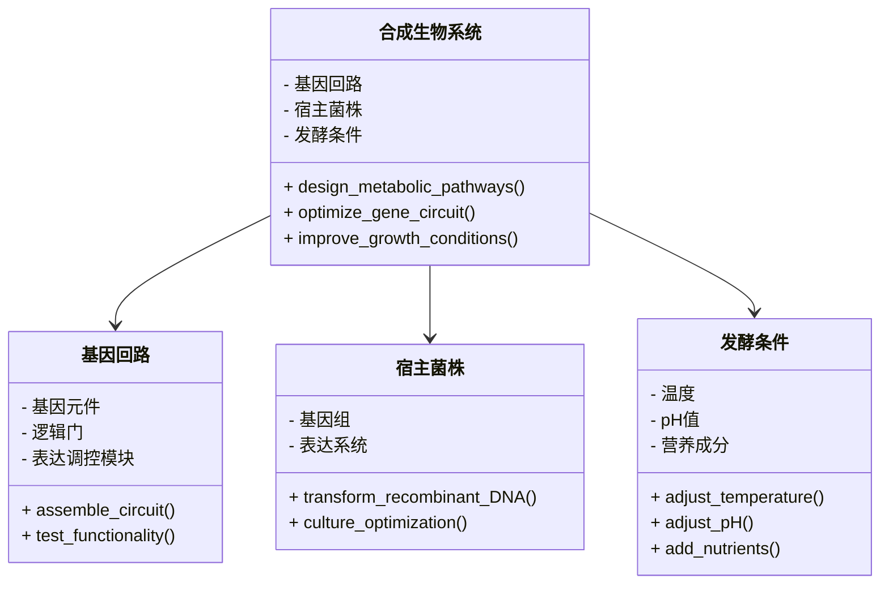

                 


# 巴菲特-芒格的合成生物学投资：创造生命的科技革命

## 关键词：合成生物学，巴菲特，芒格，投资策略，科技创新，生物技术

## 摘要：本文探讨了巴菲特和芒格在合成生物学领域的投资策略，分析了合成生物学的技术原理和应用领域，并结合实际案例，提供了系统化的方法来评估投资机会，总结了合成生物学的投资策略和未来趋势。

---

## 第一部分：合成生物学概述

### 第1章：合成生物学的背景与定义

#### 1.1 合成生物学的定义与核心概念

- 1.1.1 合成生物学的定义
  合成生物学（Synthetic Biology）是通过设计和构建新的生物组件、装置和系统，以实现特定功能的学科。它结合了基因工程、系统生物学和工程学原理，旨在创造或修改生物系统以满足人类需求。

- 1.1.2 合成生物学的核心要素
  合成生物学的核心要素包括：**人工设计的基因回路**、**合成代谢途径**、**工程化细胞**等。这些要素通过模块化设计，可以重新组合以实现特定功能。

- 1.1.3 合成生物学与传统生物技术的区别
  合成生物学与传统生物技术的区别在于其**模块化和系统化**。合成生物学家不仅修改现有生物系统，还设计和构建新的生物系统，类似于工程设计。

#### 1.2 合成生物学的历史与发展

- 1.2.1 合成生物学的起源
  合成生物学起源于20世纪末，随着基因组测序技术的发展，科学家开始尝试人工合成基因组。1995年，第一个合成基因组（细菌）诞生，标志着合成生物学的开端。

- 1.2.2 关键技术的发展历程
  1. **基因编辑技术**：从早期的ZFN、TALEN到如今的CRISPR-Cas9，基因编辑技术的精度和效率不断提高。
  2. **合成基因组学**：随着技术的进步，科学家能够合成越来越复杂的基因组，如2010年Craig Venter团队合成的支原体基因组。
  3. **生物模块化设计**：通过模块化设计，合成生物学家可以将生物系统分解为可替换的模块，方便设计和优化。

- 1.2.3 当前研究的热点领域
  1. **合成代谢工程**：设计和优化代谢途径，生产有用化合物。
  2. **基因回路设计**：构建复杂的基因回路，实现逻辑功能。
  3. **微生物改造**：改造微生物用于生产生物燃料、药物等。

#### 1.3 合成生物学的投资背景

- 1.3.1 合成生物学的市场潜力
  合成生物学在医药、化工、环保等领域有广泛应用潜力。预计到2025年，合成生物学市场规模将达到数百亿美元。

- 1.3.2 投资者关注的焦点
  投资者关注合成生物学公司的技术壁垒、市场应用潜力和管理团队。特别是那些能够将实验室成果转化为商业化产品的公司更受青睐。

- 1.3.3 巴菲特与芒格的投资理念
  巴菲特和芒格注重长期价值投资，关注公司的基本面和管理团队。他们认为合成生物学有潜力成为下一个科技革命的核心领域。

---

### 第2章：合成生物学的核心原理

#### 2.1 合成生物学的基本原理

- 2.1.1 基因编辑技术
  CRISPR-Cas9技术是最常用的基因编辑工具，通过引导RNA和Cas9蛋白的结合，可以在特定位置切割DNA，实现基因的精准编辑。

- 2.1.2 人工合成基因回路
  合成生物学家设计基因回路，类似于电子电路，用于控制基因的表达。例如，逻辑门电路（AND、OR、NAND）可以被设计到生物系统中。

- 2.1.3 微生物的重新设计
  通过重新设计微生物的代谢途径和基因组，可以使其生产特定的化合物，如生物燃料、药品等。

#### 2.2 合成生物学的关键技术

- 2.2.1 CRISPR-Cas9技术
  CRISPR-Cas9是一种革命性的基因编辑工具，允许科学家精确地修改DNA序列。它在合成生物学中的应用广泛，包括基因回路的设计和优化。

- 2.2.2 合成基因组学
  合成基因组学涉及人工合成和设计基因组。通过化学合成和组装技术，科学家可以构建复杂的合成基因组，用于研究和应用。

- 2.2.3 合成代谢工程
  合成代谢工程旨在设计和优化生物代谢途径，以提高目标产物的产量。这通常涉及基因敲除、过表达和代谢通路重新设计。

#### 2.3 合成生物学的应用领域

- 2.3.1 医药与健康
  合成生物学在医药领域的应用包括：生产重组蛋白质、设计新药、开发个性化医疗方案。

- 2.3.2 化工与材料
  通过设计和改造微生物，合成生物学可以生产传统化工难以合成的材料，如生物基塑料、高性能纤维。

- 2.3.3 环境保护
  合成生物学在环境保护中的应用包括：生物降解塑料、处理工业污染物、修复受污染的土壤和水体。

---

### 第3章：合成生物学的投资策略

#### 3.1 巴菲特的投资理念

- 3.1.1 长期价值投资
  巴菲特强调长期投资，关注公司的内在价值。他认为，合成生物学作为新兴科技领域，具有巨大的潜力，值得长期关注。

- 3.1.2 股价与内在价值的关系
  巴菲特认为，股价短期可能受市场情绪影响，但长期来看，股价会回归其内在价值。因此，投资者应关注公司的基本面，而非短期波动。

- 3.1.3 安全边际的重要性
  安全边际是指投资价格低于内在价值的程度。巴菲特认为，安全边际可以降低投资风险，确保长期收益。

#### 3.2 芒格的多元思维模型

- 3.2.1 跨学科思维的重要性
  芒格强调，投资者需要具备跨学科的思维，能够从不同角度分析问题。这对于理解合成生物学这样的新兴科技尤为重要。

- 3.2.2 合成生物学领域的应用
  芒格认为，合成生物学的应用广泛，投资者需要深入了解其技术原理和市场前景，才能做出明智的投资决策。

- 3.2.3 投资决策的逻辑框架
  芒格提出了“反常识”的投资原则，即寻找那些被市场忽视或低估的投资机会。他认为，合成生物学领域的许多公司目前尚未被市场充分认识，这正是投资的好机会。

---

## 第四部分：系统分析与架构设计

### 第4章：系统分析与架构设计

#### 4.1 问题场景介绍

- **问题场景**：设计一个合成生物学系统，用于生产特定化合物。
- **目标**：优化代谢途径，提高产量，降低成本。
- **关键问题**：如何设计基因回路？如何选择和改造宿主菌株？如何优化发酵条件？

#### 4.2 项目介绍

- **项目目标**：构建一个能够高效生产目标化合物的合成生物系统。
- **项目范围**：包括基因回路设计、宿主菌改造、发酵条件优化等。

#### 4.3 系统功能设计（领域模型 Mermaid 类图）



#### 4.4 系统架构设计（Mermaid 架构图）

```mermaid
architectural {
    title 合成生物系统架构

    设计团队 --> 工程化平台
    工程化平台 --> 数据分析模块
    工程化平台 --> 实验室测试模块
    数据分析模块 --> 优化算法模块
    优化算法模块 --> 实验室测试模块
    实验室测试模块 --> 成果验证模块
}
```

---

## 第五部分：项目实战

### 第5章：项目实战

#### 5.1 环境安装

- **安装环境**：需要安装Python、生物信息学工具（如BioPython）、基因编辑工具（如CRISPR设计工具）等。
- **依赖管理**：使用虚拟环境管理Python包，确保所有依赖版本一致。

#### 5.2 系统核心实现源代码

- **基因回路设计代码示例**：

```python
def design_gene_circuit(gene_list):
    # 输入：基因列表，按顺序排列
    # 输出：设计的基因回路
    circuit = []
    for gene in gene_list:
        if gene == 'promoter':
            circuit.append('启动子')
        elif gene == 'rbs':
            circuit.append('RBS')
        elif gene == 'coding':
            circuit.append('编码区')
        elif gene == 'terminator':
            circuit.append('终止子')
    return circuit

# 示例：设计一个简单的基因回路
gene_list = ['promoter', 'rbs', 'coding', 'terminator']
print(design_gene_circuit(gene_list))
```

- **代谢途径优化代码示例**：

```python
def optimize_metabolic_pathway(rates):
    # 输入：代谢途径的速率常数
    # 输出：优化后的代谢途径
    import numpy as np
    from scipy.optimize import minimize

    def objective_function(x):
        # 目标函数：最小化总成本
        return sum(x)

    constraints = []
    # 添加约束条件：各步骤的速率常数必须大于0
    for i in range(len(rates)):
        constraints.append({'type': 'ineq', 'fun': lambda x, i=i: x[i] >= 0})

    result = minimize(objective_function, rates, constraints=constraints)
    return result.x

# 示例：优化代谢途径
rates = [1, 2, 3, 4]
optimized_rates = optimize_metabolic_pathway(rates)
print(optimized_rates)
```

#### 5.3 案例分析

- **案例：设计一个合成代谢途径，生产生物基塑料。**
  - **步骤1**：选择宿主菌株，如大肠杆菌。
  - **步骤2**：设计代谢回路，引入外源基因，编码聚酯合成酶。
  - **步骤3**：优化发酵条件，如温度、pH、碳源浓度。
  - **步骤4**：实验室测试，验证产量和成本。

#### 5.4 项目总结

- **总结**：通过系统化的方法，设计和优化合成生物系统，可以显著提高目标产物的产量，降低成本。同时，代码实现和数据分析是关键步骤，需要结合生物技术与信息技术。

---

## 第六部分：投资策略与未来展望

### 第6章：投资策略

#### 6.1 投资策略

- **策略一：关注具有强大研发能力的公司**
  投资者应选择那些在合成生物学领域有深厚研发基础的公司，这些公司更有可能将实验室成果转化为商业化产品。

- **策略二：分散投资**
  由于合成生物学领域的不确定性强，投资者应分散投资，降低风险。

- **策略三：长期持有**
  合成生物学技术的成熟和商业化需要时间，投资者应有长期持有的耐心。

#### 6.2 风险管理

- **风险管理一：技术风险**
  合成生物学技术的复杂性和不确定性可能导致项目失败。投资者应选择技术壁垒高、管理团队经验丰富的企业。

- **风险管理二：市场风险**
  合成生物学产品的市场需求可能不确定。投资者应关注那些有明确市场应用的公司。

- **风险管理三：政策风险**
  政府政策的变化可能影响合成生物学的发展。投资者应关注相关政策动态。

#### 6.3 投资案例分析

- **案例：投资合成生物燃料公司**
  某合成生物燃料公司通过改造微生物，设计出高效的代谢途径，生产生物柴油。公司技术领先，团队经验丰富，市场前景广阔。巴菲特和芒格可能对此类公司感兴趣。

---

## 第七部分：未来展望

### 第7章：未来展望

#### 7.1 合成生物学的技术趋势

- **趋势一：人工智能驱动的合成生物学**
  人工智能和机器学习将加速合成生物学的发展，帮助科学家设计和优化生物系统。

- **趋势二：绿色化学**
  合成生物学将推动绿色化学的发展，减少对环境的污染，提高资源利用效率。

- **趋势三：个性化医疗**
  合成生物学在医药领域的应用将推动个性化医疗的发展，提供更精准的治疗方案。

#### 7.2 合成生物学的投资机会

- **机会一：医疗健康**
  合成生物学在新药开发、个性化医疗等方面有巨大潜力。

- **机会二：可持续发展**
  合成生物学在生物基材料、生物能源等领域将推动可持续发展。

- **机会三：农业创新**
  合成生物学可以改造农作物，提高产量和抗病性，解决粮食安全问题。

---

## 第八部分：结论

### 第8章：结论

#### 8.1 总结

合成生物学作为一项革命性技术，正在改变多个行业。巴菲特和芒格的投资策略注重长期价值和安全边际，非常适合合成生物学领域的投资。投资者应关注具有强大研发能力和明确市场应用的公司，分散投资，降低风险。

#### 8.2 展望未来

未来，合成生物学将在更多领域展现其潜力，成为推动科技进步和经济发展的重要力量。投资者应保持关注，抓住机遇，应对挑战。

---

## 作者：AI天才研究院/AI Genius Institute & 禅与计算机程序设计艺术 /Zen And The Art of Computer Programming

