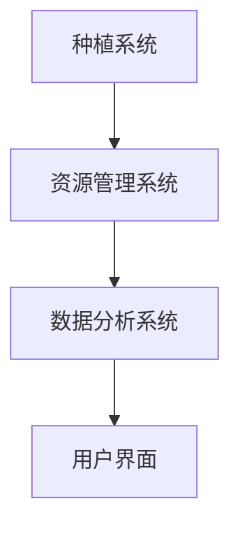

                 


# 巴菲特-芒格的垂直农业投资：未来食品生产的新模式

---

## 关键词

- 巴菲特投资
- 芒格投资
- 垂直农业
- 未来食品生产
- 农业技术

---

## 摘要

垂直农业是一种创新的农业模式，通过垂直空间的利用和先进技术的应用，显著提高了土地利用率和生产效率。巴菲特和芒格的投资策略以价值投资和多元思维模型闻名，他们对垂直农业的投资不仅体现了对行业趋势的精准把握，也展现了对技术创新的支持。本文将从垂直农业的概念、技术优势、系统架构、算法设计以及实际案例等方面，详细分析这一新模式对食品生产的影响，探讨巴菲特和芒格的投资逻辑。

---

## 第1章：垂直农业的定义与背景

### 1.1 垂直农业的起源与发展趋势

垂直农业是一种利用垂直空间进行作物种植的农业模式，起源于20世纪末，随着城市化进程的加快和土地资源的紧缺，逐渐受到关注。与传统农业相比，垂直农业具有以下优势：

- **高密度种植**：通过多层结构设计，垂直农业能够显著提高单位面积的产量。
- **资源节约**：垂直农业通常采用循环经济技术，减少水、肥料和能源的浪费。
- **环境适应性**：垂直农业可以灵活调整种植环境，适应不同的气候条件。

### 1.2 巴菲特与芒格的投资哲学

巴菲特和芒格的投资策略以长期价值为导向，注重企业基本面分析和管理层能力评估。芒格的多元思维模型强调跨学科思考，将复杂问题拆解为简单元素进行分析。

---

## 第2章：垂直农业的模式与技术应用

### 2.1 垂直农业的模式分析

#### 2.1.1 垂直种植模式

垂直种植模式采用多层立体结构，适合在城市中有限的土地上进行大规模作物种植。例如，利用屋顶或室内空间种植蔬菜和水果。

#### 2.1.2 垂直养殖模式

垂直养殖模式通过多层结构进行家禽或牲畜的养殖，显著提高养殖密度和效率。例如，垂直化禽养殖系统。

#### 2.1.3 综合垂直农业模式

综合垂直农业模式将种植和养殖结合，形成一个闭环系统，实现资源的高效利用和内部循环。

### 2.2 垂直农业的技术优势

#### 2.2.1 精准农业技术

精准农业技术通过传感器和数据分析，实现对作物生长环境的精确控制，优化种植条件。

#### 2.2.2 智能化管理技术

智能化管理技术利用物联网和人工智能，实现对农业生产的实时监控和智能决策。

#### 2.2.3 循环经济技术

循环经济技术通过废弃物资源化利用，减少农业生产的环境负担。

---

## 第3章：巴菲特与芒格的垂直农业投资策略

### 3.1 巴菲特与芒格的垂直农业投资逻辑

#### 3.1.1 投资的核心逻辑

- **长期价值**：巴菲特和芒格关注企业的长期价值，而非短期市场波动。
- **技术创新**：垂直农业的技术创新是吸引投资者的重要因素。
- **可持续性**：垂直农业模式具有较强的环境适应性和可持续性。

#### 3.1.2 投资的行业选择

- **高成长性**：垂直农业行业的高成长性符合巴菲特和芒格的投资偏好。
- **竞争优势**：企业是否具备技术壁垒和竞争优势。

#### 3.1.3 投资的长期视角

巴菲特和芒格的投资策略强调长期视角，认为垂直农业模式在未来具有广阔的发展前景。

---

## 第4章：垂直农业的技术原理与算法设计

### 4.1 垂直农业的算法设计

#### 4.1.1 种植优化算法

种植优化算法的目标是通过数学模型和优化算法，找到最优的种植方案。例如，利用线性规划模型进行种植计划的优化。

#### 4.1.2 资源分配算法

资源分配算法通过动态规划等方法，优化资源的分配和利用，提高生产效率。

---

## 第5章：系统架构与设计

### 5.1 垂直农业系统的架构设计

#### 5.1.1 系统功能设计

- **种植系统**：包括种植环境监控、作物生长状态监测等功能。
- **资源管理系统**：包括水肥管理、能源管理等功能。
- **数据分析系统**：包括数据采集、分析和决策支持。

#### 5.1.2 系统架构图



---

## 第6章：垂直农业项目实战

### 6.1 环境安装与系统实现

#### 6.1.1 环境安装

- 安装必要的软件和库，例如Python、NumPy、Matplotlib等。

#### 6.1.2 核心代码实现

以下是一个种植优化算法的Python代码示例：

```python
import numpy as np

def种植优化算法(土地面积, 水资源, 肥料资源):
    # 初始化参数
    种植面积 =土地面积
    水资源约束 =水资源
    肥料约束 =肥料资源
    
    # 构建优化模型
    model = {
        '目标函数': 'maximize 利润',
        '约束条件': [
            '土地使用 <= 土地面积',
            '水资源使用 <= 水资源约束',
            '肥料使用 <= 肥料约束'
        ]
    }
    
    # 解决优化问题
    解决方案 = 解优化模型(model)
    return 解决方案

# 示例调用
种植优化算法(1000, 500, 200)
```

---

## 第7章：实际案例分析

### 7.1 巴菲特和芒格的投资案例

#### 7.1.1 案例背景

以某垂直农业公司为例，该公司采用垂直种植模式，结合精准农业技术，实现了高效生产。

#### 7.1.2 投资分析

巴菲特和芒格通过分析公司的技术优势、市场前景和管理团队，决定投资该公司。

---

## 第8章：总结与展望

### 8.1 总结

垂直农业作为一种创新的农业模式，具有显著的技术优势和市场潜力。巴菲特和芒格的投资策略为这一行业的发展提供了重要支持。

### 8.2 展望

未来，随着技术的进步和政策的支持，垂直农业将在全球范围内得到更广泛的应用，成为未来食品生产的重要模式。

---

## 附录

### 附录A：参考文献

- 巴菲特《巴菲特致股东的信》
- 芒格《芒格投资思想》
- 垂直农业相关学术文献

### 附录B：进一步阅读

- 垂直农业技术发展现状与趋势
- 巴菲特和芒格的投资策略分析

---

## 作者信息

作者：AI天才研究院/AI Genius Institute & 禅与计算机程序设计艺术 /Zen And The Art of Computer Programming

