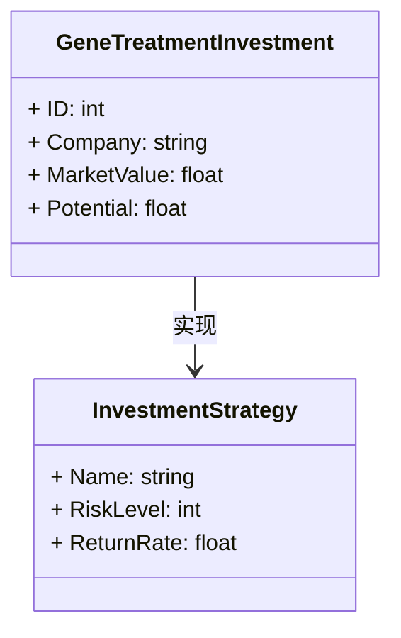
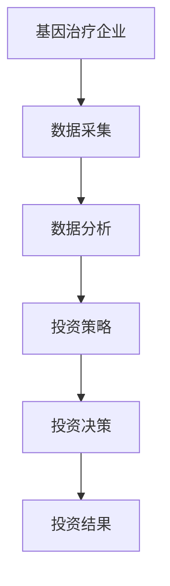
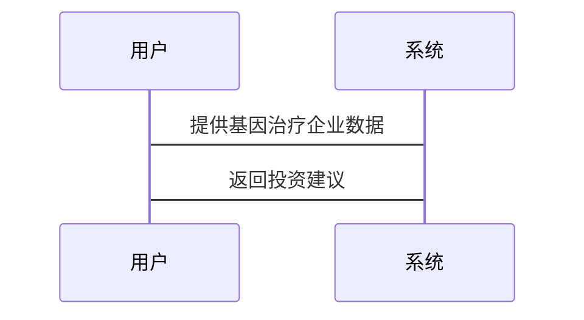

                 


# 巴菲特-芒格的基因治疗个性化医疗投资：精准医学的新纪元

> 关键词：巴菲特，芒格，基因治疗，精准医学，个性化医疗，投资策略，医疗科技创新

> 摘要：本文探讨了巴菲特和芒格在基因治疗和个性化医疗投资领域的独特见解，分析了精准医学如何开启医疗投资的新纪元。通过结合价值投资与精准医学的理念，文章深入解析了基因治疗的投资逻辑、算法原理、系统架构以及实际应用案例，为读者提供了全面的视角和深度分析。

---

# 第一部分: 巴菲特与芒格的基因治疗与个性化医疗投资背景

## 第1章: 巴菲特与芒格的背景与投资理念

### 1.1 巴菲特与芒格的背景介绍

#### 1.1.1 巴菲特的生平与投资哲学
沃伦·巴菲特（Warren Buffett）是全球闻名的价值投资者，他的投资哲学强调长期价值、安全边际和集中投资。巴菲特的成功不仅在于他的投资能力，还在于他对人性的深刻理解。他的名言“只有当潮水退去时，你才会知道谁在游泳”成为投资界的经典。

#### 1.1.2 芒格的智慧与决策思维
查理·芒格（Charlie Munger）是巴菲特的合作伙伴，他的多元思维模型（ Mental Models）是投资界的重要理论。芒格认为，投资者需要通过多个学科的交叉思考，才能做出更明智的决策。他的决策思维强调逻辑性、系统性和逆向思考。

#### 1.1.3 巴菲特与芒格合作的投资经典案例
巴菲特和芒格的经典合作案例包括可口可乐、富国银行等。这些案例展示了他们对长期价值和安全边际的坚持，以及对管理层能力和企业竞争优势的高度重视。

---

### 1.2 巴菲特与芒格的投资理念

#### 1.2.1 巴菲特的价值投资理论
巴菲特的价值投资理论强调购买低于内在价值的股票，长期持有优质企业，而非频繁交易。他注重企业的财务健康、管理层素质和行业地位。

#### 1.2.2 芒格的多元思维模型
芒格的多元思维模型强调通过多个学科的交叉思考，找到问题的本质。他认为，投资者需要避免“认知陷阱”，通过不断学习和反思来优化决策。

#### 1.2.3 两人投资理念的结合与互补
巴菲特和芒格的投资理念结合了长期价值和多元思考，形成了独特的投资风格。他们的合作不仅提升了投资决策的质量，还为医疗科技创新提供了新的视角。

---

## 第2章: 基因治疗与精准医学的背景

### 2.1 基因治疗的定义与发展

#### 2.1.1 基因治疗的基本概念
基因治疗是一种通过修改基因组来治疗或预防疾病的方法。它包括基因编辑、基因替换和基因增强等技术。

#### 2.1.2 基因治疗的历史演变
基因治疗的发展经历了从实验室研究到临床应用的漫长过程。近年来，CRISPR技术的突破推动了基因治疗的快速发展。

#### 2.1.3 基因治疗的技术突破与现状
当前，基因治疗在癌症治疗、遗传病矫正等领域取得了显著进展。技术的进步使得基因治疗更加精准和高效。

---

### 2.2 精准医学的定义与发展

#### 2.2.1 精准医学的基本概念
精准医学是基于个体基因、环境和生活方式的差异，制定个性化治疗方案的医学模式。

#### 2.2.2 精准医学的技术基础
精准医学依赖于基因测序、大数据分析和人工智能等技术。这些技术为个性化医疗提供了科学依据。

#### 2.2.3 精准医学在医疗领域的应用
精准医学已经在癌症治疗、罕见病诊断等领域取得了显著成效，未来有望进一步改变医疗行业的面貌。

---

## 第3章: 巴菲特与芒格与基因治疗的结合

### 3.1 巴菲特与芒格对基因治疗的关注

#### 3.1.1 巴菲特对医疗行业的投资逻辑
巴菲特长期关注医疗行业，认为其具备稳定的需求和长期增长潜力。他对基因治疗的前景持乐观态度，认为其将改变医疗行业。

#### 3.1.2 芒格对基因治疗的哲学思考
芒格认为，基因治疗是人类科技进步的重要成果，其投资价值在于其对人类健康的重大贡献。

#### 3.1.3 两人对基因治疗的长期价值判断
巴菲特和芒格都认为，基因治疗是医疗行业的未来方向，具备长期投资价值。

---

### 3.2 巴菲特与芒格的基因治疗投资策略

#### 3.2.1 价值投资在基因治疗领域的应用
巴菲特的价值投资策略强调选择具有长期竞争优势的企业。在基因治疗领域，他倾向于投资技术领先、管理优秀的企业。

#### 3.2.2 多元思维模型在基因治疗投资中的运用
芒格的多元思维模型帮助投资者全面评估基因治疗企业的价值，包括技术风险、市场需求和政策环境等多个维度。

#### 3.2.3 基因治疗投资的风险与机遇
基因治疗领域存在技术风险、政策风险和市场竞争风险。然而，其带来的医疗变革也为投资者提供了巨大机遇。

---

# 第二部分: 巴菲特与芒格的基因治疗投资核心概念与联系

## 第4章: 巴菲特与芒格基因治疗投资的核心概念

### 4.1 巴菲特与芒格投资模型的分析

#### 4.1.1 巴菲特的价值投资模型
巴菲特的价值投资模型强调内在价值、安全边际和长期持有。在基因治疗领域，他倾向于投资具有强大研发能力和市场潜力的企业。

#### 4.1.2 芒格的多元思维模型
芒格的多元思维模型强调跨学科思考，帮助投资者全面评估基因治疗企业的价值。

#### 4.1.3 两者模型的结合与应用
将巴菲特的价值投资模型与芒格的多元思维模型结合，可以为基因治疗投资提供更全面的视角。

---

### 4.2 基因治疗的核心机制

#### 4.2.1 基因治疗的原理
基因治疗通过修改基因组来治疗疾病，包括基因替换、基因编辑和基因增强等技术。

#### 4.2.2 基因治疗与精准医学的关系
基因治疗是精准医学的重要组成部分，其技术进步推动了个性化医疗的发展。

#### 4.2.3 基因治疗的临床应用
基因治疗已经在癌症治疗、遗传病矫正等领域取得了显著成效。

---

## 第5章: 巴菲特与芒格基因治疗投资的数学模型与算法原理

### 5.1 投资组合优化的数学模型

#### 5.1.1 投资组合优化的基本概念
投资组合优化是通过数学模型优化资产配置，以实现风险与收益的最优平衡。

#### 5.1.2 基因治疗投资的数学模型
在基因治疗投资中，可以通过线性规划或动态规划等数学模型优化投资组合。

#### 5.1.3 投资组合优化的公式
$$ \text{目标函数：} \min_{w} w^T \Sigma w $$
$$ \text{约束条件：} w^T \mu = \text{目标收益} $$

---

### 5.2 基因治疗投资的算法原理

#### 5.2.1 基因治疗投资的算法选择
在基因治疗投资中，可以使用机器学习算法进行预测和优化。

#### 5.2.2 机器学习算法的实现
通过训练基因治疗企业的历史数据，可以使用随机森林或支持向量机等算法预测企业的未来表现。

#### 5.2.3 算法实现的代码示例
```python
import pandas as pd
from sklearn.ensemble import RandomForestRegressor

# 加载数据
data = pd.read_csv('gene_treatment_data.csv')

# 分割特征与标签
X = data.drop('target', axis=1)
y = data['target']

# 训练模型
model = RandomForestRegressor()
model.fit(X, y)

# 预测结果
predictions = model.predict(X)
```

---

## 第6章: 巴菲特与芒格基因治疗投资的系统分析与架构设计

### 6.1 系统功能设计

#### 6.1.1 领域模型设计
通过绘制领域模型类图，展示基因治疗投资系统的主要组件和关系。



---

### 6.2 系统架构设计

#### 6.2.1 系统架构图
通过绘制系统架构图，展示基因治疗投资系统的整体架构。



---

### 6.3 系统接口设计

#### 6.3.1 系统接口设计
基因治疗投资系统的接口设计需要考虑数据输入、处理和输出的流程。

---

### 6.4 系统交互设计

#### 6.4.1 系统交互序列图
通过绘制系统交互序列图，展示基因治疗投资系统的用户与系统之间的交互流程。



---

## 第7章: 巴菲特与芒格基因治疗投资的项目实战

### 7.1 项目环境安装

#### 7.1.1 环境安装
需要安装Python、Pandas、Scikit-learn等工具。

```bash
pip install pandas scikit-learn
```

---

### 7.2 项目核心实现

#### 7.2.1 核心代码实现
```python
import pandas as pd
from sklearn.ensemble import RandomForestRegressor

# 加载数据
data = pd.read_csv('gene_treatment_data.csv')

# 分割特征与标签
X = data.drop('target', axis=1)
y = data['target']

# 训练模型
model = RandomForestRegressor()
model.fit(X, y)

# 预测结果
predictions = model.predict(X)

# 输出结果
print('预测结果:', predictions)
```

---

### 7.3 项目案例分析

#### 7.3.1 案例分析
以某家基因治疗企业为例，分析其投资价值。

---

## 第8章: 总结与展望

### 8.1 总结
本文探讨了巴菲特和芒格在基因治疗和精准医学领域的投资理念，分析了其与基因治疗投资的核心概念和数学模型，并通过实际案例展示了其投资策略的应用。

### 8.2 展望
未来，随着基因治疗技术的进一步发展，巴菲特和芒格的投资理念将为医疗科技创新提供更多的可能性。

---

# 附录

## 附录A: 参考文献

## 附录B: 巴菲特与芒格投资哲学的工具安装指南

## 附录C: 基因治疗与精准医学术语表

---

作者：AI天才研究院/AI Genius Institute & 禅与计算机程序设计艺术 /Zen And The Art of Computer Programming

