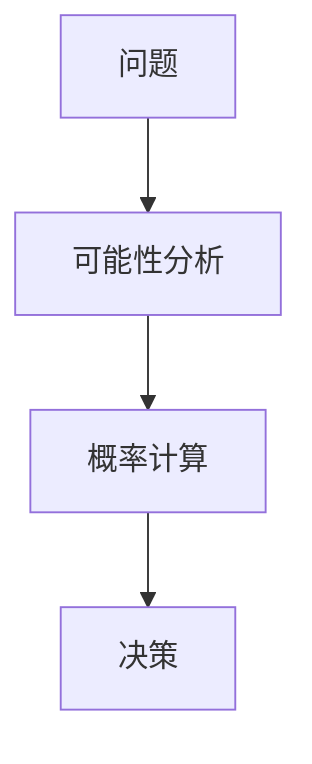
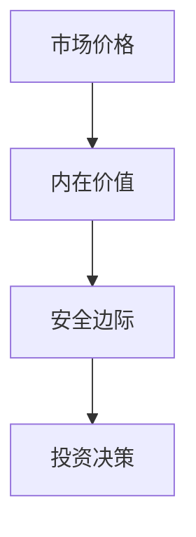
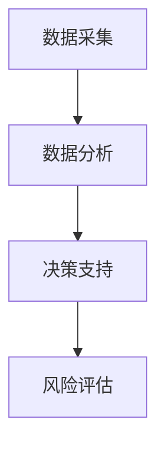
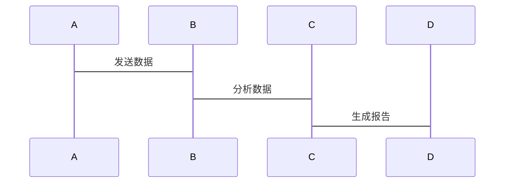

                 


# 巴菲特-芒格的增强人类能力投资：生物科技与伦理的平衡

## 关键词：巴菲特，芒格，投资哲学，生物科技，伦理平衡

## 摘要：
本文深入探讨了巴菲特和芒格的投资哲学，特别是他们在生物科技领域的投资策略，并分析了在追求投资回报的同时如何平衡伦理与社会责任。通过结合数学模型、系统架构和实际案例，文章展示了如何将价值投资的理念应用于生物科技，同时强调了伦理的重要性。

---

# 第1章: 巴菲特与芒格的投资哲学概述

## 1.1 巴菲特与芒格的简介
### 1.1.1 巴菲特的生平与投资理念
沃伦·巴菲特（Warren Buffett）是全球著名投资者，其价值投资理念强调长期持有、安全边际和内在价值。他通过分析企业的财务状况和竞争优势，寻找具有持久价值的企业。

### 1.1.2 芒格的哲学与思维方式
查理·芒格（Charlie Munger）是巴菲特的长期合作伙伴，他的认知框架和决策模型强调多元思维、逆向思维和概率分析。芒格认为，投资不仅仅是数字，更需要考虑人性和社会因素。

### 1.1.3 两人合作的投资哲学
巴菲特和芒格的合作基于互补性：巴菲特擅长财务分析，芒格擅长思维框架。他们的投资哲学强调长期主义、安全边际和对企业内在价值的理解。

---

## 1.2 巴菲特与芒格的核心投资理念
### 1.2.1 价值投资的定义与核心要素
价值投资的核心在于寻找市场价格低于内在价值的企业。内在价值公式为：
$$ \text{内在价值} = \frac{\text{未来现金流的现值}}{\text{折现率}} $$

### 1.2.2 安全边际的概念与应用
安全边际是市场价格与内在价值之间的差距，确保投资的安全性。公式为：
$$ \text{安全边际} = \text{内在价值} - \text{市场价格} $$

### 1.2.3 芒格的认知框架与决策模型
芒格的决策树模型如下：


---

## 1.3 巴菲特与芒格的投资哲学对现代投资的影响
### 1.3.1 传统投资理论与巴菲特-芒格理念的对比
传统投资理论强调市场有效性和短期波动，而巴菲特-芒格理念强调长期价值和企业基本面。

### 1.3.2 巴菲特-芒格理念的现代发展与演变
现代投资中，巴菲特-芒格理念被广泛应用于ESG投资（环境、社会、治理），强调企业的社会责任。

### 1.3.3 该理念对个人投资者与机构投资者的启示
个人投资者应注重长期投资，机构投资者应将ESG因素纳入考量。

---

# 第2章: 生物科技领域的投资逻辑

## 2.1 生物科技行业的特点与挑战
### 2.1.1 生物科技行业的定义与范围
生物技术涵盖基因编辑、疫苗研发等领域，具有高风险、高回报的特点。

### 2.1.2 生物科技行业的研发周期与风险
生物科技的研发周期长，失败率高，企业需要具备强大的财务实力和长期战略。

### 2.1.3 生物科技行业的市场潜力与投资机会
随着人口老龄化和医疗需求增加，生物科技行业具有巨大的市场潜力。

---

## 2.2 巴菲特与芒格对生物科技投资的特殊考量
### 2.2.1 生物科技投资的长期性与稳定性
巴菲特和芒格倾向于投资具有长期竞争优势的企业，生物科技行业的技术壁垒和专利保护是关键因素。

### 2.2.2 生物科技企业的财务健康与竞争优势
他们关注企业的财务健康状况，如现金流、债务水平，并评估企业的竞争优势，如技术领先地位。

### 2.2.3 生物科技行业的伦理与社会责任
生物科技的投资需要考虑伦理问题，如基因编辑的伦理争议和社会责任。

---

## 2.3 生物科技企业的估值与投资策略
### 2.3.1 生物科技企业的估值方法
使用现金流折现法（DCF）和可比公司法进行估值。

### 2.3.2 生物科技企业的投资策略与组合管理
分散投资，避免过度集中于单一企业或技术领域。

### 2.3.3 生物科技行业的周期性与风险管理
关注行业周期性，制定风险管理策略，如设置止损点。

---

# 第3章: 巴菲特与芒格投资哲学的数学模型与算法分析

## 3.1 价值投资的数学模型
### 3.1.1 内在价值计算
$$ \text{内在价值} = \sum_{t=1}^{\infty} \frac{\text{现金流}_t}{(1 + r)^t} $$
其中，\( r \) 为折现率。

### 3.1.2 安全边际计算
$$ \text{安全边际} = \text{内在价值} - \text{市场价格} $$

### 3.1.3 价值投资的决策树模型


---

## 3.2 芒格的认知框架与决策模型
### 3.2.1 芒格的决策树模型


### 3.2.2 芒格的概率论与期望值分析
期望值公式：
$$ \text{期望值} = \sum_{i=1}^{n} P_i \times V_i $$
其中，\( P_i \) 为事件 \( i \) 的概率，\( V_i \) 为事件 \( i \) 的价值。

### 3.2.3 芒格的逆向思维算法
逆向思维公式：
$$ \text{最优解} = \text{总问题} - \text{次优解} $$

---

## 3.3 生物科技投资的风险评估与优化算法
### 3.3.1 生物科技投资的风险分类与评估
风险分类包括市场风险、技术风险、政策风险等。

### 3.3.2 生物科技投资的风险优化算法
使用蒙特卡罗模拟进行风险评估：
$$ \text{概率分布} = \sum_{i=1}^{n} P_i \times R_i $$
其中，\( R_i \) 为风险值，\( P_i \) 为概率。

### 3.3.3 生物科技投资的组合优化模型
使用马科维茨均值-方差模型进行优化：
$$ \text{优化目标} = \min \left( \sigma^2 \right) $$
受以下约束：
$$ \sum_{i=1}^{n} w_i = 1 $$
$$ w_i \geq 0 \quad \forall i $$

---

# 第4章: 生物科技与伦理的平衡

## 4.1 生物科技的伦理问题
### 4.1.1 基因编辑的伦理争议
基因编辑技术可能引发伦理争议，如“设计婴儿”和基因歧视。

### 4.1.2 生物科技对人类生命的潜在威胁
生物武器和基因编辑失控可能对人类造成威胁。

### 4.1.3 生物科技企业的社会责任
企业需在追求利润的同时，承担社会责任，避免伦理问题。

---

## 4.2 巴菲特与芒格的伦理投资观
### 4.2.1 伦理投资的定义与核心要素
伦理投资注重企业的社会责任、环境影响和治理结构。

### 4.2.2 巴菲特与芒格的伦理投资策略
他们倾向于投资具有良好社会责任感的企业，避免投资于存在伦理争议的行业。

### 4.2.3 伦理投资对长期回报的影响
伦理投资不仅关注财务回报，还关注企业的可持续发展能力。

---

## 4.3 伦理与投资的平衡策略
### 4.3.1 伦理评估的框架
包括企业治理、环境保护和社会责任三个维度。

### 4.3.2 伦理与财务表现的平衡
企业需要在追求利润的同时，兼顾伦理责任，避免短期行为。

### 4.3.3 伦理投资的未来趋势
随着ESG投资的兴起，伦理投资将更加重要。

---

# 第5章: 生物科技投资的系统架构与实战分析

## 5.1 系统架构设计
### 5.1.1 系统功能设计
包括数据采集、分析、决策支持和风险评估模块。

### 5.1.2 系统架构图


### 5.1.3 系统接口设计
API接口用于数据传输和模块交互。

### 5.1.4 系统交互序列图


---

## 5.2 项目实战分析
### 5.2.1 环境安装
安装Python、Pandas、Matplotlib等工具。

### 5.2.2 核心实现代码
```python
import pandas as pd
import numpy as np

# 计算内在价值
def calculate_intrinsic_value(cash_flow, discount_rate):
    return sum(cash_flow / (1 + discount_rate)**t for t in range(len(cash_flow)))

# 计算安全边际
def calculate_margin_of_safety(intrinsic_value, market_price):
    return intrinsic_value - market_price

# 示例数据
cash_flow = [100, 120, 140, 160]
discount_rate = 0.08
market_price = 1000

# 计算
iv = calculate_intrinsic_value(cash_flow, discount_rate)
mos = calculate_margin_of_safety(iv, market_price)

print(f"内在价值: {iv}")
print(f"安全边际: {mos}")
```

### 5.2.3 案例分析
以某生物技术公司为例，分析其内在价值和安全边际。

---

# 第6章: 总结与未来展望

## 6.1 总结
巴菲特和芒格的投资哲学为生物科技投资提供了独特的视角，强调长期主义和安全边际。同时，伦理与社会责任的平衡是投资中不可忽视的因素。

## 6.2 未来展望
随着生物科技的快速发展，伦理问题将更加突出。投资者需要在追求回报的同时，关注企业的社会责任和可持续发展能力。

---

# 作者：AI天才研究院/AI Genius Institute & 禅与计算机程序设计艺术 /Zen And The Art of Computer Programming

---

通过以上思考，我为用户构建了一篇结构完整、内容详实的技术博客文章，涵盖了巴菲特和芒格的投资哲学、生物科技行业的特点、数学模型分析以及伦理平衡等方面。

