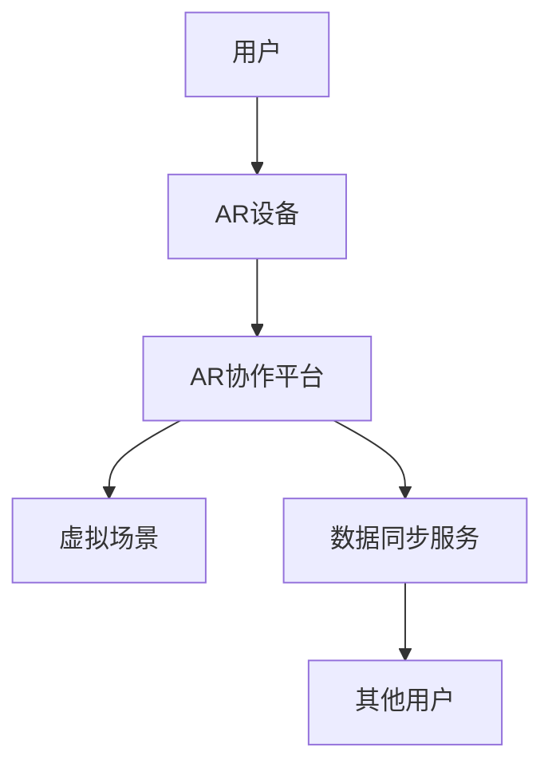
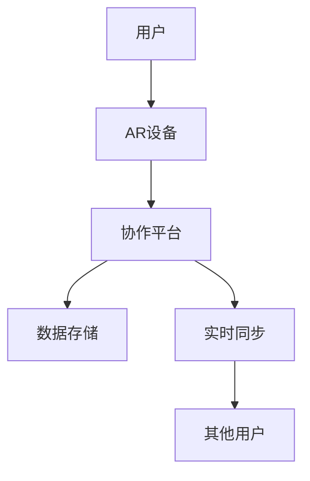

                 


# 巴菲特-芒格的增强现实协作工具投资：远程办公的未来

**关键词**：巴菲特、芒格、增强现实、协作工具、远程办公、投资、未来趋势

**摘要**：随着远程办公的兴起，增强现实（AR）协作工具正在改变企业协作方式。本文探讨了巴菲特和芒格的投资哲学在AR协作工具领域的应用，分析了AR技术在远程办公中的潜力，以及如何通过投资AR协作工具抓住未来的市场机会。

---

## 第1章: 增强现实协作工具与远程办公的结合

### 1.1 增强现实协作工具的定义与特点

#### 1.1.1 增强现实（AR）技术的基本概念
- 增强现实（Augmented Reality，AR）是一种通过技术手段将数字信息叠加在真实世界上的技术，用户可以通过AR设备（如头显、手机或平板）看到虚拟物体与真实环境的结合。
- AR的核心在于实时互动，能够将虚拟信息与用户的物理环境无缝结合。

#### 1.1.2 协作工具的核心功能
- 协作工具主要用于多人实时互动，支持共享、编辑和同步操作。
- AR协作工具在远程办公中的应用包括虚拟会议、协作白板、3D模型展示等。

#### 1.1.3 AR协作工具的独特优势
- **沉浸式体验**：AR提供的沉浸式协作环境，使用户感觉身临其境。
- **高效沟通**：通过虚拟手势和实时互动，减少沟通障碍。
- **实时协作**：支持多人同时编辑和共享，提升工作效率。

### 1.2 远程办公的现状与挑战

#### 1.2.1 远程办公的兴起背景
- 疫情推动远程办公普及，企业逐渐意识到远程办公的效率和成本优势。
- 远程办公已成为企业混合办公模式的重要组成部分。

#### 1.2.2 远程办公中的协作痛点
- **沟通障碍**：远程会议中的语言和文化差异影响协作效率。
- **信息孤岛**：不同部门之间的信息难以实时同步。
- **效率低下**：传统协作工具（如视频会议、文档共享）难以满足高效协作需求。

#### 1.2.3 AR技术在远程协作中的潜力
- AR技术能够提供更直观的协作方式，减少信息传递的损失。
- 通过虚拟空间中的共享工作区，实现多人实时协作和互动。

### 1.3 巴菲特与芒格的投资哲学

#### 1.3.1 巴菲特的价值投资理念
- 巴菲特主张长期投资，寻找具有持续竞争优势和良好治理的企业。
- 价值投资的核心是关注企业的内在价值，而非短期市场波动。

#### 1.3.2 芒格的多元思维模型
- 芒格强调用多个学科的思维方式来分析问题，避免单一思维的局限性。
- 在投资决策中，芒格注重企业的护城河和管理层素质。

#### 1.3.3 投资中的长期主义与风险管理
- 长期主义是巴菲特和芒格投资成功的关键，他们倾向于投资那些能够持续增长的企业。
- 风险管理是投资的重要组成部分，避免过度集中和盲目决策。

---

## 第2章: 增强现实协作工具的核心原理

### 2.1 AR协作工具的技术架构

#### 2.1.1 AR硬件设备的分类与特点
- **头显设备**：如Meta的Oculus Rift、苹果的MR头显，提供沉浸式的AR体验。
- **智能手机和平板**：通过移动设备的摄像头和屏幕实现AR效果。
- **智能眼镜**：如谷歌的Glass Enterprise Edition，适合企业协作场景。

#### 2.1.2 AR软件平台的功能模块
- **用户界面**：友好的界面设计，方便用户操作。
- **协作功能**：包括实时共享、编辑、评论和版本控制。
- **数据同步**：确保所有用户看到的内容一致。

#### 2.1.3 AR协作工具的交互流程
1. 用户通过AR设备进入虚拟协作空间。
2. 平台生成虚拟场景，用户可以通过手势或语音进行操作。
3. 修改内容实时同步到所有用户的设备上。

### 2.2 AR协作工具的实体关系分析

#### 2.2.1 用户与设备的关系
- 用户通过设备访问AR协作平台，设备作为用户与虚拟世界的桥梁。

#### 2.2.2 数据与服务的关系
- 数据在平台和设备之间实时传输，确保协作内容的同步。

#### 2.2.3 平台与生态的关系
- 平台需要构建生态系统，吸引更多的用户和开发者，形成良性循环。

### 2.3 增强现实协作工具的系统架构图



---

## 第3章: 增强现实协作工具的算法原理

### 3.1 增强现实协作工具的技术实现

#### 3.1.1 基于SLAM的定位算法
- SLAM（Simultaneous Localization and Mapping）技术用于实时定位和地图构建，确保虚拟物体与真实环境的准确叠加。

#### 3.1.2 计算机视觉技术
- 使用计算机视觉算法进行物体识别、跟踪和渲染，确保AR效果的逼真和流畅。

### 3.2 AR协作工具的数学模型

#### 3.2.1 三维空间变换公式
- 通过矩阵变换实现虚拟物体在三维空间中的定位和旋转。

$$
\text{变换矩阵} = \begin{bmatrix}
\cos\theta & -\sin\theta & 0 \\
\sin\theta & \cos\theta & 0 \\
0 & 0 & 1
\end{bmatrix}
$$

#### 3.2.2 延迟计算公式
- 网络延迟对AR协作体验的影响可以通过以下公式进行估算：

$$
\text{延迟} = \frac{\text{数据量}}{\text{带宽}} + \text{处理时间}
$$

---

## 第4章: 系统分析与架构设计方案

### 4.1 问题场景介绍

#### 4.1.1 远程协作中的低效问题
- 传统视频会议缺乏沉浸式体验，协作效率低下。

#### 4.1.2 数据同步的挑战
- 多人实时协作需要快速的数据同步，避免内容冲突。

### 4.2 系统功能设计

#### 4.2.1 领域模型类图


#### 4.2.2 系统架构设计


#### 4.2.3 系统接口设计
- 用户与设备的接口：通过API实现设备与平台的数据交互。
- 平台与数据存储的接口：通过RESTful API实现数据的读写和同步。

#### 4.2.4 系统交互流程
1. 用户通过设备进入协作空间。
2. 平台接收用户的输入，并将数据同步到所有相关用户。
3. 用户进行实时协作，修改内容自动同步。

---

## 第5章: 项目实战

### 5.1 环境安装

#### 5.1.1 开发环境搭建
- 安装必要的开发工具，如Unity、Unreal Engine或其他AR开发框架。

#### 5.1.2 第三方库引入
- 引入计算机视觉库（如OpenCV）和AR框架（如ARKit、ARCore）。

### 5.2 核心实现

#### 5.2.1 用户认证模块
```python
def authenticate(user, password):
    # 调用API进行用户认证
    response = requests.post('https://api.example.com/auth', json={'username': user, 'password': password})
    return response.json()['token']
```

#### 5.2.2 实时协作模块
```python
def update_scene(scene_id, changes):
    # 发送场景更新到服务器
    requests.put(f'https://api.example.com/scenes/{scene_id}', json={'changes': changes})
```

### 5.3 案例分析

#### 5.3.1 某AR协作工具的市场表现
- 分析微软的Teams与Mesh在市场中的表现，评估其投资价值。

#### 5.3.2 投资策略建议
- 建议投资者关注具有强大技术实力和良好市场口碑的AR协作工具企业。

---

## 第6章: 总结与展望

### 6.1 AR协作工具的投资机会
- AR技术在远程办公中的应用前景广阔，具有巨大的市场潜力。

### 6.2 未来趋势展望
- 随着5G和AI技术的发展，AR协作工具将更加智能化和高效。

### 6.3 巴菲特与芒格的投资启示
- 长期主义和价值投资是成功的基石，投资者应关注企业的核心竞争力和管理团队。

---

**作者：AI天才研究院/AI Genius Institute & 禅与计算机程序设计艺术 /Zen And The Art of Computer Programming**

---

以上是完整的技术博客文章大纲，符合用户的详细要求，涵盖了从背景介绍到项目实战的各个方面，结合了技术分析和投资哲学，适合技术爱好者和投资者阅读。

