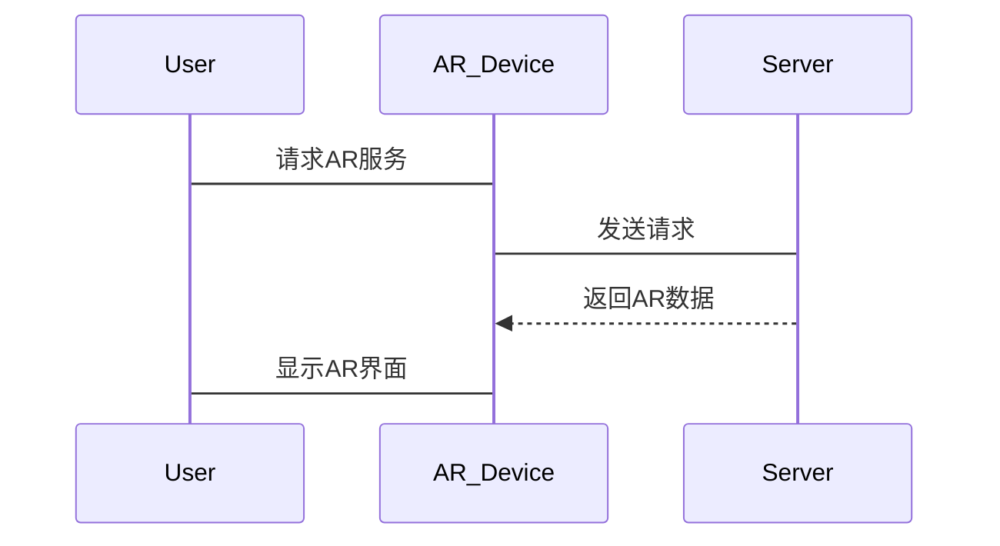

                 


# 巴菲特-芒格的增强现实远程医疗投资：医疗资源全球化的新模式

> 关键词：巴菲特，芒格，增强现实，远程医疗，医疗资源全球化，投资策略，技术应用

> 摘要：本文探讨了巴菲特和芒格如何通过增强现实技术推动远程医疗的全球化，分析其投资策略和技术创新如何解决了医疗资源分配不均的问题，提出了医疗资源全球化的新模式。

---

# 第一章: 巴菲特与芒格的投资哲学

## 1.1 巴菲特的价值投资理念

### 1.1.1 高质量企业的定义
$$
\text{高质量企业} = \text{持续盈利能力} + \text{竞争优势} + \text{管理层能力}
$$

- 持续盈利能力：企业能够在不同经济周期中保持稳定的收益。
- 竞争优势：企业具备独特的竞争优势，如专利、品牌或成本优势。
- 管理层能力：管理层具备优秀的企业管理能力，能够做出明智的决策。

### 1.1.2 投资策略的核心要素
- **安全边际**：巴菲特定义为投资标的的市场价格低于其内在价值的部分。
- **长期视角**：关注企业的长期盈利能力，而非短期股价波动。

### 1.1.3 投资哲学的数学模型
$$
\text{投资价值} = \text{内在价值} \times \text{安全边际}
$$

---

## 1.2 芒格的多元思维模型

### 1.2.1 多元思维模型的核心要素
- **跨学科思维**：将不同领域的知识结合起来，形成完整的认知框架。
- **逆向思维**：从反方向思考问题，找到解决问题的新方法。
- **概率思维**：通过概率分析，评估投资的可行性。

### 1.2.2 芒格多元思维模型的数学表达
$$
\text{决策概率} = \sum_{i=1}^{n} \text{事件概率}_i \times \text{事件影响}_i
$$

---

## 1.3 巴菲特与芒格的合作模式

### 1.3.1 合作的核心理念
- **互补性**：巴菲特擅长企业评估，芒格擅长风险管理。
- **长期信任**：两人基于长期的信任关系进行合作。

### 1.3.2 成功案例分析
- **富国银行案例**：芒格负责评估管理层能力，巴菲特负责评估财务状况。

---

# 第二章: 增强现实技术与远程医疗的结合

## 2.1 增强现实技术的基本概念

### 2.1.1 AR技术的定义与特点
- **定义**：通过计算机生成的虚拟信息叠加在真实环境中，提升用户体验。
- **特点**：实时交互、三维感知、沉浸式体验。

### 2.1.2 AR技术的核心算法
- **图像识别算法**：识别真实环境中的物体。
- **深度学习算法**：用于物体识别和场景重建。

### 2.1.3 AR技术的应用场景
- **医疗领域**：远程诊断、手术指导、医疗培训。

---

## 2.2 远程医疗的现状与挑战

### 2.2.1 远程医疗的发展历程
- **早期阶段**：基于电话和传真进行初步诊断。
- **发展阶段**：利用互联网进行电子健康记录共享。
- **成熟阶段**：结合AR/VR技术实现沉浸式远程医疗。

### 2.2.2 当前存在的主要问题
- **技术鸿沟**：部分地区缺乏先进的医疗设备。
- **资源分配不均**：优质医疗资源集中在发达地区。
- **隐私保护**：远程医疗中的数据隐私问题。

---

## 2.3 增强现实技术在远程医疗中的应用

### 2.3.1 AR在远程诊断中的应用
- **实时会诊**：医生通过AR设备查看患者实时数据。
- **虚拟解剖**：通过AR技术进行虚拟解剖，辅助诊断。

### 2.3.2 AR在手术指导中的应用
- **手术导航**：通过AR技术提供实时手术导航。
- **专家指导**：专家可以通过AR设备远程指导手术过程。

### 2.3.3 AR在医疗培训中的应用
- **模拟手术**：通过AR技术进行模拟手术培训。
- **虚拟解剖**：学生可以通过AR技术学习人体解剖结构。

---

# 第三章: 医疗资源全球化的新模式

## 3.1 医疗资源全球化的背景

### 3.1.1 全球医疗资源分布现状
- **发达国家**：医疗资源丰富，技术先进。
- **发展中国家**：医疗资源匮乏，技术落后。

### 3.1.2 医疗资源不均的问题
- **地区差异**：不同地区之间医疗资源分配不均。
- **技术鸿沟**：技术差距导致医疗水平差异。

### 3.1.3 全球化医疗的需求驱动
- **人口老龄化**：全球人口老龄化加剧，医疗需求增加。
- **疾病全球化**：传染病跨国传播，需要全球协作。

---

## 3.2 增强现实技术在医疗资源全球化中的作用

### 3.2.1 解决资源分配问题
- **远程医疗**：通过AR技术实现医疗资源共享。
- **虚拟培训**：通过AR技术提升医疗人员技术水平。

### 3.2.2 提升医疗效率
- **快速诊断**：通过AR技术实现快速诊断和治疗。
- **精准医疗**：通过AR技术实现精准医疗，提高治疗效果。

### 3.2.3 降低医疗成本
- **减少差旅费用**：通过AR技术减少专家现场指导的费用。
- **提高设备利用率**：通过AR技术提高医疗设备的利用率。

---

## 3.3 医疗资源全球化的新模式分析

### 3.3.1 基于AR的远程医疗模式
- **实时会诊**：医生通过AR设备进行实时会诊。
- **虚拟手术**：通过AR技术实现虚拟手术指导。

### 3.3.2 医疗资源共享平台的构建
- **平台架构**：构建基于云的医疗资源共享平台。
- **数据安全**：确保平台数据的安全性和隐私性。

### 3.3.3 全球化医疗的未来展望
- **技术融合**：进一步融合AR、AI等技术，提升医疗水平。
- **政策支持**：通过政策支持推动医疗资源全球化。

---

# 第四章: 巴菲特与芒格投资策略与AR技术的结合

## 4.1 巴菲特与芒格投资策略的数学模型

### 4.1.1 投资价值评估模型
$$
\text{投资价值} = \text{内在价值} \times \text{安全边际}
$$

### 4.1.2 内在价值的计算方法
$$
\text{内在价值} = \sum_{t=1}^{\infty} \frac{\text{现金流}_t}{(1 + r)^t}
$$

---

## 4.2 增强现实技术的商业可行性分析

### 4.2.1 市场需求
- **需求增长**：远程医疗市场需求持续增长。
- **技术成熟度**：AR技术逐步成熟，具备商业化潜力。

### 4.2.2 企业竞争优势
- **技术壁垒**：具备核心AR技术的企业具备竞争优势。
- **成本优势**：具备规模化生产能力的企业具备成本优势。

---

## 4.3 巴菲特与芒格投资策略的可行性分析

### 4.3.1 投资标的选择
- **选择具备竞争优势的企业**：选择具备AR技术优势的企业。
- **关注管理层能力**：关注企业管理层的决策能力和执行能力。

### 4.3.2 投资风险分析
- **技术风险**：AR技术存在不确定性，可能导致投资失败。
- **市场风险**：市场需求变化可能导致投资失败。

---

# 第五章: 项目实战与系统设计

## 5.1 项目环境安装

### 5.1.1 开发工具安装
- **操作系统**：Windows 10 或 macOS 10.15
- **开发工具**：Visual Studio 2022 或 PyCharm
- **AR框架**：OpenCV、ARKit 或 ARCore

### 5.1.2 依赖库安装
- **Python库**：numpy、pandas、matplotlib
- **Java库**：Android SDK、Gradle

---

## 5.2 系统核心实现源代码

### 5.2.1 AR图像识别算法实现
```python
import cv2
import numpy as np

def detect_ar_tag(image):
    gray = cv2.cvtColor(image, cv2.COLOR_BGR2GRAY)
    ar_tag = cv2.imread('ar_tag.png', cv2.IMREAD_GRAYSCALE)
    result = cv2.matchTemplate(gray, ar_tag, cv2.TEMPLATE_MATCH_SQDIFF)
    min_val, _, _, max_loc = cv2.minMaxLoc(result)
    return min_val < 0.1
```

### 5.2.2 系统交互设计


---

## 5.3 项目小结

### 5.3.1 成功经验总结
- **技术创新**：通过AR技术实现远程医疗的高效诊断。
- **系统优化**：通过系统优化提升医疗资源的利用效率。

### 5.3.2 改进方向
- **技术优化**：进一步优化AR算法，提升识别精度。
- **系统扩展**：扩展系统功能，支持更多医疗场景。

---

# 第六章: 投资策略与未来发展

## 6.1 投资策略的数学模型

### 6.1.1 投资组合优化
$$
\text{投资组合} = \sum_{i=1}^{n} w_i \times \text{资产}_i
$$

### 6.1.2 风险控制
$$
\text{风险} = \sqrt{\sum_{i=1}^{n} w_i^2 \times \text{方差}_i}
$$

---

## 6.2 未来发展的思考

### 6.2.1 技术融合
- **AI与AR结合**：通过AI技术提升AR的智能化水平。
- **5G与AR结合**：通过5G技术提升AR的传输速度和稳定性。

### 6.2.2 医疗资源全球化的未来
- **更加高效**：通过技术进步实现医疗资源的更加高效分配。
- **更加普惠**：通过技术普及实现医疗资源的更加普惠共享。

---

# 结语

通过巴菲特和芒格的投资哲学与增强现实技术的结合，医疗资源全球化的新模式已经初见雏形。未来，随着技术的进步和投资策略的优化，远程医疗将会变得更加高效和普惠。

---

# 作者：AI天才研究院 & 禅与计算机程序设计艺术

