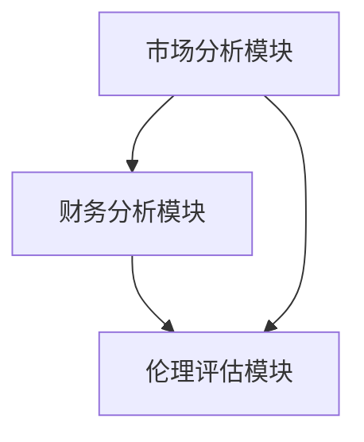

                 


# 巴菲特-芒格的太空旅游伦理投资：商业化与科研的平衡

> 关键词：巴菲特, 芒格, 太空旅游, 伦理投资, 商业化, 科研平衡

> 摘要：本文探讨了巴菲特和芒格在太空旅游领域的投资策略与伦理考量，分析了商业化与科研之间的平衡点，提出了基于价值投资和多元思维模型的伦理投资框架，结合系统架构设计与数学模型，为投资者提供了实用的决策参考。

---

## 第一章: 巴菲特与芒格的投资哲学

### 1.1 巴菲特的生平与投资理念

#### 1.1.1 巴菲特的生平
沃伦·巴菲特（Warren Buffett）是世界著名投资者，出生于1934年，被誉为“股神”。他创立的伯克希尔·哈撒韦公司（Berkshire Hathaway）是全球最大的投资公司之一。巴菲特的投资理念以价值投资为核心，强调长期稳健的投资策略。

#### 1.1.2 巴菲特的投资理念
- **价值投资**：寻找市场中被低估的公司，长期持有，等待其价值回归。
- **安全边际**：在投资时留有安全边际，即以低于内在价值的价格买入。
- **集中投资**：将资金集中在少数优质资产上，而不是分散投资。

#### 1.1.3 巴菲特的标志性投资事件
- 1970年代收购国民鞋业公司（国民西尔斯百货）。
- 1980年代开始投资可口可乐公司，长期持有。

---

### 1.2 芒格的生平与投资哲学

#### 1.2.1 芒格的生平
查理·芒格（Charlie Munger）是巴菲特的长期合作伙伴，出生于1924年，是伯克希尔·哈撒韦公司的副主席。芒格以多元思维模型闻名，强调通过跨学科思考来做出决策。

#### 1.2.2 芒格的投资理念
- **多元思维模型**：通过多个学科的思维方式来分析问题，避免单一维度的决策。
- **逆向思维**：从反方向思考问题，寻找别人忽略的机会。
- **认知的局限性**：承认自己的认知局限，避免过度自信。

#### 1.2.3 芒格的标志性投资事件
- 1970年代与巴菲特合作收购伯克希尔·哈撒韦。
- 1980年代开始投资苹果公司，长期持有。

---

## 第二章: 太空旅游的定义与发展现状

### 2.1 太空旅游的定义与分类

#### 2.1.1 太空旅游的定义
太空旅游是指人类通过商业化的航天器进入地球大气层以外的空间，进行观光、科研或娱乐活动。

#### 2.1.2 太空旅游的分类
- **亚轨道旅游**：飞行高度在50-100公里，乘客体验失重。
- **低地球轨道旅游**：飞行高度在160-2000公里，可进入国际空间站。
- **深空旅游**：探索月球、火星等更远的天体。

---

### 2.2 太空旅游的发展现状

#### 2.2.1 太空旅游的发展历史
- 2000年代：私人航天公司（如SpaceX、Blue Origin）开始发展。
- 2010年代：亚轨道旅游逐渐商业化。
- 2020年代：低地球轨道旅游逐步实现。

#### 2.2.2 太空旅游的主要参与者
- **SpaceX**：埃隆·马斯克（Elon Musk）创立，目标是实现火星殖民。
- **Blue Origin**：杰夫·贝索斯（Jeff Bezos）创立，专注于亚轨道旅游。
- **维珍银河**（Virgin Galactic）：理查德·布兰森（Richard Branson）创立，提供亚轨道旅游服务。

---

### 2.3 太空旅游的伦理问题与争议

#### 2.3.1 环境影响
- 太空旅游可能对地球环境造成影响，例如火箭发射释放的污染物。
- 太空垃圾的增加对现有卫星和航天器构成威胁。

#### 2.3.2 社会公平
- 太空旅游目前主要面向富人群体，可能加剧社会不平等。
- 资源分配的不均可能导致贫富差距进一步扩大。

#### 2.3.3 科研优先
- 商业化可能挤占科研资源，影响太空探索的长期目标。
- 如何平衡短期商业利益与长期科研投入？

---

## 第三章: 巴菲特与芒格的投资分析方法

### 3.1 巴菲特的价值投资理论

#### 3.1.1 价值投资的核心理念
巴菲特的价值投资理论强调寻找具有持续竞争优势、良好治理和稳定现金流的公司。他通过分析公司的基本面，寻找市场价格低于内在价值的投资机会。

#### 3.1.2 巴菲特的价值投资方法
- **分析公司财务报表**：关注盈利能力、资产负债表和现金流。
- **评估管理层**：信任管理层的诚信和能力。
- **寻找安全边际**：以低于内在价值的价格买入。

---

### 3.2 芒格的多元思维模型

#### 3.2.1 多元思维模型的定义
多元思维模型是指通过多个学科的思维方式来分析问题，避免单一维度的决策。芒格认为，跨学科的思考可以帮助投资者避免认知偏差。

#### 3.2.2 芒格的决策框架
- **认知的局限性**：承认自己的认知局限，避免过度自信。
- **逆向思维**：从反方向思考问题，寻找别人忽略的机会。
- **跨学科思考**：结合心理学、经济学、物理学等学科的原理进行决策。

---

## 第四章: 太空旅游投资的伦理平衡

### 4.1 太空旅游的商业化与伦理冲突

#### 4.1.1 商业化带来的伦理问题
- 太空旅游可能加剧社会不平等，导致资源分配不均。
- 商业化可能挤占科研资源，影响太空探索的长期目标。

#### 4.1.2 伦理投资的原则
- **长期价值**：关注公司的长期价值，而非短期收益。
- **社会影响**：评估投资对社会和环境的综合影响。
- **风险管理**：平衡短期收益与长期风险。

---

### 4.2 科研与商业的平衡之道

#### 4.2.1 科研投入与商业回报的关系
- **短期**：科研投入可能需要大量的资金和时间，回报周期长。
- **长期**：科研成果可能带来技术突破，推动整个行业的商业化。

#### 4.2.2 科研成果的商业化路径
- **技术转化**：将科研成果转化为商业化产品。
- **战略合作**：与政府、科研机构合作，共同推动技术发展。

---

## 第五章: 太空旅游投资的系统分析与架构设计

### 5.1 系统分析

#### 5.1.1 投资目标与问题场景
- **目标**：寻找具有长期价值的太空旅游公司。
- **问题场景**：商业化与科研之间的平衡。

#### 5.1.2 项目需求分析
- **需求1**：分析太空旅游市场的潜力。
- **需求2**：评估公司的财务状况和管理层能力。
- **需求3**：平衡商业化与科研投入。

---

### 5.2 系统架构设计

#### 5.2.1 系统功能设计
- **模块1**：市场分析模块。
- **模块2**：财务分析模块。
- **模块3**：伦理评估模块。

#### 5.2.2 系统架构图


---

## 第六章: 太空旅游投资的算法原理与数学模型

### 6.1 价值评估模型

#### 6.1.1 价值评估模型的构建
$$ V = \frac{E}{k} $$
其中，$V$ 是内在价值，$E$ 是公司未来现金流的现值，$k$ 是折现率。

#### 6.1.2 案例分析
假设某公司未来现金流为1000万元，折现率为10%。
$$ V = \frac{1000}{0.1} = 10000万元 $$

---

## 第七章: 项目实战

### 7.1 环境安装

#### 7.1.1 安装Python
```bash
pip install numpy pandas matplotlib
```

#### 7.1.2 安装Mermaid
```bash
npm install -g mermaid-js
```

---

## 第八章: 结语

### 8.1 最佳实践 Tips
- **长期价值**：投资太空旅游公司时，关注其长期价值。
- **伦理考量**：平衡商业化与科研投入，关注社会影响。
- **风险管理**：评估投资风险，避免过度集中。

### 8.2 小结
本文结合巴菲特和芒格的投资哲学，分析了太空旅游的商业化与科研平衡问题，提出了基于价值投资和多元思维模型的伦理投资框架，为投资者提供了实用的决策参考。

---

**作者：AI天才研究院/AI Genius Institute & 禅与计算机程序设计艺术 /Zen And The Art of Computer Programming**

