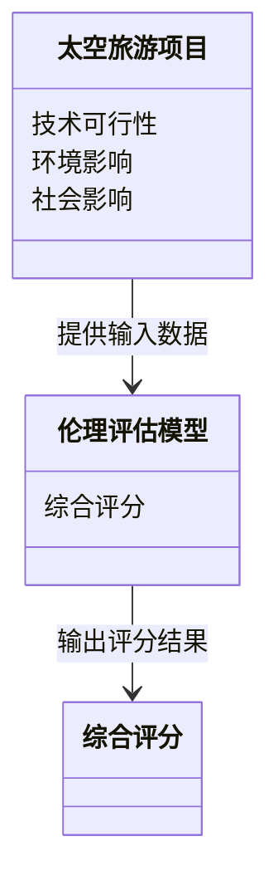

                 


# 巴菲特-芒格的太空旅游伦理投资：探索与保护的平衡

> 关键词：太空旅游，伦理投资，巴菲特，芒格，探索与保护

> 摘要：本文探讨了巴菲特和芒格在太空旅游投资中的伦理观点，分析了如何在探索太空与保护地球生态之间找到平衡。通过构建伦理评估模型和系统架构，提出了可持续的太空旅游投资策略。

---

## 第一部分：太空旅游与投资的背景介绍

### #1 章: 太空旅游的定义与现状

#### 1.1 太空旅游的定义
太空旅游是指通过商业航天技术，将普通人送入太空进行观光或科学研究的活动。近年来，随着技术进步，太空旅游逐渐从政府主导转向商业驱动。

#### 1.2 当前太空旅游的发展现状
- **技术进步**：SpaceX、Blue Origin等公司推动了私人航天技术的发展。
- **市场规模**：预计2023年市场规模达到数亿美元，未来将快速增长。
- **主要参与者**：包括埃隆·马斯克、杰夫·贝索斯等企业家。

#### 1.3 太空旅游的市场潜力与挑战
- **潜力**：未来可能成为大众消费品，市场规模有望超过千亿美元。
- **挑战**：技术风险高、成本昂贵、法律监管不完善。

### #2 章: 巴菲特与芒格的投资哲学

#### 1.1 巴菲特的价值投资理念
- **长期价值**：关注企业的长期盈利能力，而非短期波动。
- **安全边际**：投资时留有安全边际，降低风险。

#### 1.2 芒格的多元思维模型
- **跨学科思维**：将不同领域的知识融会贯通，形成决策依据。
- **逆向思维**：从反面思考问题，寻找投资机会。

---

## 第二部分：太空旅游投资的伦理框架

### #3 章: 伦理投资的核心概念

#### 3.1 伦理投资的定义
伦理投资是在追求经济效益的同时，考虑环境、社会和治理（ESG）因素的投资方式。

#### 3.2 太空旅游投资中的伦理问题
- **环境影响**：太空探索可能对地球环境造成负面影响。
- **社会责任**：投资是否促进社会福祉，而非仅追求利润。

#### 3.3 伦理框架的构建
- **目标**：确保投资行为符合伦理标准。
- **方法**：结合巴菲特和芒格的哲学，制定伦理评估模型。

### #4 章: 巴菲特与芒格的伦理投资观点

#### 4.1 巴菲特的长期价值观
- **长期视角**：关注企业的可持续发展，而非短期收益。
- **安全边际**：在太空旅游投资中，确保资金安全，避免高风险项目。

#### 4.2 芒格的多元思维模型
- **跨学科分析**：将物理学、伦理学等知识融入投资决策。
- **逆向思维**：寻找被低估的太空项目，同时考虑其社会影响。

---

## 第三部分：探索与保护的平衡

### #5 章: 太空探索的伦理考量

#### 5.1 太空探索的科学价值
- **技术进步**：推动航天技术发展，促进人类文明。
- **知识积累**：为科学研究提供数据，增进人类对宇宙的认知。

#### 5.2 太空探索的环境影响
- **资源消耗**：发射火箭会产生大量二氧化碳，加剧气候变化。
- **太空污染**：废弃的航天器可能威胁其他航天器的安全。

#### 5.3 探索与保护的伦理冲突
- **短期利益 vs 长期责任**：如何在追求商业利益的同时，保护地球环境。
- **技术创新 vs 生态保护**：技术进步是否以牺牲环境为代价。

### #6 章: 保护地球生态的伦理责任

#### 6.1 地球生态系统的脆弱性
- **生态链依赖**：地球生态系统的每个环节都相互关联，破坏一个环节可能引发连锁反应。
- **人类活动的影响**：工业活动、旅游开发等对地球生态造成压力。

#### 6.2 太空旅游对地球生态的影响
- **资源消耗**：太空旅游需要大量能源，可能加剧地球资源的消耗。
- **碳足迹**：发射和返回地球的过程会产生大量温室气体。

#### 6.3 保护地球的责任与投资决策
- **责任投资（ESG）**：将环境、社会和治理因素纳入投资决策。
- **伦理评估模型**：通过模型评估太空旅游项目对地球生态的影响，选择最优投资方案。

---

## 第四部分：太空旅游投资的伦理评估模型

### #7 章: 伦理评估模型的构建

#### 7.1 模型的构建逻辑
- **输入**：项目的技术可行性、环境影响、社会影响。
- **处理**：评估各因素的权重，计算综合评分。
- **输出**：评分结果，指导投资决策。

#### 7.2 模型的输入变量
- 技术可行性：项目的技术成熟度、成本效益比。
- 环境影响：碳排放、资源消耗、生态破坏程度。
- 社会影响：就业机会、社会认可度、法律合规性。

#### 7.3 模型的输出结果
- 评分：优秀、良好、一般、较差、不可行。

### #8 章: 伦理评估模型的数学公式

#### 8.1 模型的数学表达式
$$
\text{综合评分} = w_1 \times \text{技术可行性} + w_2 \times \text{环境影响} + w_3 \times \text{社会影响}
$$
其中，$w_1$、$w_2$、$w_3$分别为技术、环境、社会因素的权重。

#### 8.2 示例计算
假设权重分别为0.4、0.3、0.3，技术可行性得分为80，环境影响得分为60，社会影响得分为70。
$$
\text{综合评分} = 0.4 \times 80 + 0.3 \times 60 + 0.3 \times 70 = 32 + 18 + 21 = 71
$$
评分71分，属于良好。

---

## 第五部分：系统分析与架构设计

### #9 章: 系统功能设计

#### 9.1 领域模型（Mermaid 类图）


#### 9.2 系统架构设计（Mermaid 架构图）


---

## 第六部分：项目实战

### #10 章: 环境安装与核心代码

#### 10.1 环境安装
- Python 3.8+
- 安装库：numpy, matplotlib

#### 10.2 核心代码
```python
def calculate_score(tech, env, social, weights):
    return weights[0] * tech + weights[1] * env + weights[2] * social

# 示例数据
tech = 80
env = 60
social = 70
weights = [0.4, 0.3, 0.3]

score = calculate_score(tech, env, social, weights)
print(f"综合评分: {score}")
```

#### 10.3 代码解读
- `calculate_score`函数：根据输入数据和权重计算综合评分。
- 示例数据：技术可行性80，环境影响60，社会影响70，权重分别为0.4、0.3、0.3。
- 输出结果：综合评分71。

---

## 第七部分：总结与展望

### #11 章: 总结

- **核心观点**：太空旅游投资需在探索与保护之间找到平衡。
- **方法论**：通过伦理评估模型，结合巴菲特和芒格的哲学，制定投资策略。
- **未来展望**：随着技术进步，伦理投资将更加重要，推动可持续发展。

### #12 章: 注意事项与拓展阅读

- **注意事项**：模型需根据实际情况调整权重，确保评估结果准确。
- **拓展阅读**：建议阅读巴菲特和芒格的著作，深入理解其投资哲学。

---

## 作者

作者：AI天才研究院 & 禅与计算机程序设计艺术

---

希望这篇文章能满足您的需求！如果需要进一步修改或补充，请随时告知。

