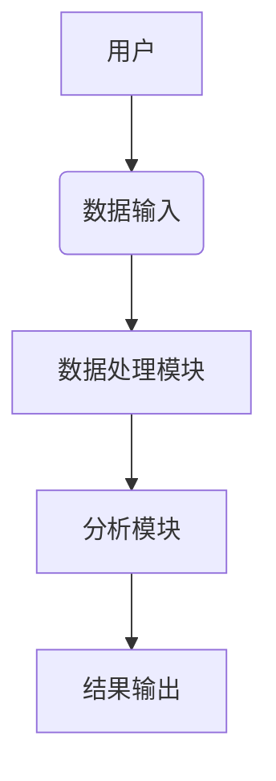
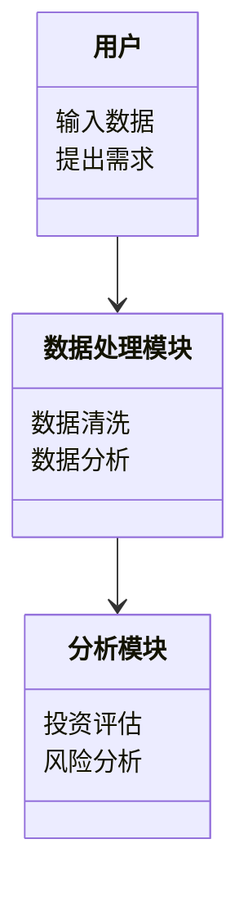

                 


# 巴菲特-芒格的太空旅游投资：探索商业航天的潜力

**关键词**：巴菲特、芒格、太空旅游、商业航天、投资策略、技术分析

**摘要**：本文探讨了巴菲特和芒格在太空旅游投资领域的策略，分析商业航天的潜力，结合投资模型和系统架构，提供深入的技术分析和实际案例，总结投资要点和未来趋势。

---

## 第一部分：背景介绍

### 第1章：太空旅游投资的背景与现状

#### 1.1 太空旅游的定义与发展

**1.1.1 太空旅游的定义**  
太空旅游指通过商业航天公司提供的服务，让普通人体验外层空间的旅行，包括亚轨道飞行、绕月飞行和火星旅行等。

**1.1.2 太空旅游的发展历程**  
20世纪60年代，苏联和美国开始载人航天，21世纪初，SpaceX等公司推动了商业航天的发展，私人太空旅行成为现实。

**1.1.3 当前太空旅游的市场现状**  
市场需求旺盛，主要参与者包括SpaceX、Blue Origin和 Virgin Galactic，市场估值高达数万亿美元。

#### 1.2 巴菲特与芒格的背景与投资逻辑

**1.2.1 巴菲特的价值投资理念**  
巴菲特投资注重企业长期价值、财务健康和管理团队，关注企业竞争优势和安全边际。

**1.2.2 芒格的多元思维模型**  
芒格强调多学科思维，考虑复杂问题时运用物理学、心理学等知识，避免认知偏差。

**1.2.3 巴菲特与芒格投资决策的共同点**  
两者都注重企业基本面分析、长期投资价值，避免短期波动，选择具有强大护城河的企业。

---

## 第二部分：核心概念与商业模式

### 第2章：商业航天的核心概念

#### 2.1 商业航天的定义与特征

**2.1.1 商业航天的定义**  
商业航天指由私人企业主导的航天活动，涵盖发射服务、卫星制造和太空旅游等。

**2.1.2 商业航天的核心特征**  
市场化运作、技术创新、成本控制和高效运营。

#### 2.2 商业航天的主要参与者

| 参与者类型 | 典型企业       | 主要业务                        |
|------------|----------------|--------------------------------|
| 火箭制造   | SpaceX         | 火箭研发与发射服务             |
| 卫星制造   | Planet Labs    | 卫星设计与数据服务             |
| 发射服务   | Rocket Lab     | 小型卫星发射                   |
| 旅游服务   | Virgin Galactic | 商业太空旅行服务               |

#### 2.3 商业航天的产业链分析

- **上游**：火箭发动机、推进剂和电子设备供应商。
- **中游**：卫星制造、发射服务提供商。
- **下游**：卫星应用（通信、导航）、太空旅游服务。

### 第3章：商业航天的商业模式

#### 3.1 商业航天的主要商业模式

| 模式         | 描述                       |
|--------------|---------------------------|
| 火箭发射服务 | 收取发射费用               |
| 卫星服务     | 通过卫星数据收取服务费     |
| 太空旅游     | 销售太空旅行体验           |

#### 3.2 商业航天的盈利模式

| 收入来源         | 描述                       |
|------------------|---------------------------|
| 火箭发射收入     | 向客户提供发射服务         |
| 卫星数据收入     | 提供卫星收集的数据服务     |
| 太空旅游收入     | 销售太空旅行票务           |

#### 3.3 市场风险与挑战

| 风险类型         | 描述                       |
|------------------|---------------------------|
| 技术风险         | 火箭发射失败或技术瓶颈     |
| 市场风险         | 市场需求不足或竞争激烈     |
| 政策风险         | 政府监管或出口限制         |

---

## 第三部分：巴菲特与芒格的投资策略分析

### 第4章：巴菲特与芒格的投资策略

#### 4.1 巴菲特的价值投资策略

**4.1.1 价值投资的核心要素**  
关注企业的内在价值、管理层素质和财务健康状况。

**4.1.2 商业航天投资的逻辑**  
认为商业航天具备高增长潜力，符合长期投资价值。

#### 4.2 芒格的多元思维模型

**4.2.1 多元思维模型的应用**  
分析商业航天时，结合物理学（技术可行性）、经济学（市场潜力）和心理学（消费者行为）。

---

## 第四部分：系统分析与架构设计

### 第5章：太空旅游投资分析系统

#### 5.1 系统架构设计



#### 5.2 系统功能设计



---

## 第五部分：项目实战

### 第6章：SpaceX投资分析案例

#### 6.1 环境安装

```bash
pip install pandas numpy matplotlib
```

#### 6.2 数据收集与分析

```python
import pandas as pd
import numpy as np

data = {'年份': [2015, 2016, 2017, 2018, 2019],
        '收入(亿美元)': [3, 4, 5, 7, 10]}
df = pd.DataFrame(data)
print(df)
```

#### 6.3 投资评估模型

使用CAPM模型：

$$ E(R_i) = R_f + \beta_i (R_m - R_f) $$

---

## 第六部分：总结与展望

### 第7章：总结与展望

#### 7.1 投资策略总结

- 长期视角：关注企业技术实力和市场潜力。
- 风险控制：分散投资，避免过度集中。

#### 7.2 未来趋势

- 技术进步： reusable rockets降低成本。
- 市场扩展：太空资源开发和深空探索。

#### 7.3 投资注意事项

- 关注政策变化：政府监管可能影响市场。
- 技术风险：依赖技术创新。
- 市场竞争：新兴企业加入可能导致竞争加剧。

---

**作者：AI天才研究院 & 禅与计算机程序设计艺术**

---

通过以上结构，文章详细分析了巴菲特和芒格在太空旅游投资的策略，结合商业航天的技术分析和实际案例，为读者提供了全面的视角和深入的见解。

