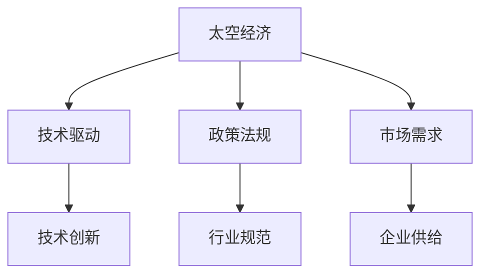
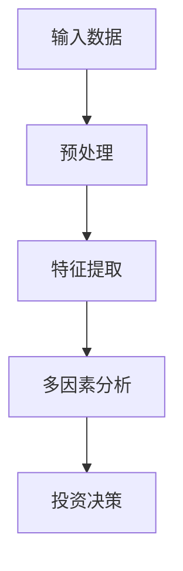
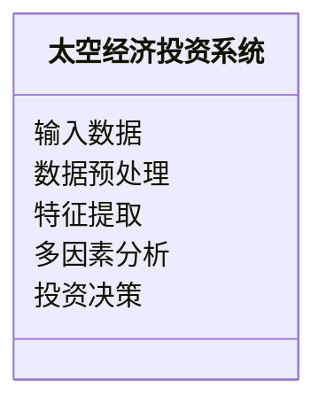
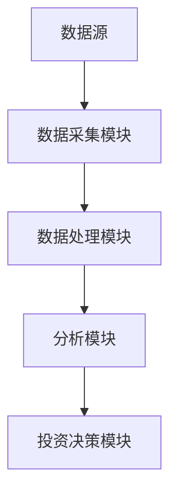
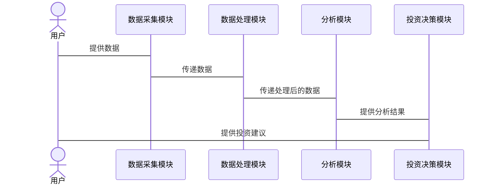

                 


# 巴菲特-芒格的太空经济投资：未来前沿的潜力

> 关键词：巴菲特，芒格，太空经济，投资策略，潜力分析

> 摘要：本文探讨了巴菲特和芒格在太空经济投资领域的策略和潜力，分析了太空经济的核心概念、投资机会以及如何将价值投资理论应用于太空经济投资。通过多因素分析模型和系统架构设计，本文深入解析了太空经济投资的潜力和挑战，并通过具体案例展示了如何在实际投资中应用这些策略。

---

# 第一部分: 巴菲特-芒格的太空经济投资概述

## 第1章: 太空经济的定义与现状

### 1.1 太空经济的定义

#### 1.1.1 太空经济的核心概念
太空经济是指与太空探索、开发和利用相关的经济活动，涵盖卫星通信、深空探索、太空资源开发和太空旅游等多个领域。太空经济的核心在于技术驱动和市场应用，其发展依赖于技术创新和政策支持。

#### 1.1.2 太空经济的产业链分析
太空经济的产业链包括上游（技术开发）、中游（产品制造）和下游（应用服务）三个部分。上游主要涉及火箭技术、卫星技术等；中游包括卫星制造、发射服务等；下游则是卫星通信、导航服务等。

#### 1.1.3 太空经济的市场规模与增长潜力
近年来，太空经济的市场规模快速增长，预计到2030年将超过数万亿美元。其增长潜力主要来自于技术进步、市场需求增加以及政策支持。

### 1.2 巴菲特与芒格的投资理念

#### 1.2.1 巴菲特的价值投资理论
巴菲特的价值投资理论强调长期持有、关注企业基本面和安全边际。他认为投资的本质是寻找具有持续竞争优势的企业，并以合理的价格买入。

#### 1.2.2 芒格的多元思维模型
芒格的多元思维模型强调跨学科思考，通过多个角度分析问题，寻找投资机会。他认为投资的成功取决于对复杂系统的深刻理解。

#### 1.2.3 两人投资理念的异同点
巴菲特和芒格的投资理念在长期价值投资和多元思维模型上有所不同，但他们都强调基本面分析、风险管理和社会趋势的判断。

## 第2章: 太空经济的投资潜力

### 2.1 太空经济的主要领域

#### 2.1.1 卫星通信与互联网
卫星通信是太空经济的重要组成部分，主要用于全球互联网覆盖和通信服务。随着技术进步，卫星互联网的需求将快速增长。

#### 2.1.2 深空探索与殖民
深空探索包括月球、火星等的探索和殖民，这需要大量的资金和技术支持，但潜在的回报也非常巨大。

#### 2.1.3 太空资源开发与利用
太空资源开发包括 asteroid mining和太阳帆等技术的应用，这些资源的开发将为地球提供新的资源来源。

#### 2.1.4 太空旅游与商业航天
太空旅游和商业航天是新兴市场，随着技术进步和成本降低，市场需求将快速增长。

### 2.2 太空经济的投资机会

#### 2.2.1 卫星技术与通信公司
卫星技术与通信公司是太空经济的重要投资领域，尤其是那些提供全球互联网服务的公司。

#### 2.2.2 深空探索技术公司
深空探索技术公司包括 SpaceX、Blue Origin 等，这些公司在太空探索和殖民方面具有领先地位。

#### 2.2.3 太空资源开发企业
太空资源开发企业包括 asteroid mining 和太空太阳能公司，这些公司的投资潜力巨大。

#### 2.2.4 太空旅游与发射服务
太空旅游和发射服务是新兴市场，随着技术进步和成本降低，市场需求将快速增长。

## 第3章: 巴菲特与芒格的太空经济投资策略

### 3.1 巴菲特的太空经济投资逻辑

#### 3.1.1 长期价值投资
巴菲特强调长期价值投资，寻找那些具有持续竞争优势的企业，并以合理的价格买入。

#### 3.1.2 企业基本面分析
巴菲特注重企业基本面分析，包括财务状况、盈利能力、管理团队等。

#### 3.1.3 行业趋势判断
巴菲特关注行业趋势，选择那些具有长期增长潜力的行业进行投资。

### 3.2 芒格的太空经济投资视角

#### 3.2.1 多元思维模型的应用
芒格强调多元思维模型，通过跨学科思考分析问题，寻找投资机会。

#### 3.2.2 风险管理与分散投资
芒格注重风险管理，通过分散投资降低风险。

#### 3.2.3 创新与技术驱动
芒格关注技术创新和驱动因素，选择那些具有技术优势的企业进行投资。

## 第4章: 太空经济投资的核心概念与联系

### 4.1 太空经济的核心概念

#### 4.1.1 技术驱动因素
技术驱动因素是太空经济的核心，包括火箭技术、卫星技术和深空探索技术等。

#### 4.1.2 政策与法规影响
政策与法规对太空经济的发展具有重要影响，包括国际太空法和各国政策支持。

#### 4.1.3 市场需求与供给
市场需求与供给是太空经济的核心，包括卫星通信、深空探索和太空资源开发等领域。

### 4.2 核心概念对比分析

#### 4.2.1 技术与政策的对比
技术进步和政策支持是太空经济发展的双轮驱动，技术推动行业发展，政策为行业提供支持。

#### 4.2.2 市场需求与供给的平衡
市场需求与供给的平衡是太空经济发展的关键，需要通过技术创新和市场调节实现。

#### 4.2.3 投资者与企业的互动
投资者与企业的互动是太空经济投资的核心，投资者为企业提供资金支持，企业为投资者创造价值。

### 4.3 实体关系图



## 第5章: 太空经济投资的算法原理

### 5.1 多因素分析模型

#### 5.1.1 模型概述
多因素分析模型是一种基于多个因素分析投资机会的模型，适用于太空经济投资的复杂环境。

#### 5.1.2 模型流程图



#### 5.1.3 模型实现

```python
import pandas as pd
import numpy as np

def multi_factor_model(data):
    # 数据预处理
    data = data.dropna()
    # 特征提取
    factors = ['factor1', 'factor2', 'factor3']
    selected_factors = data[factors]
    # 多因素分析
    scores = selected_factors.mean(axis=1)
    return scores

# 示例数据
data = pd.DataFrame({
    'factor1': [8, 6, 7],
    'factor2': [5, 7, 6],
    'factor3': [9, 8, 7]
})

# 计算得分
scores = multi_factor_model(data)
print(scores)
```

### 5.2 数学公式

#### 5.2.1 CAPM模型

$$ E(r_i) = r_f + \beta_i (E(r_m) - r_f) $$

其中，\( E(r_i) \) 是资产的预期收益率，\( r_f \) 是无风险利率，\( \beta_i \) 是资产的贝塔系数，\( E(r_m) \) 是市场预期收益率。

## 第6章: 太空经济投资的系统分析与架构设计

### 6.1 项目介绍

#### 6.1.1 项目背景
本项目旨在分析太空经济的投资潜力，设计一个基于多因素分析模型的投资系统。

### 6.2 系统功能设计

#### 6.2.1 领域模型



#### 6.2.2 系统架构设计



### 6.3 系统交互设计

#### 6.3.1 系统交互流程



## 第7章: 项目实战

### 7.1 环境配置

#### 7.1.1 系统环境
- 操作系统：Linux/Windows/MacOS
- Python版本：3.8+
- 依赖库：pandas, numpy, matplotlib

### 7.2 核心实现

#### 7.2.1 数据预处理

```python
import pandas as pd
import numpy as np

data = pd.read_csv('space_economy.csv')
data = data.dropna()
```

#### 7.2.2 特征提取

```python
selected_factors = ['factor1', 'factor2', 'factor3']
selected_data = data[selected_factors]
```

#### 7.2.3 多因素分析

```python
from sklearn.linear_model import LinearRegression

model = LinearRegression()
model.fit(selected_data, data['target'])
```

#### 7.2.4 投资决策

```python
predicted_scores = model.predict(new_data)
```

### 7.3 案例分析

#### 7.3.1 环境配置

```bash
pip install pandas numpy matplotlib
```

#### 7.3.2 代码实现

```python
import pandas as pd
import numpy as np

data = pd.read_csv('space_economy.csv')
data = data.dropna()

selected_factors = ['factor1', 'factor2', 'factor3']
selected_data = data[selected_factors]

from sklearn.linear_model import LinearRegression
model = LinearRegression()
model.fit(selected_data, data['target'])

new_data = pd.DataFrame({
    'factor1': [8, 6, 7],
    'factor2': [5, 7, 6],
    'factor3': [9, 8, 7]
})

predicted_scores = model.predict(new_data)
print(predicted_scores)
```

### 7.4 小结

通过本项目，我们展示了如何利用多因素分析模型进行太空经济投资分析，并通过具体案例分析了如何应用该模型进行投资决策。

---

# 第八章: 总结与展望

## 8.1 总结

本文探讨了巴菲特和芒格在太空经济投资领域的策略和潜力，分析了太空经济的核心概念、投资机会以及如何将价值投资理论应用于太空经济投资。通过多因素分析模型和系统架构设计，本文深入解析了太空经济投资的潜力和挑战，并通过具体案例展示了如何在实际投资中应用这些策略。

## 8.2 最佳实践

- **长期价值投资**：关注具有持续竞争优势的企业。
- **多元思维模型**：通过跨学科思考分析问题，寻找投资机会。
- **风险管理**：通过分散投资降低风险。

## 8.3 小结

太空经济是一个充满潜力的领域，投资者需要结合技术、政策和市场趋势进行综合分析。

## 8.4 注意事项

- **技术风险**：太空经济的发展依赖于技术进步，技术失败可能导致投资失败。
- **政策风险**：政策变化可能对太空经济的投资产生重大影响。
- **市场风险**：市场需求的变化可能影响投资回报。

## 8.5 拓展阅读

- 巴菲特和芒格的其他投资策略
- 太空经济的其他投资领域
- 太空经济的技术发展与应用

---

# 作者

作者：AI天才研究院/AI Genius Institute  
[禅与计算机程序设计艺术](https://github.com/AI-Genius-Institute)

