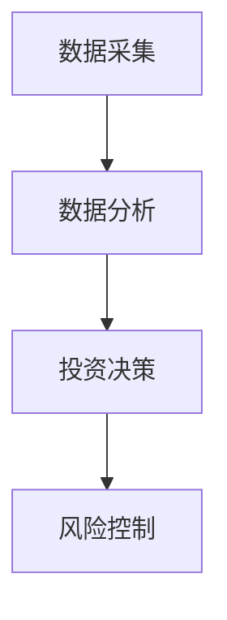
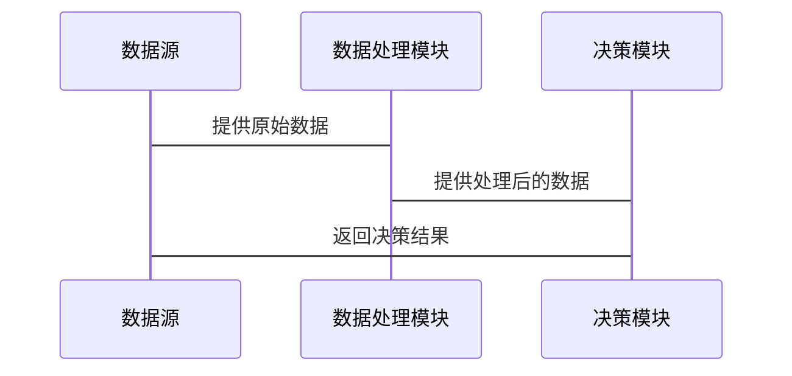
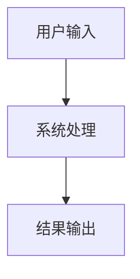

                 


# 巴菲特-芒格的太阳能技术投资：可再生能源的未来

---

## 关键词：
- 巴菲特投资
- 芒格投资
- 太阳能技术
- 可再生能源
- 投资策略
- 太阳能系统
- 未来趋势

---

## 摘要：
本文深入探讨了巴菲特和芒格在太阳能技术领域的投资策略，分析了他们如何将价值投资理念与可再生能源技术相结合。文章从太阳能技术的基本原理、投资模型构建、经典投资案例分析到系统架构设计，全面解析了巴菲特和芒格的投资逻辑，并通过实际案例展示了如何在可再生能源领域实现长期稳健的投资回报。文章最后展望了太阳能技术的未来发展，为投资者提供了宝贵的经验和启示。

---

## 第1章: 巴菲特-芒格投资理念概述

### 1.1 巴菲特-芒格投资理念的核心思想

#### 1.1.1 巴菲特的价值投资理论
巴菲特的价值投资理论强调长期持有优质资产，关注企业的内在价值。他认为，投资的本质是寻找那些具有强大护城河、良好管理和优秀商业模式的企业，并在市场恐慌时买入，市场疯狂时卖出。

#### 1.1.2 芒格的多元思维模型
芒格提出“多元思维模型”，认为投资者需要构建跨学科的知识框架，从物理学、心理学、经济学等多个角度分析问题。这种思维方式帮助芒格在投资决策中避免认知偏差，做出更明智的选择。

#### 1.1.3 两人投资理念的结合与互补
巴菲特和芒格的投资理念互补性强。巴菲特关注企业的基本面和长期价值，而芒格则注重跨学科分析和风险控制。两人的结合使他们的投资决策更加稳健和科学。

---

### 1.2 太阳能技术投资的背景与趋势

#### 1.2.1 全球能源结构转型的背景
全球能源结构正从化石能源向可再生能源转型。气候变化和环境问题促使各国政府加大对可再生能源的支持力度，太阳能作为其中的重要组成部分，迎来快速发展。

#### 1.2.2 太阳能技术的发展现状
太阳能技术已进入成熟阶段，光伏发电效率不断提高，成本持续下降。全球范围内的政策支持和技术进步使得太阳能成为最具潜力的可再生能源。

#### 1.2.3 可再生能源行业的投资机遇
随着技术进步和成本下降，太阳能行业的投资回报率逐渐提高。政策支持和市场的需求使得太阳能技术成为长期投资的热门领域。

---

## 第2章: 太阳能技术的基本原理与应用

### 2.1 太阳能技术的核心原理

#### 2.1.1 太阳能电池的工作原理
太阳能电池通过光电效应将太阳光转化为电能。其基本原理是：当光子击中半导体材料时，会激发电子，产生电流。这个过程涉及半导体材料的能带结构和载流子运动。

#### 2.1.2 光伏发电系统的构成
光伏发电系统主要由太阳能电池板、逆变器、支架和电网接口组成。其中，太阳能电池板是核心部件，负责将太阳能转化为电能。

#### 2.1.3 太阳能转换效率的影响因素
太阳能转换效率受多种因素影响，包括光照强度、温度、材料质量和制造工艺等。优化这些因素可以提高太阳能电池的效率。

---

### 2.2 太阳能技术的发展历程

#### 2.2.1 太阳能技术的历史演变
太阳能技术的发展可以分为几个阶段：20世纪50年代的初步研究、70年代的快速发展、90年代的技术成熟和近年来的商业化应用。

#### 2.2.2 全球主要国家的太阳能技术发展现状
全球主要国家如中国、美国、德国等都在积极推动太阳能技术的发展，通过政策支持和技术创新提升太阳能发电能力。

#### 2.2.3 太阳能技术的未来发展趋势
未来，太阳能技术将朝着高效率、低成本、智能化方向发展。新型材料和先进技术的应用将进一步提升太阳能电池的性能。

---

### 2.3 太阳能技术在可再生能源中的优势

#### 2.3.1 环境友好性
太阳能是一种清洁能源，不会产生污染物，对环境影响小。

#### 2.3.2 资源丰富性
太阳能是一种取之不尽的资源，分布广泛，适合大规模应用。

#### 2.3.3 技术成熟性
经过几十年的发展，太阳能技术已经非常成熟，具备大规模商业化应用的条件。

---

## 第3章: 太阳能技术投资的策略与模型

### 3.1 巴菲特-芒格投资策略的核心要素

#### 3.1.1 企业基本面分析
巴菲特和芒格非常注重企业的基本面，包括财务状况、盈利能力、管理团队等。他们认为，投资成功的关键在于选择具有强大竞争优势的企业。

#### 3.1.2 行业竞争格局分析
两人注重分析行业的竞争格局，选择那些具有明显竞争优势和市场地位的企业进行投资。

#### 3.1.3 财务指标评估
巴菲特和芒格非常关注企业的财务指标，如ROE（净资产收益率）、ROA（资产回报率）和净利率等。他们认为，这些指标可以反映企业的盈利能力和发展潜力。

---

### 3.2 太阳能技术投资的行业分析

#### 3.2.1 全球太阳能市场现状
全球太阳能市场增长迅速，尤其是在发展中国家，太阳能发电装机容量不断增加。

#### 3.2.2 主要国家的政策支持
各国政府通过补贴、税收优惠等政策支持太阳能技术的发展，进一步推动了市场的增长。

#### 3.2.3 行业竞争格局
太阳能行业竞争激烈，主要企业包括First Solar、晶科能源等。这些企业在技术研发、成本控制和市场拓展方面具有竞争优势。

---

### 3.3 太阳能技术投资的数学模型构建

#### 3.3.1 投资回报率（ROI）计算公式
$$ ROI = \frac{净利润}{初始投资} \times 100\% $$

#### 3.3.2 净现值（NPV）模型
$$ NPV = \sum_{t=1}^{n} \frac{CF_t}{(1 + r)^t} $$

其中，CF_t为第t年的现金流，r为贴现率，n为项目寿命。

#### 3.3.3 内部收益率（IRR）分析
$$ IRR = \frac{NPV}{Initial Investment} $$

---

## 第4章: 巴菲特-芒格太阳能技术投资的经典案例分析

### 4.1 巴菲特的太阳能投资案例

#### 4.1.1 太阳能项目的投资决策过程
巴菲特在选择太阳能项目时，注重企业的财务状况、市场地位和技术实力。他倾向于投资那些具有长期竞争优势的企业。

#### 4.1.2 投资回报与风险控制
巴菲特通过分散投资和严格的风险评估，降低了投资风险，确保了投资回报的稳定性。

#### 4.1.3 经验总结与启示
巴菲特的成功经验表明，长期价值投资是实现稳健回报的关键。

---

### 4.2 芒格的太阳能投资案例

#### 4.2.1 投资理念与决策逻辑
芒格注重跨学科分析，关注企业的基本面和行业趋势，选择那些具有长期增长潜力的企业。

#### 4.2.2 投资组合的构建与优化
芒格通过优化投资组合，分散风险，提高投资回报率。

#### 4.2.3 案例分析的启示与借鉴
芒格的案例表明，跨学科分析和长期投资策略是取得成功的重要因素。

---

## 第5章: 太阳能技术投资的系统分析与架构设计

### 5.1 太阳能技术投资的系统架构

#### 5.1.1 系统功能模块划分
系统功能模块包括数据采集、数据分析、投资决策和风险控制。

#### 5.1.2 系统流程图设计


#### 5.1.3 系统架构图展示


---

### 5.2 太阳能技术投资的系统接口设计

#### 5.2.1 数据接口定义
系统接口包括数据输入、数据处理和数据输出三个部分。

#### 5.2.2 接口交互流程


#### 5.2.3 接口实现方案
系统接口采用RESTful API设计，支持JSON格式数据的传输。

---

### 5.3 太阳能技术投资的系统交互设计

#### 5.3.1 用户需求分析
用户需要一个直观的界面，能够实时监控太阳能项目的运行状态和投资回报。

#### 5.3.2 系统功能流程


#### 5.3.3 交互设计图展示
```mermaid
gantt
    title 项目流程
    section 数据采集
    数据采集 : 2周
    section 数据分析
    数据分析 : 2周
    section 投资决策
    投资决策 : 2周
```

---

## 第6章: 太阳能技术投资的项目实战

### 6.1 项目环境安装与配置

#### 6.1.1 开发环境搭建
建议使用Python和Jupyter Notebook进行数据分析和建模。

#### 6.1.2 依赖库安装
安装Pandas、NumPy、Matplotlib等数据分析库。

#### 6.1.3 代码实现
以下是Python代码示例：

```python
import pandas as pd
import numpy as np
import matplotlib.pyplot as plt

# 示例数据
data = {'年份': [2018, 2019, 2020, 2021, 2022],
        '收益': [10, 15, 20, 25, 30]}
df = pd.DataFrame(data)

# 绘制折线图
plt.plot(df['年份'], df['收益'])
plt.title('太阳能项目收益趋势')
plt.xlabel('年份')
plt.ylabel('收益')
plt.show()
```

---

### 6.2 代码应用解读与分析

#### 6.2.1 数据分析
上述代码展示了如何使用Pandas和Matplotlib进行数据分析和可视化。通过绘制收益趋势图，投资者可以直观地了解项目的发展状况。

#### 6.2.2 投资回报率计算
根据上述代码，我们可以计算出项目的年均回报率：

$$ 年均回报率 = \frac{总收益}{初始投资} $$

---

### 6.3 实际案例分析和详细讲解剖析

#### 6.3.1 案例背景
假设我们投资了一个太阳能发电项目，初始投资为1000万元，预计年收益为200万元，投资期限为5年。

#### 6.3.2 投资回报分析
$$ ROI = \frac{200 \times 5 - 1000}{1000} \times 100\% = 10\% $$

#### 6.3.3 风险控制
通过购买保险和分散投资，降低项目的风险。

---

### 6.4 项目小结

通过实际案例分析，我们可以看出，太阳能技术投资具有较高的回报率和较大的发展潜力。然而，投资者需要具备专业的知识和风险控制能力，才能在竞争激烈的市场中获得成功。

---

## 第7章: 未来展望与投资建议

### 7.1 太阳能技术的未来发展趋势

#### 7.1.1 技术创新
未来，太阳能技术将朝着高效率、低成本和智能化方向发展。新型材料和技术的应用将进一步提升太阳能电池的性能。

#### 7.1.2 市场扩展
随着技术进步和成本下降，太阳能技术将在更多领域得到应用，市场空间将更加广阔。

#### 7.1.3 政策支持
各国政府将继续加大对可再生能源的支持力度，为太阳能技术的发展提供政策保障。

---

### 7.2 投资建议

#### 7.2.1 长期投资
投资者应采取长期投资策略，选择那些具有长期竞争优势的企业。

#### 7.2.2 风险控制
通过分散投资和严格的风险评估，降低投资风险。

#### 7.2.3 技术创新
关注技术创新型企业，投资那些具有领先技术优势的企业。

---

## 作者：AI天才研究院/AI Genius Institute & 禅与计算机程序设计艺术 /Zen And The Art of Computer Programming

