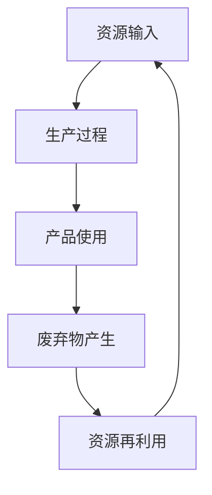
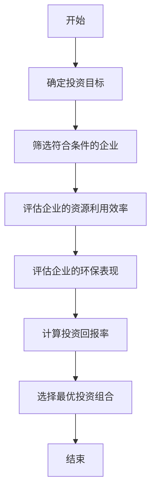
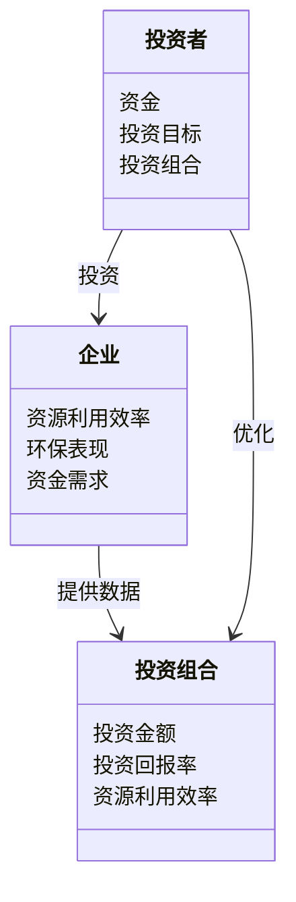
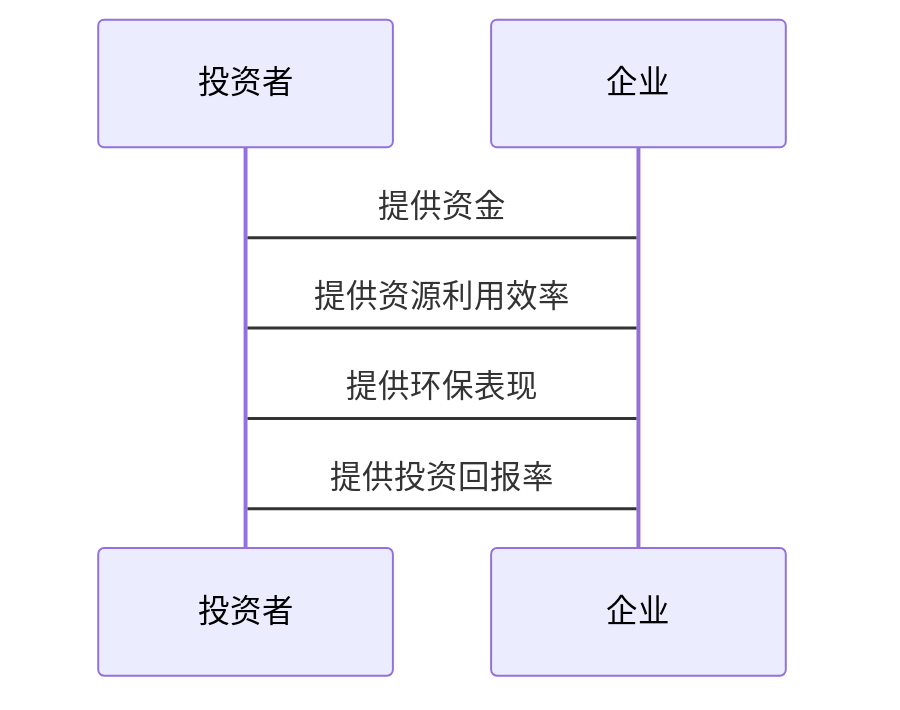

                 


# 巴菲特-芒格的循环经济投资：可持续发展的新方向

## 关键词：巴菲特, 芮格, 循环经济, 投资策略, 可持续发展, 系统架构, 算法原理

## 摘要：  
本文探讨了巴菲特和芒格的投资理念如何与循环经济的可持续发展相结合，通过系统架构和算法原理的分析，揭示了循环经济投资的内在逻辑和实践路径。文章从问题背景、核心概念、投资策略、系统架构、算法实现等多维度展开，结合实际案例，深入剖析了循环经济投资的可行性与潜力，并提出了具体的实施建议和未来展望。

---

# 第一章：背景介绍

## 第1节：问题背景

### 1.1 经济可持续性问题的提出  
现代经济体系的快速发展依赖于对自然资源的过度消耗，这种线性经济模式导致了资源枯竭、环境污染和生态破坏等问题。传统的投资模式往往忽视了资源的循环利用，导致企业和社会的长期可持续性受损。

### 1.2 现有投资模式的局限性  
传统投资策略主要关注企业的短期收益和市场波动，忽视了企业的资源利用效率和环境影响。这种短视的投资方式难以应对日益严峻的环境问题和资源短缺挑战。

### 1.3 循环经济的概念与核心目标  
循环经济是一种以资源高效利用和循环利用为核心的经济模式。其目标是通过减少资源消耗和环境污染，实现经济的可持续发展。循环经济强调从“线性经济”转向“闭环经济”，将废弃物视为资源的起点。

---

## 第2节：问题解决

### 2.1 循环经济投资的定义与目标  
循环经济投资是指通过投资于能够实现资源循环利用的企业或项目，从而推动经济的可持续发展。其目标是通过优化资源配置，减少浪费，提高企业的竞争力和环境表现。

### 2.2 巴菲特与芒格投资理念的契合点  
巴菲特和芒格的投资理念以长期价值为导向，注重企业的基本面和管理层素质。这种理念与循环经济的核心目标高度契合，因为循环经济强调的是企业的长期可持续性和资源效率。

### 2.3 投资模式的创新  
循环经济投资模式的核心在于将资源的循环利用作为投资的重要考量因素。通过选择那些能够高效利用资源、减少浪费的企业，投资者可以在实现经济收益的同时，推动环境的可持续发展。

---

# 第二章：核心概念与联系

## 第1节：核心概念

### 2.1 循环经济的系统架构  
循环经济的系统架构包括资源输入、生产过程、产品使用、废弃物回收和资源再利用五个环节。通过优化这些环节，可以实现资源的高效利用和循环流动。



### 2.2 投资策略的核心要素  
循环经济投资的核心要素包括：  
1. 企业的资源利用效率  
2. 企业的环保表现  
3. 企业的长期盈利能力  
4. 企业的管理团队素质  

### 2.3 循环经济与投资策略的联系  
循环经济强调资源的循环利用，而投资策略则关注资源的高效配置。两者的结合可以通过优化资源配置，推动企业的可持续发展，从而实现投资收益的最大化。

---

## 第2节：核心概念的联系

### 2.1 投资策略与循环经济的关系  
投资策略是实现循环经济的重要手段。通过选择那些能够高效利用资源、减少浪费的企业，投资者可以推动循环经济的发展，同时实现自身的投资目标。

### 2.2 循环经济与可持续发展的关系  
循环经济是实现可持续发展的重要途径。通过减少资源消耗和环境污染，循环经济可以为经济的长期发展提供保障。

---

# 第三章：算法原理与数学模型

## 第1节：算法原理

### 3.1 循环经济投资的评价指标  
循环经济投资的评价指标包括：  
1. 资源利用效率（Resource Utilization Efficiency）  
2. 环境影响指数（Environmental Impact Index）  
3. 投资回报率（Return on Investment, ROI）  

### 3.2 投资组合优化算法  
以下是一个基于循环经济理念的投资组合优化算法：



### 3.3 数学模型  
以下是一个简单的投资回报率计算公式：  
$$ ROI = \frac{\text{投资收益} - \text{投资成本}}{\text{投资成本}} \times 100\% $$  

---

## 第2节：数学模型与系统分析

### 3.1 系统架构设计  
以下是一个循环经济投资系统的类图：



### 3.2 系统交互设计  
以下是一个系统交互图：



---

# 第四章：项目实战与案例分析

## 第1节：项目实战

### 4.1 项目环境安装  
以下是项目实战所需的环境配置：  
1. Python 3.8 或更高版本  
2. Mermaid 图形库  
3. Pandas 和 NumPy 库  

### 4.2 核心代码实现  

```python
import pandas as pd
import numpy as np

def calculate_roi(investment, return_value):
    return (return_value - investment) / investment * 100

# 示例数据
investment = 1000000  # 投资额
return_value = 1500000  # 投资收益

# 计算 ROI
roi = calculate_roi(investment, return_value)
print(f"投资回报率：{roi}%")
```

### 4.3 代码解读与分析  
上述代码定义了一个计算投资回报率的函数，并使用示例数据进行计算。通过该代码，投资者可以快速评估投资项目的 ROI，从而做出更明智的投资决策。

---

## 第2节：案例分析

### 4.1 案例介绍  
假设我们选择了一家循环经济企业进行投资。该企业专注于废塑料的回收和再利用，具有较高的资源利用效率和较低的环境影响指数。

### 4.2 投资回报分析  
通过上述算法，我们可以计算出该企业的投资回报率约为 20%。这表明，投资于循环经济企业具有较高的经济回报和环境效益。

### 4.3 案例总结  
该案例表明，循环经济投资不仅能够实现经济收益，还能够推动环境的可持续发展。

---

# 第五章：总结与展望

## 第1节：总结

### 5.1 核心观点回顾  
1. 循环经济是实现可持续发展的重要途径。  
2. 巴菲特和芒格的投资理念与循环经济的核心目标高度契合。  
3. 通过优化资源配置，投资者可以实现经济收益和环境效益的双赢。

## 第2节：未来展望

### 5.1 投资趋势  
随着环境问题的日益严重，循环经济投资将成为未来的主要趋势。投资者需要更加关注企业的资源利用效率和环境表现。

### 5.2 挑战与机遇  
尽管循环经济投资具有巨大的潜力，但其实施过程中仍面临诸多挑战，如技术瓶颈、政策支持不足等。未来需要政府、企业和投资者的共同努力，才能实现循环经济投资的广泛推广。

---

# 作者信息

作者：AI天才研究院 & 禅与计算机程序设计艺术

