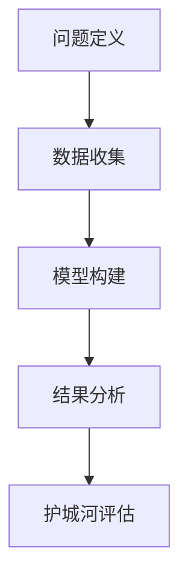
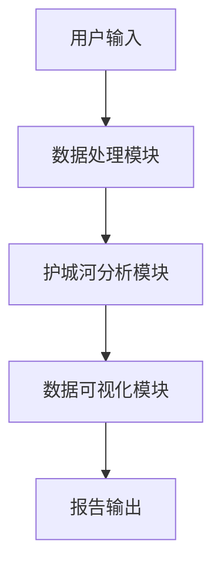

                 


# 巴菲特-芒格的护城河理论：寻找持久竞争优势

## 关键词：护城河、竞争优势、巴菲特、芒格、投资策略、商业分析、企业价值

## 摘要：巴菲特和芒格的护城河理论是投资和商业策略中的经典思想，强调通过识别企业的持久竞争优势来构建长期价值。本文深入分析护城河理论的核心概念，包括成本优势、品牌优势、技术优势、资源优势和市场优势，并通过实际案例和系统架构设计，探讨如何在现代商业环境中应用这一理论。文章结合算法原理和项目实战，提供实用的分析工具和方法，帮助读者在投资和商业决策中找到持久的竞争优势。

---

# 第一部分: 护城河理论的背景与核心概念

## 第1章: 护城河理论的起源与发展

### 1.1 护城河理论的起源

#### 1.1.1 巴菲特的护城河思想
- 巴菲特的护城河理论源于其价值投资理念，强调寻找具有持续竞争优势的企业。
- 他认为，真正的投资是找到那些具备宽宽的“护城河”（competitive moat）的企业，这些护城河能够抵御竞争对手的侵蚀，确保企业长期的盈利能力。

#### 1.1.2 芒格的互补性投资理念
- 芒格的多元思维模型为护城河理论提供了更广泛的支持，他强调从多个角度分析企业的竞争优势。
- 芒格认为，真正的竞争优势来源于企业能够在多个维度上建立优势，从而形成一个综合的护城河。

#### 1.1.3 护城河理论的核心思想
- 护城河理论的核心思想是通过识别企业的持久竞争优势，构建一个能够抵御时间和竞争压力的商业模式。
- 这种竞争优势可以是成本优势、品牌优势、技术优势、资源优势或市场优势。

### 1.2 护城河理论的演变

#### 1.2.1 从巴菲特到芒格的理论发展
- 巴菲特的护城河理论主要关注企业的经济护城河，如成本优势和规模经济。
- 芒格的多元思维模型则将护城河的概念扩展到更广泛的领域，包括心理学、物理学和其他学科的交叉应用。

#### 1.2.2 护城河理论的现代应用
- 在现代商业环境中，护城河理论的应用更加多样化，包括数字技术、数据优势和网络效应等新的竞争优势形式。
- 例如，互联网企业通过网络效应和数据优势构建护城河，形成了强大的市场壁垒。

#### 1.2.3 护城河理论的边界与外延
- 护城河理论的边界在于如何准确识别和评估护城河的强弱。
- 其外延则包括如何通过技术创新和商业模式创新持续增强护城河。

---

## 第2章: 护城河理论的核心概念

### 2.1 护城河的定义与分类

#### 2.1.1 护城河的定义
- 护城河是指企业在市场上相对于竞争对手的持久竞争优势，这种优势能够帮助企业在长期内获得超额利润。
- 护城河可以是可见的（如专利）或无形的（如品牌忠诚度）。

#### 2.1.2 护城河的分类
- **成本优势**：企业通过规模经济或流程优化降低成本，形成价格优势。
- **品牌优势**：强大的品牌认知度和忠诚度能够吸引顾客并抵御竞争对手。
- **技术优势**：拥有独特的技术或专利，能够在市场上保持领先地位。
- **资源优势**：企业掌握关键资源，如原材料、数据或人才，形成竞争优势。
- **市场优势**：企业在特定市场中占据主导地位，具有强大的市场影响力。

#### 2.1.3 护城河的核心要素
- **宽度**：护城河的宽度决定了竞争优势的强度。
- **深度**：护城河的深度决定了竞争优势的持久性。
- **可持续性**：护城河是否能够在长期内保持竞争优势。

### 2.2 护城河理论的分析框架

#### 2.2.1 护城河的五种类型
| 类型                | 描述                                   |
|---------------------|--------------------------------------|
| 成本优势            | 企业通过更低的成本实现价格优势      |
| 品牌优势            | 强大的品牌认知度和忠诚度              |
| 技术优势            | 独特的技术或专利                      |
| 资源优势            | 独特的资源或数据优势                  |
| 市场优势            | 在特定市场中的领先地位                |

#### 2.2.2 护城河的评估维度
- **强度**：竞争优势的强度，即相对于竞争对手的优势有多大。
- **可持续性**：竞争优势能够持续多久。
- **可扩展性**：竞争优势是否能够随着企业规模的扩大而增强。

#### 2.2.3 护城河的动态变化
- 护城河并非一成不变，随着市场环境和技术的发展，竞争优势可能会发生变化。
- 企业需要不断评估和调整其护城河，以应对新的挑战和机会。

---

## 第3章: 护城河理论的核心要素与联系

### 3.1 护城河的核心要素

#### 3.1.1 成本优势
- 成本优势是护城河的重要组成部分，通过降低成本实现价格优势。
- 例如，制造企业通过规模化生产降低成本，从而在价格竞争中占据优势。

#### 3.1.2 品牌优势
- 强大的品牌认知度和忠诚度能够吸引顾客并抵御竞争对手。
- 例如，可口可乐通过长期的品牌建设形成了强大的品牌护城河。

#### 3.1.3 技术优势
- 独特的技术或专利是企业的重要竞争优势。
- 例如，苹果通过不断创新的技术和专利，保持了在科技领域的领先地位。

#### 3.1.4 资源优势
- 独特的资源或数据优势能够形成强大的市场壁垒。
- 例如，谷歌通过海量的数据和搜索引擎技术，形成了强大的竞争优势。

#### 3.1.5 市场优势
- 在特定市场中的领先地位是企业的重要竞争优势。
- 例如，沃尔玛通过在全球零售市场的布局，形成了强大的市场优势。

### 3.2 护城河要素的对比分析

#### 3.2.1 成本优势与品牌优势的对比
| 维度   | 成本优势                          | 品牌优势                          |
|--------|-----------------------------------|-----------------------------------|
| 性质   | 经济性                            | 心理学                            |
| 作用   | 降低成本，提高价格竞争力          | 提高品牌认知度和忠诚度            |
| 可持续性| 取决于成本控制能力                | 取决于品牌管理和营销能力          |

#### 3.2.2 技术优势与资源优势的对比
| 维度   | 技术优势                          | 资源优势                          |
|--------|-----------------------------------|-----------------------------------|
| 性质   | 创新性                            | 稀缺性                            |
| 作用   | 提高产品附加值，形成技术壁垒      | 提供独特资源，增强竞争力          |
| 可持续性| 取决于技术创新能力                | 取决于资源获取和管理能力          |

#### 3.2.3 市场优势与其他优势的对比
| 维度   | 市场优势                          | 其他优势                          |
|--------|-----------------------------------|-----------------------------------|
| 性质   | 地域性和规模性                    | 技术性、经济性和资源性            |
| 作用   | 占据市场份额，扩大销售规模        | 提高产品竞争力，降低成本或提高技术壁垒 |
| 可持续性| 取决于市场环境和企业战略          | 取决于企业内部管理和外部环境      |

### 3.3 护城河要素的ER实体关系图
```mermaid
er
actor: 护城河要素
class: 成本优势, 品牌优势, 技术优势, 资源优势, 市场优势
```

---

## 第4章: 护城河理论的算法原理

### 4.1 护城河分析的算法框架

#### 4.1.1 护城河分析的流程
1. **问题定义**：明确分析的目标，例如识别企业的竞争优势。
2. **数据收集**：收集企业的财务数据、市场数据和竞争对手信息。
3. **模型构建**：使用护城河分析模型对企业进行评估。
4. **结果分析**：根据模型输出的结果，评估企业的护城河强度。

#### 4.1.2 护城河分析模型
- **护城河指数模型**：通过加权评分法对企业竞争优势进行量化评估。
- **护城河强度公式**：$$ \text{护城河强度} = \sum (\text{优势权重} \times \text{优势强度}) $$

#### 4.1.3 护城河分析的流程图


---

## 第5章: 护城河理论的系统架构设计

### 5.1 系统功能设计

#### 5.1.1 护城河分析模块
- 功能：对企业进行护城河分析，识别竞争优势。
- 输入：企业数据、竞争对手数据。
- 输出：护城河评估报告。

#### 5.1.2 数据可视化模块
- 功能：将护城河分析结果可视化，便于理解。
- 输入：分析结果。
- 输出：图表、报告。

### 5.2 系统架构设计

#### 5.2.1 系统架构图


#### 5.2.2 接口设计
- **输入接口**：企业数据接口、竞争对手数据接口。
- **输出接口**：护城河评估报告接口、数据可视化接口。

---

## 第6章: 护城河理论的项目实战

### 6.1 项目背景与目标

#### 6.1.1 项目背景
- 通过护城河理论分析，识别企业的竞争优势。
- 以某互联网企业为例，分析其护城河的强弱。

#### 6.1.2 项目目标
- 构建护城河分析模型，评估企业的竞争优势。
- 提供改进建议，增强企业的护城河。

### 6.2 环境与工具

#### 6.2.1 环境配置
- 操作系统：Linux/Windows/MacOS。
- 开发工具：Python、Jupyter Notebook、Mermaid。
- 数据库：MySQL/PostgreSQL。
- 可视化工具：Matplotlib/Seaborn。

#### 6.2.2 核心实现代码
```python
import pandas as pd
import numpy as np

# 示例数据
data = {
    '企业': ['A', 'B', 'C'],
    '成本优势': [0.8, 0.6, 0.7],
    '品牌优势': [0.9, 0.5, 0.8],
    '技术优势': [0.7, 0.6, 0.9],
    '资源优势': [0.6, 0.7, 0.5],
    '市场优势': [0.8, 0.4, 0.7]
}

df = pd.DataFrame(data)

# 护城河强度计算
def calculate_moat(row):
    weights = [0.2, 0.2, 0.2, 0.2, 0.2]
    moat = sum(w * v for w, v in zip(weights, row))
    return moat

df['护城河强度'] = df.iloc[:, 1:6].apply(calculate_moat, axis=1)
print(df)
```

### 6.3 案例分析

#### 6.3.1 案例背景
- 以某互联网企业为例，分析其护城河的强弱。
- 数据包括成本优势、品牌优势、技术优势、资源优势和市场优势。

#### 6.3.2 数据分析
- 使用护城河强度公式，计算企业的护城河强度。
- 通过数据可视化，展示企业的竞争优势。

#### 6.3.3 改进建议
- 根据分析结果，提出增强护城河的具体建议，例如加强技术研发、提升品牌忠诚度等。

---

## 第7章: 护城河理论的最佳实践与总结

### 7.1 最佳实践 tips

#### 7.1.1 定期评估
- 定期评估企业的护城河，确保竞争优势的持续性。

#### 7.1.2 结合多元思维模型
- 通过多元思维模型，全面分析企业的竞争优势。

#### 7.1.3 注重创新
- 不断创新，通过技术、产品和商业模式的创新，增强护城河。

### 7.2 小结

- 护城河理论是投资和商业策略中的经典思想，通过识别企业的持久竞争优势，构建长期价值。
- 在现代商业环境中，护城河理论的应用更加多样化，需要结合新的竞争优势形式，如数字技术、数据优势和网络效应等。

### 7.3 注意事项

- 护城河并非一成不变，需要根据市场环境和技术的发展，不断调整和优化。
- 在应用护城河理论时，需要注意其局限性，避免过于依赖单一竞争优势。

### 7.4 拓展阅读

- 巴菲特和芒格的其他投资理念，如安全边际、价值投资等。
- 现代商业中的护城河构建，如数字护城河、数据护城河等。

---

## 作者信息

作者：AI天才研究院/AI Genius Institute & 禅与计算机程序设计艺术/Zen And The Art of Computer Programming

