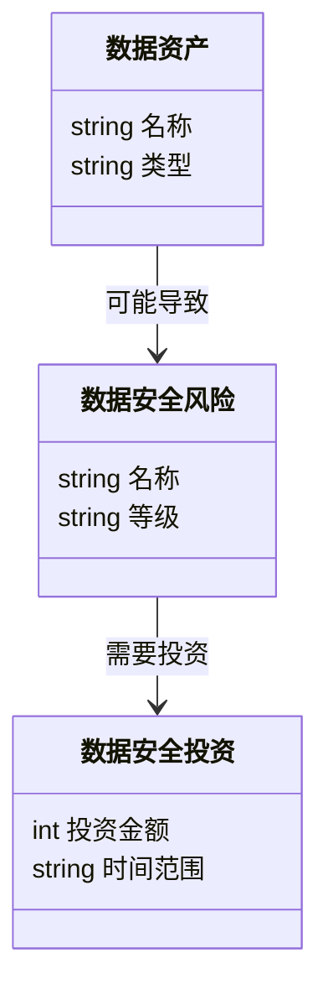
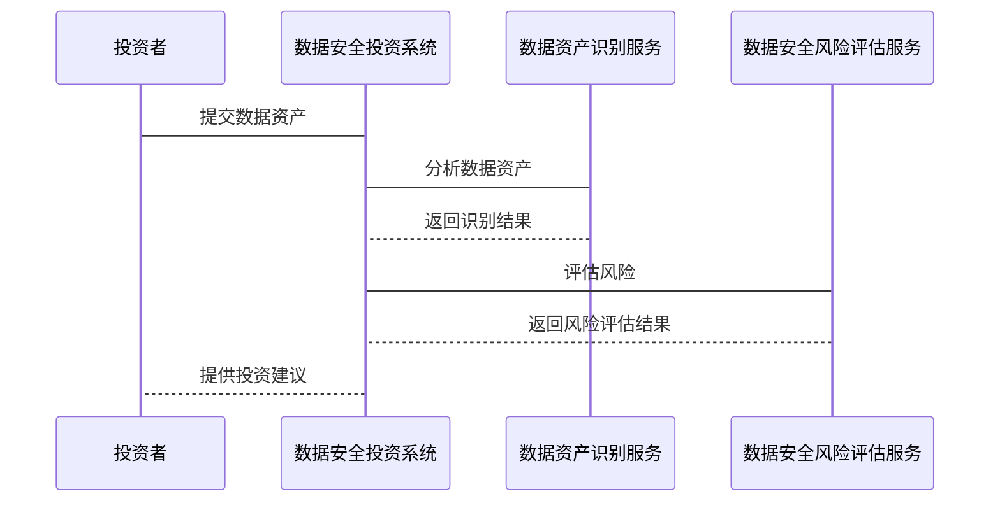

                 


# 巴菲特-芒格的数据安全投资：数字时代的新机遇

## 关键词：
- 巴菲特-芒格投资理念
- 数据安全投资
- 数字时代
- 价值投资
- 数据安全风险

## 摘要：
数字时代，数据成为最重要的资产之一，数据安全投资的重要性日益凸显。本文结合巴菲特和芒格的价值投资理念，探讨数据安全投资的核心概念、分析框架、数学模型和系统设计，通过实际案例分析，揭示数据安全投资在数字时代的机遇与挑战。

---

# 第1章 巴菲特-芒格投资理念与数据安全投资概述

## 1.1 巴菲特-芒格投资理念概述

### 1.1.1 巴菲特与芒格的投资哲学
巴菲特和芒格的价值投资理念强调长期主义、安全边际和企业基本面分析。芒格的多元思维模型为其投资决策提供了坚实的基础。

### 1.1.2 巴菲特-芒格投资策略的核心要素
- **长期价值**：关注企业的内在价值，而非短期市场波动。
- **安全边际**：以低于内在价值的价格买入优质资产。
- **竞争优势**：投资具有独特竞争优势的企业。

### 1.1.3 巴菲特-芒格投资理念的现代应用
随着数据成为核心资产，巴菲特和芒格的投资理念在数据安全领域展现出新的价值。

---

## 1.2 数据安全投资的背景与意义

### 1.2.1 数字时代的数据安全挑战
数据泄露、网络攻击等安全威胁日益严峻，数据安全成为企业生存的关键。

### 1.2.2 数据安全投资的必要性
数据安全是企业核心资产的保护伞，投资数据安全是企业可持续发展的必要条件。

### 1.2.3 数据安全投资与企业价值的关系
数据安全投资不仅降低风险，还能提升企业市场价值和客户信任。

---

## 1.3 巴菲特-芒格与数据安全投资的结合

### 1.3.1 巴菲特-芒格投资理念与数据安全的契合点
- 数据安全是企业长期价值的重要组成部分。
- 数据安全投资需要注重安全边际和竞争优势。

### 1.3.2 数据安全投资的长期价值视角
从长期来看，数据安全投资能够为企业的可持续发展提供保障。

### 1.3.3 数据安全投资的未来应用前景
数据安全将成为企业核心竞争力的重要组成部分，投资于数据安全的企业将更具竞争优势。

---

## 1.4 本章小结
本章介绍了巴菲特和芒格的投资理念，探讨了数据安全投资的背景和意义，并分析了两者结合的可能性和前景。

---

# 第2章 数据安全投资的核心概念与分析框架

## 2.1 数据安全投资的核心概念

### 2.1.1 数据安全投资的定义
数据安全投资是指为保护数据资产安全而进行的资本投入。

### 2.1.2 数据安全投资的关键属性
- **防御性**：防范数据泄露和攻击。
- **主动性**：提前规划和应对风险。
- **系统性**：覆盖数据生命周期的各个阶段。

### 2.1.3 数据安全投资的边界与外延
数据安全投资的边界包括数据采集、存储、处理和传输，外延则涉及数据隐私、合规性等方面。

---

## 2.2 数据安全投资的核心要素

### 2.2.1 数据资产的价值评估
数据资产的价值取决于其对企业的战略意义和经济价值。

### 2.2.2 数据安全风险的量化
通过风险评估模型量化数据安全风险，为投资决策提供依据。

### 2.2.3 数据安全投资的收益模型
收益模型包括预防成本、检测成本和恢复成本的综合考量。

---

## 2.3 数据安全投资的分析框架

### 2.3.1 数据安全投资的多维度分析
从技术、管理和法律等多个维度分析数据安全投资。

### 2.3.2 数据安全投资的生命周期模型
包括规划、实施、监控和优化四个阶段。

### 2.3.3 数据安全投资的决策树分析
通过决策树分析不同投资策略的风险和收益。

---

## 2.4 核心概念与联系

### 2.4.1 核心概念原理
数据安全投资需要综合考虑数据资产、风险和收益之间的关系。

### 2.4.2 核心概念属性特征对比表格

| 概念         | 属性           | 特征         |
|--------------|----------------|--------------|
| 数据资产     | 价值           | 战略性       |
| 数据安全风险 | 危险性         | 可量化       |
| 数据安全投资 | 投资金额       | 预防性       |

### 2.4.3 ER实体关系图架构的 mermaid 流程图

```mermaid
erDiagram
    actor 投资者 {
        string 资金
        string 风险评估
    }
    actor 企业 {
        string 数据资产
        string 安全措施
    }
    中间人 数据安全投资 {
        string 投资金额
        string 收益
    }
    投资者 --> 中间人 : 提供资金
    企业 --> 中间人 : 提供数据资产和安全措施
    中间人 --> 投资者 : 返回收益
```

---

## 2.5 本章小结
本章详细阐述了数据安全投资的核心概念和分析框架，为后续分析提供了理论基础。

---

# 第3章 数据安全投资的市场现状与趋势

## 3.1 数据安全投资的市场现状

### 3.1.1 全球数据安全投资市场的规模与结构
2023年，全球数据安全投资市场规模约为1500亿美元，预计年均增长率为10%。

### 3.1.2 主要市场参与者与竞争格局
主要参与者包括Symantec、McAfee、FireEye等企业。

### 3.1.3 数据安全投资的主要驱动因素
- 数据泄露风险增加
- 法律法规趋严
- 数字化转型加速

---

## 3.2 数据安全投资的趋势分析

### 3.2.1 云安全投资的增长
随着云计算的普及，云安全投资占比逐年增加。

### 3.2.2 人工智能在数据安全中的应用
AI技术的应用使得数据安全防护更加智能化。

### 3.2.3 数据安全投资的合规性要求
各国法规对数据安全的要求日益严格，推动投资增长。

---

## 3.3 本章小结
本章分析了数据安全投资的市场现状和未来趋势，为企业投资提供了参考。

---

# 第4章 巴菲特-芒格数据安全投资模型

## 4.1 数据安全投资模型的构成

### 4.1.1 投资目标识别
识别具有长期价值的数据安全项目。

### 4.1.2 安全边际评估
确保投资的安全边际，降低风险。

### 4.1.3 竞争优势分析
选择具有竞争优势的企业进行投资。

---

## 4.2 数据安全投资模型的实施步骤

### 4.2.1 确定投资目标
基于长期价值和竞争优势选择数据安全项目。

### 4.2.2 进行风险评估
使用风险量化模型评估投资风险。

### 4.2.3 制定投资策略
结合安全边际和收益预期制定投资策略。

---

## 4.3 本章小结
本章提出了巴菲特-芒格数据安全投资模型，并详细阐述了其实施步骤。

---

# 第5章 数据安全投资的数学模型和算法

## 5.1 数据安全风险量化模型

### 5.1.1 风险量化公式
$$ R = \sum_{i=1}^{n} (P_i \times I_i) $$
其中，R为总体风险，P_i为风险发生概率，I_i为影响程度。

### 5.1.2 案例分析
假设某企业有两项风险，P1=0.3，I1=50；P2=0.2，I2=80。则总体风险R=0.3×50 + 0.2×80=15+16=31。

---

## 5.2 数据安全投资收益模型

### 5.2.1 收益计算公式
$$ ROI = \frac{收益 - 成本}{成本} \times 100\% $$

### 5.2.2 案例分析
假设投资成本为100万元，预期收益为150万元，则ROI=50%。

---

## 5.3 本章小结
本章通过数学模型和算法，量化了数据安全投资的风险和收益，为投资决策提供了科学依据。

---

# 第6章 数据安全投资的系统分析与架构设计

## 6.1 系统功能设计

### 6.1.1 领域模型
使用mermaid类图描述数据安全投资的领域模型。



---

## 6.2 系统架构设计

### 6.2.1 架构设计
使用mermaid架构图描述系统架构。

```mermaid
container 数据安全投资系统 {
    service 数据资产识别服务
    service 数据安全风险评估服务
    service 数据安全投资决策服务
    数据库 数据资产库
    数据库 风险评估库
}
```

---

## 6.3 系统接口设计

### 6.3.1 接口设计
数据资产识别服务与风险评估服务之间的接口定义。

---

## 6.4 系统交互设计

### 6.4.1 交互流程
使用mermaid序列图描述系统交互流程。



---

## 6.5 本章小结
本章通过系统分析和架构设计，为数据安全投资提供了技术实现的框架。

---

# 第7章 数据安全投资的项目实战

## 7.1 环境安装

### 7.1.1 安装Python环境
使用Anaconda安装Python 3.8及以上版本。

---

## 7.2 核心代码实现

### 7.2.1 数据安全风险量化代码

```python
def calculate_risk(probability, impact):
    return probability * impact

# 示例
probabilities = [0.3, 0.2]
impacts = [50, 80]
total_risk = sum([calculate_risk(p, i) for p, i in zip(probabilities, impacts)])
print(f"Total Risk: {total_risk}")
```

### 7.2.2 数据安全投资收益计算代码

```python
def calculate_roi(revenue, cost):
    return (revenue - cost) / cost * 100

# 示例
cost = 1000000
revenue = 1500000
roi = calculate_roi(revenue, cost)
print(f"ROI: {roi}%")
```

---

## 7.3 案例分析与解读

### 7.3.1 案例分析
某企业投资100万元于数据安全项目，预期收益150万元，ROI为50%。

### 7.3.2 代码应用解读
通过代码实现风险量化和收益计算，帮助企业做出科学的投资决策。

---

## 7.4 项目小结
本章通过实战案例，展示了数据安全投资的实施过程和应用效果。

---

# 第8章 总结与展望

## 8.1 总结
本文结合巴菲特和芒格的投资理念，系统地分析了数据安全投资的核心概念、数学模型和系统设计，并通过实战案例展示了其应用。

## 8.2 未来展望
未来，数据安全投资将更加智能化和全球化，企业需要持续关注技术发展和法规变化。

## 8.3 最佳实践 tips
- 优先投资具有长期价值和竞争优势的数据安全项目。
- 结合数学模型和系统设计，科学评估风险和收益。
- 定期审查和优化数据安全投资策略。

---

# 作者：AI天才研究院/AI Genius Institute & 禅与计算机程序设计艺术 /Zen And The Art of Computer Programming

---

这篇文章系统地探讨了巴菲特-芒格投资理念在数据安全投资中的应用，通过理论分析和实战案例，为企业提供了科学的投资决策参考。

