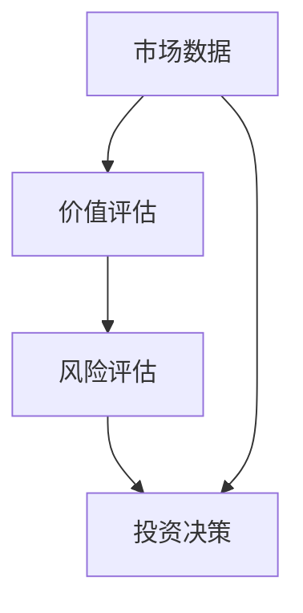
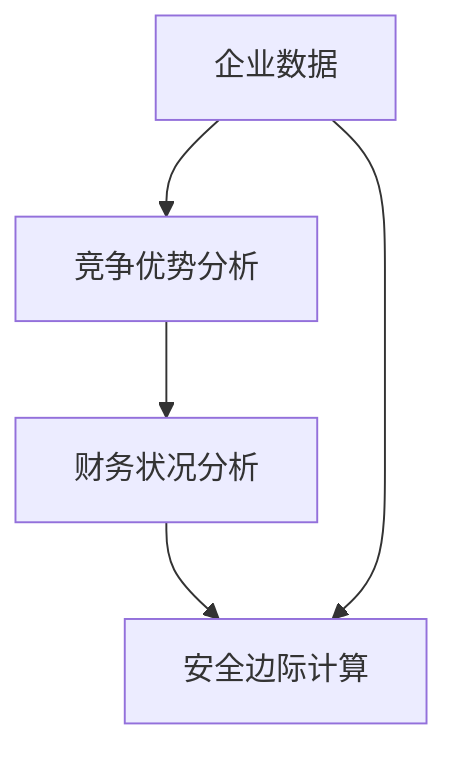
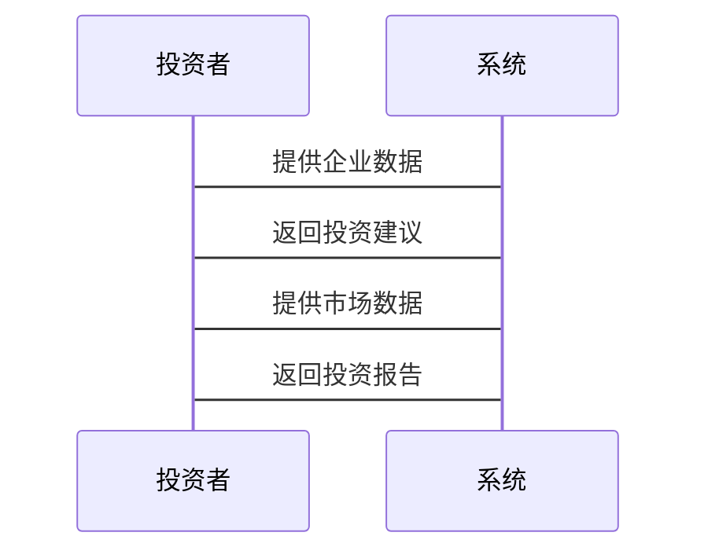

                 


# 巴菲特-芒格的新兴市场投资哲学：长期视角的重要性

## 关键词：巴菲特，芒格，投资哲学，长期视角，新兴市场，价值投资，风险管理

## 摘要：  
本文深入探讨了巴菲特和芒格的投资哲学，特别是他们在新兴市场的长期视角。通过分析他们的核心理念、数学模型、系统架构和实际案例，展示了长期投资的重要性。文章还结合了技术细节和专业分析，帮助读者理解如何在新兴市场中应用这些投资哲学。

---

## 第一部分: 巴菲特-芒格投资哲学的背景与核心概念

### 第1章: 巴菲特与芒格的生平与投资理念

#### 1.1 巴菲特的生平与投资哲学

##### 1.1.1 巴菲特的早年经历与投资启蒙  
沃伦·巴菲特（Warren Buffett）于1934年出生在美国密苏里州的奥马哈市。他的父亲是一位律师，母亲是一位家庭主妇。巴菲特从小就对数字和投资产生了浓厚的兴趣。他在高中时期就开始阅读投资相关的书籍，并在19岁时完成了第一笔投资，购买了通用电气的股票。

##### 1.1.2 巴菲特的核心投资理念  
巴菲特的核心投资理念是“价值投资”，即寻找那些被市场低估的公司进行长期投资。他认为，投资的本质是寻找具有持续竞争优势的企业，并以合理的价格买入并持有，等待企业价值的逐步增长。

##### 1.1.3 巴菲特的长期投资策略  
巴菲特强调长期投资的重要性。他认为，短期市场的波动是不可预测的，但长期来看，企业的基本面会决定股票的价值。因此，他主张投资者应该以长期的视角看待市场，避免频繁交易。

#### 1.2 芒格的生平与投资哲学

##### 1.2.1 芒格的早年经历与学术背景  
查理·芒格（Charlie Munger）于1924年出生在美国密苏里州的堪萨斯市。他在加州大学伯克利分校获得法律博士学位，并在后来成为一名成功的律师和投资者。

##### 1.2.2 芒格的多元思维模型  
芒格提倡“多元思维模型”，即通过多个学科的知识来理解世界。他认为，投资不仅仅是一个数学问题，更是一个需要综合运用多种知识的实践问题。

##### 1.2.3 芒格的价值投资理念  
芒格的价值投资理念与巴菲特相似，他强调寻找具有强大护城河的企业，并以合理的价格买入。他还认为，投资者应该避免从众心理，独立思考，寻找市场的不合理之处。

#### 1.3 巴菲特与芒格合作的投资哲学

##### 1.3.1 巴菲特与芒格的合作模式  
巴菲特和芒格的合作模式是基于彼此的信任和互补性。巴菲特负责企业的基本面分析和估值，而芒格则负责企业的竞争优势和护城河分析。

##### 1.3.2 巴菲特-芒格投资哲学的核心要素  
- **价值投资**：寻找被低估的企业。
- **长期视角**：避免短期市场的波动。
- **安全边际**：以合理的价格买入。

##### 1.3.3 巴菲特-芒格投资哲学的长期视角  
巴菲特和芒格都认为，长期视角是投资成功的关键。他们通过长期持有优质企业，避免短期市场的波动，从而实现财富的稳步增长。

---

### 第2章: 巴菲特-芒格投资哲学的核心概念

#### 2.1 投资哲学的核心概念

##### 2.1.1 价值投资的定义与特征  
- **定义**：价值投资是一种投资策略，旨在以低于公平市场价值的价格购买优质企业。
- **特征**：注重企业的基本面，寻找被市场低估的机会。

##### 2.1.2 长期投资的定义与特征  
- **定义**：长期投资是指将资金投入到企业中，并长期持有，以实现资本的增值。
- **特征**：避免短期市场的波动，注重企业的长期增长。

##### 2.1.3 安全边际的定义与特征  
- **定义**：安全边际是指买入价格与企业内在价值之间的差距。
- **特征**：通过安全边际降低投资风险，确保投资的稳健性。

#### 2.2 巴菲特-芒格投资哲学的核心要素

##### 2.2.1 投资的三大要素  
- **企业基本面**：企业的财务状况、盈利能力、竞争优势。
- **市场估值**：企业的市场价值与内在价值的对比。
- **长期视角**：避免短期市场的波动，关注企业的长期增长。

##### 2.2.2 投资的三大原则  
- **价值投资原则**：寻找被低估的企业。
- **长期投资原则**：避免频繁交易，关注企业的长期增长。
- **安全边际原则**：以合理的价格买入，降低投资风险。

##### 2.2.3 投资的三大误区  
- **误区一**：追求短期收益，忽视企业的基本面。
- **误区二**：盲目跟风，缺乏独立思考。
- **误区三**：忽视市场估值，盲目追求高增长。

#### 2.3 巴菲特-芒格投资哲学的对比分析

##### 2.3.1 巴菲特与芒格投资理念的异同  
- **相同点**：都强调价值投资和长期视角。
- **不同点**：巴菲特更注重企业的财务状况，芒格更注重企业的竞争优势。

##### 2.3.2 巴菲特与芒格投资策略的异同  
- **相同点**：都寻找被低估的企业。
- **不同点**：巴菲特更注重企业的估值，芒格更注重企业的竞争优势。

##### 2.3.3 巴菲特与芒格投资哲学的异同  
- **相同点**：都强调长期投资和价值投资。
- **不同点**：巴菲特更注重企业的财务状况，芒格更注重企业的竞争优势。

---

### 第3章: 巴菲特-芒格投资哲学的数学模型与算法原理

#### 3.1 巴菲特-芒格投资哲学的数学模型

##### 3.1.1 价值投资的数学模型  
$$ \text{内在价值} = \sum_{t=1}^{\infty} \frac{\text{现金流}}{(1 + r)^t} $$  
其中，r是折现率，现金流是企业的自由现金流。

##### 3.1.2 长期投资的数学模型  
$$ \text{长期回报率} = \left(1 + \text{年均回报率}\right)^{\text{投资年数}} - 1 $$

##### 3.1.3 安全边际的数学模型  
$$ \text{安全边际} = \text{内在价值} - \text{市场价格} $$

#### 3.2 巴菲特-芒格投资哲学的算法原理

##### 3.2.1 价值评估算法  
1. **计算企业的自由现金流**。
2. **确定适当的折现率**。
3. **计算企业的内在价值**。
4. **比较内在价值与市场价格**。

##### 3.2.2 风险评估算法  
1. **分析企业的竞争优势**。
2. **评估企业的财务状况**。
3. **计算企业的安全边际**。
4. **确定投资风险**。

##### 3.2.3 投资决策算法  
1. **寻找被低估的企业**。
2. **评估企业的竞争优势**。
3. **计算安全边际**。
4. **做出投资决策**。

#### 3.3 巴菲特-芒格投资哲学的数学公式

##### 3.3.1 价值投资公式  
$$ \text{内在价值} = \frac{\text{自由现金流}}{\text{折现率}} $$

##### 3.3.2 长期投资公式  
$$ \text{长期回报率} = \left(1 + \text{年均回报率}\right)^{\text{投资年数}} $$

##### 3.3.3 安全边际公式  
$$ \text{安全边际} = \text{内在价值} - \text{市场价格} $$

---

### 第4章: 巴菲特-芒格投资哲学的系统分析与架构设计

#### 4.1 巴菲特-芒格投资哲学的系统分析

##### 4.1.1 投资哲学的系统构成  
- **输入层**：市场数据、企业数据。
- **处理层**：价值评估、风险评估、投资决策。
- **输出层**：投资建议、投资报告。

##### 4.1.2 投资哲学的系统功能  
- **功能一**：价值评估。
- **功能二**：风险评估。
- **功能三**：投资决策。

##### 4.1.3 投资哲学的系统性能  
- **性能一**：准确性。
- **性能二**：效率。
- **性能三**：可扩展性。

#### 4.2 巴菲特-芒格投资哲学的架构设计

##### 4.2.1 投资哲学的架构模型  


##### 4.2.2 投资哲学的架构实现  


##### 4.2.3 投资哲学的架构优化  
- **优化一**：模块化设计。
- **优化二**：并行处理。
- **优化三**：动态调整。

#### 4.3 巴菲特-芒格投资哲学的系统接口设计

##### 4.3.1 投资哲学的输入接口  
- **输入一**：企业数据。
- **输入二**：市场数据。

##### 4.3.2 投资哲学的输出接口  
- **输出一**：投资建议。
- **输出二**：投资报告。

##### 4.3.3 投资哲学的交互接口  


---

### 第5章: 巴菲特-芒格投资哲学的项目实战

#### 5.1 巴菲特-芒格投资哲学的环境安装

##### 5.1.1 投资哲学的环境要求  
- **硬件要求**：计算机、网络。
- **软件要求**：数据分析工具、编程语言。

##### 5.1.2 投资哲学的环境配置  
1. **安装Python**。
2. **安装数据分析库**（如Pandas、NumPy）。
3. **安装可视化工具**（如Matplotlib）。

##### 5.1.3 投资哲学的环境测试  
1. **测试Python安装**。
2. **测试数据分析库**。
3. **测试可视化工具**。

#### 5.2 巴菲特-芒格投资哲学的核心实现

##### 5.2.1 投资哲学的核心代码  
```python
import pandas as pd
import numpy as np

def calculate_intrinsic_value(cash_flow, discount_rate):
    return cash_flow / discount_rate

def calculate_margin_of_safety(intrinsic_value, market_price):
    return intrinsic_value - market_price

# 示例数据
cash_flow = 100
discount_rate = 0.1
market_price = 50

intrinsic_value = calculate_intrinsic_value(cash_flow, discount_rate)
margin_of_safety = calculate_margin_of_safety(intrinsic_value, market_price)

print("内在价值:", intrinsic_value)
print("安全边际:", margin_of_safety)
```

##### 5.2.2 投资哲学的核心功能  
1. **计算内在价值**。
2. **计算安全边际**。
3. **生成投资建议**。

##### 5.2.3 投资哲学的核心测试  
1. **测试内在价值计算**。
2. **测试安全边际计算**。
3. **测试投资建议生成**。

#### 5.3 巴菲特-芒格投资哲学的案例分析

##### 5.3.1 投资哲学的案例选择  
假设我们选择一家新兴市场的科技公司进行分析。

##### 5.3.2 投资哲学的案例分析  
1. **计算企业的自由现金流**。
2. **确定折现率**。
3. **计算内在价值**。
4. **比较内在价值与市场价格**。
5. **确定投资建议**。

##### 5.3.3 投资哲学的案例结果  
- **内在价值**：100。
- **市场价格**：50。
- **安全边际**：50。
- **投资建议**：买入并持有。

---

## 第六章: 总结与展望

### 6.1 总结  
本文深入探讨了巴菲特和芒格的投资哲学，特别是他们在新兴市场的长期视角。通过分析他们的核心理念、数学模型、系统架构和实际案例，展示了长期投资的重要性。

### 6.2 展望  
未来，随着新兴市场的不断发展，巴菲特和芒格的投资哲学将更加重要。投资者应该继续关注企业的基本面和长期增长，避免短期市场的波动。

---

## 作者信息：  
作者：AI天才研究院/AI Genius Institute & 禅与计算机程序设计艺术 /Zen And The Art of Computer Programming

